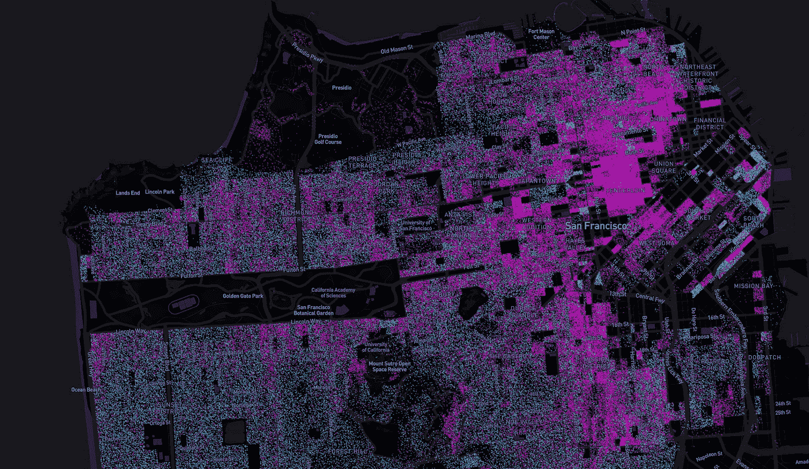

# 租户和业主——可视化美国的每一个人。

> 原文：<https://medium.com/hackernoon/renters-and-owners-visualizing-every-person-in-the-us-ba97d3c49c02>

## 针对大规模人口普查数据的 Mapbox 和 Tippecanoe

> **查看已完成的** [**地图点击这里**](http://ryantm.io/population/) **！**

住房政策是我经常处理的事情，所以我花了很多时间试图理解住房数据。当我思考房屋租赁市场与房屋所有权之间的关系时，我开始思考这种关系在地理上是什么样的。

当然，城市的某些地方以拥有大量的公寓或单户住宅而闻名；但是我很好奇这个整体看起来是什么样子，以及是否可以分辨出更大的结构。

这一调查变成了它自己强大的技术挑战，并产生了一个非常有趣的数据集；请继续阅读，了解更多信息，以及我是如何构建它的！

Portland, Oregon renters/owners viewed as a choropleth.

Portland, Oregon renters/owners viewed per-person.

美国人口普查使业主/租户信息很容易用于人口普查区块几何图形，但将其视为简单的 choropleth 彩色多边形仍有不足之处。通常，租房的主要空间后果之一是密度增加，因为出租的房屋通常较小或位于多户建筑内。但是一张显示房主和房客相对关系的 choropleth 地图丢失了这一重要信息。相反，如果我们在每个人的水平上查看数据，我们可以同时捕获两个维度的信息。

这让我们可以比较像曼哈顿这样的高密度地区的密度和所有权结构:

从市区到郊区都有明显的蔓延，比如华盛顿 DC:

这就很容易开始形成这样的问题:为什么发展会采取它所采取的(字面上的)形式；什么样的历史力量、政策和时间线创造了这种或那种特殊的形状和聚集？或者，出于同样的原因，是什么导致了那些根本没有可辨别结构的区域？

我承认我还没有答案，但这是一个有趣的起点。

# 我是如何建造的

使用的数据最初来自美国人口普查局的 2010 年 SF1 人口普查。这是最近的人口普查，数据可在街区一级获得，这种精细的细节是产生更有趣的可视化所必需的。使用[美国人口普查 API](https://www.census.gov/developers/) 和 [TIGER/Line](https://www.census.gov/geo/maps-data/data/tiger-line.html) 几何数据库，您可以获取感兴趣的人口普查变量以及与它们相关联的几何。在我们的例子中，我们取了总人口，租房的人口和拥有自己房子的人口。

人口数量必须转换为落在块几何图形内的相等数量的点几何图形。有几种方法可以做到这一点，而在我目前的职位上，我恰好可以获得比开发时间多得多的计算时间(而且也便宜得多)。这也是一个低优先级的项目，所以我用廉价的方式(蛮力)对它进行编码，让它在周五晚上运行，并在葡萄酒之乡享受周末。当我们周一回来的时候，有一个很好的数据集在等着我们。:)

Oregon wine country. What better way to spend a weekend!

对于每个块特征，我们将几何图形输入一个函数，该函数首先计算边界框，然后在边界框内生成一个随机点。我们使用光线投射测试这个点是在实际的多边形里面还是仅仅在它的边界框里面。

如果点落在多边形内，我们保存它，否则它被丢弃。我们一直这样做，直到多边形内的点的数量与 SF1 人口普查中记录的该街区的人口数量相同，对于我们感兴趣的每种类型(租户/业主)，然后继续下一个街区。

> 值得一提的是，如果有人有兴趣在更合理的时间内完成这项工作，以下应该是更快的解决方案:计算多边形的[约束 delaunay 三角剖分](https://en.wikipedia.org/wiki/Delaunay_triangulation)，随机选取一个三角形，并使用三角形内的[重心坐标](https://en.wikipedia.org/wiki/Barycentric_coordinate_system)生成一个随机点。这从强力方法中消除了被拒绝的点，并且应该提供更快的点生成，特别是对于严重倾斜的几何图形；以更复杂的代码为代价。

## 显示

上述脚本的输出结果是包含点要素的近 40GB geo JSON 文件。下一个问题自然是，“我们到底要怎么把它装载到任何东西里？”

好在矢量地图平铺是个神奇的东西！Mapbox 为这种情况维护了一个程序，叫做 [Tippecanoe](https://github.com/mapbox/tippecanoe) 。Tippecanoe 接收大量 geojson 几何图形，并将其转换为 Mapbox 矢量切片格式，这是一种高效的 protobuf 编码 SQLite 数据库。这使您可以将数据作为可消化的小矢量切片，并有助于确保数据的纹理和密度在所有缩放级别中都得到保留。

生成的矢量切片数据库称为. mbtiles 文件，大小约为 2GB，可以轻松上传到 Mapbox 的切片服务器。

剩下的就是在 Mapbox Studio 中应用一些样式。为了帮助这些点在不同的缩放级别上更好地阅读，它们的直径是缩放和不透明度的函数。这样，在低缩放时，重叠点会创建更亮的区域。

你可以在这里查看成品！显示个人层面的人口统计信息真的可以改变你对数据的看法，并迫使你记住它为什么重要:我们在这里谈论的是真实的人！

如果你创建了像这样你觉得有趣的可视化，我很乐意看到它，[给我发一条推特](http://twitter.com/mcculloughrt)！