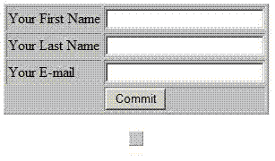
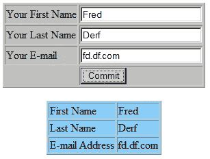

# 使用 JavaScript 替换 HTML 内容

> 原文：<https://medium.com/hackernoon/replacing-html-content-using-javascript-9a3d36c56cc>

有一天，在查看许多站点的源代码时，我注意到大量的元素不包含任何数据。我开始怀疑为什么一个网页设计师会在网页上放置元素而不显示任何东西。然后我意识到那些空的元素只是简单的占位符。设计者以后会操作的屏幕空白区域。

JavaScript 提供的一个非常有用的功能是替换先前显示的现有 HTML 文档中的元素内容，甚至是空元素。网页设计者选择利用这种能力有很多原因，但提供交互式页面是一个可能的目标。

检索 HTML 表单数据中心在新页面上显示检索到的数据。虽然该方法实际上显示了数据，但有时在检索数据的同一页面上显示数据会增强站点的吸引力。

完成这个简单的壮举需要使用另一种技术，这种技术采用了 **getElementByID()** 内置的 JavaScript 函数。我提到过 JavaScript 是区分大小写的吗？是的，当你使用之前定义的函数时，确保你的大写字母和小写字母是正确的，否则当 JavaScript 解释器找不到函数时，你会收到语法错误。
**getElementById**函数

在 JavaScript 中， **getElementById()** 函数提供了替换先前包含在文档中并由 Id 属性标识的元素中的数据的能力。您可以在 HTML 标记中包含 idattribute。例如，要包含 id 属性来将一个表单标识为 contactForm，我们应该在<表单>标签中包含 id 属性，如下所示:

`<form id="contactForm"> ... </form>`

既然我们已经在 HTML 文档中标识了表单，现在我们可以在脚本中引用该表单。

代码片段中的以下行说明了使用 **getElementById()** 包含的 JavaScript 函数的一般形式或语法:

`document.getElementById(elementId).innerHTML="new content";`

在显示的代码行中，document 是包含 getElementById()函数的当前或父文档。括号中的 *elementId* 是指要修改的元素的 *ID* 。语句的 *innerHTML="new content"* 部分指示浏览器用引号之间的 *new content* 表示的内容替换内部 HTML 区域或 HTML 元素标记之间的空间。还要注意语句中的句点。这些标点符号是必要的，它们将对象与要采取的方法和行动分开。

使用该函数还说明了 W3C HTML 文档对象模型(DOM)中元素之间的关系。尽管互联网不受特定组织的控制，W3C 或万维网联盟为 Web 开发制定了标准。

在 DOM 下，文档被认为是网页中的父对象或最高级别的对象。从面向对象编程(OOP)中借用对象的概念导致了在对象中包含属性和方法。在本指南中， **getElementById()** 方法包含在文档类中，并且可以引用父文档的任何子元素，只要该元素包含 *id* 标识符，该方法使用该标识符来定位目标元素。

那么我们可以使用 **getElementById()** 函数做些什么呢，让我们首先在 HTML 代码的 *< body >* 部分的第一个表格之后创建另一个表格。下面的代码片段创建了一个不显示任何内容的表。请原谅我没有包括 HTML 代码运行时表格显示的屏幕截图，但是显示会像一幅众所周知的暴风雪中的北极熊的图片——只有很多白色。

`<table``style="background-color:LightSkyBlue"`

`<tr>`

`<td` `id="ic1"></td><td` `id="ic2"></td>`

`</tr>`

`<tr>`

`<td` `id="ic3"></td><td` `id="ic4"></td>`

`</tr>`

`<tr>`

`<td` `id="ic5"></td><td` `id="ic6"></td>`

`</tr>`

`</table>`

请看右边的屏幕截图，显示了添加了空表单的输入表单。我给表单设置了蓝色背景，这样新表单的位置就会显示在屏幕截图中。请注意，表格非常小(蓝色小方框)。

因此，添加了第二个表后，我们现在可以添加代码，使用 **getElementById()** 方法从表单中提取数据，并在第二个表中显示这些数据。执行这些操作的代码如下:

``

**你学到了什么？**

在该示例中，您将上述代码放在 HTML 文档的部分，并使用 onclick 事件调用该函数(关于 onclick 事件的更多信息，请参见后面的 hub)。当用户单击一个按钮时，onclick 事件被触发，该按钮是作为用于提供数据的表单中的一个元素提供的。这并不是使用 **getElementById()** 函数的唯一方法，而是作者在本例中使用的方法。尝试该函数，真正了解该方法的多功能性。

**一个小提示:**

您会注意到，在我的大多数代码示例中，代码都采用了缩进格式。这些缩进被称为空白，只是为了提高代码对人类观众的可读性。

计算机不关心空白，而是从程序的运行版本中解析出那部分代码。

然而，空白确实使调试代码更容易，当处理 HTML 代码时，空白使定位丢失的标签变得轻而易举。这种技术在使用其他语言时也很有帮助。

这篇文章最初是由 DoMyWriting 的 Daisy Rowley 写的