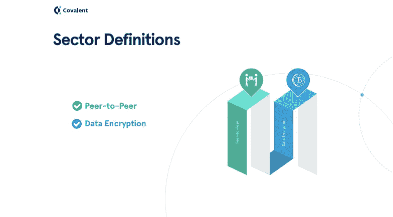

# 区块链上分散式文件存储和共享研究

> 原文：<https://medium.com/hackernoon/research-on-decentralized-file-storage-and-sharing-on-the-blockchain-f3a224c4c85b>

## Filecoin、Siacoin、Maidsafe、Storj 和 Bluzelle 等基于区块链的平台如何破坏文件存储空间。

在这篇文章中，我们将深入探讨为什么分散的文件共享和存储空间很重要。然后，我们将定义该行业由什么组成，最终用户和市场关心什么，去中心化如何解决这些市场需求，去中心化理论的破坏性是什么，市场规模和行业排名，以及对区块链上顶级玩家的分析。

云文件存储平台具有变革性，因为你不再使用本地计算机存储来存储文件和照片，这些文件和照片有时会占用 1gb 的空间，而是使用 Dropbox、box、Google Drive 和 Microsoft One Drive 的第三方卖家。云存储市场预计到 2021 年将增长到 740 亿美元，这是一个巨大的空间。

**什么定义了分散的文件存储和共享空间？**

我们用两个关键属性来定义这个空间。首先是服务的点对点性质。事实上，您可以在一个分散的平台上租赁您未使用的存储来抵消您的成本，这是开创性的。点对点是分散空间的主要支柱之一。该属性允许提高下载和上传速度，因为每个正在下载的文件都来自网络上的多个主机。对等网络有一个有趣的特性，即存储成本随着网络中对等节点数量的增加而降低。

第二个关键属性是数据加密的使用。集中式平台提供有限的数据加密，这通常会导致安全漏洞。这里的关键点是，用于加密数据的私钥由分散存储提供商持有。加密在分散平台所具有的出色的安全性和隐私性方面发挥着巨大的作用。

数据文件在跨网络上的不同主机存储之前经过完全加密并分成碎片。只有上传数据的用户才能使用他们的私有加密密钥访问数据。这是集中式平台永远无法比拟的无与伦比的数据安全性。

**终端用户和市场关心什么？**

[在共价](https://www.covalenthq.com/research/decentralized-file-storage-sharing/)，我们根据五项关键功能评估了存储平台。分散式存储平台正处于萌芽阶段，通常还不针对企业使用案例。

第一个需求是数据安全。最终用户关心的是，除了他们自己，没有人能访问他们的文件。

第二个需求是系统速度。该服务需要提供快速的上传和下载速度。

第三，消费者对价格非常敏感。随着存储的数据越来越多，最终用户非常关心成本。

第四个关键要求是数据隐私。区分数据安全和数据隐私非常重要。

> 想象一扇窗户。有两种情况。首先，你可以用金属条来防止物体进入窗户。这是安全，人们仍然可以透过窗户看，没有隐私。第二，你可以把窗帘挂在窗户上，这样可以保护隐私，但不安全，因为你总是可以往里面扔东西。因此，窗帘和金属条的组合提供了最好的隐私和安全性。最终用户肯定关心隐私。

最后一点是整合。最终用户关心他们的存储提供商与您现有平台(如 Slack 和 Autodesk)的集成。

## 你认为基于区块链的分散式文件存储系统怎么样？

请在评论中告诉我们你的想法。

我们发布各种不同领域的[**数据支持研究报告**](https://www.covalenthq.com/research/decentralized-file-storage-sharing/) ，如分散式云计算、[文件存储](https://www.covalenthq.com/research/decentralized-file-storage-sharing/)、体育博彩、货币兑换、电子商务、隐私和安全以及分散式社交媒体。