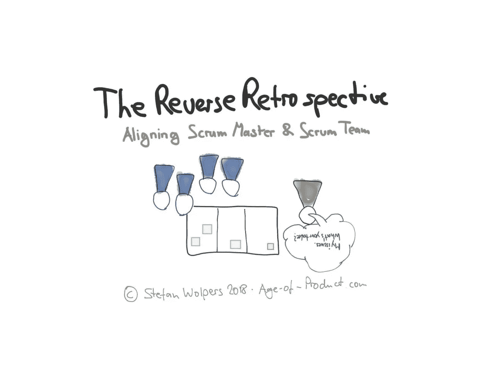

# 反向追溯

> 原文：<https://medium.com/hackernoon/reserve-retrospective-a3f90b6e6a24>

# TL；大卫:反向回顾

作为一名 scrum 大师或敏捷教练，你是否与“你的”团队经历了更多的沟通障碍？它的改进速度停滞了吗？你是否觉得这个团队正在倒退到旧的习惯和模式？也许，是时候进行一次逆向回顾，与团队分享你的观察结果了。

学习如何运行逆向回顾来重新调整你的 scrum 团队。

Reverse Retrospective — Aligning Scrum Team and Scrum Master

# 逆向追溯:框定问题——土拨鼠日

作为一名 scrum 大师或敏捷教练，你可能会问自己，为什么即使问题在团队的控制之下，你的团队也要花这么长时间来改变方向。这可能是一个简单的技术，例如“将吉拉任务的红色编号放在索引卡的右上角，这样我们就有机会从远处读取它。”或者是对基本敏捷实践的理解。例如，不充分的产品 backlog 细化可能会在 sprint 结束时导致溢出，从而危及 sprint 目标的实现。

这种落后或没有发挥潜力的时刻在重复出现时尤为不幸。没有什么比一个团队在回顾过程中设法确定问题，并决定采取行动却不交付这些行动项目更令人沮丧的了。或者，一开始把情况变得更好，但过一段时间后又慢慢回到旧的模式。今天是土拨鼠日，敏捷版。

# 自组织 Scrum 团队

从教练的角度来看，一个问题是，当 scrum 大师定期指导团队成员做什么和如何做事情，甚至可能在稍后阶段强制执行那些“建议”时，自组织团队不会形成。

自组织意味着团队负责自己的事务，因为没有问责制的自治等于无政府状态。(这就是帕蒂·麦考德——前网飞——所说的“像对待完全成熟的成年人一样对待每个人”)

摆脱这种困境的一种方法可能是回顾性练习，旨在重新调整 scrum 团队与 scrum 大师或敏捷教练的关系——反向回顾。

# 如何进行反向回顾

逆向回顾结合了 scrum master 工具箱中的几种技术:

*   scrum master 创建带有问题的标签
*   Diana Larsen 的[影响圈模型](https://www.futureworksconsulting.com/blog/2010/07/26/circles-and-soup/)允许根据团队权威对问题进行聚类
*   有一个点投票的步骤来确定 scrum 团队和 scrum master 一致的问题，更重要的是，不一致的问题
*   有一个基于点投票结果的精益咖啡式的讨论。

反向回顾的预期结果是确认团队和教练对团队情况有相同的观点。如果回顾揭示，事实并非如此，接下来的讨论将会克服这些差异，并重新调整 scrum 团队和 scrum master。

# 敏捷过渡——来自战壕的手册

下载最新的，212 页的版本"[敏捷过渡-来自战壕的实践手册](https://age-of-product.com/download-agile-transition-hands-guide-trenches/) " 就在这里**！**

## 作为 Scrum 大师准备逆向回顾

作为 scrum 大师，准备逆向回顾最重要的部分是确定你想要解决的问题。无论如何，我都是通过收集观察列表——一种问题积压——来开始与日常工作并行进行的。我也重温过去回顾的协议，并检查团队同意处理的行动项目。

根据 scrum 团队的流畅程度，在这个步骤中，我通常会遇到 10 到 40 个不同严重程度的问题。有些可能是任务关键型的，而有些仅仅是很好的选择。接下来，我对问题进行排序:这些问题在多大程度上阻碍了团队实现其目标，以及团队可以对此做些什么？(这个排名让我可以将逆向回顾的重点放在手头的前 10-15 个问题上。否则，团队可能会迷失在噪音中。)

我也喜欢给问题贴上标签。简单的模型就可以了，我的模型包括:

*   组织
*   组
*   技术
*   过程。

然后我把这些问题转移到便笺或索引卡上。(我使用单一颜色的卡片。)

回顾展的房间或空间需要准备一个基于 Diana Larsen 的影响圈模型的矩阵。(见上。)我发现很难在一张有原始圆形设计的挂图纸上进行逆向回顾。光滑的墙壁、大白板或窗户更适合这个目的。此外，您需要确保团队在墙前有足够的空间进行点投票。

我还使用了一种矩阵设计，而不是原来的同心圆，因为矩阵使练习在视觉上不那么复杂:胶粘物的重叠更少，更容易点票，更直接地提出行动项目。

## 请点击“拍手”👏，如果你觉得这篇文章有用——它对我来说意义重大！

***如果你更喜欢邮件通知，请*** [***注册我的每周简讯***](https://age-of-product.com/subscribe/?ref=Food4ThoughtMedium) ***，加入 15071 位同行。***

## 逆向回顾的开始

我开始逆向回顾，向团队介绍每个问题，解释我的想法或背后的观察。每个点花费的时间不会超过 45 到 60 秒，所以介绍阶段适合 10 分钟的时间。

在介绍过程中，我还将问题分为三类:

1.  团队控制
2.  团队影响
3.  “汤。”

(如果不熟悉术语，请查看[戴安娜·拉森的原帖](https://www.futureworksconsulting.com/blog/2010/07/26/circles-and-soup/)。)

## 点投票

团队成员用两种不同颜色的点进行以下的点投票:一种颜色表示对手头的问题达成一致。另一种颜色表示不同意和需要讨论。(为此选择对比色。例如，如果团队成员中有人是红绿色盲，红绿点将不起作用。)团队成员从他们的角度出发，根据相关性分配点。

你最终会发现 scrum 团队和 scrum master 之间的一致性很明显。其他问题可能会在团队成员中引起争议，这两种颜色的圆点数量大致相等。最有趣的问题是团队和 scrum master 不一致的地方。

## 为讨论的问题排序

对于下面的讨论，我倾向于将问题排序如下:

1.  不一致的问题
2.  有争议的问题。(两个点的数量大致相等。)
3.  高度一致的问题。

讨论的目的是解决问题。在未对齐的情况下，这可能就像修复通信混乱一样简单。在其他情况下，解决方案可能需要创建一个任务或行动项。根据 Diana Larsen 的说法，这有三种类型:

1.  直接行动。(团队控制问题。)
2.  建议行动。(团队影响问题。)
3.  作为一个团队做出相应的反应。(团队在这个问题上没有权限。)

当最紧迫的问题是系统性的时，这种分类特别有助于计划下一步的改进。这些在过去被证明是更令人沮丧的品质。

然而，不管结果如何，逆向回顾很可能会改善 scrum 团队和 scrum master 未来的合作。

# 结论——反向追溯

运行逆向回顾是 scrum 团队和 scrum master 或敏捷教练之间一个有用的反馈循环，以确保他们在阻碍团队进步的问题上保持一致。

每当改进的速度似乎变慢了，交流混乱变得更频繁了，或者系统问题阻碍了团队的发展时，考虑运行一个反向回顾。

除了通常的惯例和仪式之外，你如何保证 scrum 大师和 scrum 团队之间的一致性？请在评论中与我们分享。

# ✋不要错过:加入 2700 多人的强大的“动手敏捷”Slack 团队

我邀请你加入[“手把手的敏捷”Slack 团队](https://goo.gl/forms/LObbRtSF9vvxN3CL2)，享受来自世界各地的敏捷实践者的快速增长、充满活力的社区带来的好处。

如果你现在想加入，你现在所要做的就是[通过这个谷歌表格](https://goo.gl/forms/LObbRtSF9vvxN3CL2)提供你的证书，我会帮你注册。顺便说一下，**是免费的。**

# 你还想这样多读书吗？

好吧，那么:

*   📰*加入 15071 位同行和* [*报名我的每周简讯*](https://age-of-product.com/subscribe/?ref=Food4ThoughtMedium)
*   🐦*关注我的* [*推特*](https://twitter.com/stefanw) *订阅我的博客* [*产品时代*](https://age-of-product.com)
*   💬*或者，免费加入* [*Slack 团队【动手敏捷】的 2700 多名同行*](https://goo.gl/forms/XIsABn0fLn9O0hqg2) *。*

[逆向回顾——调整 Scrum 团队和 Scrum Master](https://age-of-product.com/reverse-retrospective/) 首次发表于《产品时代》。