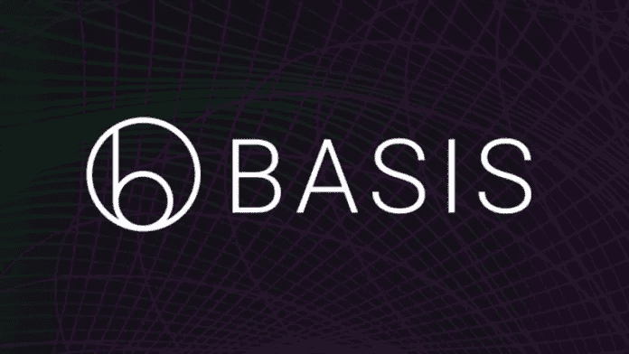
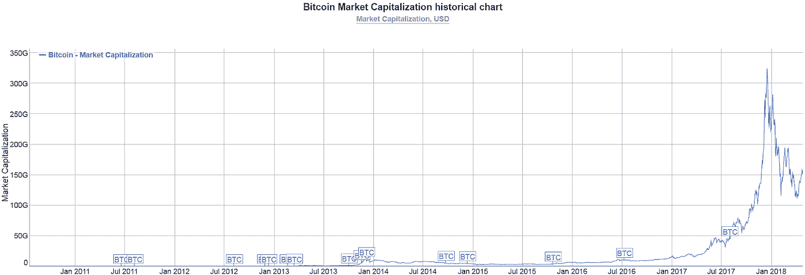
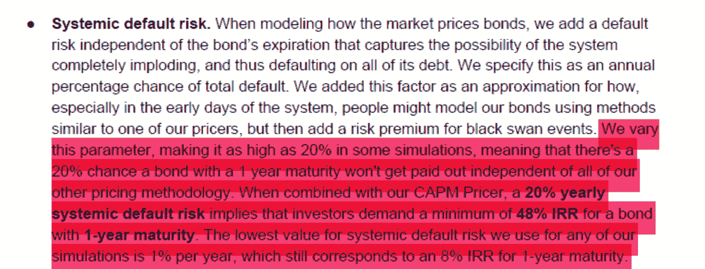
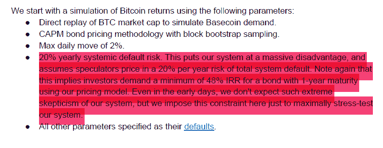
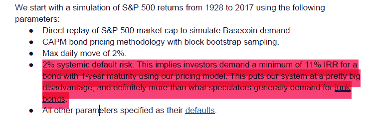
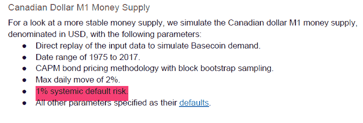

# Reserve 对基础协议的分析

> 原文：<https://medium.com/hackernoon/reserves-analysis-of-the-basis-protocol-12cb3586b98e>

*感谢 Multicoin Capital 的* [*迈尔斯·斯奈德*](https://multicoin.capital/2018/01/17/an-overview-of-stablecoins/) *r 对本文的反馈。*

Basis 是一个正在开发中的算法稳定系统。它以前被称为“[基础币](https://hackernoon.com/tagged/basecoin)”

现在，它是最引人注目的[“铸币税股”——](https://bravenewcoin.com/assets/Whitepapers/A-Note-on-Cryptocurrency-Stabilisation-Seigniorage-Shares.pdf)类型的 stablecoins 之一，与 Maker DAO ( [在此处阅读我们对 Maker 协议的分析](/reserve-currency/our-analysis-of-the-makerdao-protocol-4a9872c1a824))一起，是即将推出的 stablecoins 中最受关注的一个。这种关注是理所应当的，因为 Basis 团队为 stablecoin 的发展做出了重要贡献。他们成功地普及了没有稳定就没有真实货币的理念，从而使加密资产作为一个整体更接近于成为真实货币。

在此之前，稳定的货币格局停滞不前。资金很少，除了导演道之外，没有其他有前途的项目。如今，每周都有新的项目冒出来——有些[甚至](http://www.carbon.money/) [是受基础协议](https://www.fragments.org/)的启发。

Basis 采用了 Robert Sams 的[铸币税份额](https://bravenewcoin.com/assets/Whitepapers/A-Note-on-Cryptocurrency-Stabilisation-Seigniorage-Shares.pdf)概念，并将其发展为一个简单优雅的分散稳定货币协议，他们非常巧妙地将其传达给公众。

不幸的是，尽管有诚实和开拓性的努力，我预计基础将失败。他们已经朝着正确的方向迈出了许多步，但最终他们不会成功地创造出一种可靠的稳定的硬币。

原因说起来相对简单，但需要深入分析才能理解。我将首先在这里用要点来陈述它，然后用这篇文章的其余部分来精确描述 Basis 是如何工作的，以及它的设计是如何出现不可修复的缺陷的。在底部你可以看到我写这篇文章的动机。

# 总结:

*   对 Basis 自身稳定性分析的仔细研究揭示出**在极有可能发生的情况下，钉住汇率制可能会不可挽回地失败**。
*   基础**声称链上稳定**，使其不可信。然而**他们的实际计划包括使用链外资产的稳定期**。**这个** **让他们面对所有困扰系绳**、**但更糟糕的**的问题。据报道，Tether 由一个被扣押的银行账户中的 100%资金支持。Basis 将获得至多 80%的资金支持，并且没有承诺用这些资金捍卫联系汇率制。
*   即使当 Basis 的市值足够小时，链外稳定起作用，**其** **现金储备解决方案不会扩展**。
*   这尤其糟糕，因为 Basis 的稳定机制只有在投资者对稳定挂钩和增长都有信心的情况下才会发挥作用。
*   事实上，**在钉住汇率中断期间，信心是最需要的，而此时信心最不可能出现**。
*   在法定货币的情况下，对汇率挂钩的信心是通过展示为支持挂钩而持有的储备资产来建立的。**由于 Basis 的储备是当前市场需求和信心的函数，因此难以辨认且不可靠，这进一步加剧了潜在的价值损失和信心不足**。

# 基础系统如何工作

基础协议在他们的[白皮书](http://www.basis.io/basis_whitepaper_en.pdf)中描述得非常清楚。如果你还没有读它，你会想在读这篇文章之前读一读。我将在这里重新定义协议行为，让我们开始:

## 基础协议

Basis 协议通过使用三种不同的令牌来运行，即**“Basis”(稳定币)、“债券令牌”和“共享令牌”**

基础令牌是固定在 1 美元的稳定令牌。债券是一种代币，当新的基础代币被铸造出来时，它会被转换成基础代币。股票在系统中的作用类似于股权:股东获得新铸造的基础代币，*当且仅当*所有未偿债券都已转换为基础代币，并且需要铸造更多的基础代币。

基本令牌本身通过供应链管理得以稳定。这意味着 Basis 的市场价格由智能合约通过 oracle 进行监控，当市场价格与 1 美元不同时，该合约会通过增加或减少供应来尝试将市场价格恢复到 1 美元。

如果基差价格低于 1 美元，那么合同需要减少基差供给以恢复市场价格。供应减少是由于合同获得的基础，然后燃烧。为了获得基础代币，合约铸造并在拍卖中出售债券(最低债券价格为 10 美分)。用这些债券交换基础代币，然后烧掉所获得的基础代币。供应的减少恢复了 1 美元的价格。

如果价格高于 1 美元，那么系统需要增加供给来降低市场价格。通过铸造新的基础代币来增加供给。这些新铸造的代币用于在先进先出的基础上偿还未偿债券。偿还的债券被烧毁。作为债券的回报，持有人得到 1 个基础代币。任何剩余的新铸造的基础代币被分配给股东。

与债券相反，股票在支付时不会被烧毁。此外，债券会在五年后到期，但股票不会。到期债券不支付基础代币。

为什么人们会购买债券？人们购买债券是为了从未来的铸造中获利。每个债券支付 1 个基本代币，铸造时至少值 1 美元，因为代币只有在市场价格高于挂钩时才铸造。例如，如果你以 75 美分的价格买入债券，你将获得 25%以上的利润。只要支付时的时间贴现利润超过债券在支付前到期的风险，购买债券是值得的。

## 基础链外稳定化

我从 stablecoin 社区了解到，Basis 计划使用链外资金——这些资金不是由[区块链](https://hackernoon.com/tagged/blockchain)的智能合约不可信地控制的*资金——来保持他们的 stablecoin 挂钩。这些资金将由背后的公司持有和控制。*

Basis 团队计划从两个来源获得链外资金来稳定他们的令牌。第一个来源是他们的资金筹集。他们将从筹集的资金中拿出一部分，用它来建立大量的初始链外储备，由 Basis 公司控制，称为无形实验室。这在最初是可行的。当市值较小时，筹集的资金将足以在早期保护联系汇率。但是，这种保护是不可扩展的。如果 Basis 的市值增长到适度水平，众筹基金将不再足以保护联系汇率。从长远来看，他们需要比现在更多的资金来保护联系汇率。

这就把我们带到了计划中的第二个资金来源:公司拥有的基础股收益。在 stablecoin 社区中已知，Basis 团队计划保留大量 Basis 股份，甚至可能高达 80%，并在 Basis token 的供应最初增长时使用它们来获得更多资金。

正如我们在上面看到的，这个系统是通过铸造基础代币发展起来的，每当所有未偿还的债券都被支付时，它就把基础代币给股东。该公司可以出售他们收到的新基础代币作为法定货币，并像 Tether 一样将这些钱存入银行账户。拥有 Basis 的大部分股份给了 Basis 一个可扩展的链外储备来源。如果他们拥有 80%的股份，他们将获得高达 80%的新发行的基础令牌，并可以使用它们来维持高达 80%的链外储备支持。一旦平台上线，该团队还可以选择出售更多股份来筹集额外资金，尽管随着网络规模开始扩大，这将减少他们的收入流。

可以通过多种方式使用链外储备来稳定基础。例如，在交易所里，他们可以在钉住点的正下方(买入墙)设置大额买入订单，在钉住点的正上方(卖出墙)设置大额卖出订单。或者，Basis 可以资助以更动态的方式捍卫盯住政策的自动机器人。

如果他们的协议的稳定机制失败，Basis 团队可能会使用他们的菲亚特储备来捍卫钉住，不管他们是手动还是通过机器人自动做到这一点。如果挂钩打破了，或者即将打破，他们将买入基差令牌，并将基差价格稳定在挂钩水平。

# 基础的设计缺陷

在接下来的内容中，我将回顾 Basis 系统不可挽回的缺陷的三个方面:(1)离线稳定系统如何不是一个可持续的解决方案，(2)Basis 算法稳定系统的脆弱性，以及(3)它难以辨认和易变的后台。

## 1.链外稳定不是一个可持续的解决方案

除非你认为你的链上稳定机制不起作用，否则没有理由建立链外稳定机制。这很可能是 Basis 团队的动力。也许他们和我在下一节表达的一样，担心他们的连锁稳定机制不能保持钉住汇率。

遗憾的是，离线稳定的变通方法削弱了 Basis 成为广泛采用的去中心化货币的能力。在某种程度上，该协议依赖于链外资金，它与 [Tether](https://tether.to/) 没有什么不同，并且遇到了与 Tether 和其他依赖于链外资金的集中式数字货币相同的问题。

从长远来看，链外稳定是不可持续的，原因有三。

首先，和 Tether 一样，Basis 将很难找到愿意持有他们资金的银行。有充分的证据表明，泰瑟公司很难维持与银行的关系。

第二，鉴于集中式硬币要求用户信任发行者，这导致了[交易对手风险](https://www.investopedia.com/terms/c/counterpartyrisk.asp)。发行者可以窃取、误用、错误分配或只是丢失链外资产。

第三，集中式硬币有被政府关闭的风险。仅美国政府[就关闭了](https://blog.bitmex.com/tether/)六种以上的集中式数字货币。

Basis 团队知道这一点。他们也批评系绳带来的交易对手风险和被政府关闭的风险。他们在白皮书中写道:“从长远来看，像 Tether 这样的集中式解决方案可能永远不会奏效，因此对 Tether 的看法非常负面。”[(第 5 页)](http://www.basis.io/basis_whitepaper_en.pdf)

Basis 团队为什么要依赖他们知道不可持续的稳定币模型？我怀疑他们的计划是在短期内使用链外储备，然后希望他们的算法稳定将能够在中期和长期保持联系。不幸的是，这也行不通，原因如下。

在 Basis 的链上稳定不起作用的情况下，Basis 是另一个限制，除了 80%或更少的储备支持而不是 100%。

## 2.Basis 的算法稳定性是脆弱的

Basis 的算法稳定性需要完整的市场信心，以可靠地应对 Basis 令牌需求的下降。这是不现实的。即使在加密货币成功实现大规模采用的最佳情况下，它也必须经受住途中的信心下降。

对 Basis“未来增长”信心的暂时丧失会削弱 Basis 捍卫联系汇率的能力。Basis 通过发行债券来抵御这些价格下跌。这些债券的预期未来价值取决于对基础债券供应未来增长的预期。对这种未来增长的信心下降，从而降低了债券价值。

举例来说，考虑信心不足时需求下降的影响。需求下降导致基价下降。该系统开始出售债券，以使基础代币退出流通，并使价格回升。最初的债券抛售扩大了债券队列。随着债券队列越来越长，债券在支付前到期的风险也在增加。这种增加的风险降低了每个新债券的价值。新债券的预期支付时间也变长了。时间贴现使得稍后支付的债券价值降低，与债券无法支付的风险无关。因此，越多的债券被出售以保持联系汇率，其价值下跌越快。当债券的预期价值低于 10 美分的下限时，系统停止出售债券。

不出售债券意味着，该体系无法进一步减少基准供给以稳定联系汇率制。然后，挂钩断裂。当然，钉住汇率的打破是反对 Basis 生存能力的有力证据，并可能进一步降低信心。

从这个意义上说，基础的脆弱比刀对黑天鹅的敏感还要严重。“黑天鹅”是一种不仅仅是不太可能发生，而且不太可能超出我们正常预期的事件。黑天鹅在发生之前可能被认为是荒谬的不可能。相比之下，基础系统可以被普通的信心下降所击倒。

## Basis 的回应以及为什么没有帮助

Basis 团队知道，他们的协议很容易以这种方式丧失市场信心。他们一致认为信心危机最终会打破他们的联系汇率制度，但他们认为这不会是致命的。他们相信，他们的 5 年债券到期期限将有助于最终恢复联系汇率制:

> 该协议旨在当信心危机发生时，一旦债券价格低于我们称之为债券价格下限的阈值，该协议将直接停止创造新的债券。当(债券价格跌破下限)时，我们预计基价会在一段时间内跌至 1 美元以下，因为需求下降，但债券不再被创造。然而，债券到期意味着旧债券逐渐到期。当旧债券到期时，债券队列变短了。在某个时候，通常是非常迅速的，我们预计较短的债券队列会导致债券价格再次升至底部之上，帮助基价回到 1 美元。

这意味着，在足够多的债券到期、挂钩机制得以恢复之前，Basis 的挂钩机制在一段时间内不会出现问题。然后业务可以照常进行。

然而，债券到期需要很长时间，Basis 无法承受长期与美元脱钩。债券到期期限为 5 年，债券到期发生在*年*的规模上。这不会在盯住汇率打破后很快恢复。

这意味着真正的问题是一次持续数年不盯住美元有多糟糕。打破钉住汇率制从两个方面对稳定的货币造成了持久的损害:信心的丧失和用户的流失。最初的钉住打破伤害了用户和市场的信心。这是一个迹象，表明该系统未能实现其设计目的:保持稳定。当基差在很长一段时间内保持不挂钩时，用户可能会很快失去对该系统的任何信心。

稳定的货币市场竞争越来越激烈。有些，像刀匠，是超前基础的。其他人会来的。只要 Basis 在一段时间内保持不挂钩，其用户就会停止使用 Basis，转而使用竞争对手的产品，从而进一步压低价格。稳定硬币用户不需要另一种不稳定硬币。由于对基础失去信心，长时间中断后恢复钉住汇率是不可能的。

即使 Basis 以某种方式恢复了联系汇率制，它也无法挽回自己的客户。当有其他成功的、稳定的、被广泛采用的替代品时，为什么有人要买一种已经坏了五年的稳定币呢？特别是，当联系汇率制度崩溃时，持有基差的人不会再回到基差。他们中的许多人会损失很多钱——例如，如果基差脱钩，从 1 美元跌至 0.50 美元，并且他们因担心进一步损失而抛售，他们将损失一半的资金，这些资金原本被认为是可信赖的稳定货币。

失去信心和失去用户的结合使得长时间的钉住汇率变动对于稳定的货币来说是不可接受的。如果基差几个月不挂钩，基差就会消失。因此，尽管债券到期，Basis 仍无力承受信心危机。

## Basis 的稳定性分析存在严重缺陷

有人可能会问，这种脆弱性是否不会在稳定性分析中出现，并怀疑 Basis 团队是否做了这样的分析。他们做到了。在这一节中，我将详细说明他们的稳定性分析实际上是如何揭示这种脆弱性的，尽管他们声称并非如此。

他们的价格稳定性分析“揭示”基础代币 1 美元的价值在广泛的市场情况下仍然存在。然而，这只是因为他们模拟的模型依赖于一个关键的有缺陷的假设:它假设市场对该协议偿还其债券的能力有稳定的高度信心，即使在需求急剧减少或钉住汇率制度崩溃的时期。正是这种毫无根据的假设，使他们能够预测良好的结果为基础。

不幸的是，这份稳定性分析还没有发表，尽管 Basis 团队在 6 个月前就承诺“在未来几天发布到我们的网站上”这使得公众无法评估 Basis 声称的稳定性。我最终得到了这份文件的副本，因此有机会对它进行分析。我想尊重他们不发表它的决定，但是为了证明我在这里提出的一些主张，我将包括一些截图。

为了分析 Basis stablecoin 如何处理市场情景，Basis 团队根据 Basis 的完整未来需求历史进行了模拟。这些历史是代表未来几十年基础需求发展的可能方式的数据集。

然而，预测未来是困难的。你如何对 Basis 的未来需求历史做出一个好的预测？一种方法是查看类似资产的过去需求历史。还有一种是编造随机数据。Basis 使用这两种方法，因此产生了两个系列的模拟。

稳定性分析使用基础系统和市场如何对给定的需求历史做出反应的模型。给定 Basis 的需求历史作为输入，模型输出 Basis 的市场价格历史的估计值。此外，根据模型，输出的价格历史显示基差何时失去其挂钩。

在基于过去资产历史的第一组模拟中，他们使用比特币 2011 年至 2017 年的市值历史来近似 Basis 早期的需求历史。

他们还使用 S&P500 股票指数 1928-2017，作为中期基本需求历史的近似值。最后，他们研究了墨西哥比索、加拿大元和美元的历史 M1 货币供应量，以此作为长期基本需求的例子。

在第二组模拟中，他们使用随机生成的市值数据，对需求增长率和需求波动性进行了不同的设置。

两组模拟都有一个基本缺陷。有缺陷的假设是，存在一个“系统性违约”的**常数**预期风险——即当 Basis 未能在合理的时间内增长到足以偿还其未偿债券时。Basis 假设市场对违约风险有一个恒定的预期，不管市场条件如何。事实上，预期风险变化很大；这将取决于人们对基础的信心。当形势不好时，信心自然会下降，预期风险会显著增加。

以下是 Basis 自己对违约风险假设的描述:

他们在比特币需求历史模拟中使用了 20%的一年期预期违约风险假设。这相当于假设市场认为 Basis 在一年内偿还其债券的几率为 80%。

Note: “max daily move” is defined as a “limit that prevents the protocol from creating or destroying more than a fixed percentage of coin market cap in coins per day,” and is not an artificial limitation on the movement of the coin price in the simulation.

Basis 将其标准普尔 500 模拟的风险假设降至 2%。这相当于一年内 98%的债券支付几率。

对于他们的 M1 货币供应模拟，他们使用 1%或 2%的风险假设(我们这里只引用他们的加元例子):

在正常情况下，对于市场对未来一年基差违约风险的估计，20%、2%和 1%确实是相当保守的数字。然而，Basis 的挑战不是在正常时期保持稳定，而是在困难时期保持稳定*。这时，恒定预期风险假设就有问题了。*

*比特币数据集包括 2013 年 12 月 Mt.Gox 崩盘，市值在 13 个月内下跌 83%，3 年内没有恢复。在整个低迷的市场形势下，Basis 的模拟假设市场预期新购买的债券有 80%的稳定几率在一年内得到偿还。*

*更糟糕的是，Basis 的 S&P500 数据集包括了大萧条，在大萧条期间，需求在 1929-1932 年间下降了 86%，用了 17 年时间才恢复。这里的基础假设一个 98%的市场信念不变。)债券在一年内得到偿还的机会。那个假设显然是荒谬的。对于所有要偿还的债券，市场要完全复苏还不够，它必须从之前的需求高点扩张到足以支付购买债券的人所需的任何溢价。想象一下，在 1929 年至 1932 年下跌后的大萧条中，你是一名普通的市场参与者。在你的债券到期前，你有多大信心市场会完全恢复并进一步增长？在这种情况下，你有多大信心相信其他人会继续购买债券来维持系统的运转？如果世界正处于萧条之中，而且基准挂钩在很长一段时间内被打破，你还能指望明年这个体系有 98%的机会继续运转吗？*

*有了这样的假设，基差令牌在他们的模拟中经受住了各种市场情况也就不足为奇了。在现实条件下，像 Mt. Gox 崩溃或大萧条这样的崩溃将侵蚀市场对 Basis 的信心，开始我上面描述的自我强化的低信心危机。*

*Basis 团队认为，钉住汇率制度的打破不会损害市场对 Basis 的信心。在他们的模拟中，Basis 失去了挂钩，连续几周跌破 0.70 美元，并在*重新挂钩*之前的一个月保持在 1 美元以下。实际上，像这样的钉住汇率制的打破将不可逆转地伤害市场对基差的信心。人们之所以会信任和使用基差，大概是因为*与美元挂钩的实力*。一旦这一点被打破，游戏就结束了。在 Basis 的模拟中，尽管钉住汇率制度被打破，市场仍保持了 98%的信心。难怪联系汇率制会复苏。*

*对 Basis 稳定性分析和模拟的肤浅解释是，Basis 可以处理各种各样的市场情况。但一旦你仔细观察，这些不切实际的假设直指系统的致命缺陷。*

## *3.基础的支持是难以辨认的和易变的*

*事实上，一种货币保持钉住汇率的能力取决于其有效的储备支持。为了保持钉住汇率，发行者需要保证你可以随时以目标价格用钉住的货币兑换它所钉住的货币。*

*让我们以丹麦克朗为例。它与欧元挂钩，汇率为 1 欧元兑 7.46038 克朗。法定货币的挂钩受到中央银行的支持。丹麦央行很容易保证你总能把一欧元换成(至少)7.46038 克朗。如果克朗的市场价格相对于欧元上涨，那么你得到的克朗比 7.46038 欧元少，丹麦央行可以印更多的克朗，通过以 1/7.46038 欧元的价格出售克朗，将克朗的市场价格压低到盯住汇率。*

*保证盯住美元的棘手之处在于，如果克朗相对于欧元贬值。为了确保克朗的价值不低于 1/7.46038 欧元，央行需要能够以 1 欧元兑换 7.46038 克朗。通常，这是通过持有外汇储备来实现的。银行持有的可为欧元回购克朗提供资金的储备总值，决定了银行稳定克朗上行的能力。*

*一般来说，只要人们相信中央银行有能力确保货币之间按照承诺的汇率进行兑换，联系汇率就可以维持下去。这种信任反过来取决于有效储备相对于流通货币的规模。*

*Basis 的目标是成为一家算法央行，因此我们可以像分析央行一样分析它。基础协议不同于中央银行，因为它不持有任何外汇储备。他们在任何时候以 1 美元的固定汇率回购基础债券的能力取决于他们当时出售债券的能力。所以基差在一段时间内的有效储备是人们准备为基差在这段时间内发行的所有债券支付的法定货币总额。*

*Basis 的有效储备有两个问题。首先，实际上不可能知道储备的规模。充其量只能估计。各国央行在其储备中持有已知数量的外汇。有抵押支持的加密货币，如 [TrueUSD](https://truecoin.com/) ，也保持着已知数量的储备。对于 Basis 来说，我们可以知道协议发行债券时任何给定时间的债券市场价格，但我们永远无法提前知道 Basis 通过抛售越来越多的债券总共可以筹集到多少价值。*

*当人们不知道有效储备的规模时，他们就无法判断货币有多稳定，因为他们不知道它能在需求减少和信心下降的情况下如何生存。这种不确定性使得 Basis 很难让市场相信他们的稳定性。如果人们开始怀疑 Basis 捍卫其联系汇率的能力，就没有办法通过展示坚实的储备支持来回应怀疑者。缺乏信任会成为自我实现的预言。人们愿意为债券支付多少取决于他们对 Basis 未来的预期，而这又取决于人们对 Basis 捍卫其联系汇率制度能力的信心。*

*基础支持规模的不确定性也降低了人们采用人民币的意愿。我们用[系绳](https://tether.to/)看到这个。如果人们确信它像它声称的那样得到支持，它就不会有那么多用处。*

*其次，Basis 的有效储备是不稳定的。随着人们对 Basis 未来扩张的预期改变，债券的价值也会改变，有效储备规模也会改变。如果前景光明，储备增加，但如果前景黯淡，储备减少。*

*有效储备的波动性不仅取决于市场对基差的看法，还取决于人们对加密货币前景的总体看法。当前加密资产的估值在很大程度上取决于市场对加密资产总体表现的预期。我们可以通过观察他们的市值[如何随着一般的加密消息一起涨跌](https://www.sifrdata.com/cryptocurrency-correlation-matrix/)来了解这一点。*

*市场对 Basis 未来前景的预期也是如此。例如，如果日本禁止加密货币，那么 Basis 的有效储备将减少。*

*Basis 有效储备的波动令人不安，因为重要的是*而不是*平均储备规模，而是储备支持不足的频率。比较两种具有相同平均支持的货币储备，其中一种稳定，另一种波动。稳定储备提供 100%的支持，不稳定储备在 50%和 150%之间波动，平均值为 100%。由稳定储备支持的钉住货币永远不会有钉住汇率被打破的风险。另一方面，当外汇储备低于 100%时，波动较大的货币就有风险。在经济景气时期，超过 100%的准备金支持无助于在经济低迷时期保护联系汇率，尽管平均准备金支持达到了 100%。*

*基本上，它们有效储备的波动性造成了脆弱性增加的时期。当对基差的信心降低时，有效储备下降，基差变得更加脆弱，致命的钉住汇率制度崩溃的风险增加。*

## *债券缺乏可替代性*

*债券缺乏可替代性进一步压低了有效储备规模。*

*特定债券的价值取决于其支付的概率以及支付的时间。两者都由债券在债券队列中的位置决定。鉴于所有债券在队列中的位置不同，因此所有债券的价值也略有不同。鉴于它们都有不同的价值，它们是不可替代的。这种可替代性的缺乏使得债券交易市场难以形成。债券二级市场的可能缺乏导致了两个问题。*

*首先，这些市场不存在的事实使得人们不愿意花那么多钱购买债券，因为他们会收取非流动性溢价。因此，债券的价值会因为缺乏可替代性而立即受损。因为债券价值决定了 Basis 能够处理的需求减少量，这种减少的价值通过减少有效储备规模来惩罚 Basis 的稳定能力。*

*例如，如果债券购买者为非流动性债券支付的价格是他们为流动性债券支付的价格的一半，那么 Basis 的有效储备就会减半——购买者为获得所有未来铸币而支付的金额会减半，这反过来会将 Basis 为捍卫其盯住汇率而能够筹集的总价值减半。*

*第二，较低的债券估值也使得 Basis 在需求下降的情况下稳定联系汇率的成本更高。例如，如果人们以一半的价格购买债券，那么当对基础代币的需求下降时，为了使基础代币退出流通，就必须发行两倍的债券。这意味着两倍的基础代币价值流向了债券购买者。这一价值来自股东，否则他们会得到它。因此，由于债券缺乏流动性，股东获得的利润较少。*

# *失败不是免费的*

*正如我在本文开头提到的，我认为 Basis 团队通过分享正确的见解和正确引导投资者的注意力，帮助了加密货币社区。我也认为他们是善意的——这可能会提出一个问题，为什么我要写一份详细的分析，说明他们糟糕的算法稳定性，难以辨认和易变的支持，以及链外稳定计划的结合将如何导致他们失败。*

*两个原因:*

1.  *我预测基础可能失败会带来巨大伤害。(你可以在我的下一篇文章中读到更多我对 stablecoin 生产商的责任的想法。)*
2.  *我正在运行一个竞争项目，并且“Basis 有什么问题？”是我经常被问到的问题。*

*如果 Basis 长期存在并成为一种全球货币，Basis 可能造成的伤害就不会发生。如果短期内失败，这也不会发生。然而，Basis 最有可能在中期失败，中期失败会伤害很多人。*

*Basis 不太可能在早期失败，因为团队可以用集中的外链资金来稳定它。(这是假设他们不会错误分配资金或被美国政府关闭。大量资金的链外稳定将防止和减轻信心危机和长时间的脱钩。*

*在成功的情况下，Basis 做得非常好，并设法成为像美元一样的全球货币，Basis 将自然稳定下来。一种全球货币有大量多样化的稳定需求，这限制了它的波动性。*

*然而，在成功之前，链外储备稳定黑客将不能保护钉住。如果 Basis 设法让人们接受他们的货币，那么他们的链外储备最终将不足以支持它，它很可能会失败。*

*谁是 Basis 的中期用户会受到此次故障的影响？普通人。与投资者或投机者不同，他们既没有意识到也没有准备好应对持有不稳定资产的风险。在游戏的这一点上，稳定的货币将在很大程度上由发展中国家的人们持有，他们将一生的积蓄投入稳定的货币，以避免通货膨胀的问题。*

*如果 Basis 获得广泛但不完全的采用，他们的链外储备稳定系统将不足以稳定不可避免的波动。当钉住汇率制度崩溃时，普通人将会损失大量金钱。穷人可能会失去他们一生的积蓄。*

*这不仅会对那些普通人造成损害，还会对 stablecoins 和整个加密货币社区的声誉造成损害。*

*如果你对这篇文章的准确性有任何反馈，或者想讨论如何将加密货币转化为现实世界的货币，请发电子邮件到 contact@reserve.org 给我。*