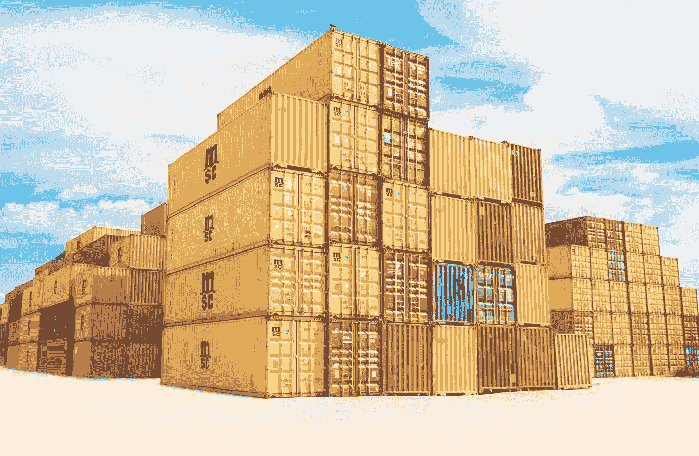

# 解决我们的平台稳定性问题

> 原文：<https://medium.com/hackernoon/resolving-our-platform-stability-issues-4bf4aeb2e1ca>

几年前，我们开始面临一些严重的扩展问题。随着[平台](https://hackernoon.com/tagged/platform)的发展，我们拥有越来越多的客户，由于服务器耗尽和数据库争用，系统响应时间开始受到影响。我们的托管成本增长比我们的增长率快得多，这显然是不可持续的业务。当平台的各种组件开始定期发生故障，导致我们遭遇中断时，事情变得非常严重。

我们发现，我们一直在努力保持系统平稳运行。支持团队最终在他们的地板上有一个巨大的红色按钮，每周按很多次。我们提供优质客户服务的声誉受到了损害。不得不应对沮丧的顾客的团队无法完成他们的工作，这有助于沙龙利用我们的平台发展他们的业务。

我们需要采取一些严肃的行动，解决稳定性问题，在事故发生时重新思考我们的价值观和决策过程。我们不能再仅仅通过“重新部署”或“扩大 x”来解决任何生产问题。

发生的每个事件都需要有一份停机报告。这让我们对每种类型的事件都有明确的行动和解决方案。

每个停机报告都有相同的格式，由解决问题的[软件](https://hackernoon.com/tagged/software)工程师发布，并放到我们的维基上。我们与公司的每个人都分享了这份报告，让他们明白我们正在采取预防措施，并让他们放心。

# 断电报告格式

**描述**

*发生的事情的可消化的俏皮话。*

**停机时间**

*时:分*

**募集支持票数量**

*对支持团队影响的详细数字*

**受影响的功能**

*受断电影响的系统功能描述*

**问题的解释**

*对所发生事件的清晰技术描述*

这份报告确保我们清楚地了解实际发生了什么。

**调查**

工程师查看了哪些地方，他们是如何解决问题的，花了多长时间。以及该问题的一些指标或日志的截屏。

**预防措施和行动**

为了防止这种事情再次发生，我们要做些什么？

这里的最低期望将是一个警报，以帮助我们先发制人。每个行动都需要在吉拉被追踪。

# 我们发现了什么

*   自动化和部署过程中的弱点。
*   我们的构建过程和部署速度太慢了
*   我们缺少监视器和警报(客户比我们先知道问题)
*   难以应对流量的服务器组件
*   有内存泄漏的过时版本的库和代码

在分析数据时，我们清楚地看到它对我们产品开发的阻碍程度。工程师们不断被从不同的角度拉去救火。速度和交付的不稳定性意味着我们无法准确预测新功能或改进何时可以交付。我们的两个核心价值观是增长和长期思考，所以我们知道是时候解决这些问题并发展我们的平台了。

# 修复稳定性问题

对于一个小的工程团队来说，在继续产品开发工作的同时解决所有问题的工作量太大了。我们不得不做出一个重大决定，停止所有的产品开发工作，并付出巨大的工程努力来解决问题。这产生了巨大的连锁效应，因为我们有业务承诺和期望要满足。

目标很明确，提高我们系统的稳定性，同时帮助它随着我们客户群的增长而扩展。我们称这个工程为达尔文工程，因为它是关于我们系统的进化。从工程的角度来看，很难知道我们什么时候会完成，但是我们把它分解成小的可测量的增量。

我们承担的一些主要工作包括:

*   我们从 API 和集成级别的测试覆盖开始——这样我们就可以知道我们是否破坏了什么
*   我们编写了加特林性能测试，以确保我们能够模拟生产环境
*   将一个单一的后端划分成独立的服务(每个责任的有界上下文)
*   从经典 EC2 烘焙 AMI 部署迁移到 Docker
*   我们让我们的容器自我修复，并在 ALBs 之后对它们进行负载平衡
*   将我们的基础设施转化为代码
*   迁移我们的数据库亚马逊的极光
*   使我们的服务无状态化并移除缓存
*   添加自动缩放功能
*   完全自动化我们的构建过程和发布过程

# 一年后回头看

虽然停止功能开发和修复问题很痛苦，但我们可以有把握地说，我们的稳定性问题已经解决了。没有更多的消防和支持地板上的红色按钮是值得庆幸的灰尘。通过使用我们的长期价值作为指导，我们进行了达尔文项目，以获得平台稳定性、容错性和弹性。

因此，我们再也不必退回到需要解决问题的大爆炸式方法，我们已经适应了持续改进的思维模式，它现在是我们工程价值观的核心部分。我们在开发冲刺阶段定期休息，处理我们的技术积压——修复琐碎的问题，升级系统的某些区域，回答未知的问题，并总是让系统变得更好。

如前所述，我们的托管成本是不可持续的，当我们回头看时，我们看到一个更低的和不稳定的 AWS 账单。

从更个人的角度来说，这是我所面临的最困难的工程挑战之一，如果没有天才的工程师和普勒斯特团队的支持，这是不可能的。