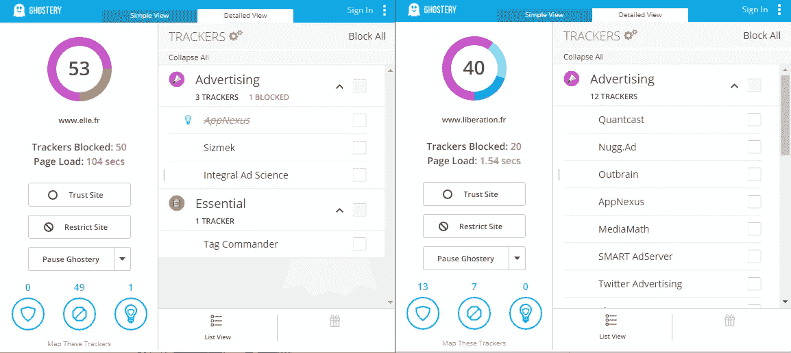
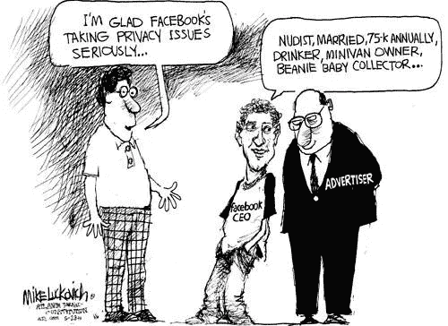
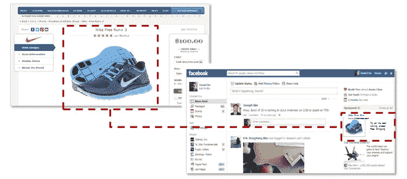
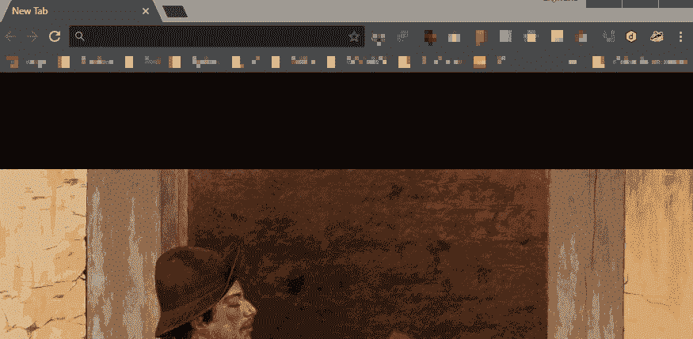

# 尊重用户隐私:必须成为标准的怪事

> 原文：<https://medium.com/hackernoon/respecting-users-privacy-the-oddity-that-must-become-a-standard-1252fbf54189>

2018 年，尊重你的用户隐私应该很容易吧？在斯诺登披露了美国国家安全局的做法和其他所有后续行为后，虚拟主机提供商和其他服务改变了他们的做法，对吗？这就是我们所想的——这种幻觉并没有持续很久。今天我们带你进行一次小小的数据之旅:谁在收集它们，如何收集，为了什么？

这篇法语文章是原文。

# 设置上下文

你可能知道；否则，我们建议你阅读宣言——我们最近推出了一份出版物 EcoCrypto，它尊重用户和他们的关注。

关于他们的注意力，那是我们的问题。然而，说到尊重我们用户的隐私，它比我们更重要:我们必须仔细检查我们使用的每一个第三方服务，以确保他们没有滥用我们(和你)的信任。

当我们发表[宣言](https://ecocrypto.fr/manifeste/)时，我们意识到**很少有人知道发生在网上的系统化数据收集**。我们决定写一篇文章，全面概述目前在网络上几乎随处可见的主要跟踪解决方案。在文章的最后，我们提出了两组建议。第一个是给每个人的:关于如何保护你的在线隐私的最基本的知识。第二个是针对站长的:如何尊重你的用户隐私。

# 追踪者狂热

> **每增加一名追踪者，我们就多了一位客人。**

让我们从基础开始:什么是追踪器？本质上，它是一个可以放在他/她的网站上的小脚本——它允许不同的服务用来收集访问者的数据，从而为网站管理员提供新的服务。

追踪者就像是第三方的告密者——每增加一个追踪者，我们的隐私盛宴上就多了一位客人。

# 最少一打追踪器？

*注意:为了忠于原文(用法语写给法国公众)，我们保留了法语网站作为例子。全球各地的情况都差不多，有些国家甚至更糟。*

任何媒体网站都在使用至少一打追踪器。不需要相信我们，[使用 Ghostery](https://www.ghostery.com/) 自己检查:它让你很容易地可视化所有网站上的追踪器。

以下是法国访问量最大的网站的追踪之旅:

*   lemonde . fr[法国第二大(受众)全国性日报] — **32** 不同的追踪器
*   leFigaro.fr [#1 全国性日报] — **35**
*   media part[仅在线发布] — **21**
*   快报【周刊】——**49**
*   tf1.fr [#1 私人电视频道] — **35**
*   France2.fr [#1 公共电视频道] — **18**
*   法新社(AFP——法国新闻社)——12 日
*   最后，最干净的 l'Humanité仍然有 10 种不同的追踪器。

*注:该措施于 7 月 18 日在各网站首页进行。记住禁用任何广告拦截器或脚本拦截器，以查看给定网站上的所有追踪器。*

Elle.fr [Weekly women magazine] — **53 trackers**; Liberation.fr [Daily newspaper] — **40 trackers**

通常，在这些网站上工作的人甚至不知道追踪器。我们联系了法国的加密出版物，让他们了解他们侵犯隐私的做法。所有人都说，他们“惊讶”地发现这个网络如此之广。有些人可能会说他们在嘲笑我们——你们是裁判。

从这次对恐怖画廊的小小参观中，我们可以得出两点结论:

1.  99%的互联网网站的所有者/网站管理员显然没有考虑过尊重他们的用户隐私。
2.  这些网站的用户不知道跟踪及其后果。因此，他们不会要求/推动既干净又尊重他们隐私的做法。

如果有任何变化即将到来，它将来自用户:我们需要要求高，不妥协。要做到这一点，你必须知道自己在与什么做斗争——让我们开始快速浏览一下在线追踪世界中一些最可疑的做法。

# 追踪器的分类

有几种不同类型的追踪器，以下是概述:

*   **广告追踪器**:这些追踪器允许网站管理员(和广告服务)在用户访问网站时收集额外的数据——这些数据随后被用于提高广告的效果。最常见的是双击和脸书广告。我们将在广告跟踪器的一个子部分——像素——给出更多细节。
*   **统计服务追踪器**:最著名的是谷歌分析，但还有很多其他的。他们会有自己的区域。
*   **社交网络追踪器:**它们允许在网站上直接整合社交媒体，比如从媒体网站上点击脸书页面。这意味着用户被识别(通过他/她的脸书/推特/X 个人资料)。最后一件事:不需要与要识别的按钮交互——这是该机制的全部优点。微笑！你被监视了。

## 访客统计…和非常详细的个人资料

每个网站管理员都有同样的问题:他/她需要统计数据来了解最常访问的页面或文章，他/她的用户来自哪里，他们有多少人…要做到这一点，关键是实施谷歌分析。

谷歌分析的价值主张非常简单:谷歌是数据收集和处理方面的专家，而你可能不是。实现这个小脚本，Google 将为您完成大部分工作:收集数据、处理数据或在全面的仪表板中呈现数据。很方便，现在大部分(如果不是全部)网站都在用。问题？所有的数据都通过谷歌，换句话说:**谷歌现在正在收集任何网站用户 99%的数据，直指源头(在网站上)。**

如果每个网站都是一个酒吧，Google Analytics 的情况将类似于在房间的正中央有一个麦克风一直开着的 Google Home。仅仅是几个吧/网站就已经很烦很有问题了。然而，现在，由于几乎所有的网站都使用这种机制，它成为了 web 全视眼/全听耳。

任何使用 Google Analytics implement 管理网站的人都知道我们在谈论什么:任何用户的可用数据量都是惊人的。很难给出一个精确的数字，因为谷歌分析的每个实现都是不同的。谷歌自己吹嘘它的 **400 种不同的“度量和维度**”——[这里是列表。](https://developers.google.com/analytics/devguides/reporting/core/dimsmets#mode=web)

站长庆幸！我们在文末提出了一个替代方案。

# 在线广告和用户隐私:严格不可调和

当我们谈到广告追踪器时，这是一个快速的概述。请允许我们放大一点。首先，关于在线广告的一些基础知识:

*   它是按行为付费的:每次点击、每千次浏览、每次特定行为(注册、下载应用程序……)的费用
*   并非所有的行为都是平等的——点击可能来自完全不属于你的主要目标的人，或者相反来自潜在的完美客户
*   在线广告活动可以随时实时调整。

当基本原则被清楚地陈述后，很容易理解在隐私和在线广告之间需要做出选择。为了优化在线广告，人们必须收集越来越多的数据，以提高他/她的针对性，并避免不必要的开支。

在线媒体和社交网络经常对他们的“保护用户隐私的斗争”颇有微词——不要让自己被愚弄了。所有访问量最大的网站都是在线广告服务的大用户，并使用许多跟踪器:简而言之，它们不尊重用户的隐私。更糟糕的是:他们正从违规中赚钱。

# 间谍像素

还不服气？你认为“道德广告”是一件事吗？让我们放大一种特定的追踪器:广告“像素”，如[脸书像素](https://www.facebook.com/business/learn/facebook-ads-pixel)。同样，这是一个小脚本，有点像谷歌分析。网站管理员在他/她的网站上实现 pixel，并获得额外的(与广告相关的)统计数据和服务。

站长们的一个主要兴趣是，所有收集的数据将直接出现在脸书的广告中——这使得优化广告变得更加容易:对于任何为该平台投入大量预算的人来说，这是一个强制性的跟踪器。多亏了 pixel，网站所有者可以将脸书上的广告和他网站上的行为联系起来:注册、购买、下载等等。

脸书 pixel 的一个问题与谷歌分析相同:由于 pixel 现在无处不在，脸书正在大多数访问量最大的网站的源头收集数据。

An example of a retargeting scenario using Facebook (source: [Lyfe Marketing](https://www.lyfemarketing.com/spa-owners-facebook-customers/facebook-retargeting-example/))

此外，pixel 允许一种称为“重新定位”的特定广告活动:该术语指的是任何利用潜在客户先前行为进行定位的广告。使用脸书(像素和广告服务)的典型重定目标流程如下所示:

1.  你去一个给定的网站，比如说一个剪草机商店。
2.  笑一笑，有人在偷窥你！多亏了 pixel，你立即被识别，你的“脸书 ID”(你的脸书个人资料的唯一标识符)被添加到一个重定向列表。
3.  你去脸书，在你的新闻提要中发现割草机惊人的销量。

# 顺便发现的小礼物

在我们深入研究我们的建议之前，让我们先来看一个具体的例子，这个例子很好地说明了尊重网站用户在线隐私的挑战。

听说过 WordPress 吗？这是一个框架(~引擎),允许你轻松地创建博客和网站——这是我们目前在 EcoCrypto 上使用的……

WordPress 的默认安装使用一种叫做 Gravatar 的服务:多亏了它，每个用户都可以拥有自己的个人资料照片。

更好的是，用户可以在 gravatar.com 上创建自己的账户，并一次性设置个人资料图片——Tada！你的照片现在出现在每一个使用 Gravatar 的 WordPress 上，而不需要你重新设置。不错吧。

只可惜噱头背后的现实相当丑陋。Gravatar 使用电子邮件将用户与其个人资料图片进行匹配。这意味着**默认情况下，任何在 Wordpress 上发表评论的人都可以看到他/她的电子邮件免费往返 Gravatar 的服务器。**通过往返，Gravatar 可以建立每个 WordPress 安装的用户列表——还在寻找那个可爱的自定义个人资料图片吗？

存在许多替代方法，只需点击几下鼠标就可以设置好，但是由于 Gravatar 在所有安装上都是启用的，所以它仍然被广泛使用。默认安装，再加上对这种做法的普遍忽视，使得 automatic(Gravatar 的开发者)可以用多年来不知不觉收集的用户电子邮件来填充自己。 *为了更进一步，这里有* [*一篇关于 Gravatar 隐私问题的有趣阅读。*](https://meta.stackexchange.com/questions/44717/is-gravatar-a-privacy-risk)

当涉及到隐私时，这种场景会一遍又一遍地重复。每个人都同意并支持这个概念，但只有少数人真正研究它。在商业方面，“尊重你的用户的隐私”这个主题只不过是一个潜在的交流话题:它很少在软件层面得到执行。

# 那么，我们能做什么呢？

我们试图保持简洁，不要过多地钻研技术细节——我们已经省略了许多实践，这篇文章一点也不详尽。有几十种，可能是几百种不同的技巧和机制可以用来跟踪和监视在线用户。有些比其他的更阴险，更难对付，比如[指纹识别。](https://panopticlick.eff.org/)

这篇文章的灵感来源于建立一个尊重读者隐私的简单博客的艰难历程。**我们把这个话题留给了专家，正因为如此，我们正在进入一个侵犯隐私已成常态的局面——那些想要尊重隐私的人也在为此挣扎。**所有这一切都发生在苹果、谷歌、脸书和其他公司在普通观众面前将自己描绘成“隐私冠军”的时候，而他们是第一个将隐私概念的最末端系统化的人。我们应该反击，或者也许我们十年前就应该反击了？永远都不晚！

# 工具箱:保护你隐私的最低要求

好消息(有一个！)保护你的隐私需要你屏蔽所有的广告——以及检测你是否有广告拦截器的脚本。隐身也有光明的一面！

接下来是最基本的设置，如果可能的话，您必须走得更远才能真正覆盖:

## 1.屏蔽广告

对于 Chrome 用户，我们推荐[Nano ad blocker](https://chrome.google.com/webstore/detail/nano-adblocker/gabbbocakeomblphkmmnoamkioajlkfo)+[Nano Defender](https://chrome.google.com/webstore/detail/nano-defender/ggolfgbegefeeoocgjbmkembbncoadlb?hl=en)(反广告拦截解除器)组合:设置简单，效果不错。Firefox 用户可以使用 [uBlock Origin](https://addons.mozilla.org/en-US/firefox/addon/ublock-origin/) 获得类似的结果。

注意:无论你选择什么广告拦截器，不要忘记启用与你的国家相应的 EasyList。下面是法国列表的演示 GIF:

您可以通过访问任何启用广告拦截器的媒体网站来尝试您的设置；你会看到很多自由空间！阴险的广告，如赞助商的帖子(专业人士称之为“原生广告”)不会被屏蔽——小心。

## 2.列出并阻止追踪器

广告只是开始。现在我们需要解决追踪者。好消息是有非常多的扩展可以为你处理这些。

隐私獾是由电子前沿基金会(EFF)开发的，这是一个多年来一直在数字世界捍卫公民自由的非营利组织，盲目信任他们是不够的，但它确实提供了保证。你不需要任何特定的设置，但你可能想看看追踪器列表(通过点击扩展图标)并禁用那些你不需要的。在文章的开始，我们提到了[Ghostery](https://www.ghostery.com/)——它也工作得很好，对于某些人来说可能更容易使用。

## 3.使用 HTTPS，无处不在

当您访问使用 HTTPS 的网站时，浏览器和网站之间的交换是加密的。HTTPS 现在很普遍，但它在某些网站上的实现相当混乱:它们会让你在安全和常规 HTTP 之间切换回来。EFF 的另一个浏览器扩展解决了这个问题:它迫使网站在任何可用的时候使用 HTTPS。

## 关于隐私工具的附加说明

如果你想更安全，使用火狐浏览器而不是 T2 谷歌浏览器。如果你在网上寻找敏感的东西，[至少用 TOR，设置](https://www.torproject.org/projects/torbrowser.html.en)超级简单。最后，如果你想更安全一点，寻找更敏感的东西，或者泄露关键信息，请检查[TAILS——一个为隐私而设计的操作系统(基于 Linux】。在进入网络的黑暗面之前，阅读并记录你自己。](https://tails.boum.org/)

为了保持文章简短，我们将自己限制在三个工具上。**要真正覆盖您的数字步骤，您必须走得更远。**

我们可以很容易地列出一百种不同的[工具](https://hackernoon.com/tagged/tools)用于不同的情况——这是没有意义的。你需要能够自己挑选最适合自己使用的工具。要做到这一点，除了掀开引擎盖钻研技术问题，别无他法。**如今隐私不给；你必须为之奋斗。**

全球各地的非营利组织都在尽其所能。EFF 编辑了一个[监视自卫指南](https://ssd.eff.org/en)，这可能是一个很好的起点。

# 作为网站管理员，尊重用户隐私

如果你在管理一个网站，你可以从脱离谷歌分析开始最关键的行动。我们选择了 [Matomo](https://matomo.org/) ，一个开源的**自托管**分析解决方案。自托管的部分意味着数据保留在我们的服务器上:这是必不可少的。

根据你的主机提供商，设置 Matomo 可能更容易或更难。如果你的主机提供支持 [Softaculous](https://www.softaculous.com/) ，安装将在几个点击中完成。否则，您可能需要学习一两件关于服务器管理的事情。

您可以采取的其他行动将取决于您使用的服务和框架。让我们建议一种方法，而不是工具列表:

1.  **第三方服务最小化**:尽量减少您使用的第三方服务的数量。每个新服务对你的网站[安全](https://hackernoon.com/tagged/security)和你用户的隐私都是一个潜在的风险。即使是一个体面、诚实的服务也可能在一瞬间变得无赖，而且它不会就此警告你。
2.  **调查你实现的任何第三方服务**:尽管 1/，你还是要使用一些第三方服务。调查这些服务的开发者，他们的其他产品，评论。甚至可能会有其他人审核他们的代码并谈论它。尽可能使用开源服务。
3.  忘掉主要服务(社交媒体、谷歌……)上的在线广告吧——你无法在不侵犯用户隐私的情况下实现这些服务的成本效益。
4.  **求助！越来越多的人变得“隐私流畅”,并且很乐意帮助一位好心的网站管理员建立一个体面的环境。**

如果你喜欢这篇文章，请告诉我，并查看我的维基以获得更多类似的内容。 **别忘了拍拍它** **帮它传播:**可以一直按👏高达 50 次鼓掌。

本文是一篇原创(法语)EcoCrypto.fr 故事的翻译。