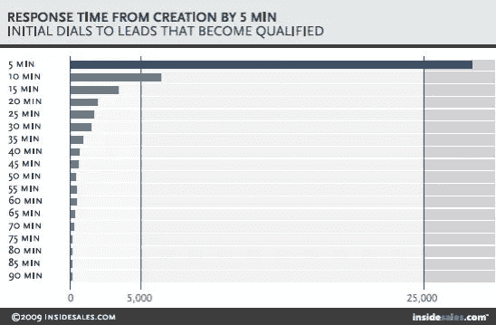

# 回应线索:你行动够快吗？

> 原文：<https://medium.com/hackernoon/responding-to-leads-are-you-moving-fast-enough-2facfa8b75f3>

Image by Rawpixel.com

# 一条新线索出现了——时间紧迫。在你的领先优势消失之前，你有多少时间做出回应？

每个人似乎都知道，当有机会达成交易时，时间是最重要的。然而,[哈佛商业评论](https://hbr.org/2011/03/the-short-life-of-online-sales-leads)的研究统计数据显示，大多数公司对线索的反应都很慢，这意味着他们不能有效地处理在线查询。

研究了 2000 多家美国公司，以衡量他们对网络生成的测试线索做出回应的时间，结果发现，24%的公司花了超过 24 小时——23%的公司根本没有回应。

更有趣的是，这个统计数据反映了及时的反应有多重要。研究表明，**在一个小时内对销售线索做出回应的公司，将销售线索转化为销售额的可能性是其他公司的 7 倍。**

报告写道，那些试图在收到查询后 60 分钟内联系潜在客户的公司“*”与那些试图在一个小时后联系潜在客户的公司相比，他们与关键决策者进行有意义对话的可能性几乎是后者的 7 倍。然而，只有 37%的公司设法在一小时内跟进线索。*

# **分秒必争**

《哈佛商业评论》展示了一小时内回复的重要性，但更仔细地看会发生什么；在提交线索后的几分钟内？

[销售线索回应管理研究](http://www.leadresponsemanagement.org/lrm_study)展示了当您的销售线索在等待回应时，每一分钟会让您付出多少代价:

Image from [Lead Response Management Study](http://www.leadresponsemanagement.org/lrm_study)

*“在第一个小时内，致电联系销售线索* ***的几率下降超过 10 倍*** *”*

*“排位赛 5 分钟领先 30 分钟的几率* ***下降 21 倍*** *”*

# 为什么响应时间如此重要？

你的回应时间之所以如此重要，不仅是因为第一意识(当联系发生时，消费者对供应商仍记忆犹新)，也是因为 Ken Krogue 所说的“[哇效应](https://www.forbes.com/sites/kenkrogue/2012/07/12/the-black-hole-that-executives-dont-know-about/#49ecf7cf38e3)”。

如果你在收到线索后几秒钟就回复他们，会不会吓到他们？也许曾经有一段时间，这可能有点令人担忧——但随着人工智能和技术的所有最新进展，事实是，如今的消费者*想要*而*期望*立即响应。

对潜在客户做出快速反应是留下良好第一印象的好方法。这表明你感兴趣，并告诉他们你的服务有多快——有助于从一开始就建立信任。

# 击败你的竞争对手

多达 [50%](https://uk.insidesales.com/resource-short/2014-lead-response-report/) 的销售额流向最先做出回应的供应商。那么，你如何确保自己有效地处理线索，并成为第一个做出回应的人呢？

# **1。为您的团队配备最新的实时聊天技术**

消费者比以往任何时候都更需要即时关注，这就是为什么企业越来越多地转向可以促进即时响应的实时聊天软件。

一个现代的实时聊天工具可以让你的销售团队在有人对你的产品或服务感兴趣的时候随时准备好开始对话；并参与对话以实时回答问题。

无需在线提交表格，也无需消费者等待你的电子邮件；实时聊天可以将漏斗简化为单个对话。

目标是在 5 分钟内返回，以优化你成功的机会。

# **2。使用自动化来定制响应**

当你不能提供即时的个人回应时，自动回应可以提供很好的支持——前提是你的团队能够根据情况选择并跟进。

在使用自动回复时，重要的是要避免自动回复给人一种刻板的印象。努力使你的信息个性化。一个好的自动化工具可以让你根据客户的行为和行动定制信息，确保内容不仅及时，而且切题。

# 3.**有效跟进**

除了通常缓慢的响应标准，统计数据还显示公司在追踪线索方面不够坚持。平均而言，**公司在辞职前尝试联系领导的次数只有 1.3 次。**

想想消费者有多少选择。您的潜在客户可能会犹豫不决，需要一定程度的关注，这只能通过适当的跟进来实现。这就是坚持如此重要的原因。

沟通是保持潜在客户在其决策周期中前进的关键。没有有效地跟进，你就让你的线索从雷达上消失了，给了你的竞争对手介入的空间。

# **结论**

延迟回复潜在客户很容易导致金钱损失。一个小时内的回复将转化的机会提高了 7 倍，而你与潜在客户成功联系的最佳机会是在 5 分钟之内。

快速响应线索在很大程度上取决于拥有正确的工具。速度很重要，但相关性也很重要。确保为你的团队配备工具，让他们能够快速响应，并在正确的时间发送正确的信息。记住——每一分钟都很重要！