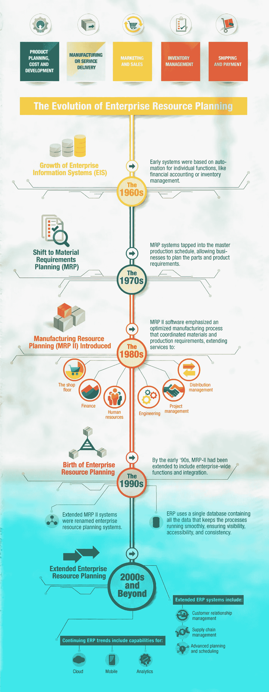
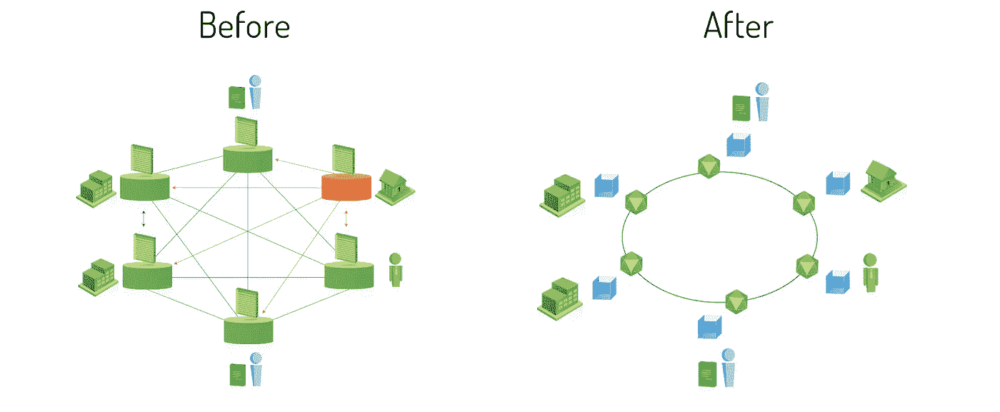

# 里普里普。

> 原文：<https://medium.com/hackernoon/rest-in-peace-enterprise-resource-planning-r-i-p-e-r-p-665039e788ec>

## “区块链”企业

数字化转型将扼杀 ERP。这是一个强有力的声明，但在这个时候，没有什么比改变更确定的了。当大型企业从旧金山的地下室或哈佛的学生礼堂中诞生时，不难质疑应用程序的未来。如果数字化转型可以“瓦解”企业，为什么不能摧毁一个概念？

# 工业时代 x 数字时代

在他的精彩文章“[中，旧的 ERP 在“日期](http://diginomica.com/2015/10/05/old-erp-is-way-past-its-best-when-used-by-date/)”使用时已经过了它的“最佳时期”， **Brian Sommer** 提出:“就像[巨蟒剧团的挪威蓝鹦鹉](https://www.youtube.com/watch?v=4vuW6tQ0218)一样，再多的谈论或把这个可怜的东西钉在它的栖木上也不会让它起死回生。打电话给殡仪馆，写讣告。”在第二篇文章中，他详细描述了他触及 ERP 结构核心的想法。在他看来，成本会计属于工业时代，它教会人们如何确定在一个项目的生产过程中是否发生了任何生产、成本、废料或其他差异，但如果你的产品是数据，并且“数字时代迫切需要一个新的成本会计模型”，这就无关紧要了

> “是时候淘汰旧的 ERP 解决方案了。你的公司花了几百万或几十亿来实施它的 ERP 系统并不重要，它们只是不再相关了。”
> 
> 布莱恩·索默

Gartner 表示,“满足企业所有需求的单一 ERP 套件的概念已经过时，取而代之的是混合 ERP 方法，该方法将云点解决方案与内部 ERP 功能(如财务和制造)的较小“核心”相结合。对他们来说，“随着整体式、内部 ERP 和企业应用程序的替代方案不断成熟，首席信息官和应用程序负责人必须采取行动，应对“**传统 ERP** 即将到来的现实”。

# 数字化转型

[**古往今来的企业资源规划**](http://www.ctnd.com/a-brief-historical-look-at-the-evolution-of-enterprise-resource-planning/)

# 区块链:后一天

忘掉 ERP 和我们多年来经营企业的方式。尽管技术发生了变化，但一切都保存在一本书里。称为总账的交易账簿。应付账款、应收账款、现金流、固定资产和采购。为什么？用简单的一句话？因为我们要知道能不能把钱带回家！不管是小业主还是大型上市公司。是一样的。但是如果没有一本集中的书呢？我们需要知道我们是否还能把钱带回家。但是如果没有钱呢？

## **万物的纳普斯坦化**！

我第一次听到这个是在 1999 年。我的硕士论文导师、网络无政府主义者理查德·巴布鲁克博士(Dr. Richard Barbrook)正在传播这样一个消息:互联网是美国军方(ARPANET)发明的，[是对冷战的最大讽刺。在对抗斯大林共产主义的高潮中，它无意中资助了网络共产主义的创建。由《太阳报》](http://www.imaginaryfutures.net/2007/04/17/cyber-communism-how-the-americans-are-superseding-capitalism-in-cyberspace/)和杰里米·科尔宾数字民主宣言背后的人[滑稽地描绘的巴布鲁克博士，假定“在](http://www.thesun.co.uk/news/1696459/jeremy-corbyn-comes-up-with-nonsense-online-strategy-dreamed-up-by-cyber-communist/)[高科技礼物经济](http://innovate.ucsb.edu/796-richard-barbrook-the-hi-tech-gift-economy)中，知识产权在技术上和社会上都过时了”。

# 互联网去中心化的理由

“但是谁的互联网？最终的去中心化网络已经逐渐发展成一系列庞大的[栈](http://www.theatlantic.com/technology/archive/2012/12/bruce-sterling-on-why-it-stopped-making-sense-to-talk-about-the-internet-in-2012/266674/)，在这里，我们 21 世纪的公用事业(通信、声誉、支付处理)由铁板一块的公司运营……”。“20 世纪 90 年代的虚拟边界预示着一个新的自我管理时代，它不是垂死的:它死了。"

全球首家区块链咨询公司的创始人 Stephan Tual 提出了上述问题，但他并没有让我们落后。在他的文章中，他谈到了“[物联网经济](http://www-935.ibm.com/services/us/gbs/thoughtleadership/economyofthings/)”、IBM，IBM 可以通过设备之间的直接通信从**物联网**中提取价值，而无需中央数据库。它具有巨大的破坏性潜力，他呼吁通过区块链[进行(再)去中心化。在其他文本中，他谈到了](https://hackernoon.com/tagged/blockchain)[【大数据的终结】](http://blog.stephantual.com/the-end-of-big-data-a-reasonable-internet-of-things-ff78a4428ed7#.yg039wjnr)(!)在这里，信息将被保存在它应该在的地方，而不是将数据发送回中央母舰进行处理和定位:在它自己内部，在你的家中，经过加密，除了它的所有者，没有人可以访问。

# 区块链世界

最后，我们能否分散交易账户，创建一个“napsterised”总账？通过区块链可能吗？首先，让我们看看什么是区块链和 [IBM 有一个很好的方法来解释它:](http://www.ibm.com/blockchain/what_is_blockchain.html)

“它是新一代交易应用程序的[技术](https://hackernoon.com/tagged/technology)，在简化业务流程的同时建立信任、责任和透明度。这是一种因比特币而出名的设计模式——这也是我在本文中使用的原因——但它的应用远远不止这些。有了它，我们可以重新想象世界上最基本的商业互动，并为发明新的数字互动方式打开大门。它有可能极大地降低跨企业业务流程的成本和复杂性。分布式分类帐使创建经济高效的业务网络变得更加容易，在这个网络中，几乎任何有价值的东西都可以被跟踪和交易，而不需要一个中心控制点。”

# 开发应用程序

可以使用区块链技术开发应用程序，如[以太坊](http://www.ethereum.org/)、*一个分散的平台，应用程序完全按照编程运行，没有任何停机、审查、欺诈或第三方干扰的可能性。*

未完待续…

**下一个问题:企业应用程序会是怎样的？没有钱怎么可能有企业？一个没有钱的世界会有什么样的社会影响？**