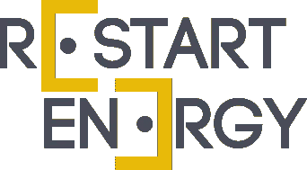

# 重启能源区块链上的去中心化和非本地化的电能供应平台

> 原文：<https://medium.com/hackernoon/restart-energy-a-decentralized-and-delocalized-electrical-energy-supply-platform-on-the-blockchain-97ec4b280139>

Restart Energy 是一家先进的能源供应商，目前正在建立一个全球分散和异地的电能供应平台，该平台涵盖所有形式的能源，以促进购买、销售和分销过程，形成一个完整的生态系统，承诺将采购费用降低 30%，同时将独立供应商的利润提高 30%。

该软件平台被称为 RED-P，旨在弥合能源供应商和消费者之间的差距，通过这样做，它将积极促进那些提供、供应和购买可再生能源的供应商。

重启能源生态系统为家庭、中小企业甚至跨国公司提供综合能源、天然气和燃料服务，以实现更大的节约和提供所有形式的能源消耗。

随着世界各国政府最终开始承认，我们对能源的过度需求正在迅速剥夺地球上宝贵的自然资源，所有国家都必须创新以更环保和更经济的方式发电的共识是明确的，并且必须迅速采取行动。

红色平台的最终目标是创造一个世界，在这个世界中，任何人、任何地方都可以创造和消费可持续的、负担得起的能源。在一个每年价值超过 2 万亿美元的行业中，这个数字每年都在继续增长，这个雄心勃勃的项目预测系统背后的驱动力功能将使 Reset Energy 成为最大的全球能源供应商，其下一代商业模式更适合数字时代。

Armand Doru Domuta 于 2015 年成立的 Restart Energy 公司负责开发欧洲第一家也是唯一一家能源零售特许经营公司，在解除管制的家用天然气市场和罗马尼亚解除管制的家用能源市场中分别排名第一和第二。该公司利用其现有网络，率先接受比特币作为支付手段，并已经在一定程度上证明了其新项目的可行性。

**重启和 RED-P 软件如何工作**

RED-P 允许直接从生产太阳能、风能、水能等的供应商处上市和购买可再生能源，以支付银行可担保的能源和绿色证书以及承购协议。与类似的服务不同，Restart 不仅仅是为了创造更多的能源提供商，它还为所有用户提供了一种访问所有能源提供商的方式，而不仅仅是那些目前拥有大量市场份额的传统参与者，因此在解除管制的国家中是一种垄断形式。

然后，电力通过红色网络提供给供应商和消费者之间的直接点对点能源交易，由区块链电力公司建造的兆瓦令牌(MWAT)驱动。这一过程消除了国家电网充当中间人的需要，根据法律，中间人要求所有生产超过消费的私人能源供应商必须以极低的成本将多余部分出售给电网，如果供应商需要在一个月内购买额外的电力，他也必须像其他非供应商一样支付膨胀的溢价。

使用红色在线门户网站或附带的移动应用程序，供应商可以列出他们的供应，无论是天然气、风能和/或太阳能，用户可以搜索找到最适合他们特定用途的能源形式。一旦用户找到了他/她的首选能源(可以每 30 天修改一次的决定)，他们就使用 MWAT 代币购买能源。然后，提供商接收代币作为支付，并且还将根据所交易的生态友好型可再生能源获得额外的代币奖励。

除了专注于消除价值链所有活动中的官僚主义，客户还可以选择仅由 100%可再生能源供应。此外，该系统还提供自动发票、付款和收据，以帮助用户保持更好的燃料管理，无论是个人还是商业。

总而言之，Restart Energy 的在线门户和移动应用程序旨在帮助用户更好地组织燃料管理，以最高水平的透明度节省成本。

**红色的优点**

尽管能源市场放松管制，理论上允许较小的组织动员自己成为一个功能齐全的能源供应商，但初始资本投资和持续的开销，以及大量的法律费用，使得这个机会对大多数人来说毫无用处。大公司仍然拥有购买或租赁所需设备、硬件和基础设施以及第三方甚至内部员工和服务成本的更大权力。因此，事实上，没有什么真正改变。

目前的模式为规模较小的初创公司提供的参与行业竞争的机会非常少，不管它能提供多好的服务。但是，通过采用 Reset 的 RED 系统，可以发现一个供应商，他可能能够提供比客户当前的供应商更好、更实惠的解决方案。

通过最终向所有希望投资可再生能源的人开放解除管制，Reset 创造了一个不那么忙乱的局面，供应商可以直接向客户销售，而不必首先将多余的能源出售给电网，客户直接从源头购买，也消除了研磨的需要。

**发展扩张**

一旦注册该网络，用户就可以访问全球能源供应提供商、智能 wifi 电表、功率预测软件点对点(P2P)能源交换，并且用户可以获得使用可再生能源的绿色证书。

为了帮助全球采用，RED 允许用户成为官方经销商，与该地区、全国或全球的其他人进行交易。为了获得开设特许店的权利，用户必须在其账户中持有一定数量的代币(不是作为付款，而是作为保证金)。虽然这项技术是在罗马尼亚开发的，巴尔干半岛是下一个扩张的目标，但据说在欧洲也有一些成功的特许经营权。

开始红色特许经营的要求是:

**10，000 个代币—红城特许经营** —在居住城市代理能源销售

**100.000 代币——红色区域特许经营**——代理其居住国整个区域的能源销售

**1.000.000 代币—红色乡村特许经营** —在其整个居住国代理能源销售

**+10.000.000 代币——RED Master 特许经营权** —国家专属，并可选择在其居住国创建分特许经营权(从 10，000，000 代币起，视人口而定)

该公司提供两种特许经营的方式。那些有资本投资的人可以从购买一体化解决方案中受益，该解决方案允许“主加盟商”访问 RED 平台上的所有功能。那些没有大笔资金投资的人仍然可以通过成为经销商来参与这个项目。这里的初始启动费用很低，但营业额也很低，尽管如此，这种解决方案确实为那些希望进入市场的人提供了一个很好的途径。

特许经营所有者从以下方面受益:

空壳中的电力零售业务

向家庭提供更便宜的可再生能源和天然气

为企业提供更便宜的可再生能源和天然气

进入红色生态系统和特许经营者的

访问具有 100%过程自动化的完整能源供应 CRM 软件

获得重新启动能源的专门人员和管理人员的协助，并全力支持特许经营及其所有者

能源和天然气交易、平衡和预测技术支持

营销和品牌包装

能效产品和服务

可再生能源产品和服务

移动应用程序的访问

在红色平台上接入 P2P 能量交换

到 2030 年，能源消耗预计将比目前的需求增加两倍以上，因此对能够更好地管理能源供应方式的新系统的需求变得更加迫切，这不仅是为了利润，也是为了促进可持续能源和帮助保护地球资源，实现更加绿色的未来。

通过使用区块链，技术重置和 RED-P 软件平台可以减少交易费用，降低消费者和当地小型生产商的总体成本，以节省生产，并通过直接的点对点能源交易在销售中赚取更多的钱。

**有价值的信息**

**币名:**重启能源(MWAT)

**总供应量:** 5 亿

**循环供给:** -

市值:30 00 万美元

**预 Ico 价格:** -

**Ico 价格:** 1 MWAT = 0.1 美元

**通过 ICO 筹集的代币/资金:** 30 00 万美元

**社交媒体链接和联系人**

**社交媒体信息:**

**T21 脸书**

网址:https://www . Facebook . com/restartenergydemocracy/

喜欢:20，215 个喜欢者 20，332 个关注者

过去 7 天有多少帖子/更新:4 条最近更新

***推特***

网址:https://Twitter . com/restartenergyio

追随者:15500 名追随者

过去 7 天有多少条推文/转发:1 条最近更新

***电报***

URL :https://t.me/restartenergy

用户:11 592 名成员

***电报管理员***

用户名:@parkerjumps

用户名:@ CryptoEsco

用户名:@DoryAmaz

用户名:@CryptoTeddy

用户名:@rebecaD

用户名:@Storm_3D

用户名:@dex27

用户名:@DocFil

用户名:@cubogdan

***松弛***

URL :-

用户:-

***Reddit***

URL:https://www . Reddit . com/r/restart energy/

读者:649 名读者

***Youtube***

网址:https://www . YouTube . com/channel/UC 3 eny KC 8 qvoug 8t-3 alk 9w

订户:325 名订户

***中等***

URL:https://blog . restart energy . io/

追随者:不显示

过去 7 天有多少次更新:3 次最近更新

***领英***

网址:[https://www.linkedin.com/company/restart-energy-one/](https://www.linkedin.com/company/restart-energy-one/)

追随者:76 名追随者

过去 7 天有多少更新:最近没有更新

***钢锤***

网址:https://ste emit . com/@ restart energy

追随者:13 名追随者

过去 7 天有多少更新:最近没有更新

***GitHub***

网址:https://github . com/Transylvania hightech/RestartEnergyICO

过去 7 天有多少更新:最近没有更新

**团队/员工**

姓名:阿曼德·多鲁·多姆塔

**头衔** :CEO &创始人

Armand 在过去的 10 年里将 Restart Energy 发展成为罗马尼亚的一家多元化能源公司，并开发了 500 多个能源项目。

**LinkedIn**:https://www . LinkedIn . com/in/armand-doru-do muta-31994123/

**姓名**:雷纳托·多伊卡鲁

**头衔**:首席运营官&联合创始人

**Bio** : Renato 负责执行电力采购和交易的所有活动。他从一开始就与阿曼德集团合作。

**LinkedIn**:https://www . LinkedIn . com/in/Renato-doi caru-51b 96955/

**姓名**:克里斯蒂安·波格丹一世

**头衔**:首席财务官

**简历** : 14 年的金融行业工作经历，主要是在顶级银行，让 **Cristian** 对商业有了全面的了解。

**领英**:https://www . LinkedIn . com/in/cristian-bogdan-14b 82638/

姓名:安德烈·阿夫拉姆

**头衔**:首席技术官

生物:欧洲委员会关于颠覆性 ICT 初创企业的专家评估员，拥有 10 年发展 IT 相关业务的经验。

**LinkedIn**:https://www . LinkedIn . com/in/avramandrei/

姓名:道林·卢普

**头衔**:首席软件架构师

**个人简介** : Dorian 在为内部应用和微服务架构开发新功能方面拥有超过 10 年的经验。

**LinkedIn**:https://www . LinkedIn . com/in/Dorian Lupu/

**名字**:奥维迪乌·布林杜斯

**标题** :CSO

**简历**:销售主管，奥维迪乌负责建立所有内部和外部销售渠道。他的法律背景和销售经验。

**LinkedIn**:https://www . LinkedIn . com/in/ovidiu-Brin dus-0239 a 9109/

姓名:莉娜·康斯坦丁诺维奇

**职务**:国际业务发展负责人

**简历**:Lina 拥有超过 20 年的跨行业经验，作为首席财务官、首席执行官和首席运营官，她已经为建立数十家成功的公司做出了贡献。

**LinkedIn**:https://www . LinkedIn . com/in/linaconstantinovi/

姓名:马克斯·昂格尔

职务 :TGE 销售经理

**简历** : Max 是一位连续创业者，也是区块链的顾问，从事这个行业已经六年多了。他的背景是

**LinkedIn**:https://www . LinkedIn . com/in/max-Unger-944553150/

名字:阿扎姆·沙哈吉

职务:公关经理

简历:阿扎姆是一名企业家和区块链顾问。她热衷于创新和颠覆性技术，以带来积极的全球影响。

LinkedIn:https://www . LinkedIn . com/in/azamshaghaghi/

**名字**:丽贝卡·德拉戈米尔

**头衔**:市场经理

Rebeca 是一名营销经理，在营销领域有 8 年的经验，从一开始就在 Restart Energy 工作。

LinkedIn:https://www . LinkedIn . com/in/rebeca-Monica-drago mir-769 aa 125/

**名称** :Eng。维奥里卡·格奥尔基

**头衔**:市场总监

**简历** : Viorica 是首席市场和预测专家，在运营 OPCOM 市场方面拥有 12 年的经验。

**LinkedIn**:https://www . LinkedIn . com/in/viorica-Gheorghe-b 670186 a/

**名称** :Eng。玛拉·格里戈雷

**头衔**:大客户主管

简历:玛拉是大客户的负责人，在像 Arelco Power 这样的顶级能源公司担任大客户经理有 20 年的经验。

**LinkedIn**:https://www . LinkedIn . com/in/Mara-gri gore-7498284 a/

**名称** :Eng。玛丽安·伊里扎-沃伊内亚

**头衔**:供气主管

**Bio**:Restart Energy 的气体供应主管，Marian 拥有 6 年的气体分配经验和 10 年的气体供应经验。

**LinkedIn**:https://www . LinkedIn . com/in/iriza-voinea-Marian-8b 738769/

名字:亚历山大·塔尔坎

**职位**:在线销售经理

**简历**:在线销售主管，在过去 15 年中拥有销售和采购领域的经验，并具备基本的专业计算机编程能力。

**LinkedIn**:https://www . LinkedIn . com/in/alexandru-tarcan-5423467/

注意:restart Energy 通过电话和多个在线平台提供 24 小时支持:

Facebook Messenger、移动应用程序、脸书机器人和 WhatsApp。

脸书客户评级—在 187 项评估中得分 4.9/5—在能源公司中得分最高。