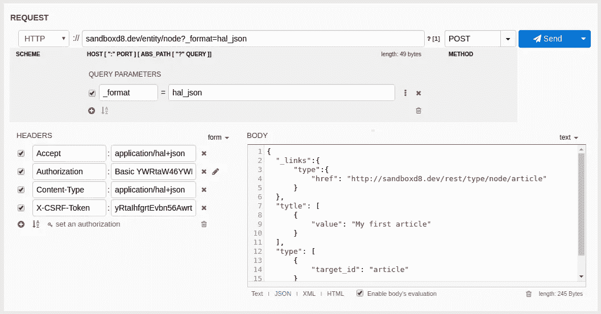
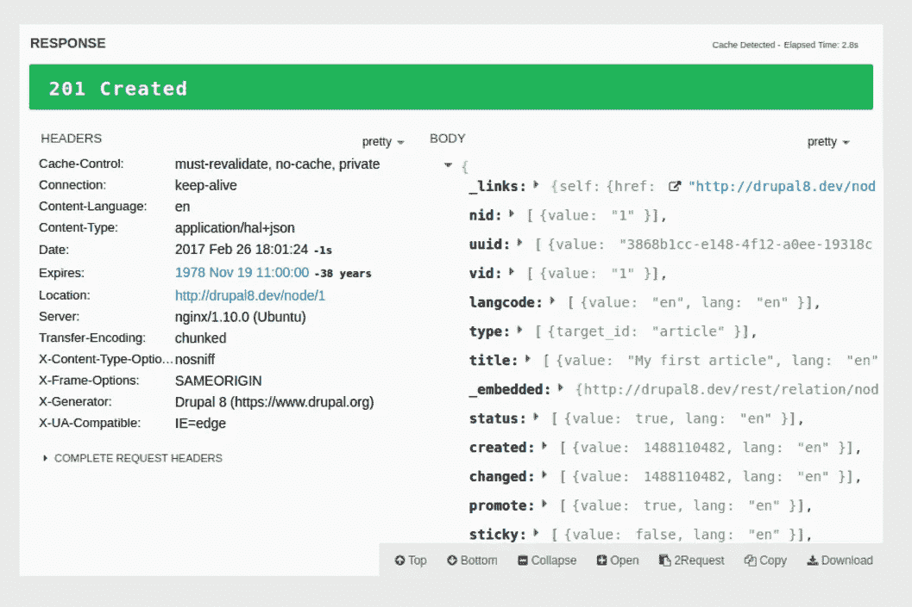

# Drupal 8 快速入门指南中的 RESTful Web 服务

> 原文：<https://medium.com/hackernoon/restful-web-services-in-drupal-8-quick-start-guide-354494c0fb31>

[By ADCI Solutions](https://goo.gl/64GGKj)

无头 Drupal 是过去几年中最激动人心的话题之一，吸引了许多人的注意力。这种现象与另一个流行术语 **RESTful API** (也被称为 **web 服务**)密切相关。它为我们作为开发人员提供了广泛的新能力。我们将了解 web 服务的本质，它们是如何工作的，以及如何使用它们，浏览可用工具的列表。在文章的最后，我们将使用 Drupal 8 Core REST API 创建一个节点。因此，让我们试着处理所有这些花哨的词语，并确定它如何帮助我们使我们的网站变得更好。

# 什么是 Web 服务？

## 关于物联网、移动应用和其他东西的一些信息

假设您有两台连接到互联网的计算机，它们位于不同的大陆。为了相互交流，他们需要一种统一的语言。这是一个关键 web 服务是两台计算机进行交互的标准化方式。在物联网时代，任何连接到互联网的东西都可以是电脑(甚至是你的微波炉)。

因此，计算机或设备可以使用相同的 API(一种应用程序接口)来相互理解和交互，而无需任何人工干预。我们可以在日常生活中使用 API，但并不知道这一点(例如，当我们将手机连接到电脑时)。

例如，您的移动应用程序可以与 Drupal site 通信来创建一个节点，或者更改和删除一个现有的节点。它是这样工作的:使用 REST API，移动应用程序发出请求，Drupal 站点用外部应用程序可以使用的结构化数据(例如 JSON)做出响应。因此，外部应用程序可以是一个 JavaScript 框架，用于网站显示的前端，但所有后端逻辑仍然属于 Drupal。甚至更多…

REST 只是让 Web 服务工作的另一种方式。还有其他格式，如 XML-RPC、SOAP 等。

我们来看看 Drupal 8 的休息能力。

# Drupal 8 中的 Web 服务

在 Drupal 8 中，Web 服务是开箱即用的。这意味着您不需要下载额外的模块，所有必要的工具都已经在核心中实现，包括以下模块:

*   RESTful Web 服务(rest):提供 RESTful API，允许您与任何内容实体(如节点、评论、用户)进行交互。取决于序列化模块。
*   序列化(Serialization ):一种服务，用于将数据序列化为格式或从格式转换为格式，如 JSON 或 XML。
*   超文本应用语言(hal): HAL 是一种超媒体格式，是 Drupal 8 核心中的主要格式。可以用 JSON 或 XML 编码。
*   HTTP 基本认证(basic_auth):提供基本的用户认证。

# 例子

> *最简短的回答是做事情。——欧内斯特·海明威。*

首先，您需要启用上面列出的模块。借助 REST 模块，您可以轻松地对节点实体资源进行获取、发布、删除和修补操作。

关于 HTTP 请求方法的一些话:当你在你喜欢的 web 浏览器中打开一个页面时，它使用 GET 方法来读取一个资源，检索数据并返回给你。如果您想在服务器上创建资源，您需要使用 POST。DELETE 方法删除指定的资源。补丁用于更新。

这些是帮助我们与 Drupal 站点上的实体进行交互的基本方法。要使用它们，你需要安装一个浏览器扩展。为此，我使用了 **Restlet 客户端** — DHC。我的 Drupal 版本是 8.2.6。

让我们试着创建一个节点。在请求体中，我们设置所创建节点的类型和标题。Content-Type 头设置为 application/hal+json。以下是发布到 URL/实体/节点的样子:

**Restlet 客户端:**

**cURL(命令行):**

卷曲—包含\

—请求发布\

—用户管理员:机密\

— header '内容类型:应用程序/hal+json' \

— header 'X-CSRF 令牌: <obtained from="" http:="">' \</obtained>

http://example.com/entity/node?_format=hal_json

—data-binary ' { " _ links ":{ " type ":{ " href ":" http://Drupal 8 . dev/rest/type/node/article " } }，" title":[{"value ":"我的第一篇文章" }]，" type ":[{ " target _ id ":" article " }]} '

让我注意一下关于 CSRF 令牌的一些事情:您可以通过对 rest/session/token 的 get 请求来获得这个令牌，并将其与您的 POST 请求一起发送。

如果操作正确，您应该会看到漂亮的绿色 201 创建响应。

# 结论

现在，您应该已经了解了 Drupal 8 中的 REST Web 服务，以及如何通过 REST API 操作基本的 Drupal 实体，比如节点。这仅仅是开始。希望这些知识对你自己的进一步探索有所帮助。

*原发布于*[*ADCI 解决方案网站*](https://goo.gl/FQJYaQ) *。*

**作者是米哈伊尔·佐连科，ADCI 解决方案公司的网络开发人员**

米哈伊尔总是在寻找新的挑战，这将使他的头脑寻找一个简单而美丽的解决方案。他带着爱和激情做所有的事情，不管是什么:编码、收集、弹吉他还是听老歌。

在社交网络上关注我们: [推特](https://twitter.com/ADCISolutions) | [脸书](https://www.facebook.com/adcisolutions/) | [LinkedIn](https://www.linkedin.com/company/adci-solutions/)

 [## 迁移 API:自定义 Drupal 到 Drupal 的迁移

### 每个开发人员迟早都会面临这个被称为“迁移”的可怕(实际上不是)过程。如果你是他们中的一员，你…

hackernoon.com](https://hackernoon.com/migrate-api-custom-drupal-to-drupal-migration-5c3b86816ece)