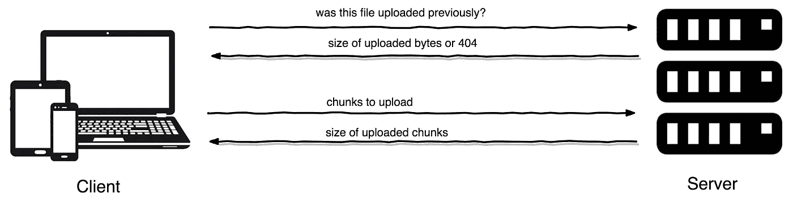

# PHP 中的可恢复文件上传:以优雅的方式处理大文件上传

> 原文：<https://medium.com/hackernoon/resumable-file-upload-in-php-handle-large-file-uploads-in-an-elegant-way-e6c6dfdeaedb>

> 曾经在 PHP 中为大文件上传而挣扎过吗？想知道你是否可以继续上传你离开的地方，而不需要在任何中断的情况下重新上传全部数据？如果这听起来对你来说很熟悉，那么继续读下去。


Photo by [rawpixel.com](https://unsplash.com/@rawpixel?utm_source=medium&utm_medium=referral) on [Unsplash](https://unsplash.com?utm_source=medium&utm_medium=referral)

文件上传是我们在几乎所有现代 web 项目中的一项常见任务。有了所有不同的工具，用任何语言实现文件上传功能都不是很难。但是，当涉及到大文件上传时，事情变得有点复杂。

比方说，你正试图上传一个相当大的文件。你已经等了一个多小时了，上传了 90%。然后突然，你的连接中断或浏览器崩溃。上传被中止，您需要从头开始。令人沮丧，不是吗？更糟糕的是，如果你的连接速度很慢，就像世界上很多地方一样，无论你尝试多长时间，每次都只能上传第一部分。


在本帖中，我们将看到一个尝试，通过使用 tus 协议上传可恢复块中的文件，在 [PHP](https://hackernoon.com/tagged/php) 中解决这个问题。

Resumable File Upload in PHP — Demo

# 图斯是什么？

Tus 是基于 HTTP 的[开放协议，用于可恢复文件上传](https://tus.io/)。可恢复意味着我们可以继续我们离开的地方，而不需要在任何中断的情况下重新上传全部数据。如果用户想要暂停，中断可能是自愿发生的，或者在网络问题或服务器中断的情况下偶然发生的。

> Tus 协议于 2017 年 5 月被 Vimeo 采用[。](/vimeo-engineering-blog/vimeo-is-adopting-tus-d5e999acd517)

# 为什么是塔斯？

引用自 [Vimeo 的博客](/vimeo-engineering-blog/vimeo-is-adopting-tus-d5e999acd517):

> 我们决定在我们的上传栈中使用 tus，因为 tus 协议以简洁和开放的方式标准化了上传文件的过程。这种标准化将允许 API 开发人员更多地关注他们的应用程序特定的代码，而不是上传过程本身。

以这种方式上传文件的另一个主要好处是，你可以从笔记本电脑开始上传，甚至可以继续从手机或任何其他设备上传相同的文件。这是增强用户体验的好方法。



Pic: Basic Tus Architecture

# 入门指南

让我们从添加依赖项开始。

```
$ composer require ankitpokhrel/tus-php
```

[*tus-php*](https://github.com/ankitpokhrel/tus-php) 是一个框架不可知的纯 PHP [服务器和客户端实现](https://tus.io/implementations.html)用于 tus 可恢复上传协议 v1.0.0。

[](https://github.com/ankitpokhrel/tus-php/) [## ankitpokhrel/tus-php

### tus-php -🚀用于 tus 可恢复上传协议 v1.0.0 的纯 PHP 服务器和客户端

github.com](https://github.com/ankitpokhrel/tus-php/) 

> **更新** : Vimeo 现在正在为 Vimeo API 使用他们[官方 PHP 库](https://github.com/vimeo/vimeo.php/pull/186) [v3](https://github.com/vimeo/vimeo.php/releases/tag/3.0.0) 中的 [TusPHP](https://github.com/ankitpokhrel/tus-php) 。

# 创建一个服务器来处理我们的请求

这是一个简单服务器的样子。

```
// server.php$server   = new \TusPhp\Tus\Server('redis');
$response = $server->serve();$response->send();exit(0); // Exit from current PHP process.
```

您需要配置您的服务器来响应特定的端点。例如，在 Nginx 中，您应该这样做:

```
# nginx.conf

location /files {
    try_files $uri $uri/ /path/to/server.php?$query_string;
}
```

假设我们服务器的 URL 是[*http://server . tus . local*。](http://server.tus.local.) 因此，基于以上 nginx 配置，我们可以使用[*http://server.tus.local/files.*](http://server.tus.local/files.)来访问我们的 tus 端点

现在，我们可以使用以下 RESTful 端点。

```
# Gather information about server's current configuration
OPTIONS /files# Check if the given upload is valid
HEAD /files/{upload-key}# Create a new upload
POST /files# Resume upload created with POST
PATCH /files/{upload-key}# Delete the previous upload
DELETE /files/{upload-key}
```

查看[协议详情](https://tus.io/protocols/resumable-upload.html)了解更多关于端点的信息。

> 如果您使用任何像 Laravel 这样的框架，您可以在您的[框架](https://hackernoon.com/tagged/framework)路由文件中定义到所有基于 tu 的端点的路由，而不是修改您的服务器配置。我们将在另一个教程中详细介绍这一点。

# 使用 tus-php 客户端处理上传

一旦服务器就位，就可以使用客户机来上传文件。让我们从创建一个简单的 HTML 表单来获取用户输入开始。

```
<form action="upload.php" method="post" enctype="multipart/form-data">
    <input type="file" name="tus_file" id="tus-file" />
    <input type="submit" value="Upload" />
</form>
```

提交表单后，我们需要遵循几个步骤来处理上传。

1.  **创建一个 tus-php 客户端对象**

```
// Tus client$client = new \TusPhp\Tus\Client('http://server.tus.local');
```

上面代码中的第一个参数是您的 tus 服务器端点。

2.**用文件元数据初始化客户端**

为了保持上传的唯一性，我们需要使用一些标识符来识别即将到来的请求中的上传。为此，我们必须生成一个唯一的上传密钥，用于以后继续上传。您可以明确提供上传密钥，也可以让系统自己生成密钥。

```
// Set upload key and file meta$client->setKey($uploadKey)
    ->file($_FILES['tus_file']['tmp_name'], 'your file name');
```

如果您没有明确提供上传密钥，上述步骤将如下所示:

```
$client->file($_FILES['tus_file']['tmp_name'], 'your file name');$uploadKey = $client->getKey(); // Unique upload key
```

3.**上传一大块**

```
// $chunkSize is size in bytes, i.e. 5000000 for 5 MB$bytesUploaded = $client->upload($chunkSize);
```

下一次，当你想上传另一个块，你可以使用相同的上传键继续。

```
// To resume upload in next request$bytesUploaded = $client->setKey($uploadKey)->upload($chunkSize);
```

上传完成后，服务器会根据校验和验证上传，以确保上传的文件没有损坏。默认情况下，服务器将使用`sha256`算法来验证上传。

> 上面演示视频的完整实现可以在[这里](https://github.com/ankitpokhrel/tus-php/tree/master/example/basic)找到。

# 使用 tus-js-client 处理上传

[Uppy](https://uppy.io/) 是一个时髦的模块化文件上传插件，由支持 tus 协议的人开发。你可以使用 uppy 无缝集成官方的 [tus-js-client](https://github.com/tus/tus-js-client) 和 *tus-php* 服务器。这意味着我们使用服务器的 php 实现和客户机的 js 实现。

```
uppy.use(Tus, {
  endpoint: 'https://server.tus.local/files/', // your tus endpoint
  resume: true,
  autoRetry: true,
  retryDelays: [0, 1000, 3000, 5000]
})
```

> 在 [uppy 文档](https://uppy.io/docs/tus/)和示例实现[中查看更多详细信息。](https://github.com/ankitpokhrel/tus-php/tree/master/example/uppy)

# 部分上传

*tus-php* 服务器支持[连接扩展](https://tus.io/protocols/resumable-upload.html#concatenation)，能够将多个上传连接成一个，使客户端能够执行并行上传和上传不连续的块。

Partial file upload using tus-php

部分上传的完整示例可以在[这里](https://github.com/ankitpokhrel/tus-php/tree/master/example/partial)找到。

# 最后的话

[tus-php 项目](https://github.com/ankitpokhrel/tus-php)本身还处于起步阶段。某些部分将来可能会改变。在[示例](https://github.com/ankitpokhrel/tus-php/tree/master/example)文件夹中可以找到三个不同的实施示例。请随意尝试并报告发现的任何问题。拉请求和项目建议非常受欢迎。

编码快乐！