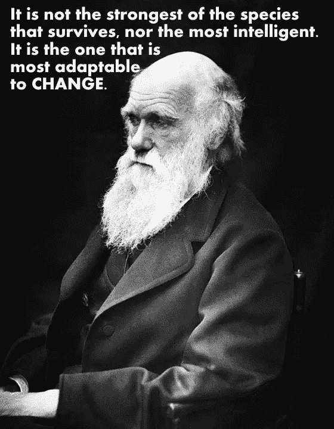
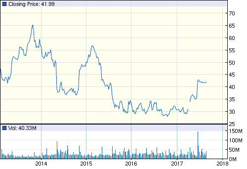
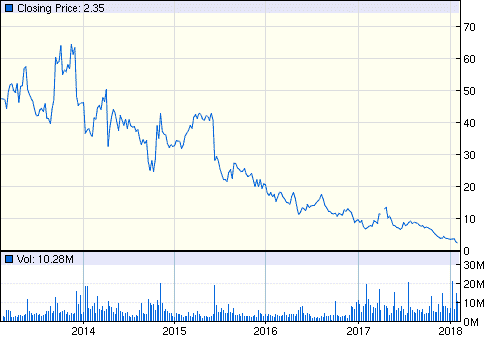
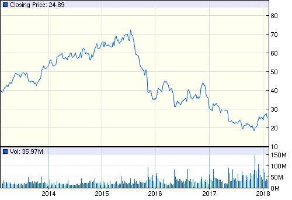

# 零售:介于天堂和地狱之间

> 原文：<https://medium.com/hackernoon/retail-somewhere-between-heaven-and-hell-340a9d3a5a30>

几年前，我举办了[物联网技术讲座](https://www.slideshare.net/EranShlomo/internet-of-things-2016-trends)，其中一个主题是[零售](https://hackernoon.com/tagged/retail)行业即将发生的变化，当我在讲座中谈到这一点时，我给出了以下主要预测:

*   商场将会转型，许多商场将无法生存。
*   主要的零售商可能会倒闭
*   网上购物和实体店购物将被迫整合
*   无摩擦购物体验对企业生存至关重要

我记得有一次演讲，一个听众强烈反对，不接受这些，大的改变是很难接受的。随着 2017 年成为零售商有史以来最糟糕的一年(8600 家商店关门)，以及[瑞士瑞信银行](https://www.credit-suisse.com/)预测 25%的购物中心将无法在未来 5 年生存，这是一个正在进行的转型，预计将加速。

在这篇文章中，我将讲述变革背后的因素及其意义(我的看法)，挑战和机遇。像在所有变化中一样，你可以选择如何查看它。

The business world works under the same evolution principles, Darwin 1809

## 零售商业模式

如果你读过我以前的一些帖子，你会知道我喜欢从一些简化的基础开始，然后将它们投射到讨论的案例中，所以让我们从一些基础开始。

每家企业都向顾客展示了一种价值，在这种价值中，顾客愿意支付额外的钱，让企业有足够的资金来运营和赚钱。零售商提供的价值主张围绕着:

*   产品——品种、品牌、白色标签和质量。
*   购物体验——商店位置、商店导航、产品订单、收银台排队等。
*   定价模式——销售、折扣、俱乐部会员资格、免费送货等。

这些核心要素使一个零售商与其他零售商不同，你确实可以发现零售商调整这些要素，为他们的客户创造最独特和最有价值的产品。换句话说，每个零售商都提供不同的价值组合，没有一个零售商能同时提供所有的价值组合(市中心折扣价格高的小商店和大型停车场不是一个有效的策略，因为它会赔钱)。

在稳定的环境中，竞争对手要么调整到不同的产品，要么在差异化不可能的情况下稳定在某种卡特尔上(完全相同市场上的竞争对手之间的沉默价格协议)。

但零售环境远非稳定，它正受到破坏。颠覆的一个关键因素是商业模式的转变——过去几十年开发的稳定模式无法快速调整以与新模式竞争，在零售领域，新模式是电子商务或在线购物。

这种破坏同时攻击了其所有价值主张中的现有业务模式，使其没有调整的空间。在这个变化中，我把价值因素分成两部分:已经在运动的和即将到来的。

值得一提的是，还有一个社会因素，这里没有讨论——年轻人倾向于更快地上网，所以即使没有任何技术的推动，我也希望随着时间的推移，网上获得更多的市场份额。

# 过去

我认为价格、产品种类和无摩擦购物是迄今为止网上购物提供的最强有力的价值主张。我想知道你们中有多少人现在经常在网上购物，但我可以肯定的是，在我的周围，大多数购物还没有在网上进行，甚至更多，直到一两年前，许多人没有在网上进行任何交易都是很常见的。这种情况变化很快，网上购物在过去的 5 年里翻了一番，而且这种趋势有望继续。零售商现在感到的痛苦是，只有 10%的人在网上购物，15%或 20%会是什么样子？我们将在未来几年内找到答案。

## 价格

网上的价格近乎不可抗拒，我们买的大多数东西都可以在网上以更低的价格买到，有时甚至有 80%的折扣。原因很简单，维持一个网上商店要比实体商店便宜得多。

## 品种

网上的种类非常多，你可以从世界各地买到几乎任何东西，而且在许多情况下，某种特定的产品只能在网上买到，要么是因为销量低(如 kick starter 或独立制造商)，要么是因为进口缺口(没有人真正把产品带到附近的商店)。

随着越来越多的企业加入这一趋势，网上购物种类不断增加，这一价值主张日益得到强化。

## 无摩擦购物

你只要点击购买，不用收银，不用排队，随时随地都可以。没有驾驶或停车费用，没有时间浪费。谁能抗拒呢？

# 现状

只要看看下面的股票图表，就能很好地了解上述情况的影响。

Whole foods market stock price

Sears stock price

Macy’s stock price

还有很多其他例子，但你明白了，关店通常是一个不好的信号，这种事情到处都在发生。

在这一点上值得一提的是，许多零售商都做得很好，**他们适应了**。但他们将不得不加快适应步伐，因为转型刚刚开始，许多其他技术正在零售商的门口出现，加速了这一进程。

在谈论未来之前，先简要介绍一下电子商务的弱点，这些弱点也是实体零售商赖以生存的基础。

# 电子商务的弱点

我认为网上购物的主要缺点如下:

*   立即拥有——我现在就想要，等待发货真糟糕。
*   外观和感觉——我想测量、拿住，看看是否合适。
*   新鲜——获得新鲜的食物很重要。
*   退货——运回比等待发货更糟糕。
*   对欺诈的恐惧——在线金融交易仍然是一种心理障碍，也是一种不好的产品。
*   仅限信用卡——对许多人来说，信用卡购物不是一种选择(现金、食品券等)。

# 今后

不久的将来解决**所有电子商务的弱点，**实际上保证了转型的加速。

## 装运

货物运输速度很快，从[机器人](https://hackernoon.com/tagged/robotics)操作物流中心到解决[最后一英里问题](https://en.wikipedia.org/wiki/Last_mile_(transportation))。

出货的最大变化集中在自动驾驶**方面。**自动驾驶卡车、自动驾驶汽车和自动驾驶手推车。

运输正变得自动化，减少了障碍，并逐渐使网上购物更具有即时购物的性质。

这也直接影响到退货问题。

Starship Technologies delivery cart

## 外观和感觉

我看到两种主要技术开始在这个领域发挥作用，使在线克服这一挑战:3D 传感和虚拟现实。

Intel realsense, 3D scan for the mass

随着行业与苹果(以及镜子等其他电器)结盟，3D 传感将进入每部手机，并从本质上允许你获得测量文件。只需点击一个按钮和一些数据科学(关于供应商的统计)，你就会**确定**衣服或家具完全符合你的身材或客厅。

一旦你有了 3D 尺寸，虚拟现实就可以发挥作用，让你感觉像在现实世界中一样，但有更多的优势，想象你选择了一件衬衫，可以看到它在自己身上成千上万种颜色和角度，只需点击一下就可以更换衬衫。

将这两个连接到现有的在线基础设施，你测量，选择你喜欢的，在社交网络上发布，并排序得到最佳反馈的。

第一次你可以问**我看起来怎么样？**实际购买前。

## 新鲜

新鲜度与运输和传感技术直接相关，一旦这些技术得到改进，您就能保证快速获得新鲜产品。

我相信，在未来几年，这仍将是电子商务的弱点，因为无论发货速度有多快，从烤箱中取出比萨饼或选择最好的西红柿是最好的，有时值得麻烦。

## 金融壁垒

有了加密货币，所有资产最终都可以在网上兑换，即使你只能兑换现金或粮票。至于恐惧，时间也会处理——今天的孩子没有见过任何其他世界，点击和购买是他们的天性。

# 一些预测

以下是我对事情将如何发展的一些猜测

## 整合:许多购物中心将会消失，一些将会适应

购物中心越来越热，而且只会越来越糟。因此，除非购物中心位于黄金地段，否则就需要进行调整。我预计商场里的品牌会减少，每个商店都会变大(即整合)。想要生存的商场需要**开始打社交牌**，这是一个与购物没有直接关系的在线弱点。

随着商场打出社交牌，你会看到商场中的共享工作空间、创客空间、娱乐和家庭设施。

简而言之，购物中心吸引游客不仅仅是为了购物，购物正成为游客的第二价值。

## 对小家伙来说是坏消息

我很难理解夫妻店在这样的经济环境下如何生存。小商店将会发现它们的独特之处在于低销量、特殊优惠——那些很难在网上找到的优惠、艺术、个人风格(比如自制饼干)和地理位置。小型零售商现在比以往任何时候都更实际地出售房地产价值。

## 每个点都是销售点

移动将成为#1 销售点，零售商应该提供最好的移动购物体验，利用他们的供应链和房地产进行超高效的提货，如果可能的话开车经过。订单无处不在，提货无处不在。

增强的不动产将被用于这些领域，以允许网络和现实世界的连接。

## 无摩擦购物

商店的自动化，实现室内导航，没有收银线(自助结账)，拿起就走是未来的方向。

## 分析学

今天，零售商有很多他们知道能产生收入的规则，比如把牛奶放在深处。这些规则必须被废除，让你的顾客围着你的店走来走去肯定会在短期内增加收入，但也会鼓励她用点击来取代你。

相反，零售商应该采用分析来确定收入来源，就像在线网站每毫秒都在分析，而不会降低销售转化率。

# 摘要

零售业正在发生巨大的变化，我们都将在未来几年看到这一点，许多零售商将无法生存，但那些能够生存的零售商可能会比现在获得更多的收入。无论发生什么，购物将变得更加有趣，无论是在网上还是在现实世界。