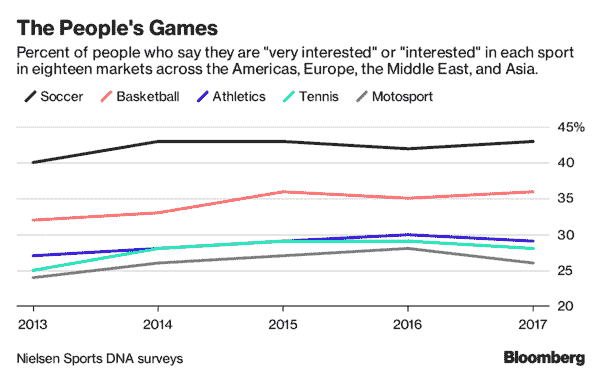
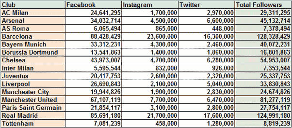
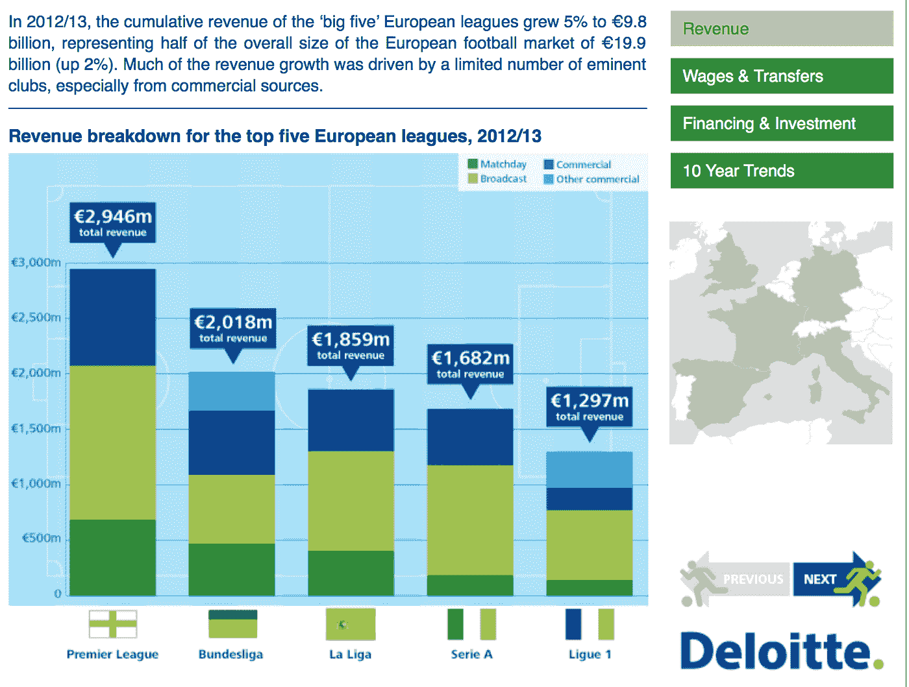
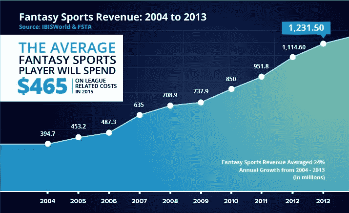
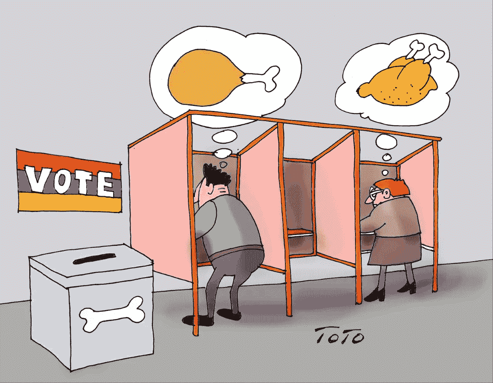

# 退役足球运动员成为区块链的新球员

> 原文：<https://medium.com/hackernoon/retired-footballers-become-the-new-ballers-for-blockchain-9f1127329071>

(Source: Bloomberg)

足球不是一种游戏，而是一种宗教。每支球队都有狂热的粉丝追随，在狂热的气氛中引发了无数次酒吧斗殴。全世界有超过 40 亿球迷(据记录，世界互联网用户的数量也有 40 亿)，足球是不同文化走到一起并围绕球队颜色打造新文化的熔炉。

(Source: Businessinsider)

因此，毫不奇怪，区块链爱好者开始寻找更新的方式来丰富球迷的体验，并允许他们在他们喜爱的球队和球员的事务中发挥更大的作用。

一些足球传奇人物参加了表演赛，以提高对足球的认识，并为慈善机构和高尚的事业筹集资金。由于顶级联赛的日程安排很紧，在可预见的未来很长一段时间内都有行程，所以在顶级联赛中打球的球队的球员很难找到时间参加这种慈善宣传比赛，除非他们的老板授权。

(Source: Deloitte)

> 球迷对赛程和球员交易的唯一控制是通过梦幻足球联盟。根据《T2》和《FSTA T3》的报道，梦幻体育联盟的市值超过 72.2 亿美元。

(Source: 888 Casino)

然而，一旦这些足球巨星退役，他们就会有更多的时间参加慈善表演赛，这样球迷就可以更好地控制比赛日程、比赛场馆，甚至比赛球衣。法比奥·卡纳瓦罗、安德烈·舍甫琴科、卡福和保罗·斯科尔斯都支持有着有趣的区块链成分的 GLS 联赛。

# GLS 联盟

据[网站](http://glsfootball.com/)报道，“全球传奇是一个由来自世界各地的传奇足球运动员组成的团队，他们赢得了最大的比赛，并受到忠实球迷的追随。传奇队在世界各地的选定城市进行了一系列表演赛。

(Source: GLS)

他们对球员的要求非常严格。全球传奇系列的玩家资格标准是:

1.  赢得了世界杯
2.  赢得了欧洲冠军
3.  赢得了冠军联赛
4.  为他们的国家出场超过 50 次

# 区块链有什么帮助？

区块链将球迷和足球运动员聚集在一起，为联盟制定未来的行动方针。它使系统更加分散，并使真正的民主决策比今天的专制决策。

GLS 联盟[与 433token](https://433token.io/) 合作开发了 ERC20 tokens，以象征联盟的全部活动。所以，如果我买了他们的代币，我就可以投票决定:

1.  我最喜欢的巨星在哪里打球？
2.  他们和谁比赛？
3.  我最喜欢的超级明星指导谁成为更好的足球运动员？

..和其他类似的特征。

在撰写本文时，433token 网站将安德烈·舍甫琴科和保罗·斯科尔斯作为确认的导师，他们将遵从令牌持有者的意愿，指导年轻人才，在令牌持有者决定的体育场比赛，并与令牌持有者决定的个人会面和问候。

# 区块链和投票:迄今为止的故事

区块链为这些项目提供了投票系统，代币持有者就像足球国家的公民。我们已经看到了早期的一些项目，比如 T2 的 Polys T3，他们希望所有的选举都在区块链进行。可以理解的是，[安全专家对这种想法敲响了警钟。他们的主要前提是，基于区块链的投票将阻止独立和自治的组织进行自由和公平的选举。](https://www.technologyreview.com/s/611850/why-security-experts-hate-that-blockchain-voting-will-be-used-in-the-midterm-elections/)

(Source: Abaka News)

我认为，我们可以有把握地得出结论，安全专家的担忧源于这样一个事实，即他们不太相信权力下放。这是新的闪亮的孩子，但有时很容易出现高度不可预测的行为。这种不可预测性让很多渴望权力的人非常紧张。

因此，我觉得体育赛事可以展示在区块链投票是多么方便、划算和和平。

> 我一直期待体育赛事的投票系统围绕着梦幻联赛或低级别联赛，因为不幸的是，这就是 groundswells 的工作方式。

然而，像舍甫琴科和斯科尔斯这样的足球巨星对区块链的支持远比弗洛伊德·梅威瑟和嘻哈艺术家的支持更具纪念意义。这些声音听起来很干净，他们说的话很庄重。

# 外卖食品

作为一个亲眼目睹了梦幻足球运动员经历的长度和研究的人，我认为他们的梦想是由整个联盟运作的实际利益构成的。

关于区块链技术，我们已经看到并期待那些迎合我们需求的项目。所有权分散只是其中之一，但却引起了最大的兴趣。虽然这些足球运动员没有交换任何有形的东西，但在某种程度上，他们在交换好处，这种分散决策项目的市场正在上升。

我们已经看到了分散投票系统的宏伟计划，这很可能会允许我们在民主政府中从未见过的那种投票审计。十年前比特币问世时，人们对透明记账有很多担忧。栅栏两边都有人。我们只能等着看赢家的出现。