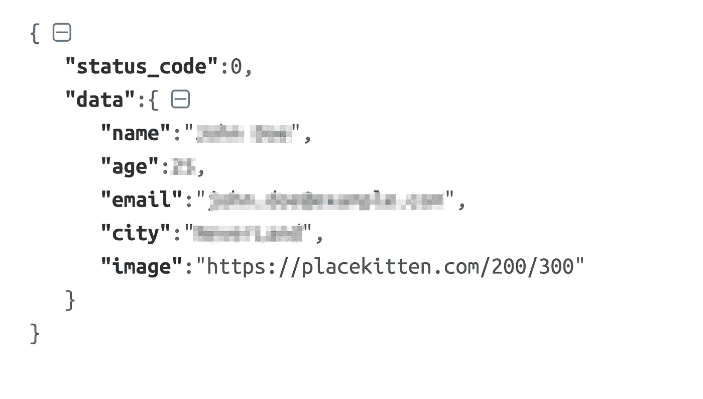

# 用于包装响应的改装转换器

> 原文：<https://medium.com/hackernoon/retrofit-converter-for-wrapped-responses-8919298a549c>



很多时候，API 响应被包装在一个包装类中，响应中包含自定义的状态代码。一种常见的格式如下

```
{
   "data" : {...}
   "status_code" : 0
   "error_message" : null
}
```

如果我们使用预先打包的 json 转换器(gson/jackson)进行改造，我们将不得不在进行 api 调用的任何地方提取底层数据对象。这导致数据对象提取和错误检查逻辑的重复。类似于跟随

```
data class Data<T>(
       var statusCode: Int = 0,
       var data: T? = null,
       var message: String? = null
)interface Api {
    @POST("user/login/")
    fun login(@Body request: LoginRequest): Single<Data<User>>
}class UserManager {
    fun login(userName: String, password: String){
         api.login(LoginRequest(userName, password))
            .subscribeOn(schedulerProvider.getIoScheduler())
            .observeOn(schedulerProvider.getUiScheduler())
            .map {if(it.statusCode ==0) then response.data else throw ApiException(it.error_message)}
            .subscribe{...}  
     }
     ...}
```

幸运的是，我们可以使用自己的定制转换器进行改造，它只是普通 Gson 转换器的一个包装器，这样就可以在一个地方处理数据提取和错误处理逻辑。我们基本上需要两节课

*   `CustomConverter`实现改型的`Converter<F,T>`接口。
*   `CustomConverterFactory`实现改造的`Converter#Factory`接口。这负责为每种类型创建`CustomConverter`。

在上面的要点中，我们使用由“GsonConverterFactory”创建的实际转换器来解析响应，因此我们不必重写任何 json 编组代码。我们的 CustomConverter 只是通过提供包装的“类型”而不是实际的“类型”来解析包装的类。

```
interface Api {
    @POST("user/login/")
    fun login(@Body request: LoginRequest): Single<User>
}class UserManager {
    fun login(userName: String, password: String){
         api.login(LoginRequest(userName, password))
            .subscribeOn(schedulerProvider.getIoScheduler())
            .observeOn(schedulerProvider.getUiScheduler())
            .subscribe{...}  
     }
     ...}
```

这就是我们的 Api 接口和逻辑现在的样子。注意 Api 接口登录方法的**返回类型**的变化。

**注意:**这个转换器假设所有的响应都是包装格式的，对于任何未包装格式的响应都将失败