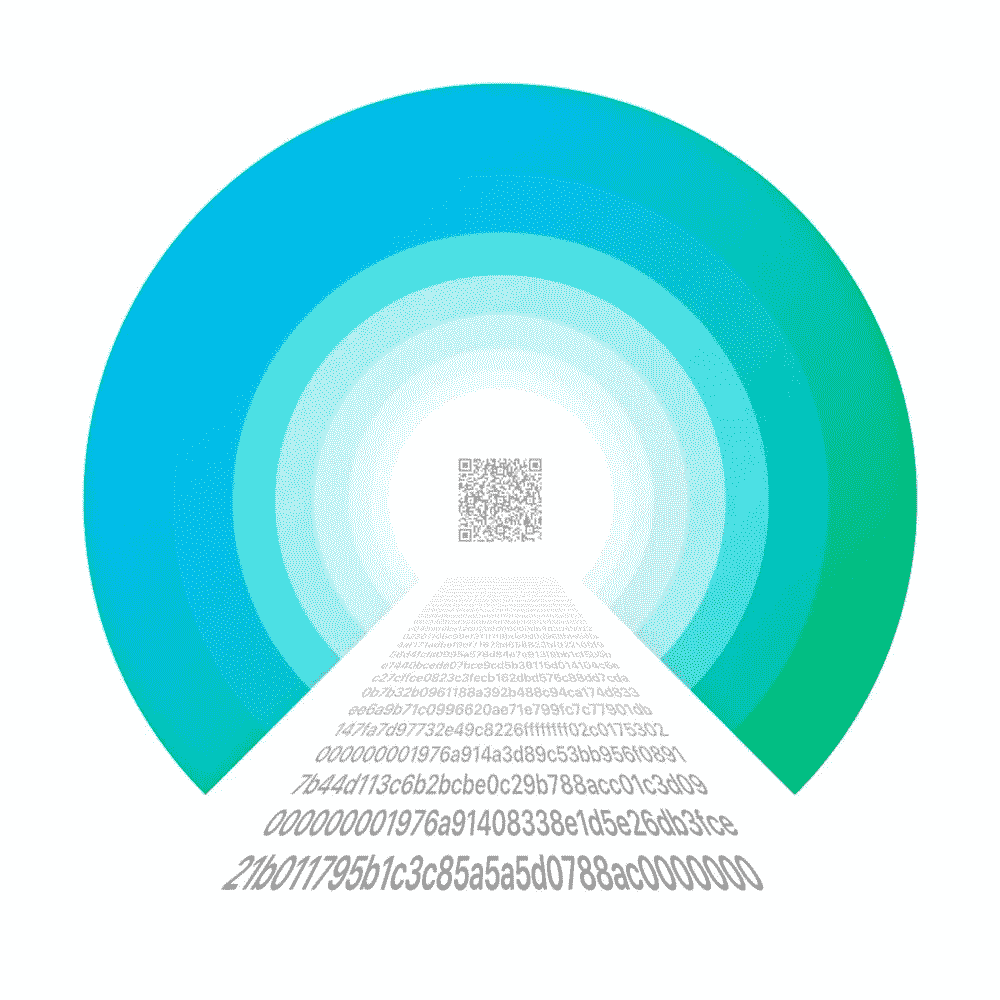

# 可重复使用的支付代码——用户友好的加密钱包的秘密成分？

> 原文：<https://medium.com/hackernoon/reusable-payment-codes-the-secret-ingredient-to-a-user-friendly-crypto-wallet-315da35b12fb>

每当你需要发送或接收钱的时候，你难道不为不得不复制和粘贴加密钱包地址而烦恼吗？当然，钱包已经朝着更好的可用性前进了一大步:例如，你现在可以从助记种子短语恢复你的钱包。然而，那些长长的十六进制地址串仍然伴随着我们…但不会太久。

BIP47 Payment Tunnel Visualization

2016 年，区块链工程师 [Justus Ranvier](https://twitter.com/BlockInTheChain) 制定了所谓的 BIP-47 ( [比特币改进提案第 47 号](https://github.com/bitcoin/bips/blob/master/bip-0047.mediawiki))——一种旨在使用户之间的经常性支付更加直观的机制。想想 Google Pay、PayPal 或任何其他可以让你向联系人列表中的人汇款的支付应用。在这样的应用程序中，你需要做的只是在你的联系人中选择一个人，输入想要的金额，点击“发送”，也许还能以某种方式验证你的付款。

通常情况下，当你第一次向某人汇款时，你需要添加他们的付款细节:信用卡或银行账号，或者只是他们的电子邮件地址。你当然不需要每次都复制粘贴一个新的冗长的地址行。BIP-47 以类似的方式工作。

这是一款集成支付代码的移动钱包**的创始人兼首席执行官基里尔·索斯诺维的解释:**

> **BIP 47 加密钱包的每个用户都有自己独特的可重复使用的支付代码。是的，这个代码看起来像那些讨厌的十六进制地址之一，但它不是一个实际的钱包地址。相反，它是一个代码，你可以安全地在互联网上的任何地方发布，从人们那里接收金钱——只是他们无法从代码中获得任何有关你钱包的信息。**

**每当有人使用你的支付代码进行转账时，你的钱包实际上会生成一个新地址，但它将完全保密。这将解决一个长期存在的问题，即地址重用，即同一地址被重复用于发送和接收比特币支付。**

**如果你一直重复使用某个地址，第三方就可以访问该地址的全部交易历史，不仅可以知道你发送了多少，还可以知道你收到了多少。可以理解的是，骗子或罪犯可以找到许多方法来利用这些信息来对付你。**

**可重复使用的支付代码的另一个巨大优势是，它们可以让你建立联系人列表，就像你在任何其他应用程序中所做的那样。你可以将其他用户的支付代码保存在他们的名字或别名以及用户照片下，这样下次你想转账的时候，你只需要搜索“Johnny D .”，或者“Katie”等等。这将使加密钱包界面更加“人性化”和用户友好，吸引那些因为所有“技术东西”而不愿意加入加密空间的用户。**

**十亿人的团队[陈述](https://billionapp.com/tokensale):**

> **所有加密货币的单一地址将让你一劳永逸地忘记中介。无需为每笔交易复制钱包地址。**

**因此，BIP-47 保护您的隐私，并消除了为每笔交易生成和复制新地址的需要。成本呢？像世界上大多数好东西一样，可重复使用的支付代码不是免费的——尽管它们使用起来仍然非常便宜。每当你想和一个新的人交易时(如果你愿意，可以把他们加入你的联系人名单)，你需要首先建立一个所谓的支付隧道。要做到这一点，需要一个特殊的通知交易——它本身并不转移任何资金，它只是创建一个连接，告诉你的钱包它需要寻找什么。每个通知交易都要缴纳标准的区块链费用，由发起创建支付隧道的用户支付。这可以说是与可重复使用的支付代码相关的唯一真正的不便——幸运的是，你只需为每个联系人做一次，所有的复杂性都隐藏在引擎盖下。也就是说，第一次付款与所有后续付款没有区别。**

**进行额外付费交易的必要性意味着 BIP-47 在双方彼此交易多次的情况下工作得最好。支付代码很方便的例子包括以加密方式支付工资的公司(这可能比你想象的更快)，接受定期捐款的项目和慈善机构，为已经进入加密经济的忠诚客户和朋友工作的自由职业者。**

**如果可重复使用的支付代码如此伟大，为什么这么少的钱包有这种功能？答案是，技术非常年轻。对于面向市场的密码世界来说，两年是很长的时间，但如果你问一个开发者，这不算什么。此外，当 BIP47 提案出现时，比特币社区内部正在爆发一场规模战争，因此这个想法起初几乎没有被注意到。**

**到目前为止，只有三个钱包已经实现了支付代码:**

1.  ******(iOS)******
2.  ********(安卓)********
3.  ********(安卓)********

****在接下来的几年里，我们可能会看到大量支持支付代码的钱包，但已经实现支付代码的钱包有望在这场竞赛中领先。****