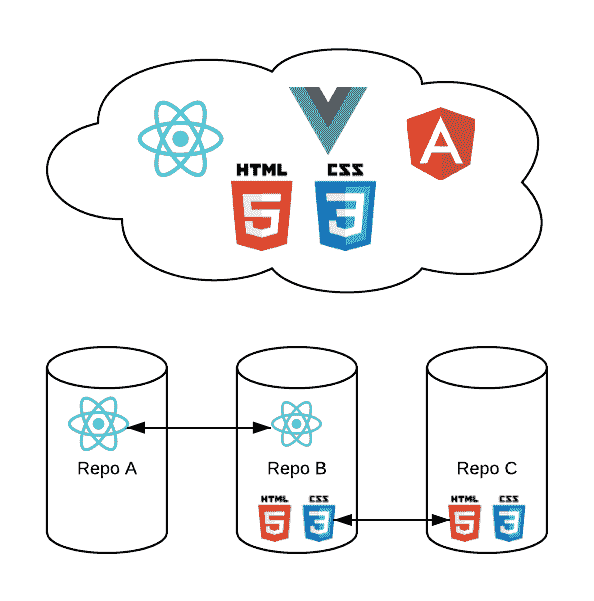

# 重用 React UI 组件

> 原文：<https://medium.com/hackernoon/reusing-ui-components-its-not-that-hard-f985f1472b9>

## 如何利用位+NPM 来简化 React 和其他 UI 组件的共享、重用和协作。

当使用 [UI](https://hackernoon.com/tagged/ui) 组件时，跨项目和团队的可重用性通常是更快开发、 [UI 一致性](https://blog.bitsrc.io/building-a-consistent-ui-design-system-4481fb37470f)和更简单维护的关键。

由于今天的组件被设计成可重用的，具有反应、Vue 和其他优秀的框架，重用它们的能力变得至关重要。当不同的开发人员在不同的地方重写相同的组件时，时间被浪费了，维护很快成为一场噩梦。

将 [**位**](https://bitsrc.io) 和 **NPM** 一起使用，您可以将新发现的**简单性**和**可伸缩性**带到**代码共享**工作流中，因为整个团队可以在他们的项目之间协作和共享代码，同时保持代码同步。

# 组件重用可能很棘手

重用组件的最大问题是开销。

首先，要使一个可重用组件成为可重用的，你必须把它变成一个包。这意味着**拆分 repo** ， **boiler-plating a package** 包括`package.json`，build 和 test configurations 等，然后发布到 NPM。

您还必须记录组件，创建一个 wiki，并以某种方式组织所有这些组件，使它们对团队来说是可发现的。

使用这段代码的开发人员将使用包管理器来安装它，这意味着如果没有大量的开销，他们就不能在需要时对组件进行更改。随着时间的推移，这使得维护变得更加困难。

许多团队都会遇到这些问题，这可能会导致不希望的强制架构或代码重复。但是，使用位+ NPM，您可以在没有这种开销的情况下扩展组件重用。以下是方法。

# 位+ NPM:扩展组件重用

使用一个**位+NPM 工作流**组件可以在项目间共享、开发和同步，而没有上面提到的开销。下面是它如何在 3 个简单的步骤中工作，从发布到在团队之间同步变更。

# 1.零发布开销

***示例:*** *下面有一个* [*示例 app*](https://github.com/teambit/movie-app) *和* [*React 组件*](https://bitsrc.io/bit/movie-app) *从中发布。*

Bit 让您无缝地**隔离任何现有项目中的** **组件**，而不是强迫您重构代码或拆分存储库来发布包。

这是通过使用`bit add`命令指向您想要重用的文件集来完成的。当 Bit 识别组件时，它会自动检测它们的依赖关系，这样您就不必进行任何配置。

然后，您可以添加预制的构建+测试环境(或者创建您自己的环境)，并使用`bit tag`锁定组件的版本。剩下的就是使用`bit export`发布组件，就这样。

项目中的所有组件现在都可以被 NPM 重用和安装，或者通过`bit import`从任何项目中开发它们。

这意味着 **0 重构**， **0 代码或文件变更**， **0 配置**和**没有手动依赖定义**。在消除发布组件的开销的同时，您可以扩展组件重用。

# 2.发现和团队合作

[https://bitsrc.io/bit/movie-app/components/hero](https://bitsrc.io/bit/movie-app/components/hero)

一旦导出，所有组件都被组织在云中，比单独使用 NPM 更容易被发现。

以下是一些有助于大规模查找和导航组件的关键功能:

*   集合:组件可以按照主题、团队、项目或者你喜欢的任何东西组织成集合。
*   **可视化** : UI 组件(暂时 React)可以渲染，这样你就可以玩组件，用自己的眼睛去选择。
*   **测试+构建结果**:在项目之外为你的组件进行 Bit 构建和运行测试，以确保它们已经准备就绪。结果是作为一个有用的指示，表明它的工作和在什么情况下。
*   **自动解析文档** : Bit 会使用`.md`文件和`jsdocs`从代码本身自动解析并呈现文档和示例。

因此，结合 Bit 的团队管理功能，您可以更轻松地找到和管理您共享的组件及其质量等。

# 3.协作工作流:双向开发

Bit 的另一个有用的特性是，除了用 NPM/Yarn 安装组件之外，您还可以使用`bit import`在任何使用它们的项目中获取组件。).

这意味着，当一个组件需要轻微的改进或修改时，您可以简单地将它导入到消费项目中，进行更改，并将新版本共享回您团队的集合中。

然后，如果您选择这样做并且有适当的权限，您可以更新它所在的任何项目中的组件，包括共享它的原始存储库。

使用 Bit 对 Git 的`merge`实用程序的扩展，可以在项目之间合并更改，这意味着跨项目的同步过程是平滑流畅的。

当一个团队或几个团队一起工作时，这种**分布式工作流**使得开发和维护随着时间的推移变得更快。到目前为止，自 2018 年 1 月以来，数千名使用 Bit 的开发人员中约有 75%更喜欢导入组件，而不是将它们作为软件包安装。

# 下一步是什么

位+ NPM 是一个有用的工作流，用于跨项目和团队有效地共享和协作 UI 组件。Bit 并不局限于 UI 组件，所以同样的工作流也适用于 Node.js 模块、纯 js 函数等等。

未来路线图包括进一步提高可发现性的特性、智能事件驱动的更新机制以及对更多语言的支持。

Bit 是开源的，正在不断维护和开发。请随意尝试，建议反馈，贡献或自己扩展它。

 [## 用代码组件进行位共享和构建

### Bit 帮助您在项目和应用程序之间共享、发现和使用代码组件，以构建新功能和…

bitsrc.io](https://bitsrc.io)  [## 团队位/位

### 与您的团队在项目之间轻松共享代码。

github.com](https://github.com/teambit/bit) 

# 了解更多信息

 [## 2018 年你应该知道的 11 个 Javascript 实用程序库

### 11 个有用的 Javascript 实用程序库，加速您的开发。

blog.bitsrc.io](https://blog.bitsrc.io/11-javascript-utility-libraries-you-should-know-in-2018-3646fb31ade)  [## 如何在 React 中写出更好的代码

### 在 React 中编写更好代码的 9 个有用技巧:了解林挺、propTypes、PureComponent 等等。

blog.bitsrc.io](https://blog.bitsrc.io/how-to-write-better-code-in-react-best-practices-b8ca87d462b0)  [## 比特和 NPM 让 Monorepos 变得更简单

### 如何利用比特+ NPM 去单一回购没有开销？

blog.bitsrc.io](https://blog.bitsrc.io/monorepo-architecture-simplified-with-bit-and-npm-b1354be62870)