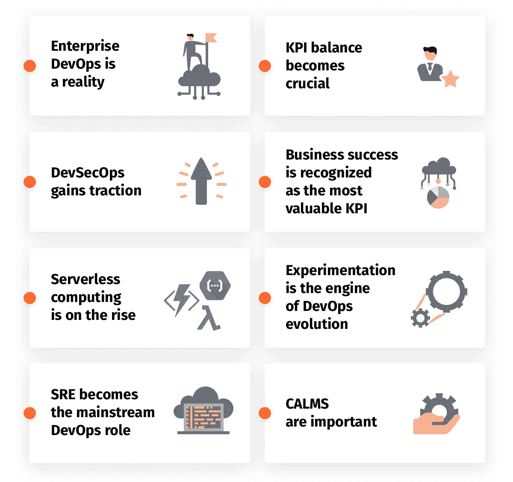
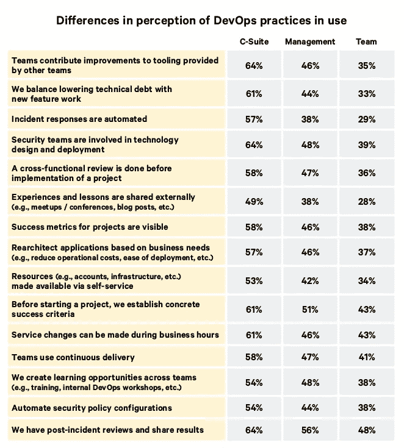
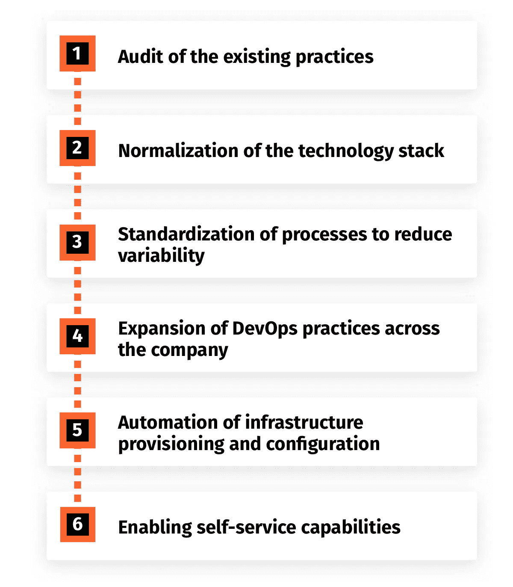
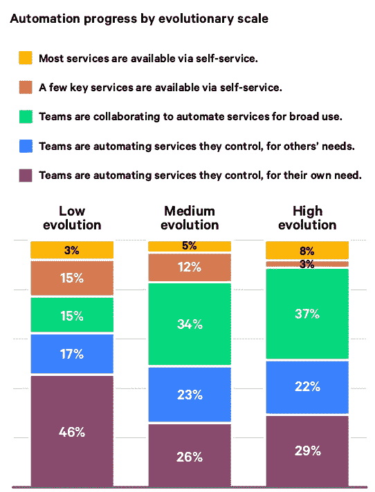

# DevOps 实施结果状态[2018]

> 原文：<https://medium.com/hackernoon/review-of-devops-implementation-results-in-2018-4a3e1ef1a7f3>

当你是 DevOps 过程的一部分时，很难评估它的状态。IT Svit 是一家托管服务提供商，是乌克兰 IT 外包市场的领导者之一，过去 5 年来我们一直提供开发运维即服务。

在此期间，DevOps 实践和工作流成为我们业务 DNA 的血肉，我们简直无法想象如何以任何其他方式进行 IT 运营。然而，来自汽车、营销、金融、零售、银行、物流、电信和其他行业的各种各样的客户仍在以几十年来的方式开展业务。大公司有很大的惯性，企业越大，执行数字化转型并充分利用其优势的时间就越长。

历史悠久的企业坚持尽可能长时间地运行专用服务器或本地私有虚拟环境。他们担心与实施新技术和改革 IT 运营相关的潜在业务中断、金钱和声誉损失。恰恰相反，构成我们大多数客户的初创公司从一开始就选择云，并轻松采用 DevOps 实践-他们只是没有孤立的技术、任务、责任和工作流来干扰。这使得他们更加灵活，能够更快地响应不断变化的客户偏好，让初创公司能够与长期领导者竞争，并在各自的领域取得胜利。

自然，这意味着全球企业必须转型以保持竞争力，并且必须采用 DevOps 最佳实践。然而，必要性并不总是导致达成解决方案。许多企业发现自己的开发运维计划即将失败。在本次回顾中，我们将深入探讨 DevOps 转型如何才能取得成功。你为什么要读这篇文章？希望它能帮助您评估贵公司采用 DevOps 的情况，识别可能的挑战并应用建议的解决方案。

# 2018 年 DevOps 趋势

作为 MSP，IT Svit 处于 DevOps 发展的前沿。我们在日常运营中经历了下列趋势，当我们的发现和见解得到其他行业领先公司的杰出专家的支持时，我们感到非常高兴。以下是我们对 DevOps 趋势演变当前方向的看法:

1.  **企业开发运维成为现实**。我们努力监控市场，我们看到了许多业界接受 DevOps 的迹象。MSP 经常发布新的案例研究，涵盖他们与需要 DevOps 实施的企业的合作。全球公司报告了他们产品和服务的软件交付质量的显著节约和提高。云服务提供商公布他们的收入，并宣布从行业领先企业的项目中获得巨额收益。 [Forrester 宣布 2018 年为企业开发运维采用年](https://go.forrester.com/blogs/2018-the-year-of-enterprise-devops/)。然而，尽管在 Puppet 和 [DORA](https://devops-research.com/) (DevOps 研究和评估机构)调查的 **80%的企业首席执行官**表示他们的公司正在积极实施 DevOps 工作流，但只有 **50%的人能够展示**过渡的一些切实好处并展示任何已解决的挑战。我们将在下面描述这种差异的原因。
2.  **DevSecOps 获得牵引力**。我们已经提到了[DevSecOps 方法](https://hackernoon.com/10-disruptive-devops-trends-of-2018-b0b6d5719376)对于构建软件交付管道的重要性。Splunk 负责 IT 市场的副总裁 Rick Fitz 证实了这一观点。他说，安全性成为企业软件开发的标准要求，因为安全运营所遵循的安全要求和最佳实践必须传授给整个 DevOps 团队。安全检查将转移到产品开发的最开始，而不是在发布之前就被搁置。
3.  无服务器计算正在兴起。在不配置底层基础设施的情况下运行代码的能力的重要性怎么估计都不为过。AWS Lambda、Azure Functions、Google Cloud Functions 和其他服务都在稳步上升。我们已经在 2017 年的[州 DevOps 采用报告中对此进行了介绍。](https://itsvit.com/blog/2017-in-review-state-of-devops-adoption/)[德勤咨询公司董事总经理迈克·卡维斯](https://twitter.com/madgreek65)表示，从服务器中提取代码的能力是 2018 年使用无服务器计算的最大优势。他的观点得到了[功能即服务演进](https://www.marketsandmarkets.com/PressReleases/function-as-a-service.asp)的市场和市场研究的支持，该研究预测云服务的这一分支到 2021 年将实现 33%的年增长率，达到 77 亿美元。
4.  SRE 成为主流 DevOps 角色。Splunk 的 Rick Fitz[表示，站点可靠性工程涵盖架构灵活性和系统自动化、站点可靠性和开发人员授权等领域，以确保更流畅、更高效的应用交付和积极的最终用户体验。SREs 可以被描述为 Ops+，他们对 Python 和 Ruby 的熟悉程度不亚于对 CI/CD 工具和配置管理的熟悉程度。这些专家目前正处于 DevOps 进展的巅峰，因为运营人才在开发方面变得熟练，能够更快地对生产中的问题做出反应。](https://twitter.com/rickfitzim)
5.  **KPI 平衡变得至关重要**。DevOps 进度是由 KPI 推动的，因为使用 [DevOps 工具](https://itsvit.com/blog/must-have-devops-tools-make-things-right-get-go/)能够测量诸如“*从代码提交到代码部署的时间*”、“*每次变更的交付时间*”或“*平均修复时间*”和“*变更失败率*”之类的事情。使用这些指标有助于衡量 DevOps 计划的成功，或者突出软件交付过程的改进/整体重新设计的空间。@ DORA 的首席执行官 Nicole Forsgren 强调了保持所有这些参数有效的重要性，因为真正的顶级执行者在软件开发的所有方面都表现出色，所以一切都协同工作，而不仅仅是一个 KPI 或另一个 KPI。
6.  **商业成功被认为是最有价值的 KPI** 。如果交付的特性没有为您的产品或服务增加实际的商业价值，那么最小化软件交付时间是没有意义的。Jez Humble，CTO @ DORA 在这一点上说得非常准确，他说，除非企业衡量每个新功能的确切影响，否则就会发现 2/3 的功能不会增加任何价值，甚至会减少价值。每个企业都必须使用机器生成的大数据来分析其开发工作和项目的效率。
     [@ Xebialabs 产品副总裁 Tim Buntel](https://twitter.com/tbuntel) 对这一想法做出了贡献，他指出，2018 年数据分析的重点从单纯的 ROI 测量转移到对每个新的 DevOps 投资或流程改进如何影响底线以及整体业务生产力的详细检查。
7.  实验是 DevOps 进化的引擎。如果 KPI 是 DevOps 进化的引擎，那么实验就是驱动它的燃料。如果 DevOps 团队有权利和机会在不对产品交付时间或生产性能产生任何不利影响的情况下进行实验，他们就能够更快地进行创新。恰恰相反，如果所有的实验都被认为是不必要的风险——团队创新的可能性有多大？DevOps 方法的全部要点是最小化风险——但是风险是必须承担的，实验的要点不是责备某人，而是强调系统效率低下，并对其进行重组，以消除将来发生相同故障的可能性。根据定义，创新是做一些以前没有做过的事情，所以这是团队必须承担的风险。快速失败，经常失败，并因此提高——这是 2018 年 DevOps 的座右铭，DORA 的 Jez Humble[说。](https://twitter.com/jezhumble)
8.  **冷静很重要**。DevOps 的定义和含义在其存在的近十年中不断演变。2018 年，来自 DORA 的 Nicole Forsgren 表示，DevOps 实施由 5 个主要特征代表:*文化、自动化、精益、测量、共享* —或平静。认真对待数字化转型并收获其成果的企业必须密切关注所有这些组成部分，因为如果忽视某个部分，整体就无法运转。

# 开发运维实施问题的可能原因

我们现在来看看我们之前提到的事实——相当多的企业难以完全完成向 DevOps 实践的过渡，或者未能在整个组织中推广试点项目的初步成功。为什么会这样？最近的 [DORA State of DevOps 2018 报告](https://puppet.com/resources/whitepaper/state-of-devops-report)的作者宣称，C 级高管和经理往往对他们部门实施 DevOps 的真实情况有些微词。当团队成员说他们正在试验 DevOps 工具、实践和工作流(并且没有提到任何特殊的挑战)时，经理们倾向于报告他们的团队正在积极地完全使用它们。

数据中的这种差异导致了前面提到的事实，即尽管 Puppet 调查的 30，000 名企业经理和高管中有超过 80%的人报告他们的公司正在进行 DevOps，但只有 50%的人能够展示一些真实的成功故事。

> ***也就是说，整个 IT 行业实施 DevOps 的结果并不像高管们预期的那样亮眼。***

# DevOps 实施的正确过程

以下是针对中型企业的 DevOps 实施的推荐课程。正如我们上面解释的，初创公司更加灵活，实施 DevOps 工作流几乎没有任何困难。

实际上，成功的 DevOps 实施分为 6 个阶段:

1.  对现有做法的审计
2.  技术堆栈的标准化
3.  标准化流程以减少可变性
4.  在整个公司范围内扩展开发运维实践
5.  基础架构供应和配置的自动化
6.  启用自助服务功能

下面我们更详细地描述每个阶段。

# 阶段 0 —评估和巩固现有流程和技术

当主要利益相关方(开发人员、运营人员、质量保证人员、安全人员和管理人员)被鼓励开始他们的[数字化转型之旅](https://itsvit.com/blog/digital-transformation-actually-journey/)时，要做的第一步是评估他们所处的位置。需要对现有基础设施、工作流程、工具和业务做法进行全面审计。

一旦对基础设施和软件生态系统的现有状态进行了全面审计，就有 5 个主要模式需要建立。这些模式不是一次性的任务，而仅仅是您数字化之旅的基础:

**1。** **创建可重用的部署模式**以确保相同的逻辑和场景可用于各种各样的操作，将新功能的上市时间平均缩短了*24 倍*

**2。** **介绍配置管理工具**如 Kubernetes、Terraform、Puppet、Ansible、Chef 等。统一基础设施管理流程。表现最好的企业使用 CM 工具的频率是表现最差的企业的 27 倍

**3。让团队为他们运行的服务配置监控/警报**。团队应该能够识别任何问题并自行处理，而不需要将任务升级到另一个团队。与表现不佳的团队相比，最好的团队进行这种实践的次数要多 24 倍

**4。创建自动化单元测试的代码库，以重用测试模式。当 QA 团队不必为每批新代码重新发明轮子时，从“代码提交到代码部署”的时间平均缩短了*44 倍***

**5。让 DevOps 为其他部门推荐新工具**。管理层必须接受这样一个事实，即负责运行软件和基础设施的 DevOps 团队最适合选择合适的工具包更新。这有助于 IT 部门保持组织创新的驱动力。在高绩效的公司中，DevOps 团队在为其他部门选择工具时有 44%的时间有发言权，而在绩效最低的公司中只有 1%的时间有发言权。

也就是说，这 5 种模式可以根据您的特定组织的需求稍加调整，但它们的核心必须保持不变，因为它们对于进一步的 DevOps 实现的成功至关重要。

# 阶段 2 —技术堆栈的标准化

随着业务的增长和各种项目的完成，技术栈也随之增长。然而，新技术一直在出现，许多传统工具现在已经完全过时了。标准化有助于简化软件交付生态系统，并实现两个主要目标:

1.  软件开发团队利用版本控制。多年来，我们的经验表明，版本控制使用的实现是构建高效 CI/CD 管道的关键先决条件。我们在最近的[关于 2018 年 DevOps 采用状况的报告](https://itsvit.com/blog/state-devops-adoption-2018/)中报道的最近的 Puppet/DORA 发现证明了这一点。利用 GitHub 或 BitBucket 等版本控制系统的团队受益于显著更高的代码交付速度、it 性能率和更低的变更失败率。
2.  开发团队使用一套标准的操作系统。常见的情况是，大部分企业 It 基础架构使用 Microsoft Server 2008，而另一些运行 Microsoft Server 2012，还有一些运行 Microsoft Server 2016。这意味着不同的应用程序必须使用不同的工具集来构建、测试和运行。消除这些变量中的任何一个都会大大简化 IT 基础设施管理，因此将操作系统、工具和平台的使用数量限制在绝对最小是至关重要的。

以下步骤有助于此阶段的成功:

*   基于标准技术集构建您的应用
*   将代码和配置文件存储在版本控制系统中
*   在更新生产之前，在临时服务器上测试新的配置设置
*   在组织中的团队之间共享源代码

实现这些步骤的最佳方式是根据所有应用程序的需求来标准化工具集，而不仅仅是几个最重要的应用程序。使用成熟的技术和可靠的流程运行您的生产环境，并为向工具集添加新工具建立明确的指导原则，以鼓励实验。

# 阶段 3 —标准化流程以减少可变性

可变性是许多遗留基础设施和软件生态系统的现实和诅咒。正如我们上面提到的，随着时间的推移，许多使用它们的工具和应用程序会变得过时，但将它们全部退役是不可能的，因为这对业务有害，或者只是太昂贵了。

因此，成功实施 DevOps 的下一步是使用标准化工具和工作流来重建系统和流程的过时部分，以减少可变性。

以下实践有助于在此阶段取得成功:

*   重用相同的部署模式来构建传统应用和服务的标准化副本
*   使用新技术重新设计应用架构，以满足您的业务需求
*   使用版本控制工具存储服务器的系统配置

一旦您的企业使用大大简化的基础架构来运行使用最新工具构建的现代化应用程序，您就可以开始下一阶段了。许多全球企业目前正处于这一阶段，但他们需要将这些试点项目中取得的成功传播到整个组织中。

# 第 4 阶段——在整个公司推广 DevOps 的成功

如果您希望在卓越中心的几个试点项目中取得的小部分 DevOps 成功成为不可阻挡的变革浪潮，重组和振兴您的整个组织，这是一个重要的步骤。在这一阶段成功的关键是经理们让位。关键是，大多数公司的经理太多了，远远超过了在精益模式下运作的实际需要。这些经理对公司的成功运营没有(或很少)贡献，但他们有批准(或拒绝)来自下属的请求的职能。

如果这些经理是善意的——他们会支持 DevOps 计划，并允许 DevOps 团队在没有额外批准的情况下完成他们的工作。一旦这些经理被剥夺了审批职能，他们应该做什么是由高管们决定的。然而，如果这些经理决定保留他们的批准权，DevOps 转型的全部意义将会丧失，整个过程将会举步维艰，每一步都将停顿。为了克服这一挑战，必须在组织中引入另外两种实践:

*   开发运维专家可以在没有团队以外的任何经理的请求和批准的情况下开展工作(这一点以后必须适用于所有部门的所有成员)
*   新的应用程序和服务是重用安全且经过验证的部署模式构建的，并逐步引入根据步骤 2 和 3 构建的新工具和技术。

请注意，我们并不是建议解雇所有中层管理人员。只要确保他们不会干预他们部门的实验。我们之前说过，创新是有风险的，没有自由实验就不会有创新。当一个实验环境可以用三个命令进行配置，并且在 5 分钟内完成配置时，错误的代价可以忽略不计。然而，成功的好处数不胜数。

# 第 5 阶段—基础架构调配和配置的自动化

许多人认为这一阶段是 DevOps 旅程的真正开始，但这不是真的。只有在前面的所有阶段都取得完全成功后，此阶段才成为可能:现有基础架构得到审核和整合，所使用的技术堆栈得到标准化，多余的流程和工具被标准化的实践所取代，DevOps 文化在整个组织中传播。

一旦您的 DevOps 团队完全习惯于自动化基础架构供应和配置以满足他们的即时需求，他们就可以在您公司的所有其他部门和分支机构中推广相同的做法。毫无疑问，任何部门都可以从所需软件和服务器环境的快速交付中受益，无论是 R&D、财务、销售、营销还是人力资源。当所有日常任务都实现自动化时，您的整个公司都会变得更加高效。

这一阶段的特点是以下做法:

*   所有系统配置和配置任务都是自动化的
*   所有应用和系统配置文件都存储在版本控制系统中，开发运维团队成员可以轻松访问

先自动化什么？自动化您在基础架构的大多数部分中最常执行的流程。通过这种方式，您可以在重复和平凡的任务上节省高达 80%的时间，让您的团队有时间做真正重要的事情，如改善您的 IT 基础设施或寻找向您的员工和客户提供价值的新方法。这一阶段从这些实践的引入中获益匪浅:

*   为团队引入自助服务功能
*   通过版本控制自动化安全配置

虽然这些大多是不言自明的，但使用像 [OWASP Top-10](https://www.owasp.org/index.php/Top_10-2017_Top_10) 这样的工具来检查您的网络安全级别以最小化可能的安全暴露面是很重要的。这应该定期进行，以确保您的 IT 基础架构的持续开发和调整不会带来新的潜在安全漏洞。通过使用可由团队任何成员启动的脚本场景实现自助服务功能，是建立真正数字化公司的最后一步。

# 阶段 6 —为您的团队启用自助服务功能

这是我们之前在关于[的文章中描述的阶段，企业可以如何转移到 DevOps 实践和工作流](https://itsvit.com/blog/starting-using-devops-enterprise-vs-startups/)。到这个阶段开始时，您的 IT 部门已经对您的软件交付管道中的大多数现有流程、工作流和工作负载进行了评估、规范化和自动化。是时候让其他员工从这种方法中受益了，而不是将 it 部门视为运营的成本中心，执行来自其他部门的订单。

您的软件开发人员、ITSM 专家、安全和合规团队、财务和营销、招聘和人力资源、R&D 部门——需要任何数字环境的任何人都必须能够按照简单的指导原则并执行存储在版本控制系统中的自动设置和配置脚本来自行调配。

需要注意的是，如果在之前的阶段没有完成创建自助服务场景的工作，则在此阶段创建如此全面的自助服务目录是不可能的。首先，DevOps 团队自动化他们自己的任务，然后他们帮助自动化与生产中的软件交付相关的最重要的业务流程，然后他们帮助自动化整个业务运营管道和所有部门的普通任务。

这个阶段还包括重新设计核心产品架构的过程，以便从更新的工具和工作流程中获益。这意味着将 monolith 产品拆分为微服务，引入 Kubernetes 集群来运行它们，利用 Docker 容器来确保应用程序的可移植性以及生产中部署和管理的跨平台普遍性。

这是顶级团队组织其 DevOps 实施的方式，我们建议您遵循相同的路线以实现最佳结果。

# 雇佣外部人员帮助缩短 DevOps 采用时间

任何拥有强大内部 IT 部门团队的企业都可以执行上述流程。唯一的缺点是这个过程很漫长，因为旧的习俗很难改变。因此，许多公司选择从[托管服务提供商](https://clutch.co/it-services/msp)处获得外部 IT 咨询服务，他们帮助建立卓越中心，并在公司内更快地实施 DevOps 文化。IT Svit 就是这样一家公司，我们在交付预期结果和为各种规模的公司提供全面数字化转型方面拥有丰富的经验。

# 案例 1 —英国安联保险公司采用 DevOps

安联拥有超过一个世纪的历史和一个巨大的、广泛分布的架构。总拥有成本非常高，该公司决定降低总拥有成本，并优化其 it 基础架构的总体性能。他们聘请了一家[外部 DevOps 承包商](https://www.zdnet.com/article/how-devops-is-helping-allianz-insurance-uk-to-become-smarter-and-quicker/)在紧张的时间框架内执行数字化转型。承包商帮助 Allianz 审计其现有基础设施，消除所有冗余和瓶颈，建立 CI/D 管道，并提出持续基础设施改进的大纲。

因此，由于使用了自动化设置和配置工具，安联 IT 团队能够**显著缩短开发周期并减少运营开销**。该公司从瀑布模型转移到敏捷软件交付模型，他们的 SDLC 变得更加可靠，更不容易出错，也更容易预测。

# 案例 2 —一家拉丁美洲保险提供商的 IT 基础架构更新

另一家来自拉丁美洲的保险提供商的传统 IT 基础架构经常出现问题，这开始阻碍他们的正常运营和产品的持续开发。他们还决定进行数字化转型，作为其产品和服务向云过渡的一部分。

MSP 派出了他们的人才，他们在内部建立了一个**卓越中心**,并教导一个 IT 工程师小组根据 DevOps 最佳实践开展工作。现有的应用程序然后被拆分成**微服务**，所以有一堆独立的模块通过一个干净的 API 交互，而不是一个整体产品。这些应用运行在 MS Azure cloud 内的 Docker 容器中，允许团队从云平台功能中受益，并重建他们的软件交付管道，以使用**基础设施作为代码**。

项目完成后，保险提供商发现自己运行着一个灵活、可扩展和弹性的 Azure 云基础设施。法律基础架构的大部分功能都被重建为云原生的，软件更新现在通过滚动更新来完成。它确保没有产品停机时间，并且客户始终拥有积极的最终用户体验。结果是,**总拥有成本显著降低,**新产品和新功能的上市时间**也显著缩短。**

# 案例 3 —医疗保健企业的 AWS 云转型

一家来自美国的全球医疗保健集团，拥有 80，000 多名员工，年收入超过 300 亿美元，正在使用跨越全球多个国家/地区的多个专用数据中心的传统基础设施，向数百万日常客户提供其 2 SaaS 平台。一旦该公司决定实施机器学习解决方案来提高大数据分析的效率，他们就知道现有的 IT 基础架构不足以完成这项任务。

该公司选择使用外部 MSP 公司的 DevOps 即服务。在对现有 IT 基础设施和工作负载进行深入分析后，承包商提出了一个迁移到 AWS 并最大限度地利用云服务平台功能的解决方案。这还将确保能够在可扩展的云基础架构层之上构建大数据分析解决方案。

因此，医疗保健提供商能够**将他们的 OPEX 至少削减 45%**，同时确保所有组件的企业级安全性&合规性，以及添加多个 AWS 模块和 AWS Marketplace 产品的可能性，以进一步促进基于大数据分析结果的产品开发和改进。

# 关于 2018 年 DevOps 实施结果的最终想法

我们希望此分析有助于描述 2018 年 DevOps 发展的主要趋势、企业当前面临的挑战以及克服这些挑战的可能方法。这也是在您内部员工的努力下完成向 DevOps 过渡的详细指南。

如果您决定聘请外部顾问来帮助您的 IT 部门执行任务，IT Svit 部门[随时准备为](https://itsvit.com/contacts/)提供帮助！

*原载于 2018 年 12 月 26 日*[*【itsvit.com*](https://itsvit.com/blog/review-of-devops-implementation-results-in-2018/)*。*