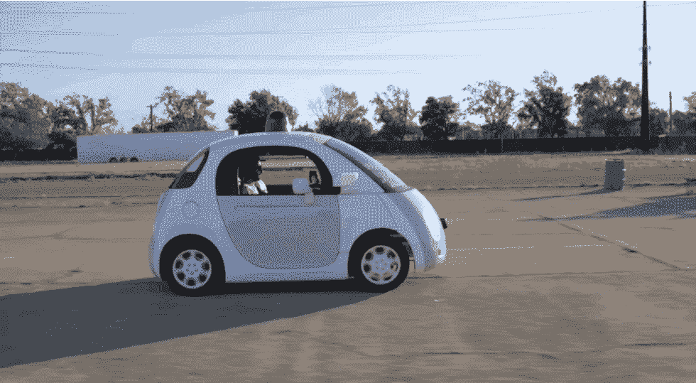

# 过去几年宣布的革命性技术及其结果

> 原文：<https://medium.com/hackernoon/revolutionary-technologies-announced-e8c5b77d58f2>

每当一项新技术在媒体上被讨论时，我们的注意力就会转移到这个概念令人兴奋的本质以及它有多了不起。然而，很少有人回忆起那次宣布以及他们过得有多好。在过去的十年里，我们有无数的“次好东西”。从物联网到机器学习，我们都洋溢着自豪，描绘着一切皆有可能的未来。尽管这些技术中有许多被证明是真正值得关注的，但其他一些技术在市场上的表现却很糟糕。

为此，我们必须对其中一些进行评估。

# 无线充电

## 历史及其公告

尼古拉·特斯拉是著名的电感耦合背后的大脑。人们认为，无线充电的概念之所以成为可能，只是因为他奠定的框架。然而，无线电力联盟在 2008 年才成立。他们随后在 2010 年开发了 Qi 标准，该标准管理与无线充电相关的一切。

## 情况如何？

该标准目前正被全世界约 900 种产品使用，然而，它的工作范围却不尽如人意。它只适用于短距离充电，通常约为 2 厘米，不能超过 4 厘米。

## 未来展望

正如所料，有许多工作要做。像苹果和三星这样的公司在这个想法上投入了大量资金，投入精力和资源进行研发。在未来五年内，我们可以预计我们的大多数设备都将配备无线充电功能。

# 无人驾驶汽车

## 历史及其公告

似乎就在昨天，自动驾驶汽车的概念还像是虚构的。虽然我们可能很容易认为自动驾驶汽车是 21 世纪技术的产物，但它实际上可以追溯到 1925 年。这是弗朗西斯·乌迪娜展示一辆由无线电控制的汽车的时候。

## 情况如何？

自那以后，自动驾驶汽车经历了几个艰难的时期，看起来该项目似乎不会取得成果。然而，在 2009 年，谷歌开始了一个秘密项目，现在被称为 Waymo。在短短 5 年内，自动驾驶汽车总共行驶了 30 万英里，而没有因 Waymo 所做的工作而引发任何形式的事故。截至 2017 年底，他们已经行驶了 200 万英里。

## 未来展望

在取得成功后，通用汽车、宝马、福特和日产等主要公司都宣布了对自动驾驶汽车的兴趣，预计到 2020 年，路上的大多数汽车都将自动驾驶。

# 三维打印

## 历史及其公告

3D 打印可以追溯到 1980 年，当时第一个专利被提交。然而，这项技术直到 2012 年才得到应有的认可，当时更便宜的替代品被引入市场。这最终让 3D 打印变得更便宜，也更容易被企业接受。

## 情况如何？

3D 打印正在慢慢消除对机器零件运输的需求——这一过程消耗了组装产品的大部分时间。这也促进了顾客和客户之间的关系，产生了快速原型和按需生产。

## 未来展望

3D 打印的应用延伸到医疗行业、制造业、航空航天业，甚至珠宝行业。随着消费级 3D 打印的发展，没有什么是不可限量的。

# 虚拟现实和增强现实

## 历史及其公告

莫顿·海利格于 1960 年制作的远程球体面具被记录为第一个头戴式虚拟现实小工具。然而，游戏和电影行业的技术发展(SEGA、任天堂和黑客帝国)直到 20 世纪 90 年代末才开始起步。

## 情况如何？

毫无疑问，这项技术已经取得了相当大的成功。苹果的 ARKit、谷歌的 ARCore 和脸书的 AR 工作室的无处不在值得称赞。除此之外，索尼的 PlayStation VR 目前正在做着令人难以置信的数字——迄今为止大约售出了 300 万台。

然而，这些成就并没有达到几年前市场评估时的大肆宣传。事实上，有急剧下降。人们的预期是，虚拟现实产品的销量将在接下来的几年里呈指数级增长。2016 年，对 VR 硬件和软件销售额的预测从 51 亿美元暴跌至 36 亿美元，最终降至 18 亿美元。2017 年，更是雪上加霜。

## 未来展望

事实是，VR 和 AR 行业并没有辜负炒作。然而，这并不是失败的信号。我们可以有把握地得出结论，VR 和 AR 市场将会很大，但是，它的增长需要时间。

# 物联网

## 历史及其公告

物联网一词第一次出现是在 1999 年。如果这项技术是人类的，它现在已经 19 岁了。当它第一次宣布时，主要特征是 RFID 技术，它可以作为一种将设备连接在一起的方法。然而，自那时以来，物联网已经走过了漫长的道路。

## 情况如何？

从 1999 年到 2010 年，这个概念经历了一个缓慢的增长期。事实上，直到云技术变得普遍，物联网也进入了大众市场。目前，物联网负责可穿戴设备、家庭自动化设备、智能电表等创新。2013 年，IDC 发布了一份报告，指出到 2020 年，物联网市场将价值 8.9 万亿美元。

## 未来展望

毫无疑问，物联网正在成为我们建设的未来不可或缺的一部分。它在医疗保健、能源、金融甚至工业领域都有潜在的应用。具有 5G 连接和小型化传感器的先进设备预计将于 2019 年上市。

# 4K 电视

## 历史及其公告

还记得电视机黑白显示内容的时候吗？更好的是，当电视机是巨大笨重的盒子，显示器会伤害你的眼睛？2015 年，4K 电视机彻底改变了游戏，它遍布美国的几个家庭。

## 情况如何？

毫不奇怪，公司现在正在调整他们的技术，以适应 4K 电视的出现，因为预计到 2020 年，它将进入 50%的美国家庭。Roku、亚马逊、Chrome 甚至苹果现在都提供支持 4K 流媒体的设备。

## 未来展望

与 4K 技术一样令人兴奋的是，它正迅速变得过时，8K 技术正试图推翻它的统治。最近支持这种说法的公告之一是夏普的 70 英寸 8K 电视。虽然它的发布还没有宣布，但每个人都在期待。

# 结束了

考虑到成就和失望，无可否认技术是多么美妙。每当我们做出大胆的预测，宣布未来的人工智能系统将有多先进，或者到 2025 年将有多少设备连接到互联网，尽管存在不确定性，这总是令人兴奋的。然而，我们都同意的一件事是，未来确实是充满希望的，有很多东西可以期待。

以后再见！

[由罗曼·昆采维奇撰写](https://www.linkedin.com/in/roman-kuntsevich-55819515a/)