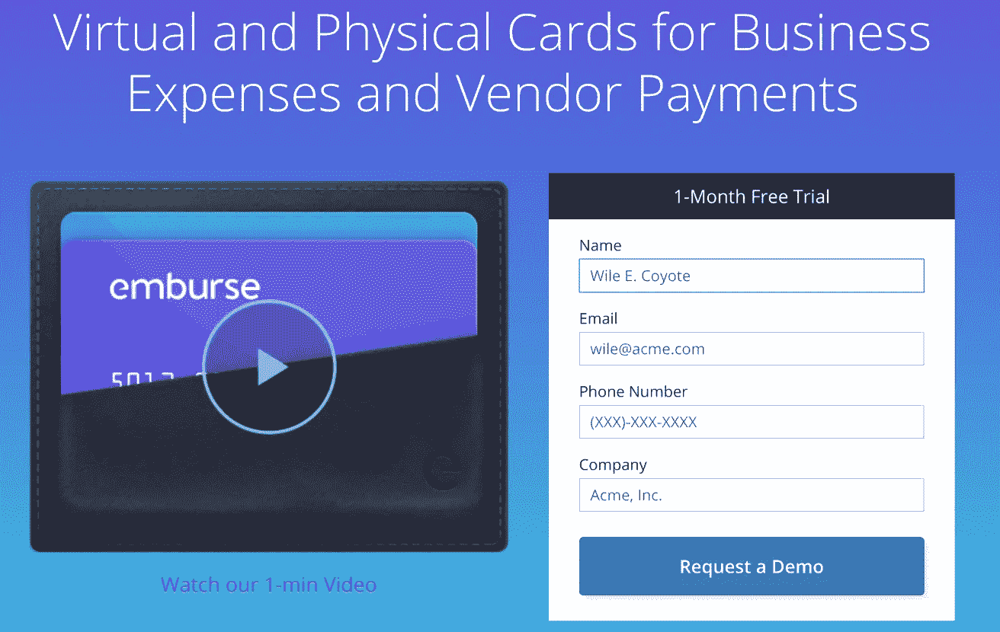
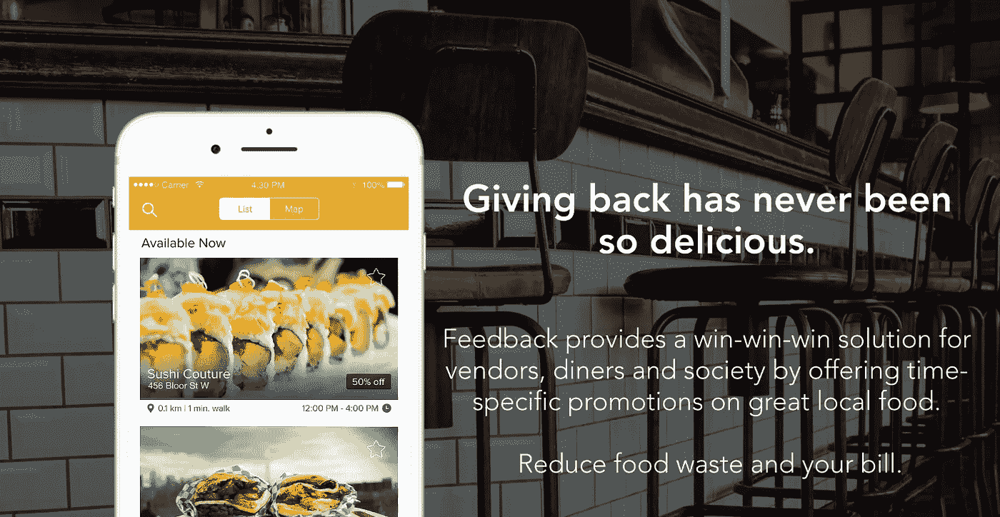
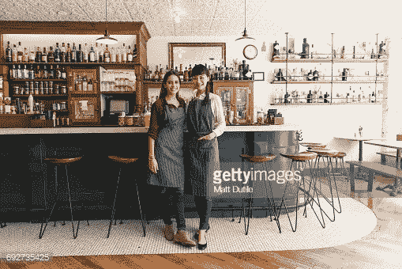
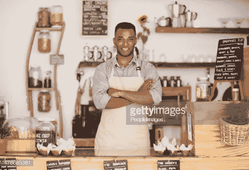
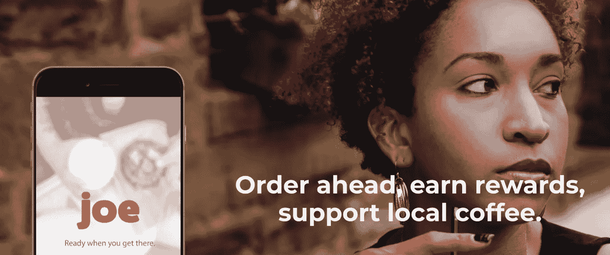
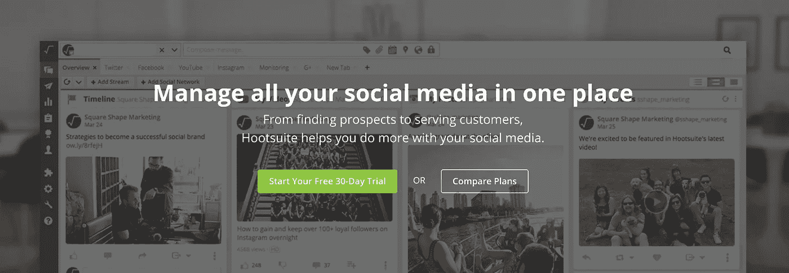

# 这样做会彻底改变你的销售和营销。

> 原文：<https://medium.com/hackernoon/revolutionize-sales-marketing-with-storytelling-9a4e194ca2c6>

## 特征和事实不能激发灵感，相反，它们讲述了一个更好的地方的故事。

“A person's hand holding a camera lens over a mountain lake” by [Paul Skorupskas](https://unsplash.com/@pawelskor?utm_source=medium&utm_medium=referral) on [Unsplash](https://unsplash.com?utm_source=medium&utm_medium=referral)

伟大的营销人员和伟大的销售人员讲故事。

他们描绘了世界是如何变化的，我们如何努力适应，以及我们需要帮助。

然后他们引导我们，非常温柔地，到一个新的更好的地方，一个我们的痛苦溜走的地方。

平庸的营销人员和销售人员使用功能听起来令人印象深刻。

需要证明吗？

三星吹嘘处理器速度、百万像素和屏幕分辨率。苹果在你的口袋里放了一千首歌，突出了捕捉瞬间的魔力。

> 苹果公司讲故事的一个例子:[https://www.youtube.com/watch?v=v76f6KPSJ2w](https://www.youtube.com/watch?v=v76f6KPSJ2w)

在 80 年代，阿迪达斯宣传更轻重量的鞋子、更好的鞋底和足球防滑钉图案。耐克告诉世界“只管去做”，并向我们展示了血、汗和泪是成为冠军所需要的。

星巴克为我们提供了联系的场所，与我们关心的人分享时刻，在热饮中寻找安慰。

“钻石是永恒的”，推而广之，我们的爱也会永恒。

讲故事改变世界。

仅仅围绕你所卖的东西进行叙述是不够的。这个故事必须是一个愿景，如果你的客户敢于冒险购买，他们会成为什么样的人。

在下面的帖子中，我们将通过一个练习来构思和改进四家技术公司讲述的故事，他们都在销售功能，而他们应该销售一个更好的未来。

完全透明，我认识所有这些公司的人。我不在这些公司工作，但讲述我所熟悉的品牌的故事比简单的熟悉感觉更自然。

# 1.emb burse

Emburse 是一家初创公司，试图理清员工支出和公司信用卡的混乱局面。如果你正在努力管理你组织内部的开支，看看他们，他们的平台令人印象深刻。

抛开平台不谈，他们的信息落入了许多其他人已经落入的陷阱，他们在销售功能。

功能不会激发灵感，网站当前的标题当然也不会。

# 当前的信息传递和挑战

没有承诺如何使用 Emburse，网站上没有人的照片(我们从 people 购买),虽然正确使用“请求演示”表单是值得的，但我们为什么要求用户立即工作？

**当前头条**:业务费用和供应商支付的虚拟和实体卡

**副标题**:分享虚拟卡或分发实体卡，提前组织开支，管理整个团队的开支。

受众:企业主、首席财务官、审计员、大型组织中的任何财务人员。寻求消除摩擦的中型企业主

虽然 Emburse 销售的产品是实体和虚拟信用卡，但它既不是人们需要帮助的真正问题，也没有启发性。

Emburse 销售的是安心、可预测性，以及从财务角度保证您的公司状况良好。

Emburse 应该谈论的愿景是安全性，是对客户的承诺，即我们现在和将来都会为您提供保障。

# 提出新的方向和新的故事

**新标题**:每一分钱，尽在掌握

**新副标题**:管理员工支出，同时跟上业务发展速度

受控的每一美元都是应许之地，一个你再也不需要担心钱的平静地方(是的，这有点夸张，但我们的目标是这里的抱负)。一旦你完成了课程，你的财务担忧减轻了，你就会有这种感觉。

副标题可以更具描述性，同时仍然以另一个承诺结尾，即 ember 会随着您的成长和变化而存在，因为这是企业所做的。

在标题下面或旁边，我建议放一张大/横幅照片，如下图所示。一个或几个看起来很满意的人(向潜在客户展示他们对 emb course 的感受),拿着一部手机，向他们宣传 emb course 支持移动设备。

> *小贴士:只要有可能，拍下人们面向或向右看的照片(或者在电子商务网站中面向购物车的照片)。这是一种心理强化，即向前看，取得进步，思考未来，而不是过去。

下面是一张库存照片，但我建议在可能的情况下拍摄您自己的照片(与证明相关)，并确保主题准确地代表您的客户人口统计。

Photo Credits: Photo by [rawpixel.com](https://unsplash.com/photos/xYjWeyS235w?utm_source=unsplash&utm_medium=referral&utm_content=creditCopyText) on [Unsplash](https://unsplash.com/?utm_source=unsplash&utm_medium=referral&utm_content=creditCopyText)

**老办法**；您可以从我们这里获得信用卡来管理员工开支。

**恩布尔的新故事**；我们将为你提供成功经营所需的财务保障。

网站的其余部分可以专注于平台提供的内容。在戏弄了这个新的未来之后这样做将会使 Emburse 比他们现在正在讲述的故事好得多。

# 2.反馈应用程序

FeedbackApp 的团队研究了一个食品订购平台市场，知道他们可以做得更好。

Feedback App 采用了与 Toms Shoes 类似的模式，让消费者能够通过订购他们想要的食物来回馈社区。

# 当前的信息传递和挑战

目前针对消费者的销售宣传方向是正确的，但并没有充分体现出产品的简单性和力量。我是在下载慈善 app 还是什么订餐的？

移动点餐是消除摩擦的一个很好的方式，但是食物折扣并不鼓舞人心，回馈也是一个太宽泛的术语来激励任何人。

这个故事必须首先得到你想要的，其次是帮助别人，最后是省钱。

**当前头条**:回馈从来没有这么好吃。

**副标题**:通过提供当地美食的特定时间促销，反馈为供应商、食客和社会提供了一个三赢的解决方案。减少食物浪费和你的账单。

改善 FeedbackApp 故事的首要任务是，他们需要承认他们在为两种受众服务。

1.  寻找食物的普通消费者(细分为:交易发现者，倾向于社会问题)
2.  餐馆老板和经理(总是需要更多的生意和更好的[营销](https://hackernoon.com/tagged/marketing)

餐馆的主页上没有推销，所以我们已经忽略了成功所需的一半受众。

我们在主页上看到的是一张空座位的照片，与一半观众想要的相反。

# 提出新的方向和新的故事

汤姆的鞋或慈善水的天才之处在于，他们找到了一种让生活变得更好的方法，同时避免了慈善活动中常见的消极情绪。他们没有伸手到你的口袋里拿你辛苦赚来的钱，他们避免了内疚之旅，并讲述了一个授权和灵感的故事。

FeedbackApp 可以利用同样的理念，通过让用户专注于获得他们想要的(需要的)食物，并作为副产品帮助他人，我们讲述了一个未来的状态，消费者可以自我感觉良好，而不必付出太多努力。

新标题:通过获取来给予

**新副标题**:你想要的食物，当你想要的时候，还有帮助他人的一面

**备用副标题**:在你想吃的时候，点你想吃的食物，同时帮助他人

通过“通过获取来给予”，我们告诉用户，他们只需要填饱肚子，这样他们就可以让他们的社区(和世界)变得更好。做最有益的事确实是最少的痛苦。

此外，通过将平台的重点放在折扣上，我们为餐厅老板(折扣是一场底部竞赛)、FeedbackApp 平台(更多的钱进来，意味着更多的钱可以赚)创造了一个更好的财务未来，当然，对于他们选择支持的慈善组织来说。

面向消费者的图像需要展现人情味，可以包括食物，并应强化给予和接受的概念。我不确定我 100%相信下面的照片，但它确实感觉像是双手向前伸出，手掌向上，这是一个很容易接受的提议。

Photo by [Annie Spratt](https://unsplash.com/photos/bB0EsYazzXY?utm_source=unsplash&utm_medium=referral&utm_content=creditCopyText) on [Unsplash](https://unsplash.com/search/photos/giving?utm_source=unsplash&utm_medium=referral&utm_content=creditCopyText)

作为第二个选择，这张照片的颜色太沉闷了，但是作为一个你可以如何艺术指导照片拍摄的例子，它几乎是完美的。一份食物，一个微笑的人，甚至围裙上的一颗小心脏都加强了这一努力的行善性质。

在这种情况下，这张图片的直接焦点给任何人一种想法，即这是个人的，服务专注于他们和他们的需求。

Photo by [Petr Sevcovic](https://unsplash.com/photos/e5Q5vWO55uU?utm_source=unsplash&utm_medium=referral&utm_content=creditCopyText) on [Unsplash](https://unsplash.com/?utm_source=unsplash&utm_medium=referral&utm_content=creditCopyText)

接下来，我们需要给餐馆发消息，因为如果没有餐馆成群结队地报名，这些顾客将从谁那里得到他们想要的食物？

# 提出新的方向和新的故事

对于餐馆来说，我们要解决的需求很简单；顾客，顾客，顾客。在一个几个百分点就能成就或摧毁一个企业的行业，新的和创造性的方法来驱动客户(尤其是非高峰时段)将是一个天赐良机。

**新掌门公司**:按需访问客户

**新子公司**:帮助你的顾客和社区获得他们需要的食物

按需获取顾客的概念是餐馆的梦想场景。不再等待客户走过，FeedbackApp 通过提前订购、帮助社区和提供及时促销的组合来推动客户，并以可预测性这样做。

在一个完美的世界中，页面上的照片将显示一个满意的餐馆老板和一个挤满了人的餐馆。如果没有发现这一点，我会建议用真实的餐馆老板/经理的照片，看着屏幕(象征性地看着其他餐馆老板)，看起来开心和满足。

**老办法**；供应商和食客的双赢，多赢，促销

**FeedbackApp 的新故事**；滋养你自己和社区。发展你的业务。

# 3.JoeCoffeeApp

JoeCoffee 将订购的概念提前，并将其专注于整个北美的 50，000+咖啡店；专门满足咖啡消费者和咖啡店店主的需求。

星巴克花了很多钱向消费者展示提前点餐的价值，JoeCoffee 打算将这种便利带给每一家咖啡店，无论规模或技术预算如何。

# 当前的信息传递和挑战

JoeCoffee 还遇到了销售功能的问题，而不是一个更好的，充满咖啡的未来。

**Headline** :提前订购，赢取奖励，支持当地咖啡

**副标题**:支持本地业务的最便捷方式

JoeCoffee 和 FeedbackApp 一样，都很难认识到他们服务的两个主要受众:

1.  咖啡购买者——所有演示中的个人顾客，比如你我，可能更多的是通勤者和商务人士，星巴克告诉他们排队是傻瓜才会做的
2.  咖啡店老板和经理——忙碌，不懂技术，总是寻求更多收入，努力降低成本

如果不努力教育和向两个受众推销这一愿景，JoeCoffee 怎么能指望发展自己的业务呢？

# 提出新的方向和新的故事

对我们许多人来说，咖啡是一种被紧急需求包裹着的宗教。它是让我们在早上动起来的神奇灵药，是我们度过一天的燃料，消费者永远不会满足。去年，美国的咖啡销售额在 2017 年达到近 40 亿美元，并且没有放缓的迹象。

JoeCoffee 顾客的乐土是在他们想要的时候就能得到他们想要的咖啡。不用排队，不用翻口袋找现金，不用翻钱包找信用卡。

拥有 JoeCoffee 就是知道当你需要解渴时，只需用手指轻轻一点就能喝到咖啡(这是基于应用程序的一种温和强化)。

**新标题**:触手可及的咖啡

**新副标题**:咖啡，方便的一面。正是你想要的。就在你想要的时候。

目前的网站照片，虽然是一个人(好的开始)，是一个看起来不是特别开心，也不是在喝咖啡的人。下面的图片是普通的(第二张是季节性的)，但是人们享受他们的咖啡，看起来很满意的图片将有助于推动故事向前发展。

Photo by [Dani Vivanco](https://unsplash.com/photos/Uy7MOSFdeFY?utm_source=unsplash&utm_medium=referral&utm_content=creditCopyText) on [Unsplash](https://unsplash.com/?utm_source=unsplash&utm_medium=referral&utm_content=creditCopyText)

Photo by [freestocks.org](https://unsplash.com/photos/5UWVdeEAE3E?utm_source=unsplash&utm_medium=referral&utm_content=creditCopyText) on [Unsplash](https://unsplash.com/?utm_source=unsplash&utm_medium=referral&utm_content=creditCopyText)

# 提出新的方向和新的故事

对于咖啡店老板来说，这些信息只有一个作用，那就是强化这样一个概念:有了 JoeCoffee，你的生意将吸引更多的顾客(需要较少关注和占用较少空间的顾客)。

JoeCoffee 作为营销渠道，具有提前订购和移动推送通知的便利，对于一个本地和真实并不总是等同于忙碌的行业来说，这是一个强有力的故事。

任何与星巴克在平台上竞争的机会都会给当地的咖啡店和中小型咖啡连锁店带来公平竞争的机会，在平等的基础上争夺顾客。

给咖啡店老板和经理的信息是，我们会派更多的人去你那里。

**新头条公司**:源源不断的客户

新的 Sub Headline Corp :提前订购不仅仅是大型连锁店的专利

如果网站上的图片能从咖啡店的角度反映他们的生活，那么招募咖啡店的效果会好得多。煮咖啡的员工，排队的顾客，所有这些都是 JoeCoffee 如何让你做你想做的事情，同时让顾客(销售)进来的视觉强化。

Photo by [Joshua Rodriguez](https://unsplash.com/photos/f7zm5TDOi4g?utm_source=unsplash&utm_medium=referral&utm_content=creditCopyText) on [Unsplash](https://unsplash.com/@jcrod?utm_source=unsplash&utm_medium=referral&utm_content=creditCopyText)

# 4.Hootsuite

很难否认 Hootsuite 的成功。他们单枪匹马地将温哥华推上了世界科技的雷达。

本着销售不仅仅是功能，关注人们和他们能取得的成就的精神，他们的故事可以做得更好。

# 当前的信息传递和挑战

Hootsuite 帮助个人和品牌在各种社交媒体平台上发布内容，简化对话和建立社区的过程。

**Headline:** 在一个地方管理您所有的社交媒体

**副标题**:从寻找潜在客户到服务客户，Hootsuite 帮助你在社交媒体上做得更多。

因此，Hootsuite 让你在一个地方管理你所有的社交媒体，但这是我们作为他们的客户想要的鼓舞人心的地方吗？

# 提出新的方向和新的故事

Hootsuite 真正带来的是整个团队对个人的力量。他们帮助他们的用户与客户和在线对话保持联系，并且比其他方式更容易。

Hootsuite 在一天结束时会让社交媒体，进而让你的工作生活更加有效。

Hootsuite 客户的乐土是社交媒体的掌握和所有权，创造了一个曾经困难和耗时的地方，现在很容易。

**新标题**:社交媒体变得简单

**新副标题**:社区时代的主信息

或者你更喜欢一点的头韵。

**新标题备选:**社交媒体变得易于管理

**新的副标题 Alt** :接触客户。推动讨论。构建社区

**受众**:品牌所有者、代理商员工、营销经理、内容创作者

Hootsuite 平台本身看起来很棒，但顶部图像横幅需要专注于人们完成工作，而不是产品。

个人工作的照片强化了这样一个概念:当你有机会接触 Hootsuite 时，你会变得多么强大。他们可以随时随地完成工作，这让客户处于主导地位。

最后一张两个人在非办公室环境中合作的照片可以用来突出团队如何合作。

Photo by [Christin Hume](https://unsplash.com/photos/slbqShqAhEo?utm_source=unsplash&utm_medium=referral&utm_content=creditCopyText) on [Unsplash](https://unsplash.com/?utm_source=unsplash&utm_medium=referral&utm_content=creditCopyText)

Photo by [LinkedIn Sales Navigator](https://unsplash.com/photos/Xh_MFNzpEDw?utm_source=unsplash&utm_medium=referral&utm_content=creditCopyText) on [Unsplash](https://unsplash.com/?utm_source=unsplash&utm_medium=referral&utm_content=creditCopyText)

Photo by [rawpixel.com](https://unsplash.com/photos/Y9nzl9tA3Lw?utm_source=unsplash&utm_medium=referral&utm_content=creditCopyText) on [Unsplash](https://unsplash.com/?utm_source=unsplash&utm_medium=referral&utm_content=creditCopyText)

毫无疑问，通过遵循更严格的流程，或至少从利益相关者和客户那里收集信息，我们可以创建更能引起目标受众共鸣的信息，但为了快速思考实验，我会将上述任何信息与每个公司目前所说的内容进行 A/B 测试，并对基于故事的选项的积极结果充满信心。

那么，你的信息是在推销更大、更光明、更好的未来，还是功能占主导地位？

你是在尽你所能去激励和愉悦他人，还是落入了告诉人们你希望什么能让你与众不同的陷阱？

你有没有认真思考过如何为你的顾客带来改变，而不仅仅是你的底线？

设身处地为他们着想，解决他们的痛苦，讲一个你是如何做到的故事，并知道事情会从那里变得更好。

接下来，我们将讨论这种信息应该如何推动您构建产品，而不是相反。

欢迎在下面或通过 Twitter 上的@kmore 来倾听您的想法、评论或担忧。

如果你喜欢这篇文章，我会感谢一次(或十次)掌声，以帮助表面的文章给其他人。