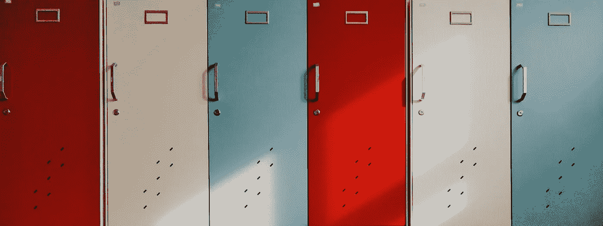

# 重塑你的大脑——变得高效、有条理和聪明

> 原文：<https://medium.com/hackernoon/rewire-your-brain-be-efficient-organised-and-smart-e6fd7c337d79>

作为人类，我们都有喜欢、不喜欢、时刻、记忆、恐惧、希望、愿望、梦想和抱负。它们都是无限的，每一天，每一秒都在形成和改造。

我们也是潜意识模式、习惯和反应的奴隶。可能是一些简单的事情，比如开始洗澡前弄湿我们的脚，或者先在右脚穿上一双袜子，我们不是故意这样做的，不是吗？实际上，我们的大脑成为了所有这些想法版本和反复的最终记录者。我们继续下意识地连接我们的大脑*。*

让我们量化我们的大脑可以存储的信息量——它具有超级计算机的存储和记忆能力——它可以存储大约 2.5 千兆字节，即 250 万千兆字节的数据。称大脑为复杂机器并不为过。一台控制一切、永不停止工作的机器，至少在我们有生之年不会。

## 墙上的镜子镜子

这是最著名的一句话，从我们童年的迪斯尼时代开始，就不时被引用。这句“白雪公主”的名言也出现在各种商品上——t 恤、杯子等等！事实上，在 2012 年上映的《白雪公主》上甚至还有一部[衍生](https://hackernoon.com/tagged/spinoff)电影，叫做《魔镜魔镜》。

Mirror mirror on the wall ~ Snow White

*如果我告诉你报价是错的，会怎么样？*不是电影说的那样！

在电影中，他们实际上说的是'**魔法**墙上的镜子**'。**

这是怎么发生的？我们的大脑，不仅仅是你的或我的，对我们大多数人来说，是如何让我们相信这是*镜镜*而不是*魔镜*的呢？对此，网上流传着大量的解释。

从更高的层面来看，这被称为**曼德拉效应**——一种成千上万彼此没有关系的人对同一事件有着相同的集体错误记忆的现象。这是互联网上流行的阴谋论之一，一直困扰着全世界的大脑。

这个词是菲奥娜·布鲁姆在人权活动家纳尔逊·曼德拉去世后于 2013 年创造的。

来自世界各地的人们感到困惑，因为大多数人对他在 20 世纪 80 年代死于狱中有着同样清晰的记忆。人们甚至发现了旧的教科书和传记，声称纳尔逊·曼德拉确实死于 80 年代。曼德拉效应的理论非常丰富。有人认为，这可能是由于平行宇宙的转移。或者像我相信的那样，这可能只是我们的大脑机器出错了。

## 混乱的大脑

你是怎么在这么乱的地方找到你的死亡池 t 恤的？

There are boards on Pinterest for Messy Closets ~ Messy Brains

更多的时候，这就是我们大脑的状况——毫无组织，处于一种完全混乱的状态。它会变得困惑，并达到超负荷的状态。

*如果大脑的搜索引擎出错了会怎么样？
如果机器(大脑)处理查询的时间太长怎么办？*

*不是吗，已经？*在过去的一个月里，我们会忘记一项重要的任务，这样的例子有几十个，如果不是更多的话。更多的时候，我们感到沮丧或精疲力竭。也许，这些是我们的大脑需要一些工作——一些组织——思维机器需要重新思考的迹象！

以最有效和最佳的方式利用我们的大脑是极其重要的。简而言之，润滑它，更好地组织信息。

我们如何改造我们的大脑？

## 分隔化

从一次做一件工作开始。

根据紧急程度或重要性来划分你的工作。这将有助于你区分任务的优先级。不要同时想太多事情，让自己负担过重。你的注意力和精力应该集中在一个特定的任务上。如前所述，你的大脑是一台机器。如果你让它超负荷运转，它就会耗尽能量，无法正常工作。

这并不意味着你忽略了其他的问题。事实上，分隔实际上会让你把全部注意力放在一个特定的任务上，而不会被手头的其他任务分散注意力。

因为你在训练你的大脑，所以你需要在开始时进行大量的微观管理。一旦你这样做了几次，你会觉得很自然，实际上，会节省很多生产时间。

## 设定截止日期

尽量在最后期限内完成工作。不要给自己设定简单的期限，甚至是很紧的期限，否则你就是在欺骗自己，这个练习对你没有任何帮助。

轻松的截止日期会让你变得懒惰和无忧无虑，而紧张的截止日期只会带来压力。

> "你在生活中将要面对或处理的最大的敌人是你自己."—罗伯特·图

按时完成任务会让你感到更有效率和自豪。自我满足是人类行为的巨大动力，鼓励我们在多个方面做得更好。

## 不要做奴隶——说不

是的，我们都是奴隶。我们是自己恶习的奴隶——多睡 5 分钟，5 分钟后才开始工作，在接近完成任务时吸烟或喝咖啡。

为了克服这些，我们应该学会对自己说不。

采取强硬立场。战胜你的贪婪。对抗每一个让你退缩的时刻。与你甜蜜的 5 分钟睡眠或者 5 分钟休息时间做斗争。完成工作，然后喝杯咖啡/抽根烟休息一下。你会发现这让你更快乐，更满足。事实上，你已经完成了一项任务，并且不需要再回去工作，这在成年人的生活中是一个很大的满足。

## 关闭

这些小小的改进会节省你很多时间。记住，如果你是自己最大的敌人，那么你也是自己最大的挑战者。

自己观察研究。从最小的事情开始。它可以是任何东西——你的措辞或习惯。我的习惯是每句话都以“所以呢？”开头。。

时不时地纠正自己是非常重要的。暂停一下；从小处着手。这些小小的调整将帮助你重组你的大脑，让你更有效率、更有条理、更聪明。