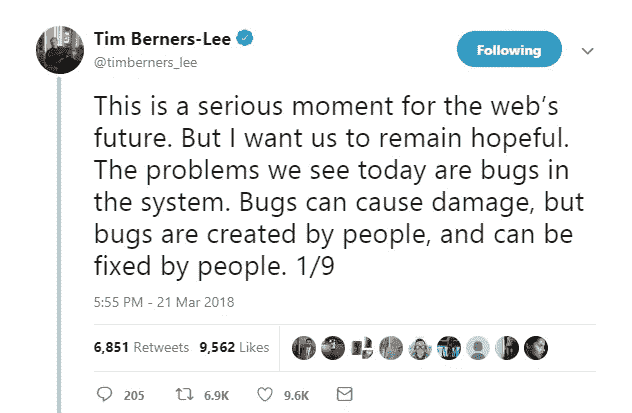
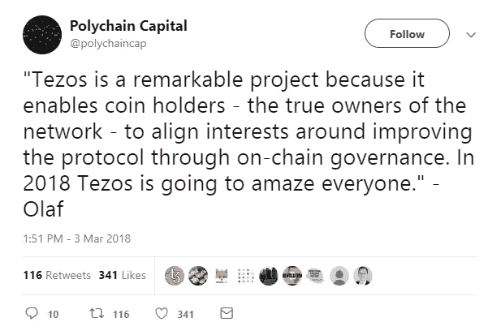
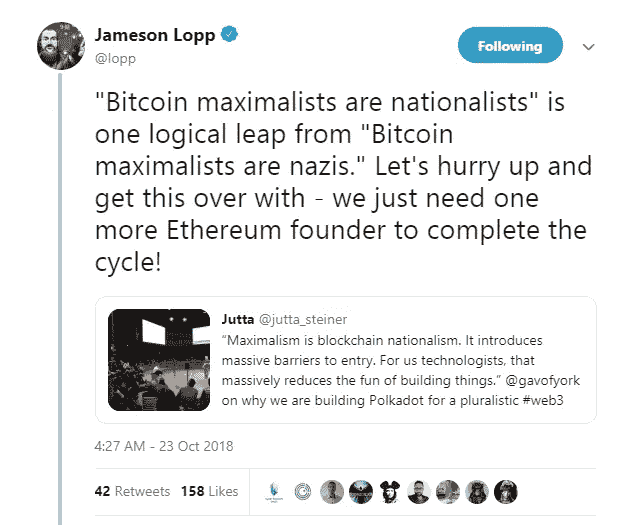
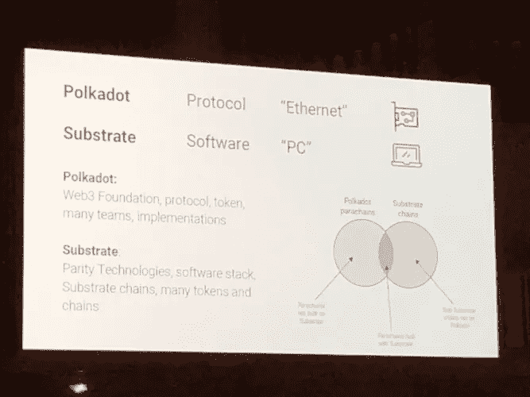
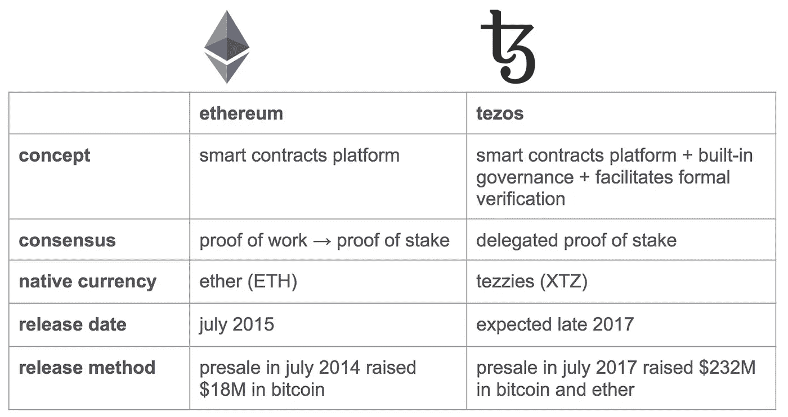
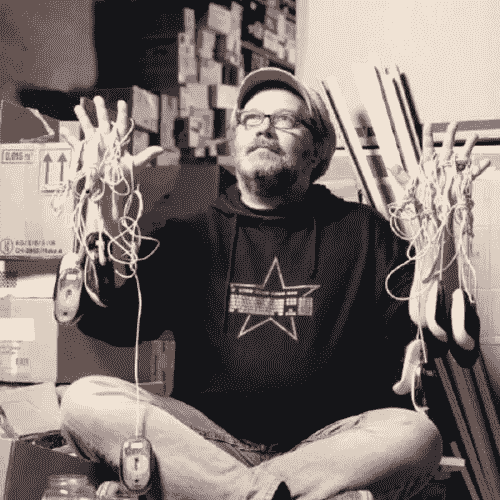

# 重写 Web2 和其他政治事件的错误

> 原文：<https://medium.com/hackernoon/rewriting-the-wrongs-of-web2-and-other-political-events-f217e5134ef2>

驾驭新兴的 Web3 生态系统就像是翻译一份庞大的营销计划。小的创业公司将会分散这一点，其他公司将会为此提供小额支付，他们都将会“纠正”互联网的错误。虽然有些是真的，但这个术语似乎并没有抓住构成下一步的实际技术栈。

*以下是 10 月 22 日至 24 日在德国柏林举行的 Web3 峰会的综述。原系列可以在 BTCManager* [*这里*](https://btcmanager.com/web3-summit-pt-1-metaphorical-mental-models-and-the-new-internet/) *，* [这里](https://btcmanager.com/web3-summit-pt-2-buidlers-toolboxes/) *，这里***找到。**

# *互联网上的历史课*

*如果你是脸书或谷歌的员工，你很难坐在 10 月 22 日至 24 日在柏林举行的 Web3 峰会的大厅里。然而，如果方集团的一名员工真的成功通过 Funkhaus 的大门参加为期三天的活动，他们将更好地了解他们的意识形态对立。他们也可能受够了这样一句话，“Web3 将粉碎 Web2 的联合企业。“但是，如果他们来自一个特定的时代，比如 Web1，整个场景可能一点也不具有威胁性。甚至可能看起来一模一样。*

*幸运的是，互联网的到来、优势和破坏都发生得相对较快。因此，很少有创始人去世，他们的许多同事都热切地接过火炬。为了引导充满幻想的 dApp 开发者和基础设施管道层， [Inria](https://www.inria.fr/en/) 的 [Harry Halpin](https://uk.linkedin.com/in/harryhalpin) 曾是麻省理工学院的现任教授，向观众讲述了互联网的第一次迭代。他风趣地解释说，加密货币之间发生的意识形态之战有多少让人想起了那些为应该标准化哪些标准而争斗的团体。他讲述了哪些山是开发商正在垂死挣扎的，哪些山是为了长期的成功而被放弃的。*

**

*(Source: [*Twitter*](https://twitter.com/timberners_lee/status/976623317808484352))*

*有趣的是，这也不是哈普林第一次听说去中心化。根据蒂姆·伯纳斯·李的说法，互联网本来就是这样的。他解释说，一群“嬉皮士”在 70 年代开始计划什么有希望让数字世界增强肉的空间。他们问，技术如何让我们变得更社会化、联系更紧密、更人性化？*

*首先，一个[增强的社交网络](http://firstmonday.org/ojs/index.php/fm/article/view/1068/988)需要一个持久的身份。早期的创新者就像区块链世界的公民一样渴望给用户一个通用的、有粘性的名字标签，当他们在互联网上遇到其他互联网用户时，他们会带着这个标签。当然，这并不容易，因为没有人能决定由哪家公司或哪家服务公司来提供这种身份。很快，在 Web2 中，为我们做出了决定。*

*但是，在这个给用户干净身份的时刻之前，回到去中心化网络的早期迭代。哈普林提醒观察者，Indymedia 、[、FOAF](http://www.foaf-project.org/) 和伯纳斯-李的“[语义网](https://www.w3.org/standards/semanticweb/)的梦想都在进行中。不幸的是，开发商搬起石头砸了自己的脚，为你知道是谁铺开了红地毯。由于在关键时刻未能达成共识，任何事情都无法达成一致，也无法建立在此基础上。这是混乱和开源的。它是分散和脆弱的。很快，世界上第一个尝试去中心化的公司被收购，被包装在 NDA 协议中，并作为著名的“喜欢”按钮重新发布。“这是分散技术有史以来最伟大的用例，”哈普林向人群喊道。“脸书有！”*

**

**The Semantic Web Stack in full color.*
(Source: [*W3*](https://www.w3.org/2003/Talks/simo-semwebapp/all.htm))*

*那么，区块链能拯救我们，让我们回到去中心化的互联网吗？是也不是。这位计算机科学家的演讲的关键要素是它提供的背景。bip、EIP、软分叉和硬分叉的蜂拥而至的自我，看起来都与互联网的崛起极其相似。幸运的是，激励模式更好一些。通过建立一个具有本土经济结构的互联网，创业者和企业家不再那么依赖大公司为他们的项目提供资金。*

*空间一方面看到了毫无根据的 [ICO](https://btcmanager.com/guide-initial-coin-offerings-icos/) 热潮，另一方面也享受着哈普林那一代人所没有享受到的某种程度的主权。尽管如此，无论看起来多么乐观，软实力和自负都会很快给机器带来麻烦。*

# *新浏览器，相同的数据*

*对于那些希望摆脱臭名昭著的广告收入模式的人来说，内置经济并没有失去作用。或者更糟:付费墙。勇敢的浏览器很可能是这方面最受欢迎的尝试。【Brave 背后的首席科学家 Ben Livshits 博士解释了通过点击和浏览赚钱的垂死商业计划是如何慢慢消失的。摆脱困境的好办法:“想象一下，你可以用小额支付来阅读《经济学人》的一部分。想象一下将 Twitter 上所有的赞和转发货币化，”Livshits 解释道。令牌操作的浏览器已经让至少[1000 万](https://btcmanager.com/brave-browser-surpasses-10-million-downloads-on-playstore/)用户相信了这一逻辑，因为 dApp 已经看到了同样多的下载。*

*然而，对于这家初创公司来说，现在还为时尚早。目前，Brave 仍处于双子阶段(浏览器发布和测试版发布)，但最终 Apollo 展示的每一步看起来都像是完美的广告清洗。或者，如果你能忍受更多的弹出窗口，浏览器会以其固有的基本注意力令牌( [BAT](http://www.bat.com/) )向用户付费。在前往阿波罗的路上，该组织还希望结交一些朋友，如 IPFS、未提及的分散身份协议，甚至更多的 YouTubers 转向浏览器。*

*很快，一个没有 Chrome 和其他讨厌的广告追踪器的世界就像是一个过去。作为最后一击， [Ocean Protocol](https://oceanprotocol.com/) 随后布局了打开数据机器的 Ocean substrate，就像[比特币](https://bitcoin.org/)打开金融机器一样。该项目的创始人 Trent McConaghy 描述了令牌经济是如何激发他在海洋协议和数据经济方面的工作的:*

> *“数据就是金钱，或者像石油一样有价值。由于我们是提供这些数据的人，我们也见证了人类历史上最大的套利交易。”*

*收集到的用户数据会以最高的价格卖给出价最高的人。更重要的是，这些数据正慢慢地，但却越来越精确地被脸书和谷歌逼到墙角并抢购一空。从这些数据孤岛的角度来思考，就像霍德勒在 2008 年对华尔街的思考一样，为什么处于危险之中描绘了一个清晰的隐喻。*

# *在 Web3 中，网络就是公司*

*最后一组小组成员在描述投资者应该如何参与分散化项目时，继续了隐喻之旅。参与对话的有 [Polychain Capital](https://polychain.capital/) 的 [Olaf Carlson-Wee](https://www.linkedin.com/in/olafcw) 、 [Fabric Ventures](https://www.fabric.vc/) 的 [Richard Muirhead](https://uk.linkedin.com/in/richardmuirhead) 、 [FBG 资本](https://www.fbg.capital/)的 [Shuoji Zhou](https://www.linkedin.com/in/shuojizhou/) 以及 [Parity Technologies](https://www.parity.io/) 的 [Jutta Steiner](https://www.crunchbase.com/person/jutta-steiner) 主持。*

*这项新兴技术的最大优势之一是它所使用的隐喻的力量。很少有受试者毫发无损，大多数时候，房间里的非技术部分都深感欣慰。为了更好地理解这三个人是如何看待投资的，Carlson-Wee 敏锐地将网络描述为公司:“投资者必须参与链上治理。不这样做，就像苹果的大股东不出席股东大会一样。”还需要注意的是，Polychain Capital 还控制着 [Tezos](https://tezos.com/) 中最大的节点。*

**

*(Source: [*Twitter*](https://twitter.com/polychaincap/status/970054155342577665))*

*穆尔黑德接着宣布“这不再是董事会了。当谈到加密货币而不是公司股票时，周更多地解释了宝藏背后的哲学。对这种新的投资者-项目关系的最后考验是确定前者的信托角色，同时也考虑后者的实际需要。*

*最终谁在帮助谁变得有点模糊。很可能，这就是问题的关键。在分散所有事情方面，Web2 做得还不够。或者，也许我们只是还没有找到合适的比喻来形容即将出现的新怪物。*

***何**[第一天](https://btcmanager.com/web3-summit-pt-1-metaphorical-mental-models-and-the-new-internet/) **在** [**Web3 峰会上的讨论**](https://web3summit.com/) **概述了互联网的新兴、平台和即将到来的迭代的许多特征。它提供了一系列的类比来帮助与会者理解权力下放和区块链技术的含义。它超越了礼仪，为整个景观提供了精神上的乐观。第二天，同样鼓舞人心，但方式大不相同。演示的策划将纠正 Web2 错误的冲动带到了一个具体的目的:编程。***

# *加文·伍德解释基底*

*以开发者为主的会谈以一位来自以太坊联合创始人加文·伍德的解释者开始。在与布特林合作并启动了太空中第二大的区块链项目后，他在奇偶技术公司和波尔卡多特拿起了武器。该项目的重点是在尽可能多的区块链之间提供最大的互操作性。*

*在他的演讲中，伍德将任何一种加密专用的最大化主义描述为“区块链的民族主义等价物”他甚至解释说，波尔卡多特甚至试图避免任何部署前无法预见的意外障碍。“即使一条链是‘完美的’，它也不会保持很久，”他总结道。*

**

*(Source: [*Twitter*](https://twitter.com/lopp/status/1054695733734060034))*

*这种哲学延伸到他谈论的焦点[基质](https://www.parity.io/what-is-substrate/)。这套面向开发者的工具将允许能够在 [Rust](https://www.rust-lang.org/) 中编码的程序员建立一个可操作的用户界面，改变区块链发布后的形态，按照他们的意愿操纵智能合同，并最终消除从头构建区块链的需要。即使是共识机制也可以“即时改变”并且“没有 T4 的硬分叉”一位评论员解释说，它就像 WordPress 的等价物，但用于分布式分类帐编程。*

*也许这个比喻有所欠缺，但它确实提供了一个有趣的视角，让我们了解 Web3 在发展方面的确切位置。通过将注意力集中在一个高级工具箱上来邀请有才华的，但可能没有区块链意识的开发者，Substrate 可能会引起一大群人的兴趣。人口统计不会像 ICO 那样充满泡沫，但它将有助于通过许多快速的手打下一个强大的基础设施。从许多方面来看，这也是对整个领域最乐观的押注之一。*

**

*(*Source*: [Trustnodes](https://www.trustnodes.com/2018/10/23/gavin-wood-launches-a-blockchain-in-15-minutes/polkadot-substrate))*

*通过构建开发人员来的地方，而不是主流大众，Wood 将一个难以置信的长时间范围放在技术继续保持相关性上，而没有所有标记化的华而不实。对于纯粹的艰苦工作没有公平的类比。*

# *给予数字版权，如何被误解，和宇宙的硬模式*

*Agoric 的 Dean Tribble 描述了在不完全接管的情况下，给任何一个用户(任何东西)足够的权力来完成特定任务的困难。“如果我给某人我的车钥匙，他们可能会回到他们的酒店，让代客泊车，第二天他们可能会卖掉它。很明显，我不想那样，”他说。*

> *“如果我用数字方式将我的密钥绑定到这个人身上，而密钥只对这个人有效，那会怎么样？我可以阻止他们卖掉它。不幸的是，一旦他们到了代客服务，他们就有点麻烦了，因为代客司机不能停车。”*

*特里布尔的演讲提出了如何在一个框架内实现自治。智能合约也以这种方式运行，Agoric 希望提供一个更丰富的版本，说明在他们的代码中可以绑定哪些类型的逻辑。在这个安全的实验中(受特定框架的约束)，特里布尔像其他许多演讲者一样，解释了开发人员如何能够通过全新的代码条工作。*

*[Tezos](https://tezos.com/)的 Arthur Breitman 做了一个与最近[推出的](https://btcmanager.com/tezos-mainnet-finally-goes-live/)聚焦治理的区块链的宣传相匹配的演讲。在他题为“Tezos 摇滚的 5 个原因，第 4 个会让你震惊”的演讲中，他概述了许多人已经听说过的事情，但这位 Tezos 联合创始人提出的最尖锐的观点可能是他的项目经常被误解。在过去几年里，围绕着这个项目的所有戏剧，似乎很自然地，这项技术从果汁金融争议中退居二线，至少从媒体的角度来看是这样。*

**

*(*Source*: [Medium](/@linda.xie/a-beginners-guide-to-tezos-c9618240183f))*

*底线是，“[ [股权证明](https://btcmanager.com/tag/proof-of-stake/) ]意味着持有 0.0001%的代币，意味着该持有人在项目方向以及整体奖励方面拥有 0.0001%的发言权。”如果说有什么不同的话，这种雄心是明确的，并对后 [PoW](https://btcmanager.com/tag/pow/) 时代的共识模型充满希望。无论如何，在这一点上保持事情简单可能是最好的。*

*[Tendermint](https://www.tendermint.com/) 、区块链间通信(IBC)协议、砍杀和打桩只是引导目光如炬的企业家远离免提网络的几个要点 3。或者，至少去掉了那些令人眼花缭乱的垒球流行语。在他简洁的介绍中，宇宙公司的扎基·马年描述了宇航员们工作的具体细节。在他的演讲之后的问答中，他甚至描述说这个项目只对高级开发人员有吸引力，假设他们还没有被启动和维护 zones(治理模型的 Cosmos 版本)以及敲定 SDK 的挑战吓跑。*

*然而，在马年的演讲中，隐藏着一颗炒作的宝石:世界可能会在 2019 年初看到第一个大规模可扩展的 dApp。最后，这才是最重要的，对吗？*

***何** [**Web3 峰会的最后一天**](https://web3summit.com/) **以一个关于技术政治化的提醒结束。随着我们的世界变得越来越数字化，人类经验变得数字化，了解** [**治理**](https://btcmanager.com/governance-remains-a-big-problem-in-the-age-of-new-tech/) **将如何被重塑变得越来越重要。许多发言者解释了这一点为何总是正确的，而其他人则描述了这些讨论能够保持民主和富有成效的实际手段。***

# *将黑客伦理带入主流*

*Bernd Fix 的最初发言重复了 Harry Halpin 在活动第一天的一些观点。Fix 来自 Halpin 之前的人口统计学，代表了一种被资本主义机器迅速挪用的计算机科学文化。他创造了打破界限、倡导自由的红星，构成了互联网最初的愿景。然而，在台上，他冷嘲热讽地谈到了这一愿景的恶化。*

*当概述互联网应该做什么时，不难看出它的政治根源。任何人都可以把计算机科学中的一些技术术语换成政治科学学院的其他术语，很快这种对话就像是政府的职责。或者说，政府应该做什么。*

*“政治是沿着新的趋势和叙事形成我们的社会的项目，”费克斯解释说。如果观察家们以此为前提，随着我们奔向加速的数字体验，不难看出关于技术的交流将如何最终塑造政治对话。不过，希望这场对话不会被少数人的声音所主导。错过政治和技术之间的桥梁，或者远离这种关系，从许多方面来说，就是放弃塑造一个国家轨迹的权力。修问道:*

> *“为什么我们对政治的讨论不能像我们对软件设计的讨论那样投入、富有同情心？”*

**

**Bernd Fix is also a founding board member of the* [*Wau Holland Foundation*](https://www.wauland.de/en/) *based in Hamburg, Germany.*
(*Source*: [LibertyBits](https://libertybits.org/speakers/bernd-fix/))*

*按照他的说法，Fix 一代的黑客伦理没有通过商业文化的“现实检验”。它无法抵挡企业的整合以及它们为财务底线塑造技术的能力。“我们没有输掉战争，但我们确实输掉了很多战役，”费克斯哀叹道。随之而来的是希望的春天。*

*Web1 和 Web2 的创始人将区块链科技和它提出的解放效应视为另一个争取自由的战场。如果参与者可以考虑创新在这种背景下的相关性，它可能会表现出与 Fix 或 Halpin 的结论大不相同。*

# *塑造对话:治理与政治技术*

*决定区块链科技将如何纠正那些依靠用户数据繁荣的大公司的错误，是分布式账本的头号公敌。虽然有些人声称技术是不可知论者，但一些平台正试图通过不同的治理模式来融入更公正社会的特征。对此发言的是 [ZK 实验室](https://zklabs.io/) [的创始人马修·迪·费兰特](https://twitter.com/matthewdif?lang=en)。*

*他向为数不多但日益增多的听众解释说，“良好治理做出的错误选择要比糟糕治理做出的正确选择好得多。”这可以从仁慈的独裁者的思想中理解，并最终将治理分解为两项:结果和过程。*

**

*(Source: [*Twitter*](https://twitter.com/FEhrsam/status/935182809123008512))*

*Di Ferrante 的观点还意味着，当做出一个糟糕的选择时(假设它是在一个“良好”的治理模式下做出的)，可以很容易地在未来得到纠正。然而，对于“糟糕的”治理来说，情况并非如此。因此，假定这些框架中包含一定程度的灵活性。这个模型的另一个方面是参与者的身体。每个人都在从一个系统的不同层面发出不同的贡献信号，这种信号也必须是充分知情的，以免一个社区最终得出错误的结论。*

**

*(*Source*: [Medium](/blockchannel/blockchain-is-governance-e0d827b97b3f))*

*[Vlad Zamfir](https://twitter.com/vladzamfir?lang=en) 、 [Gavid Wood](http://gavwood.com/) 和 [Arthur Breitman](https://twitter.com/arthurb?lang=en) 在 Funkhaus 的同一间挤满人的房间里继续讨论。“开国元勋们”的低语声响彻全场，增加了三位演讲者的严肃性。伍德从建筑材料出发，将治理描述为经济系统保持凝聚力的手段。*

*治理不善往往会导致社区内部的分裂，就像这位平等创始人所引用的天主教会一样。然而，分歧，或者说硬分叉，并不是一件坏事。Zamfir 解释了当一个社区追求不利的方向时，他对分叉代码的辩护。这样做也是为了防止菲克斯和哈尔平所概述的恶意势力接管政权，可以被比作言论自由(这种言论永远不应该被压制)。*

*Breitman 解释了在处理公共财产(如公共区块链)时治理的重要性。但是，尽管对话引用了代码的分支或分支方面的技术方面，三位发言者都没有忽略社会学的因素。无论一项技术多么强大，软实力都会一遍又一遍地重复。伍德认为，减轻治理的人性特征可能永远不会得到解决，“自由的代价是不断的警惕”。*

**

*(Source: [*Twitter*](https://twitter.com/SiaTechHQ/status/1052307999337967616))*

# *不管怎样，什么是进步？*

*会议结束时，执行副总裁 [Aeron Buchanan](https://twitter.com/aeronoxio?lang=en) 重申了这样一个事实:“在建设未来的时候，我们不能逃避政治。”在所有的发言中，都提出了改善社会通过互联网解决网络文化问题的最初尝试的愿景。*

**

*(Source: [*Twitter*](https://twitter.com/aeronoxio/status/1054410302190747650))*

*但是，也许更重要的是，社会因素将很快取代技术因素。邀请和激励尽可能多领域的专家将有望为每个人提供一个更加公正和道德的互联网。*