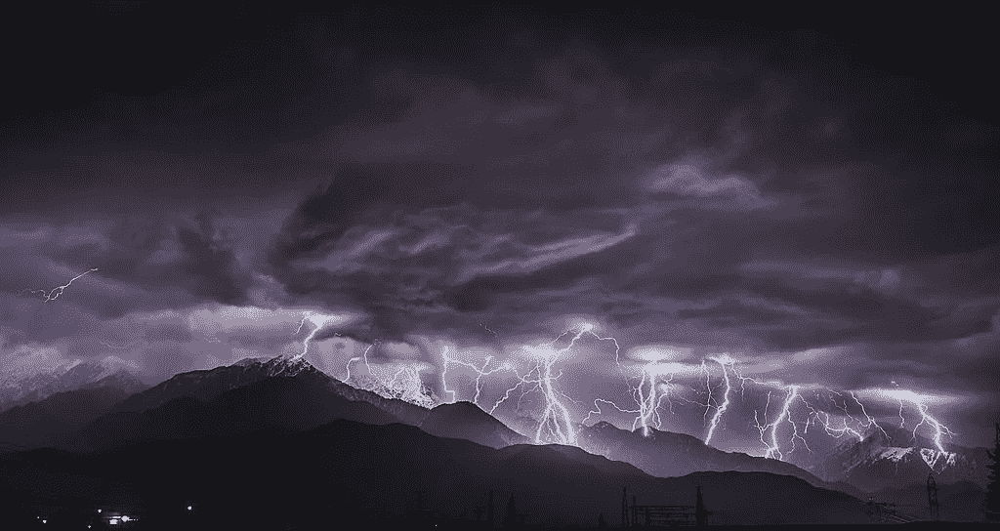

# 乘风破浪

> 原文：<https://medium.com/hackernoon/ride-the-lightning-d02db0d019b1>

你看过 [Coinfinity](https://medium.com/u/35232e2545fe?source=post_page-----d02db0d019b1--------------------------------) 闪电比特币 ATM 演示吗？它展示了两个奥地利人展示他们新的闪电比特币自动取款机。其中一个是如此奥地利，甚至他的衬衫都有虚拟吊带！不过，对于我们这些意识到其潜力的人来说，这台机器简直令人叹为观止。其中一个人扫描二维码，将一张 20 欧元的钞票放入机器，几微秒内，价值 20 欧元的比特币出现在他的手机上。不收费，即时。账单扫描比整个交易花费更多的时间。这就是*的庞大。这台机器可以瞬间将不值钱的纸币转换成数字黄金。就像你的厕所有一个原油龙头。*

像这样的技术改变了一切。下一个比特币将不是加密货币，而是第二层扩展解决方案。在不久的将来，所有的比特币交易都将是即时的、匿名的和几乎免费的。不相信我？在闪电网络上阅读。除此之外，还有分散的交换和跨链的原子交换。如果你意识到潜在的危险，请注意严重的爆炸。我们中确实看到这只是开始的人。人类从所谓领袖的魔掌中真正解放出来。这不再是关于政治，这是关于醒来，吞下红色药丸，解锁下一个级别。只是时间问题。

另一方面，时间是我们所有资源中最稀缺的。没有人知道他们在这个世界上还剩下多少，也没有人知道密码革命需要多长时间。然而我们所知道的是，比特币是稀缺的，随着时间的推移，它的稀缺程度只会增加。这就是它如此珍贵的原因。只要有足够的时间，你的比特币值多少美元或欧元都无关紧要。用比特币来命名它们吧！一个比特币就是一个比特币。x 年后，它将成为世界净值的重要组成部分。唯一的问题是 x 的大小，我们不知道是一百年，二十年还是两个月。当它发生时(是的，那是当时的*，而不是当*时的*)，你最好拥有一些。*

像 BTM 演示这样的事情让我们意识到，对比特币来说，几年后可能会比几百年后更安全地成为主流。在熊市中，它们给了我们希望，并提醒我们隧道尽头的光可能不是火车。引用暴力反抗机器的话:“还有比这里更好的地方吗？还有比现在更好的时机吗？”

视频链接:[https://youtu.be/jBHYWtd-b9g](https://youtu.be/jBHYWtd-b9g)