# 骑着打印机 Pwnie

> 原文：<https://medium.com/hackernoon/riding-the-printer-pwnie-fa9f4ce822ed>

## 在互联网上轻松发现黑客打印机

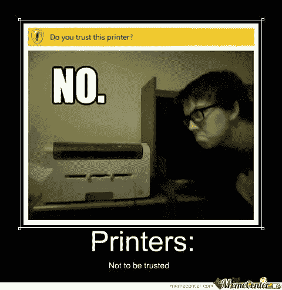

Printers, a perfect attack pivot on your network

**快乐的黑客在互联网上与大开打印机同乐**

目前，我正在完成一本关于如何最大限度发挥 Censys.io 潜力的书。Censys 是一个搜索引擎，有点像谷歌，但不是真的。它更像 Shodan，它可以索引互联网上的设备和网络。密歇根大学的一个项目，它是为计算机科学家设计的，不管那意味着什么。Censys 将横幅抓取，尝试命名系统或网站上运行的服务和端口。Censys Python 库用于与 API 进行交互。

Censys 将返回:
IP 地址的摘要页面
谷歌地图
端口打开
证书信息
检查心脏出血漏洞
横幅抓取
执行 StartTLS 启动
zenmap 每周扫描“FTP、SSH、Telnet、SMTP、DNS、HTTP、Siemens、S7、POP3、IMAP、HTTPS、SMTP、MODBUS、IMPAS、POP3S、UPnP

在研究这本书时，这些可爱的打印机宝石开始出现在搜索结果中。Censys.io 非常深入，还可以将标签应用到它找到的设备或系统上。这种巧妙的方法可以发现启用了默认 web 服务且从未配置密码的 Brother 或 Dell 品牌的 Brother 打印机。没有密码的默认不安全设置。互联网总能传递信息。世界上最有价值的商品，打印机墨水，正处于危险之中。

值得注意的是，利用 Censys.io 并不是发现这些美景的唯一方法。使用带有 Censys、Shodan、Google、Startpage、DuckDuckGo 和其他搜索引擎扫描或索引的 Dorking，可以很容易地发现易受攻击的系统。一旦找到打印机，攻击者就可以通过互联网或网络更改密码，从而授予攻击者完全控制权。通过利用内置的兄弟管理工具，打印机可以进一步被用作攻击暴露网络的支点。哥哥好心地内置了一些优秀的诊断工具。

这些易受攻击的系统主要是通过 Censys 基于网络的界面发现的。但是，使用 Censys Python 库和 API 连接或者我的一个自定义 PowerShell 工具连接到 ZMap 组件。此外，诸如 Recon NG、Metasploit with Censys 和 Nmap 脚本之类的工具可以连接到 Censys.io API 键，以连接更多其他 pen 测试工具。大多数打印机在端口 80，HTTP 上托管网页，但有些在端口 443，HTTPS。我在搜索和扫描时使用了这两个端口。

**Censys 多金鸡**

如果从未设置密码，几种不同的模型在 HTML 主体中都有警告。使用 Censys 只查看 HTML 正文，而不是像 Google Dorking 那样查看 HTML 标题。

**80.http.get.body**

**% 22 请% 26% 2332% 3b 配置% 26% 2332% 3b 密码%22**

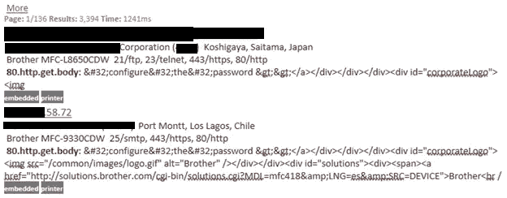

使用带有另一个 Censys 字段的报告函数 **80.http.get.title** 。打印机的型号在主机报告中返回。

**80.http.get.title.raw**

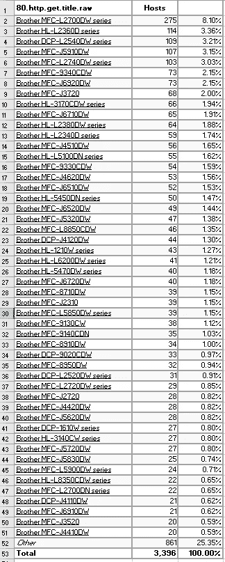

Over three thousand printers with model :)

**通过管理工具连接和控制打印机**

哥哥有一个神奇的小管理应用，2017 年更新。它可以发现你提供的列表上的任何兄弟打印机。一旦该工具找到兼容的兄弟打印机，不需要密码或登录即可连接。首先是本地测试打印机。另外两个是通过 Censys 发现的。输入 IP 地址、范围、它扫描的内容，以及它找到的任何连接内容。如果他们是邪恶的，他们可以做的事情。这个工具提供了一个极好的访问级别，使它成为一个双重用途的软件。允许它被用来行善或作恶😈

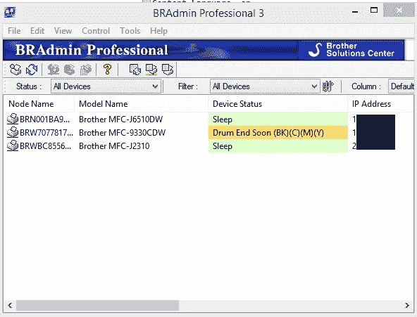

Even tells you the status, sweet

兼容的兄弟工具型号

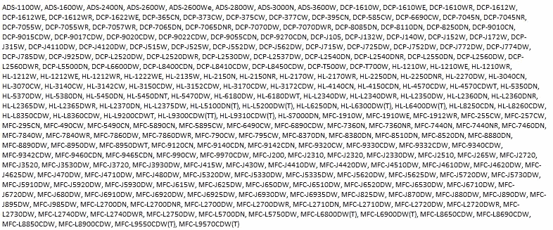

Loads of ‘em

**向任何兄弟打印机发送远程 PRN 文件，无需认证**

PRN 文件是一个[打印机驱动文件](https://www.computerworld.com/article/2545878/malware-vulnerabilities/hp-printer-drivers-hit-with-funlove-virus.html)。2000 年& 2006 年，当惠普网站上的打印机驱动文件被[感染](https://www.computerworld.com/article/2545878/malware-vulnerabilities/hp-printer-drivers-hit-with-funlove-virus.html)时，他们脸上挂着鸡蛋。病毒安装的时间:

尝试重新启动电脑。在 Windows NT 机器上，它试图更改系统设置

虽然和以前的攻击类型不同。你可以对司机做很多淘气的事情。Windows 64 系统需要签名的驱动程序。但是，有一些方法可以避免这种情况。我爱 PowerShell，出于进攻目的。有一些 PowerShell 脚本可以帮助绕过这一要求。

没有登录，只是附上管理工具，然后你可以发送一个 PRN 格式的文件。这应该适用于任何兼容的打印机。在我的打印机上测试一个文件后，它出了故障，然后关机。它花费了无数次的电源周期和打印机的完全复位来恢复它。在我的搭档到家之前，我正焦急地修理它。我不能再黑房子里的硬件了，甚至连 Roomba 也不行:-(

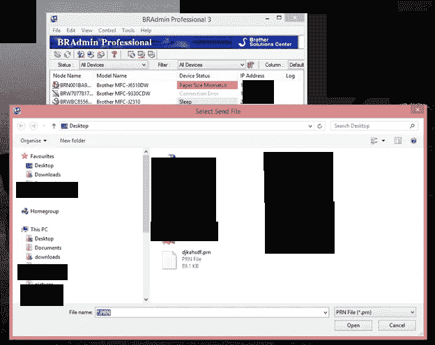

You can make your own PRN file

**ZAP 路径横向**

一旦你有了 IP 地址，你就可以测试打印机了。您可以使用 OWASP 的 ZAP 工具并扫描打印机的 web 服务。基本扫描发现了一个登录 URL 路径横向漏洞。ZAP 能找到这么多，一个帖子能找到的太多了。还可以制作一个呆子，用来检测互联网上的打印机。使用参数在 URL 中查找“/general/status.html”，然后使用附加参数进行优化。

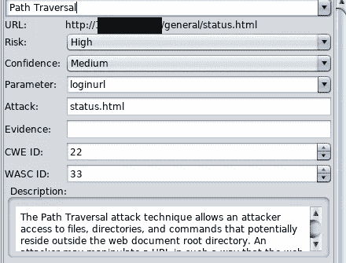

Parameter = loginurl happy hacker joy joy

**XSS 和未确认的现场乐趣**

打印机网络界面似乎没有经过那么好的安全测试。我的打印机不是最新的耗油大户。然而，考虑到其他可利用的和易受攻击的组件；值得怀疑的是，打印机网络接口是否出于安全目的进行了测试。

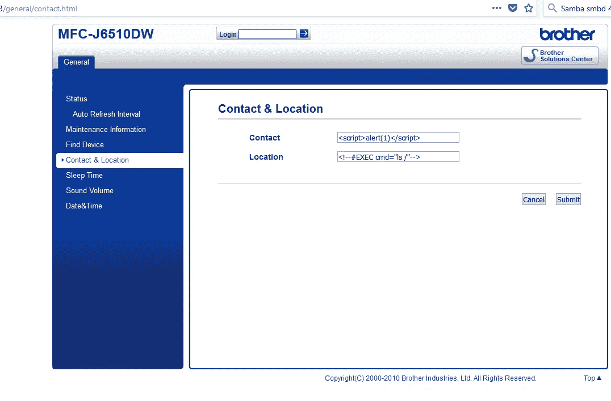

Input

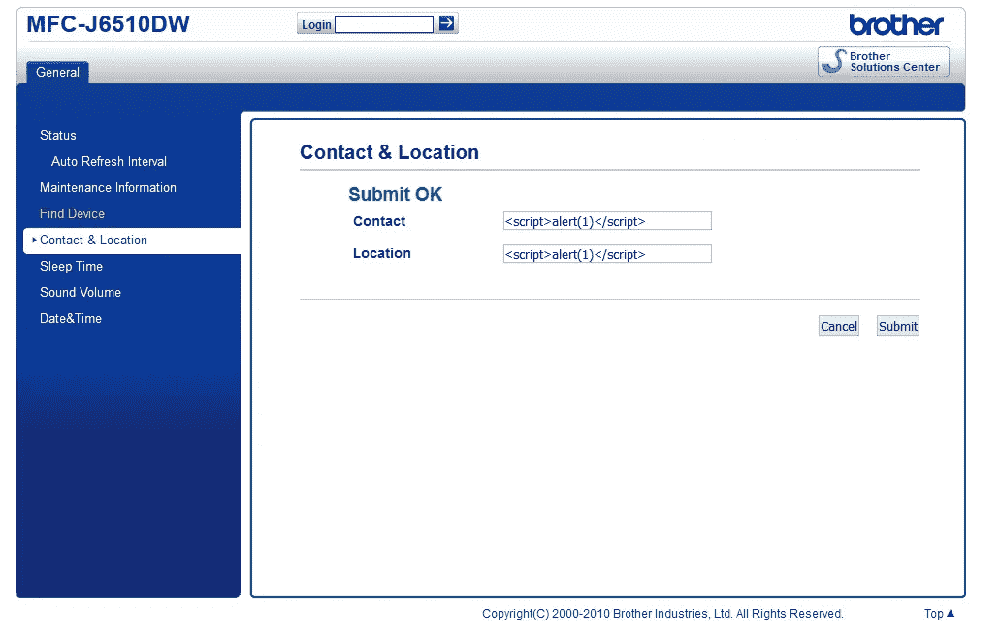

Accepts field submission

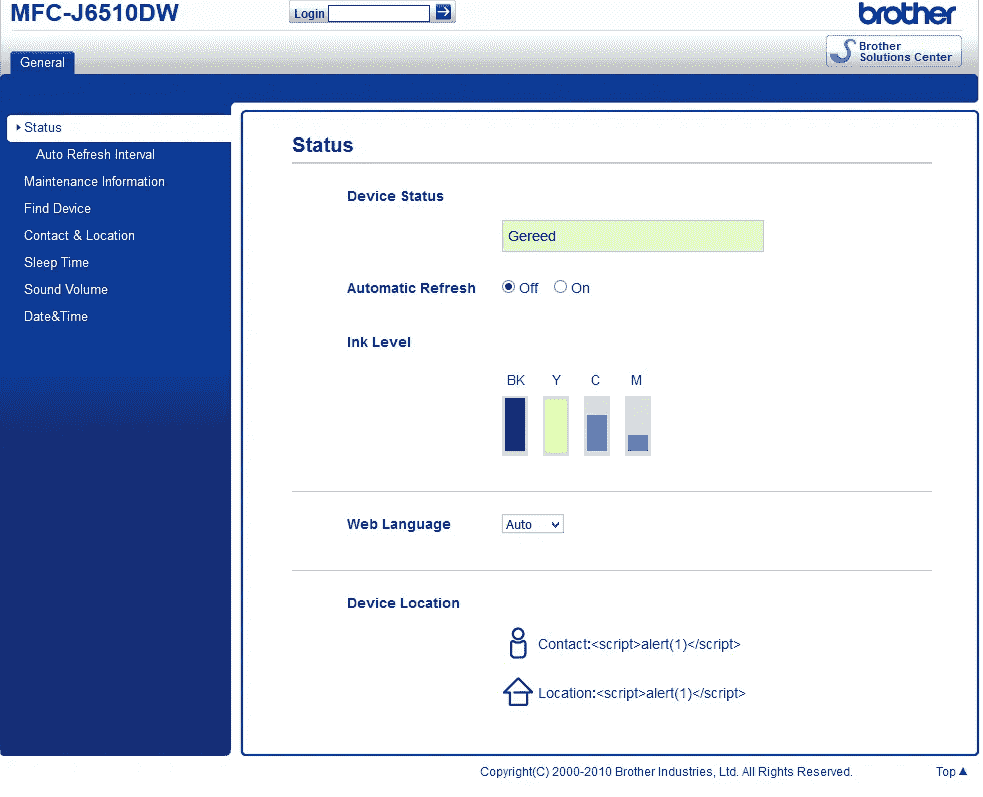

You can call me Mr.  ;-)

**远程文件包含**

几个网页上的 Brother 表单中的登录字段没有充分清理或过滤危险的用户输入。通过修改字段、外部网页和文件；此外，还可以执行其他恶意活动。此漏洞还会绕过任何登录权限。

修改表单元素后重新播放，因为它接受 URL。我可能会让它打开不良文件和其他东西。我用 ZAP 和 Fiddler 4 作为代理来测试和证明。用户代理字符串无关紧要。

易受攻击的请求(1.2.3.4 假冒 IP)

【http://1.2.3.4/general/status.html 邮报】T2 HTTP/1.1

主持人:12.3.4

用户代理:Mozilla/5.0(Windows NT 6.3；Win64x64rv:57.0)壁虎/20100101 火狐/57.0

接受:text/html，application/xhtml+xml，application/XML；q=0.9，*/*；q=0.8

接受-语言:en-US，en；q=0.5

接受编码:gzip，deflate

推荐人:http://1.2.3.4/general/contact.html

内容类型:**应用程序/x-www-form-urlencoded**

内容长度:45

DNT: 1

连接:保持活动

升级-不安全-请求:1

**Ncb = ZAP**&**loginurl = https % 3A % 2F % 2fwww . Reddit . com**

HTTP/1.1 200 没问题

你收到的是 Reddit 或 Google 或任何你想通过打印机网络接口部分打开的东西。

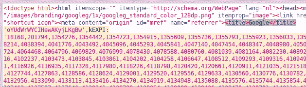

Yummy

**结论**

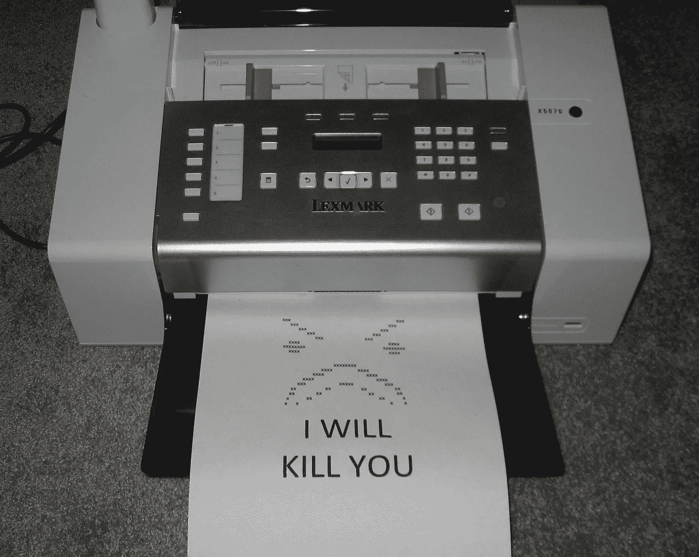

Hope one of these isn't exposing something important, like a hospital network…..

利用打印机作为攻击工具不是理论上的，而是一个有趣且潜在的诱人目标。打印机连接到您的网络，它们有关于您的网络的信息，有时内置的管理工具可以双重使用，并可用作更深入网络的秘密攻击点。打印机和多功能扫描仪通常在安全测试、修补、风险评估或安全策略中被忽略。没有打印机防病毒或下一代打印机入侵保护系统，并且出于安全目的通常只有有限的可用日志。Censys.io 编写了标记检测到的打印机设备的功能是有原因的。

回到 2017 年，我开始尝试向哥哥报告这些问题，但无济于事。可悲的是，哥哥没有回应，也没有臭虫赏金计划。提供给 CERT 作为漏洞报告。打印机并不超级性感，但它们可以为具有想象力的攻击者提供一个可爱的支点。攻击者只需要幸运一次。每次都要运气好。不要让它变得容易，用密码保护你的打印机，限制暴露给外界。拜托，看在上帝的份上，不要相信那个诡计多端的塑料墨水杀手。

留个鼓掌(或者 **50+** )和 a 请随意评论。