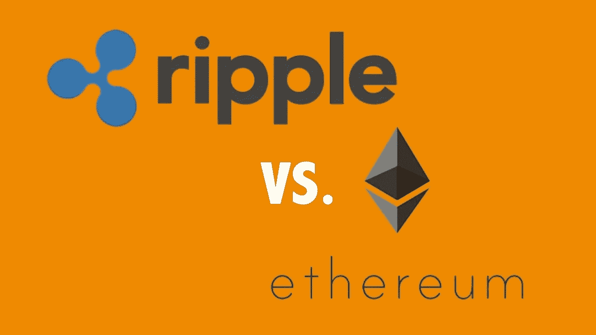
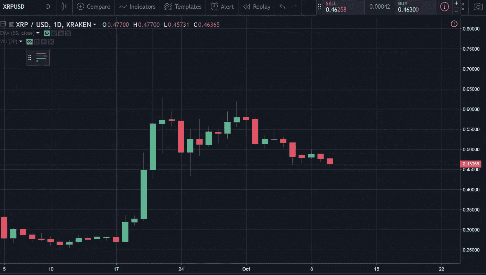
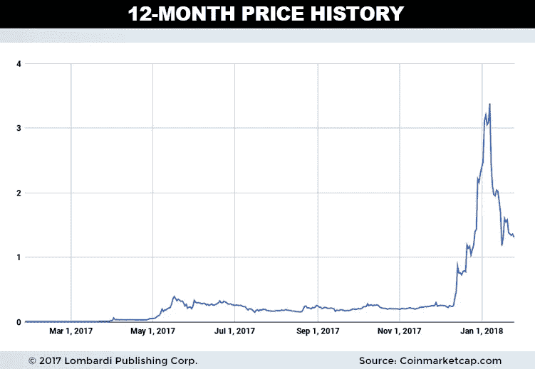
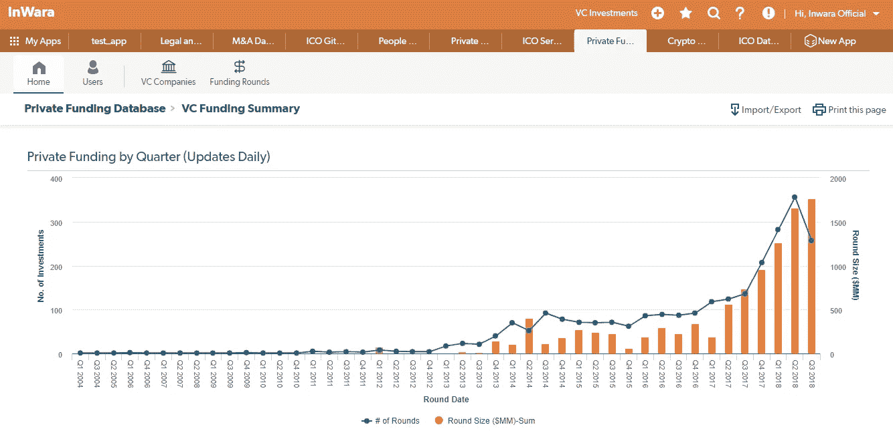

# Ripple vs Ethereum (XRP vs ETH:一场持久的竞争)

> 原文：<https://medium.com/hackernoon/ripple-vs-ethereum-14ee47d2f0f9>

Ripple(XRP)在 2018 年 9 月下半月的市值上三次超越以太坊(ETH)。虽然这只是一个短暂的时间，以太坊失去了第二大加密货币的地位。最终，以太坊卷土重来，重新占据了它的位置。

## 我们来分析一下 XRP 超越 ETH 的前因后果

## 原因:

以太坊是一个基于区块链的开源公共平台，用于 dApps，Ripple 是一个实时支付结算系统、货币兑换和汇款网络，旨在简化跨境支付。

可能成为 Ripple 超越以太坊的催化剂的主要原因是新闻报道 Ripple 将于 9 月 17 日推出 **xRapid，**Ripple 最期待和最优质的产品。

这个项目已经处于验证阶段有一段时间了，因为它正在由全球近 19 个金融机构进行测试。最终，发布消息确实对市场产生了影响。

其次，围绕“Swell 2018”会议的炒作，比尔·克林顿(Bill Clinton)将发表主题演讲，邀请来自金融领域的全球知名人士讨论 Ripple 的未来前景和增长，这在一定程度上改变了 Ripple 的优势。

虽然即使滑落到第三的位置也不会对以太坊造成太大影响，但对于 Ripple 来说，这是一个突出的里程碑。

尽管 Ripple 没有做任何加密货币应该做的事情，但价格仍在稳步攀升。

本质上，这是因为，XRP 让很多人赚了很多钱。如果有人在 2017 年初投资 10000 美元，并持有约一年，这 10000 美元将使他们获得超过 350 万美元的回报，达到 350%以上！

甚至有人猜测 XRP 可能很快会在比特币基地上市，但这只是猜测！

这种类型的增益只能在加密世界中看到。没有任何其他行业，无论是房地产、股票还是其他任何行业，能够像加密市场一样带来如此大的回报。

虽然市场确实放缓了，但机构投资者和风险资本家选择投资加密货币，而不是其他替代资产。

Source: InWara’s database

## 波纹接管第二位置的影响

大型国际银行从 SWIFT 迁移到 Ripple 的前景将会增加，因为 Ripple 的突出特点之一是其提供的交易速度。到目前为止，XRP 被认为是跨境交易中交易速度最快的国家。

## 总而言之…

虽然 XRP 和以太坊都基于区块链技术，并拥有完全不同的目标受众，但当谈到根据他们的 TPS 整理它们时，Ripple 的性能更好，因为它不仅更快，而且更便宜，并且可以比以太坊更有效地扩展。

然而，看到以太坊的君士坦丁堡升级的结果会很有趣，它正在将 Dapps 的去中心化带到一个全新的水平。

谁知道呢，也许将来它的表现会比 Ripple 更好，但只有时间会证明一切！

免责声明:这不是财务建议。 [*InWara*](http://www.inwara.com/?utm_source=hackernoon&utm_medium=hackernoon&utm_campaign=rippleeth) *不提升/降级任何公司/ICO。本信息或其他媒体中的观点、陈述、估计和预测仅属于作者个人。它们不一定反映*[*in wara*](http://www.inwara.com/?utm_source=hackernoon&utm_medium=hackernoon&utm_campaign=rippleeth)*或其任何关联公司(* [*)的意见。Inwara 没有义务更新、修改或修正此消息或其他媒体，或以其他方式通知其接收者，如果此处陈述的任何事项或此处陈述的任何意见、预测、预测或估计发生变化或随后变得不准确。本邮件或其他媒体中提供的任何内容、信息和材料均按“原样”提供。Inwara 对其准确性、完整性或及时性，或收件人获得的结果不做任何明示或暗示的保证，并且不对任何收件人在此的任何不准确、错误或遗漏承担任何责任。在不限制上述规定的情况下，Inwara 对任何消息或媒体的接收方不承担任何责任，无论是在合同、侵权行为(包括疏忽)、担保、法规或其他方面，对于此类接收方因其或任何第三方决定的任何行动、意见、建议、预测、判决或任何其他结论或任何行动过程而遭受的任何损失或损害，无论是否基于此处包含的内容、信息或材料。***](http://www.inwara.com/?utm_source=hackernoon&utm_medium=hackernoon&utm_campaign=rippleeth)