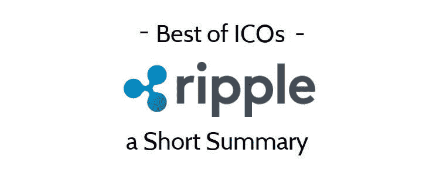
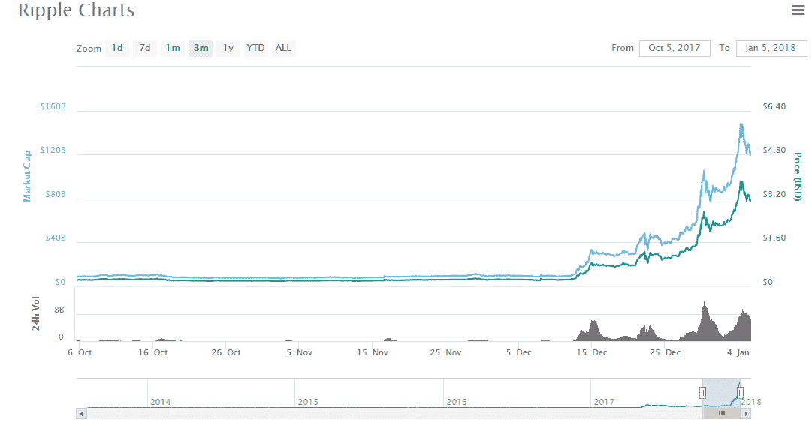

# ripple(XRP)——简短摘要

> 原文：<https://medium.com/hackernoon/ripple-xrp-a-short-summary-12a2427cb99f>

Before reading this review, please read our disclaimer at the bottom of the article or [here.](https://thebestoficos.com/disclaimer.html)

## 备受争议的支付网络令牌

**注**:这是对 Ripple 的一个简短总结。我们的完整评论，长约 20 分钟，将于 2018 年 1 月 12 日发表，题为“涟漪币评论”，在这里找到。本总结的目的是介绍 token、traction、批评以及如何购买它。

Ripple (XRP)刚刚以惊人的 1220 亿美元市值成为第二大加密货币。Ripple 的联合创始人克里斯·拉森(Chris Larsen)成为全球第八大富豪，他拥有相当于 550 亿美元的资产(截至美国东部时间 2018 年 1 月 4 日 16:00)。这个令牌分裂了加密社区，并面临**许多**的批评。

# 想法

Ripple 的目标是为当前困扰全球金融生态系统的许多跨境银行问题提供解决方案。任何通过银行系统进行电汇的人都知道，跨货币结算可能需要很多天，而且通常非常慢。

Ripple 声称，这些结算问题是由人工结算引起的，人工结算是为了将一家银行的分类账系统的交易转换到另一家银行的分类账系统。然而，Ripple 引入了一种叫做 interledger protocol 的东西，它使用一种新的加密货币(ripple [ XRP])来结算两家银行不同分类账的账户，从而加快了结算时间。

Last 3 months of Ripple’s Market cap and Price in USD via CoinMarketCap found [here](https://coinmarketcap.com/currencies/ripple/).

# 牵引力

尽管代币自 2014 年就已上市，但过去 5 周的价格涨幅超过 1500%。今年的涨幅惊人，超过 30，000%，从年初的每枚 0.007 美元，到年底超过 2 美元。市值从 2 亿美元增加到 1.3 亿美元。有超过 380 亿枚代币，创始人保留了其中的大部分，因此与货币完全流通相比，目前的估值和市值已经缩水。

代币最近变得如此受欢迎的部分原因是社交媒体。随着 ico 越来越受欢迎，人们越来越多地投资，廉价 altcoins 的价格吸引了很多人投资它。尽管大量的波纹代币是代币如此“便宜”的主要原因之一，但当不考虑总代币量时，价格都是相对的。另一个方面是 ripple 最近增加了主要的银行合作伙伴，这引起了人们对它的极大兴趣。

# 组

Ripple 的团队拥有大量资产，并与加密货币和金融科技都有联系，这是迄今为止它们的估值和快速上涨的原因之一。Ripple 由天使投资人克里斯·拉森和软件程序员杰德·麦卡勒共同创立。

克里斯·拉森(Chris Larsen)是硅谷的风险投资家，他帮助共同创立了 Ripple，以及多个金融科技相关的公司，如 E-Loan、OpenCoin 和 Prosper Marketplace。

杰德·麦卡勒(Jed McCaleb)因创建了 BTC 有史以来最大的比特币交易所而闻名，该交易所现已解散 [Mt Gox](https://en.wikipedia.org/wiki/Mt._Gox) (在麦卡勒将该公司出售给马克·卡佩斯(Mark Karpeles)后遭到黑客攻击)。杰德现在身价 200 亿美元，是世界上最富有的 40 个人之一。

除了联合创始人之外，Ripple 的团队还有一个庞大的加密老手团队，以及与六家国际银行的合作伙伴。

# 如何购买

可以通过法定货币(美元)或其他加密货币在各种交易所购买 Ripple。支持 ripple 的最大交易所是北美的 [Bitstamp](https://www.bitstamp.net/) 和[北海巨妖](https://www.kraken.com/)。Gatehub 也是收购 ripple 的一种方式，基本上允许你接入 ripple 的全球共识网络，以便将菲亚特换成 ripple。一些最受尊敬的交易所，如比特币基地，目前没有购买或出售 ripple 的计划，因为对其价格、波动性和团队实践仍有许多担忧。这里有一篇由[美国消费者新闻与商业频道写的关于如何购买代币](https://www.cnbc.com/2018/01/02/how-to-buy-ripple.html)的文章。

**注:**完成购买 Ripple 的详细步骤，可在全面审查时获得。

# 结论

Ripple 的未来非常有希望，但伴随着许多复杂性，因为它涉及到简化当前的银行业。在我们的全面回顾中，我们揭露了许多关于技术实现和使用的**问题(特别是 ripple 令牌的引入，与 ripple 创始人使用相同协议的另一个令牌完全分离)，以及 Ripple 团队做出的某些决定，我们认为这些决定的解释并不令人满意。**

然而，ripple 团队的决策是经过深思熟虑的，如果**他们成功地全面实施他们的平台并加入全球金融体系，他们肯定会为国际银行业的巨大飞跃做出贡献，使其像今天的国内银行业一样简单。**

我们将在 2018 年 1 月 12 日的全面审查中详细阐述这种加密货币的好、坏、丑。

想帮忙吗？
**在 Bountey 上支持我们！**[【https://www.bountey.com/bestoficos】](https://www.bountey.com/bestoficos)

*想在 ICOs 中保持最新？* ***访问我们在***[***https://thebestoficos.com***](http://thebestoficos.com/)

*有一个有趣的故事？* ***写我们在 info@bestoficos.com 的***

# 放弃

本网站及其包含的信息无意成为投资、金融、技术、税务或法律建议的来源。本网站不能代替专业建议和独立的事实验证。在没有首先评估你自己的个人财务状况，也没有咨询财务专家的情况下，千万不要使用这个网站上的想法和策略。本网站的所有内容仅供参考，按“原样”提供，不保证完整性、准确性、及时性或使用本网站所获得的结果。这只是一个存根，您对本网站的访问和使用取决于您是否接受并遵守[全部免责声明。免责声明适用于所有希望访问或使用本网站的访问者、用户和其他人。](https://thebestoficos.com/disclaimer.html)