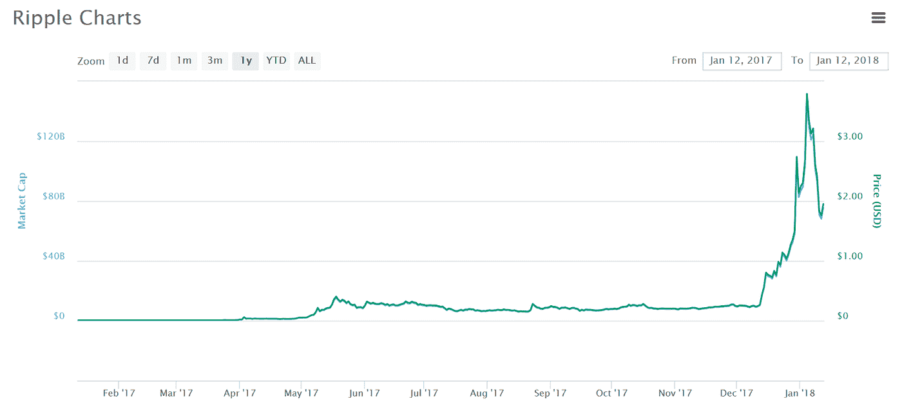

# 涟漪(XRP)硬币评论

> 原文：<https://medium.com/hackernoon/ripple-xrp-coin-review-6b13b7b19c13>

Image Caption: Before reading this review, please read our disclaimer at the bottom of the article or [here.](https://thebestoficos.com/disclaimer.html) Also, we wrote a 5 minute summary on Ripple you can find [here](https://hackernoon.com/ripple-xrp-a-short-summary-12a2427cb99f).

## 支付网络令牌

Ripple 刚刚以惊人的 1220 亿美元的市值成为第二大加密货币。Ripple 的联合创始人克里斯·拉森(Chris Larsen)成为全球第八大富豪，他拥有相当于 550 亿美元的资产(截至美国东部时间 2018 年 1 月 4 日 16:00)。

这是怎么发生的？为什么是现在？涟漪是什么？本文将回答这些问题，并揭示加密货币的积极和消极方面，以及使这种令牌在几个小时内从第九位跃升至第二位的历史原因。尽管这看起来像是一夜成名，但这是一个酝酿了 14 年的故事。

***注*** *:在撰写和编辑本文的几个小时内，这种货币的价格上涨了 10 倍。哇哦。如果你想阅读我们更短的，5 分钟的涟漪摘要，* [*点击这里*](/@BestofICOs/ripple-xrp-a-short-summary-12a2427cb99f) *。*

# 介绍

Ripple 作为代币从 2012 年开始流通。在此期间，ICO 基本上是不存在的，所以这将是我们第一次对一家没有 ICO，但其战略涉及多个合作伙伴、客户和令牌移动的公司进行评估。

Ripple 正试图通过其平台改革支付系统。他们将当前的银行体系描述为“缓慢、透明度有限且昂贵”。因此声称它也不适合作为全球支付系统。他们的想法是降低这些准入门槛，使全球支付成为真正的全球性活动。因此 RippleNet 诞生了。

空谈是廉价的，但 Ripple 已经能够通过与硅谷一些最成功的投资者以及多个国际银行机构、监管机构和技术领导者(如谷歌和麻省理工学院)合作来兑现他们的承诺。

# RippleNet

RippleNet 是 Ripple 全球支付系统的名称。它创建了一个全球银行网络，人们可以通过 Ripple 技术发送和接收支付。他们声称该系统具有实时信息传递、清算和交易的“总结算确定性”。

**总结算**是指两家银行之间的资金或证券转移。总额具体指的是使这些交易逐个发生而不是批量发送的能力，例如，如果银行在每天结束时发送一天的所有交易。

它的工作方式是通过在银行之间建立伙伴关系来访问 RippleNet 网络。一旦参与银行成为网络的一部分，世界各地的用户就可以通过他们自己的本地 RippleNet 支持的银行与该银行进行交互。用户是指希望参与银行活动的公司、个人和其他组织。

仅 RippleNet 的顾问团队就包括 6 家不同银行的成员(还在增加)。

Image under caption: RippleNet Banking advisory members, from Page 14 of [RippleNet Brochure (PDF)](https://ripple.com/files/ripplenet_brochure.pdf)

此外，RippleNet 还有一系列产品:

1.  xCurrent:付款处理
2.  xRapid:流动性来源
3.  xVia:支付发起

# x 当前

支持银行间的支付处理。他们的 RippleNet 论文将其描述为:

> “一种标准化技术，能够以更快的速度、更高的透明度和更高的效率在银行间传递信息和结算交易。”— RippleNet 手册，第 9 页

# xRapid

银行需要持有外币，以实现快速交易(无需经常配对交易)，也称为“往来账户”。xRapid 是一个资金池，银行可以使用它来轻松转移资金。

> “访问数字资产的按需流动性池，无需持有目的地货币的往来账户。”— RippleNet 手册，第 11 页

# xVia

最后，xVia 是一个全球支付交易系统

> “一个 web 服务层，使企业能够安全地发起带有丰富数据附件的实时支付。”— RippleNet 手册，第 13 页

# 银行客户

这是 Ripple 最强的价值主张之一。任何人都可以提出一个想法，但执行是真正的困难。作为双边市场业务，Ripple 既需要供给(银行)，也需要需求(用户、企业)。为了成功，他们需要首先获得供应方，这正是他们所做的。

Ripple 的客户名单还在继续增长，目前的名单相当可观，这也是 Ripple 价格一直居高不下的主要原因之一。

Image Caption: Ripple Customer Sample from Page 15 of RippleNet Brochure

# 历史

Price of Ripple from January 2014 to January 4th, 2018\. Price from CoinMarketCap.com found [here](https://coinmarketcap.com/currencies/ripple/).

## Ripplepay

14 年前，也就是 2004 年的，在比特币诞生之前，Ripplepay 是 Ryan Fugger 创造的一项服务，允许信任的参与者之间交换信用。基本上，如果有人欠你 10 美元，他们可以创建一张价值 10 美元的借条，如果其他人信任这个人，你就可以用这个借条作为第三方的 10 美元借条。这也是当前银行的运作方式，也是当前金融体系的基石之一。这是一个相对简单的概念，即使是现钞本质上也是由同一个实体，即银行/政府发行的借据。

这与比特币非常不同，比特币是一种无信任的现金系统，在这种系统中，你不需要交易双方之间的信任，但你需要某种形式的验证，以确保交易的资产(在这种情况下是比特币)不会被重复花费。如果你可以双倍花费同样的比特币，这本质上就像伪造钞票，显然这是一个问题。

然而，在上面 ripple 描述的支付系统中，你确实需要信任。如果我欠鲍勃钱，第三方，爱丽丝不需要相信鲍勃相信我的债务是有效的，她只需要相信我。你不能向不信任你的人发债。所以，你需要设定一个信任额度，或者信用额度，来定义你在多大程度上信任哪个参与者。信任线可以在网络中“荡漾”,允许与你可能不认识的参与者进行借据交易，但你可以与他们分享信任的中介。如果鲍勃和爱丽丝都信任我，鲍勃可以用我给鲍勃的借据来支付爱丽丝。

## 区块链上的涟漪

在向世界推出比特币之后，ripple 开始开发一个基于区块链的支付网络，类似于他们现有的产品，然而，Ripple 没有使用比特币的工作证明，而是使用一种叫做全球共识的东西来验证信任，他们在白皮书中解释说，这可以加快交易时间，降低交易费用。

这种全球共识的实现是全新的，尽管它所解决的问题在计算机科学文献中早已确立。通过共识验证信任是一个被称为“拜占庭一般问题”的问题，有几个协议产生了该问题的解决方案，其中之一是 ripple 的新全球共识协议。另一家公司 Stellar 实施了一个非常相似的协议，并在 2014 年因一个严重的错误导致交易永远无法确认而受到批评，但 Ripple 强烈否认他们的协议是罪魁祸首，并且这是一个不正确的实施。然而，主要的密码学家目前并不同意该协议是否可靠。

# 这个想法

正如历史部分所解释的，Ripple 最初是 Ripplepay，一个简单的债务交换平台，不涉及任何交易对手风险，但需要网络参与者之间的信任。因此，如果 Bob 信任 Alice，Alice 信任 Charlie，那么 Bob 和 Alice 之间的信任线可以“波及”到 Charlie，从而允许 Bob 的债务/信用传递给 Charlie，反之亦然。

虽然不存在重复负债支出的问题(同一个人可以向两个不同的人发行相同的债务，他们只是欠两个不同的人钱。)然而，一旦 Ripple 开始致力于基于区块链的验证网络。现在，拥有一个没有任何交易对手风险的支付网络的简单问题变成了拥有一个系统的问题，该系统不仅需要网络之间的信任，还需要一种方法来确保不会发生重复消费(即 XRP 不能被伪造)。然而，这两个部分如何组合在一起是相当复杂的，所以我们将把它分解成以下几个独立的部分。

# 令牌

Ripple 声称，这些结算问题是由人工结算引起的，人工结算是为了将一家银行的分类账系统的交易转换到另一家银行的分类账系统。然而，Ripple 引入了一种叫做 interledger protocol 的东西，它使用一种新的加密货币(ripple [ XRP])来结算两家银行不同分类账的账户，从而加快了结算时间。

# Ripple 的白皮书

Ripple 提交了多份文件和白皮书。有些侧重于业务发展方面，如 Ripple 解决方案指南( [PDF](https://ripple.com/files/ripple_solutions_guide.pdf) )和 RippleNet 手册( [PDF](https://ripple.com/files/ripplenet_brochure.pdf) )。但该公司也提交了技术白皮书，深入研究了他们的技术、共识算法( [PDF](https://ripple.com/files/ripple_consensus_whitepaper.pdf) )和 Interledger 协议( [PDF](https://interledger.org/interledger.pdf) )。

## 一致性算法

Ripple 不使用比特币的工作证明，而是使用共识协议来验证交易，这一新的共识协议是 Ripple 在其共识算法白皮书中声明的。共识算法是新的，最初提出时未经验证，但自那以后，Ripple 已经对交易进行了多次验证。这一点，加上他们与许多银行合作的事实，表明共识算法在交易验证方面效果很好。这些验证确保了没有 XRP 的双重花费，然而为什么它需要成为货币才是真正的问题。

## 内部分类协议

interledger 协议在 ripple 的白皮书中有详细说明，它基本上是 Ripple 网络允许跨货币汇款的方式。为了理解 interledger 协议，我们需要解释银行目前是如何发出国际汇款的。他们使用不同的数据库作为分类账，以确保信贷和债务资产以当地本币记账。Ripple 通过使用 XRP 作为中间货币来结算每个单独的分类账，从而结算多个分类账之间的交易。

# 验证器

为了分配 Ripple 公司在网络上施加的控制量，更重要的是，为了使网络能够运行，即使 Ripple 作为一个公司失败了，一系列验证器也已经就位。

验证者(唯一节点列表)是可以在 Ripple 网络上验证交易的组织和/或个人，因此他们充当半集中式代理。验证器还通过同意事务的顺序来确保事务不会被“重复花费”。

Ripple 协议的当前验证器包括:

*   麻省理工学院
*   微软
*   加拿大全球信息
*   还有[更多](https://xrpcharts.ripple.com/#/validators)

不幸的是，这个列表并不全面，还有一系列的节点和地址是不公开的。因此，可能存在分散化的风险，因为我们不知道 Ripple 投资者、员工或董事会是否是精英验证者的一部分。

# 令牌分发

这是 Ripple 协议最受批评的方面之一。Ripple 目前控制着超过 50%的股份，一旦所有的 XRP 都进入流通领域，ripple 公司将拥有 50%的股份。

# 区块链测试

区块链测试是指一家公司是否需要使用区块链才能成功的问题。这个测试是很多公司滥用 ICO 炒作的结果，只是为了在他们的名字后面加上“Token”这个词。“X 的令牌”模型。

原则上，Ripple 需要区块链作为对当前银行金融标准的改进。问题是 ripple 是否有必要创建自己的加密货币，以及用模糊的验证器以半集中的方式这样做是否是一个好主意。毫无疑问，他们可以使用比特币或任何其他已经存在的加密货币来履行这一角色，引入像 XRP 这样的本地货币会导致很多问题，即为什么额外的货币是必要的。

此外，hyperledger 是一个与 Ripple 提供的 interledger 协议非常相似的开源协议，它已经存在，所以 Ripple 为什么不采用它是一个合理的问题。Ripple 声称，由于缺乏原子图书交易，很难通过 hyperledger 协议进行国际汇款，但是 hyperledger 目前正在解决这个问题，因此这是一个值得注意的重要问题。

Ripple 还创建了解决方案，以便轻松地将他们的令牌转移给其他人。2013 年，OpenCoin 创建了“比特币桥”，本质上允许用户将任何货币的资金转移到比特币地址。实质上是让世界上的任何人都可以用比特币来购买商品，而不必首先拥有比特币。

桥梁是 Ripple 的区块链测试中最有趣的方面之一。这显示了该技术的巨大用途，也是几乎只有 Ripple 能够做到的事情，因为他们与银行的全球合作伙伴关系允许他们提供多种货币的流动性和网络来提供这些服务。

# 牵引力—性能

除了 Ripple 拥有的所有活动、产品、合作伙伴、投资者和客户之外，讨论代币在过去几年的表现也很重要，以展示代币自诞生以来的吸引力和人们给予代币的有效性。

# 2013–2016

在这段时间里，推动加密货币向前发展的主要引擎之一是比特币的兴起和崛起。在 2013 年 8 月至 12 月期间，比特币的价格从 80 美元左右上涨到 1000 美元以上。到 2014 年 3 月，泡沫破裂，比特币的价格持续下跌，直到 2015 年初跌至不到 200 美元。

对于许多人来说，Ripple 是“下一个比特币”,虽然比特币处于历史高点，但人们看到了 Ripple 成为下一个最佳选择的潜力。随着比特币价格暴跌，人们也对 Ripple 失去了希望，所以你可以看到 2013 年至 2015 年期间 Ripple 的价格模式非常相似。然而，在 2015 年比特币的历史低点期间，许多人认为 Ripple 将取代比特币成为首选的全球加密货币，因此价格与比特币成反比。

Ripple Price Graph from Coin Market’s Ripple found [here](https://coinmarketcap.com/currencies/ripple/).

Bitcoin Price Graph from Coin Market’s Bitcoin during the same period found [here](https://coinmarketcap.com/currencies/bitcoin/).

# 2017

到目前为止，这是加密货币最好的一年，可能也是你现在阅读这篇文章的原因。2017 年成为加密货币投资最重要的一年，因此人们开始关注市场上最大和最重要的加密货币。

Graph from Coin Market’s Ripple found [here](https://coinmarketcap.com/currencies/ripple/).

对于许多人来说，Ripple 将成为事实上的银行加密货币，因此一种自我实现的预言出现了。在 12 个月的时间里，Ripple 的价格从 0.006 美元(约合 0.6 美分)涨到了 3 美元以上。这大约增加了 50，000%。当然，随着价格不断上涨，人们不断说价格会继续上涨，所以更多的人投资于货币，循环往复。

代币最近变得如此受欢迎的部分原因是社交媒体。随着 ico 越来越受欢迎，人们越来越多地投资，廉价 altcoins 的价格吸引了很多人投资它。

Ripple 看起来如此“便宜”的原因之一是由于生产中存在大量的 Ripple 令牌。价格是相对的，不考虑代币的总数量。有 1000 亿个代币，所以价格波动比有 100 万个代币要小得多，相比之下，在 2100 万个可能的最大值中有 1600 万个比特币。

最近，批评阻止了价格继续上涨，这些批评包括网络的集中性质，团队给自己和合作伙伴的令牌数量，以及首先质疑 Ripple 需求的技术决策。

# 组

## 团队历史

在中本聪著名的原创比特币论文《比特币:一个点对点的电子现金系统》的 5 年前，就有了 Ripplepay (2004)。这个项目最初是由来自温哥华的软件开发人员 Ryan Fugge 创建的。

这个想法来自于在一家股票交易交易所的工作，开发始于 2004 年。一年后，Fugge 有了一个工作产品，使消费者能够在互联网上进行安全交易，这距离互联网繁荣仅过去了 5 年。

6 年后，软件开发商 Jed McCaleb、Arthur Britto 和 David Schwartz development 开始通过共识算法构建自己的数字货币系统。第二年，在 2012 年，新系统被纳入新公司 OpenCoin Inc .中。Fugge 开始帮助创建 Ripple 的信用网络部门。

随着 OpenCoin 继续发展壮大，该团队不断从金融、软件和风险资本市场中收购老手。这个团队现在拥有大量资产，并与加密货币和金融科技都有联系，这是迄今为止证明其估值和快速上涨合理的原因之一。Ripple 由天使投资人克里斯·拉森和软件程序员杰德·麦卡勒共同创立。Fugge 辞去了他在 Ripple 的开发者职位，目前在 ICO advisor 工作。他的网站提到，他不打算接受与健康状况有关的新项目(我们不会链接他的网站，因为我们确信他目前重视隐私)。

2013 年 9 月，OpenCoin Inc .更名为 Ripple Labs Inc .,这是目前 Ripple 的公司名称和主要持有人，克里斯·拉森担任首席执行官。

## 团队

据估计，世界上有 2000 名亿万富翁。Ripple 作为一家公司已经创造了至少 3。我们发现这是值得一提的重要一点，因为我们的批评部分谈到了加密货币在其创始人之间的分配，这可能会在公司内部创造复杂的激励机制。

Ripple 的首席执行官是布拉德·加林豪斯，他曾在美国在线、雅虎、SBC 担任高管，并担任 Hightail 和 Dalpad Communications 的首席执行官。布拉德目前拥有 Ripple 6.3%的股份，使他的净资产达到 95 亿美元。

克里斯·拉森(Chris Larsen)是硅谷的风险投资家，他帮助共同创立了 Ripple，以及多个金融科技相关的公司，如 E-Loan、OpenCoin 和 Prosper Marketplace。

杰德·麦卡勒(Jed McCaleb)因创建了 BTC 有史以来最大的比特币交易所而闻名，该交易所现已解散 [Mt Gox](https://en.wikipedia.org/wiki/Mt._Gox) (在麦卡勒将该公司出售给马克·卡佩斯(Mark Karpeles)后遭到黑客攻击)。杰德现在身价 200 亿美元，是世界上最富有的 40 个人之一。

## 投资者

Ripple 在硅谷和全球拥有一系列知名的技术投资者，包括

*   谷歌风投
*   安德森·霍洛维茨
*   CME Ventures
*   埃森哲
*   桑坦德

不用说，董事会也同样令人印象深刻，在金融和银行业有着极其良好的关系。

# 如何购买

作为最大的代币之一，Ripple 在众多的交易所中很容易获得。从[他们的网站](https://ripple.com/xrp/buy-xrp/)，交易涟漪的交易所有:

*   [Bitstamp](https://www.bitstamp.net/)(XRP/美元、欧元、BTC)
*   [北海巨妖](https://www.kraken.com)(XRP/美元、欧元、BETC)
*   [硬币](https://coinone.co.kr)(XRP/韩国，BTC)
*   [比特索](https://coinone.co.kr) (XRP/MXN，BTC)
*   [Coincheck](https://bitso.com) (XRP，日本，BTC)
*   科尔比特(XRP/朝鲜)
*   [埃及语](https://www.korbit.co.kr/?locale=en) (XRP/BTC)
*   [比特银行](https://bitbank.cc)(XRP/日元)
*   比特萨内(XRP/美元、欧元、BTC)
*   [BTC 市场](https://www.btcmarkets.net)(XRP/澳大利亚元，BTC)
*   [李克比特](https://www.litebit.eu/en)(XRP/欧元)
*   [比特币有限公司](https://bx.in.th)(XRP/泰铢)
*   [gate hub](https://gatehub.net)(XRP/美元、日元、CNY、欧元、BTC、瑞士法郎)
*   Bitcoin.co.id(XRP/BTC)

**注**:不同的交易所有不同的授权阶段，因此在某些交易所，获得 Ripple 或其他货币以最终获得 Ripple 可能会变得更加困难。

# 批评

## 商业决策批评

联合创始人决定奖励自己的 Ripple tokens 的数量被该公司严重混淆。两位创始人现在是亿万富翁，一位是世界上第十富有的人。这笔钱不是来自销售，而是来自人们对加密货币行为的预期。

为了缓解这种情况，创始人决定托管他们的大部分资金。这样，资金将被冻结，直到某些事件触发智能合约，向创始人支付报酬。**即便如此,**破解这些智能合约的动机可能会造成令人难以置信的贪婪局面。试想一下，如果你知道自己是世界上第八富有的人，你会怎么做，你会为了保护这项投资走多远？

2015 年 5 月，美国金融犯罪执法网络对 Ripple 罚款 70 万美元。

> “Ripple Labs 故意违反《银行保密法》( BSA)的多项要求，充当货币服务企业(MSB)并在未向 FinCEN 注册的情况下销售其虚拟货币 XRP，并且未能实施和维护旨在保护其产品不被洗钱者或恐怖主义融资者使用的充分的反洗钱(AML)计划。XRP 二世后来承担了 Ripple Labs 销售虚拟货币和充当 MSB 的职能；然而，与其母公司一样，XRP 二号协议故意违反银行保密法，未能实施有效的反洗钱计划，也未能报告与几笔金融交易相关的可疑活动。”— FinCEN 罚款涟漪，通过立即释放发现[此处](https://www.fincen.gov/news/news-releases/fincen-fines-ripple-labs-inc-first-civil-enforcement-action-against-virtual)。

## 技术批评

正如上文对 Ripple 工作原理的解释中提到的，XRP 只是充当跨境分类账之间的中间货币，为各个银行结算资产。最初，这是他们的共识协议的一个非常集中的版本，只有 Ripple 作为验证者，每笔交易都由他们验证。然而，为了分散货币的信任验证，他们已经开始慢慢地向网络中添加其他验证器，并开始拆除他们控制的验证器。然而，这并不意味着对货币的控制是分散的！由于 Ripple(该公司)控制了 XRP 的大部分供应，货币的使用权力非常集中在该公司，他们通过控制需求/供应市场来控制定价。

# 结论

无论发生什么，瑞波都会有一个令人生畏的故事。它要么在未来十年成为最大的金融资产之一，要么发生令人难以置信的内爆，数亿美元将被竞争对手、腐败、未解决的技术挑战、未使用的技术或所有这些因素的组合所损失。

我们不确定未来会怎样，但我们肯定会兴奋地关注这个领域发生的事情。我们希望这篇综述能给你足够的信息，让你开始自己的代币研究，并做出自己的决定。

这当然是最有趣的故事之一，以及一系列令人难以置信的合作伙伴、客户和团队成员。

想要帮忙吗？
在 Bountey 上支持我们！[【https://www.bountey.com/bestoficos】](https://www.bountey.com/bestoficos)

*想在 ICOs 中保持最新？* ***访问我们在***[***https://thebestoficos.com***](http://thebestoficos.com/)

*有一个有趣的故事？* ***写我们在 info@bestoficos.com 的***

# 放弃

本网站及其包含的信息无意成为投资、金融、技术、税务或法律建议的来源。本网站不能代替专业建议和独立的事实验证。在没有首先评估你自己的个人财务状况，也没有咨询财务专家的情况下，千万不要使用这个网站上的想法和策略。本网站的所有内容仅供参考，按“原样”提供，不保证完整性、准确性、及时性或使用本网站所获得的结果。这只是一个存根，您对本网站的访问和使用取决于您是否接受并遵守[全部免责声明。](https://thebestoficos.com/disclaimer.html)免责声明适用于所有希望访问或使用本网站的访问者、用户和其他人。