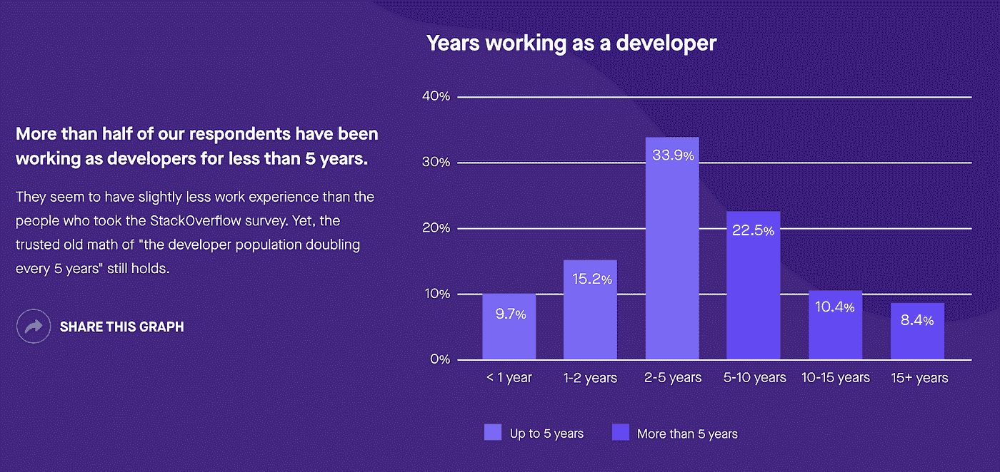
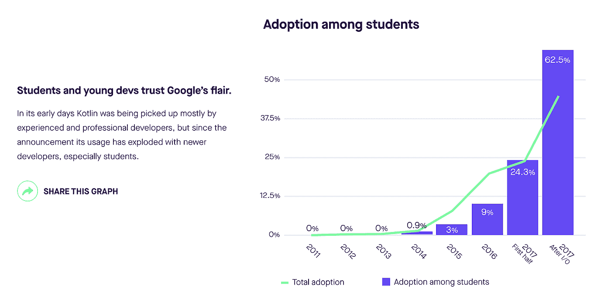
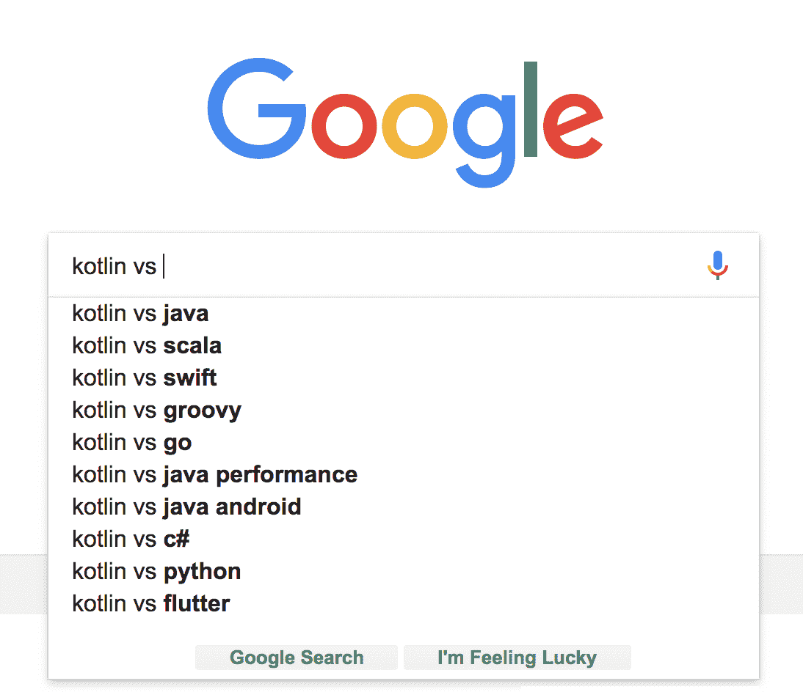
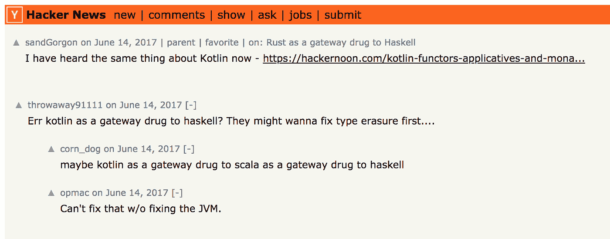

# Kotlin 的崛起:下一代编程语言

> 原文：<https://medium.com/hackernoon/rise-of-kotlin-the-programming-language-for-the-next-generation-27beeb529204>

*有请我们每周一次的赞助商* [*推手*](http://bit.ly/2lCXscm) *来到黑客中午！*[*Pusher*](http://bit.ly/2lCXscm)*制作实时 API，使世界各地的开发人员能够快速将通信和协作功能添加到他们的应用程序中。他们的核心产品使开发人员能够轻松创建应用内通知、活动流、实时仪表盘、实时跟踪器等功能。*

*今天我们要去追到推手开发者布道者* [*赞·马坎*](http://twitter.com/zmarkan) *，来讨论一下科特林的状态，是什么驱使他去做他所做的事情，是什么让一个太空牛仔成为了太空牛仔。*

[**大卫**](https://medium.com/u/7f91547ce9c9?source=post_page-----27beeb529204--------------------------------) **:先从科特林** **的** [**状态说起。你最近做了一个 Kotlin 的调查(更多关于细节的**](https://pusher.com/state-of-kotlin) [**此处**](/devrel-life/state-of-kotlin-the-story-behind-a-survey-bf8c27533d4d) **)。你在 2018 年 1 月至 3 月调查了 2744 人，以把脉生态系统。什么结果违背了你的假设？什么结果证实了你的假设？关于科特林的情况，电梯营销的要点是什么？**

[**赞**](https://medium.com/u/1320d180abbf?source=post_page-----27beeb529204--------------------------------) **:** 没错。我们注意到越来越多的开发人员在用我们的产品构建应用程序时使用 Kotlin，所以我们决定深入挖掘，找出他们的动机。我发现了一些令人惊讶的事情。

首先，我对学生和更多初级开发人员给予 Kotlin 的爱感到非常惊讶。我原以为经验丰富或不太丰富的开发人员之间会有更大的差异，但是自从 Google 把枪放在社区后面后，新的人群真的进入了 Kotlin。

另一件让我惊讶的事情是，有多少人热衷于尝试 Kotlin 团队标记为实验性的功能，即协同程序和对多平台项目的支持——大约各占 25%—30%。

调查结果或多或少证实了我对 Android 有多大的怀疑——根据我们的调查数据，大约 80%。我看到的一些其他调查显示，Android 的比例有所下降，但仍轻松超过 75%的大关。有些差异可能是因为我的网络主要是以 Android 为中心的，但影响并不明显。

一个要点是 Kotlin 是一种令人兴奋的语言，是一种让开发人员高兴的语言。

这是非常罕见的(至少对于主流编程语言来说是这样)，并且在整个 Kotlin 生态系统周围形成了一个充满活力和热情的社区。

Kotlin 的主要开发来自俄罗斯圣彼得堡的 JetBrains 程序员团队。关于它的成立，你还能告诉我们什么？你第一次使用科特林是什么时候？

据我所知，Kotlin 的历史就是 JetBrains 为他们的开发工具寻找“更好的 Java”的历史。互操作性和提高生产率是他们的一些主要目标，当时没有其他基于 JVM 的语言真正符合要求——Scala 符合大多数条件，但工具就是不存在，构建时间对于 JetBrains 的开发需求来说太慢了。

高度可互操作和更好的 Java 的确切想法是为什么它开始吸引如此多的 Android 开发者(包括我，从早期就开始做 Android)。

几年前，Android 生态系统大多停留在旧版本的 Java——Java 7 和 Java 6 的奇怪混合体，没有 lambdas 这样的好功能，而且相当冗长。因此，人们开始尝试这种新的东西，它看起来具有很好的互操作性，并允许更高的生产率(尤其是在它不会破坏一切的时候😅).

这也是我卷入其中的原因——我在 2014 年第一次听说它，然后密切关注 Kotlin 的发展——要么在业余时间玩它，要么用它快速原型化东西。我在开发[推杆聊天工具](https://pusher.com/chatkit)和[送料](https://pusher.com/feeds)产品时编写了第一个生产 Kotlin 代码。

**你认为 Kotlin 为什么会迎合经验不足的开发人员？怎样才能阻止它成为一种时尚呢？**

哈！我不认为它迎合了缺乏经验的开发者本身，事实上我认为它与我们在 StackOverflow 调查结果中看到的分组非常相似，所以从行业发展的角度来看没有什么意外。

我们还看到，它最初主要由有经验的(受雇的)开发人员使用，直到最近才开始被学生和年轻的开发人员采用。

我认为科特林语是一种很容易掌握的语言。有很好的工具可以让我们在不了解大部分内容的情况下高效工作。它可以与 Java 互操作，因此任何移植或迁移都可以按照您自己的节奏进行。最后，Google 和 JetBrains 在准备支持 Kotlin 的文档和资源方面都做得很好。

你认为是什么将 Kotlin 与其他编程语言区分开来，从而推动了它的迅速普及？更一般地说，你认为获得采用的编程语言和努力获得采用的编程语言之间的区别是什么？

来自谷歌和 JetBrains 的支持无疑有所帮助。另一方面，在开发者社区的大力推动下，谷歌才决定在 Android 中正式支持 Kotlin，所以另一方面也已经有了很大的推动。

实际上，我认为这是一种出现在正确的时间、正确的社区 Android 社区——的语言，因为它已经成熟，人们希望新的工具变得越来越高效。科特林，就在那里，当然它有它的缺陷，但它在那里，足够好，人们可以做得很好。

**你如何看待 Kotlin 在未来 5 年左右有效地竞争和补充现有的语言和架构？**

如果我们从显而易见的开始，那么 Java 相当容易，Kotlin 已经很好地补充了它。我相信我们肯定会看到更多，尤其是当工具整合和一些“黄金标准”工具出现的时候。其中一个工具是 [Arrow，这是一个为 Kotlin 开发的函数式编程工具包](https://arrow-kt.io/)，它是由 functionale 和 Kategory 团队联合开发的，旨在创建更好、更完整的东西。我认为这将成为趋势。

至于其他编程语言——在 JVM 上，我们将看到 Scala 和其他语言会发生什么，在 JVM 世界之外，现在下结论还为时过早，但我已经看到了一些关于 Kotlin/Native 和 Kotlin 用于多平台项目的有希望的想法——两者都还处于实验阶段，但一些概念证明已经存在，正在工作，非常令人兴奋。

**当** [**阿尔贝托·巴拉诺**](https://hackernoon.com/@aballano?source=post_header_lockup)**[**科特林的**](https://hackernoon.com/kotlin-functors-applicatives-and-monads-in-pictures-part-1-3-c47a1b1ce251) **中的函子、应用子和单子被搬上** [**黑客新闻**](https://news.ycombinator.com/item?id=14551170) **时，就引发了一场有趣的讨论……你认为科特林是通向什么的门户？****

****

**听起来太邪恶了！它是通向现代编程语言的门户药物——让我们既高效又快乐的语言。它肯定会让很多人接触函数式编程——尤其是像 Arrow 这样的东西，这可能会让一些人更容易地跳到更硬核的 FP 语言。**

**它可能做的其他一些事情是刺激一群 Android 开发人员冒险进入 web 或原生开发，因为它支持所有的跨平台，而且，随着越来越多的开发人员将它作为他们的第一编程语言，他们将不可避免地将 Kotlin 视为他们衡量所有其他语言的基准，这也非常令人兴奋。**

****在语言学中，像英语或西班牙语这样的语言需要很长时间才能被人们接受。它们有许多方言，但是一种全新的口语的使用肯定不如新的软件语言的使用突出。你认为我们会达到一个行业成熟期，新软件语言的比率会下降吗？还是会有更多新的软件语言不断涌现？****

**我们已经看到一些优秀的编程语言很快得到了认真的采用，最近几年，我想到了 Swift、Go、TypeScript 和 Rust。它们中的每一个都由一个(或多个)大型工程组织提供支持，这些工程组织拥有大量的资源和现有的开发者社区。**

**他们中的每一个人都抓到了他们组织的一个特别的痒处，如果这个痒处被许多其他的开发者分享，那么采用就发生了，一种语言起飞了，允许它达到“临界质量”。这就是我提到的每一种语言所发生的事情——比如 Go 是在 Google 想要做好并发性的时候开始的，Rust 的目标之一是*永不崩溃。***

**至于未来，我认为肯定会有新的计算模式，新的想法被开发出来(谁知道呢，也许区块链有一天真的会成为一件东西)——这对于我们现有的工具来说不会非常有用。
其他一些例子是量子计算或人工智能。**

**虽然现在大多数语言都声称自己是通用的，但这并不意味着它们同样适合每一种用途。我们会看到需要新语言的新目的。**

****我们来说说 Zan 这个人。你的个人网站** [**上的简历前两个字**](https://markan.me/) **读作“太空牛仔”有人称你为爱情的强盗吗？别人叫你莫里斯吗？你体现了爱情的辉煌吗？****

**哈，我喜欢这首歌！也许是爱情的强盗，因为我不认为有人会把 Zan 拼错成 Maurice，甚至星巴克的员工也不会。我也喜欢火箭，仍然为失去萤火虫而悲伤，所以这也是太空牛仔的主题。**

**这个“头衔”背后的真实故事是，几年前，当我还在经营一家初创公司时，我和几个大学毕业的朋友一起创办了这家公司。为了在向陌生人借钱时看起来更合法一点，我们为每个人都制作了名片。**

**我不太喜欢标题，尤其是 C 标题，因为每个人都在做几乎所有的事情，所以我决定走另一条路，选择了《太空牛仔》,它几乎和任何东西一样准确。至少我认为这是一个很好的话题。**

**你问这个问题的事实证明了它是一个多么好的话题引子。**

**据说你喜欢西海岸风格的 IPA。我现在在科罗拉多和拉吉纳提斯小姐。你西海岸前 3/5 的 IPA 是什么？**

**我喜欢它们强烈而冷酷的跳动。**

**每当我访问西海岸，我一定要去俄罗斯河边的老普林尼，当然还有石头 IPA——显然都是草稿。离家近一点的话，我会选择 Brewdog 的 Jack Hammer。**

****怎样才能成为一名优秀的开发者传道者？你是如何在工作中变得更好的？是什么让 Pusher 技术值得布道？****

**对于一个开发布道者(一般来说，任何开发人员关系人员)来说，最重要的事情是对教学和分享知识的真正热情。其实，正版可能更重要。句号。开发商是天生的 BS 探测器，他们讨厌被卖东西。**

**当你知道你已经帮助别人成为更好的开发者时，这也是一种很棒的感觉。**

**我首先要改进的事情之一是时间管理。作为一名开发人员，将大量时间分配给特定的任务更为常见。我现在的工作比那要有活力得多，起初我没想到会有这样的变化或调整，所以这是相当难以承受的。保罗·格拉厄姆关于制造商和经理的时间表的精彩文章对我帮助很大。**

**我学到的另一项有用的技能是项目管理——以 kot Lin State 为例，我的大部分工作首先围绕着建立调查和创建内容，然后转向更经典的项目管理，如与其他相关团队协调，如设计和开发(他们已经完成了这项工作，不是我，再次感谢——你知道你是谁),最后在各种出版物上发布消息，在网上接受采访。**

**Pusher 的技术以集成速度之快以及“它就是工作”这一事实而闻名。**

**因此，这是一件轻而易举的福音。我甚至在一次移动开发会议上遇到一些人，他们告诉我，他们在使用 Pusher 的网络团队中的同事告诉我，我们的渠道产品有多棒——这很令人兴奋😁**

****总而言之，Kotlin 在实现 Pusher 的长期愿景中处于什么位置？****

**我们已经把 Kotlin 作为我们 Android SDKs 的主要开发语言。我们从新产品的 SDK 开始——[Beams](https://pusher.com/beams)、 [Chatkit](https://pusher.com/chatkit) 和 [Feeds](https://pusher.com/feeds) ，目前我们对此相当满意。**

**我们还认为，科特林拥有最令人兴奋和参与度最高的社区之一，这也是我们决定创建科特林现状调查和报告的部分原因。我们当然希望 Kotlin 让开发人员保持快乐和高效，Kotlin 的[状态](https://pusher.com/state-of-kotlin)有助于进一步推动它的采用！**

> **我们的每周赞助商 [**Pusher**](http://bit.ly/2lCXscm) 开发通信和协作 API，为世界各地的应用提供支持，并由易于集成的 SDK 提供支持，用于 web、移动设备以及最受欢迎的后端堆栈。 [**入门。**](http://bit.ly/2lCXscm)**