# RNN 或用于 Noobs 的递归神经网络

> 原文：<https://medium.com/hackernoon/rnn-or-recurrent-neural-network-for-noobs-a9afbb00e860>

什么是递归神经网络或 RNN，它如何工作，它可以用在哪里？本文试图回答以上问题。它还展示了一个用于特定目的的 RNN 的演示实现，但是您可以根据自己的需要对其进行概括。

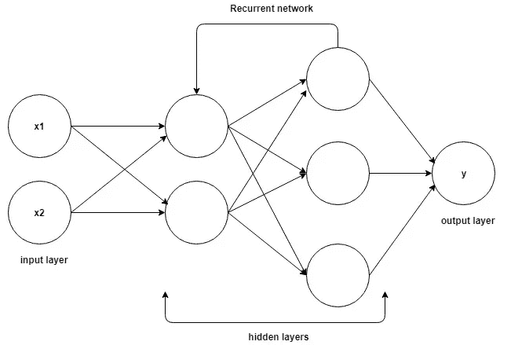

Recurrent Neural Network Architecture

诀窍。Python，CNN 知识是必须的。CNN 被要求比较 RNN 为什么比 CNN 表现好，在哪里表现好？不需要理解数学。如果你想检查然后回到我以前的文章检查什么是 CNN。

我们将从“循环”这个词的用法开始。为什么叫反复发作？在英语中，单词 recurrent 的意思是:

> 经常或重复发生的

在这种类型的神经网络的情况下，它被称为递归，因为它在连续输入集上反复进行相同的操作。我们将在本文后面讨论*操作*的含义。

# 我们为什么需要 RNN？

你现在可能在想，我们有性能非常好的普通网络，比如卷积网络。为什么我们需要另一种类型的网络？有一个非常特殊的用例需要 rnn。为了解释 RNNs，你需要首先理解一个叫做序列的东西。先说一下**序列**。

序列是相互依赖的数据流(有限或无限)。例如时间序列数据、字符串的信息片段、对话等。在对话中，一个句子意味着一些东西，但整个对话流程大多意味着完全不同的东西。同样，在像股票市场数据这样的时间序列数据中，单个分笔成交点数据意味着当前价格，但一整天的数据将显示运动，并允许我们决定是买还是卖。

当输入数据在序列模式中相互依赖时，CNN 通常表现不佳。CNN 在前一个输入和下一个输入之间没有任何关联。所以所有的输出都是独立的。CNN 基于训练好的模型接收输入和输出。如果你运行 100 个不同的输入，没有一个会被之前的输出所影响。但是想象一下句子生成或文本翻译这样的场景。所有生成的单词都依赖于前面生成的单词(在某些情况下，它也依赖于后面的单词，但我们将在后面讨论)。所以你需要有一些基于你之前输出的偏差。这就是 RNNs 大放异彩的地方。rnn 对数据序列中之前发生的事情有一定的记忆。这有助于系统获得上下文。理论上，rnn 有无限的记忆，这意味着它们有能力无限地回顾过去。我所说的回顾是指所有以前的输入。但实际上他们只能回顾最后几步。*(我们稍后会讨论这个)*

> 只是为了与人类做一个总体上的关联，我们也不会就地做出决定。我们也将我们的决定建立在先前对这个主题的了解上。(*过于简化，很难说我能理解人类大脑的 0.1% * *)

# 在哪里使用 RNN？

RNNs 可以用在很多不同的地方。下面是几个使用大量 rnn 的例子。

## 1.语言建模和生成文本

给定一个单词序列，这里我们试图预测下一个单词的可能性。这对于翻译很有用，因为最有可能的句子是正确的。

## 2.机器翻译

将文本从一种语言翻译成另一种语言使用一种或另一种形式的 RNN。所有实用的日制系统都使用某种高级版本的 RNN。

## 3.语音识别

基于输入声波预测语音片段，从而形成单词。

## 4.生成图像描述

一个非常大的用例是理解图像内部发生了什么，因此我们有一个很好的描述。这是 CNN 和 RNN 的合作项目。CNN 做了分段，然后 RNN 用分段的数据重建描述。这是最基本的，但可能性是无限的。

## 5.视频标记

这可以用于视频搜索，我们逐帧对视频进行图像描述。

# 让我们深入挖掘！

我们将按照下面提到的主题顺序来完成文档。每一部分都建立在另一部分的基础上，所以不要将此作为参考。

1.  前馈网络
2.  循环网络
3.  回归神经元
4.  穿越时间的反向传播(BPTT)
5.  RNN 实施

# 前馈网络入门

前馈网络通过发生在网络每个节点的一系列操作来传递信息。前馈网络将信息直接通过每一层传递一次。这与其他循环网络不同。我们将在后面的章节中讨论它们。一般来说，前馈网络接受一个输入并从中产生一个输出。这也主要是一个监督学习步骤，其结果很可能是一个分类。它的行为类似于 CNN 的行为。输出可以预期是像猫或狗作为标签的类。

根据一组预先标记的数据训练前馈网络。训练阶段的目标是在前馈网络试图猜测类别时减少误差。训练完成后，权重用于对新批次的数据进行分类。

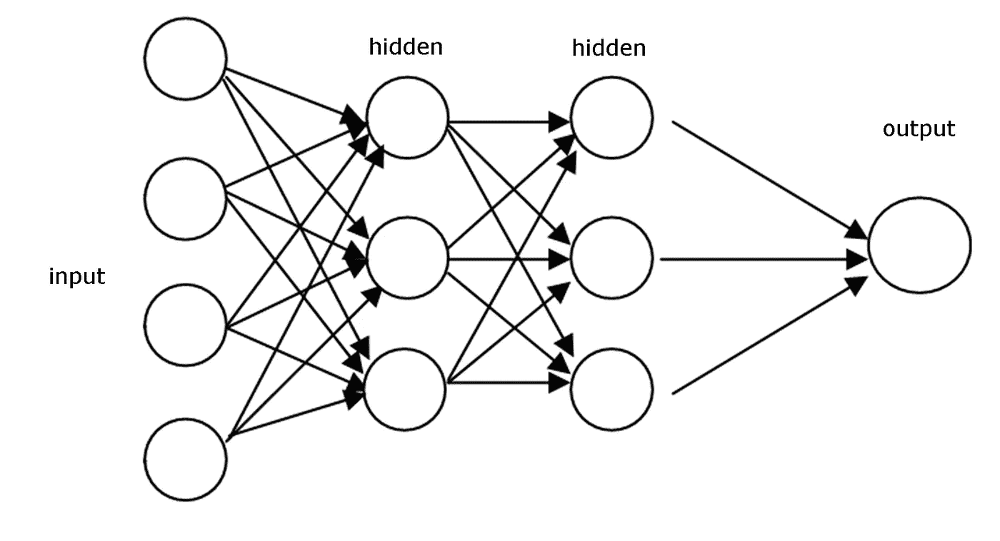

A typical feed-forward network architecture

这里需要注意一件重要的事情。在前馈网络中，无论在测试阶段向分类器显示什么图像，它都不会改变权重，因此第二个决定不受影响。这是前馈网络和递归网络之间的一个非常重要的区别。

> 与递归网络不同，前馈网络在测试时不会记住历史输入数据。

这总是时间点的决定。他们只记得在训练阶段展示给他们的东西。

# 循环网络

另一方面，循环网络不仅将他们看到的当前输入实例作为输入，还将他们之前感知到的内容作为输入。

让我们试着建立一个[多层感知器](https://en.wikipedia.org/wiki/Multilayer_perceptron)来开始解释。简单来说，有一个输入层，一个隐藏层，有一定的激活，最后我们得到一个输出。

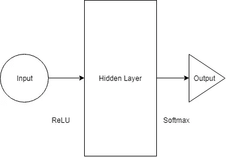

A sample multi layer perceptron architecture

如果我们在上面的例子中增加层数，输入层接受输入。然后，第一个隐藏层进行激活，传递到下一个隐藏层，依此类推。最后它到达输出层，输出层给出输出。每个隐藏层都有自己的权重和偏好。现在的问题是我们能否输入到隐藏层。

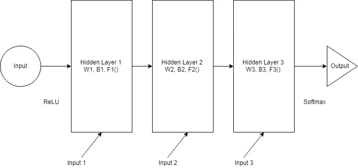

每一层都有自己的权重(W)、偏差(B)、激活函数(F)。这些层的行为不同，从技术上来说，将它们合并在一起具有挑战性。为了能够合并它们，让我们用相同的权重和偏差替换所有的层。它看起来会像这样。

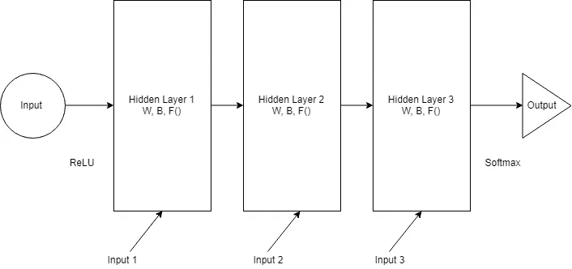

现在我们可以将所有的层合并在一起。所有隐藏层可以合并成一个单独的递归层。所以它们看起来有点像这样:

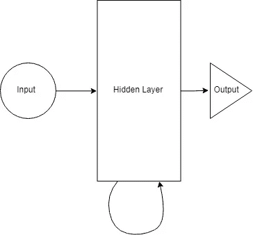

我们将在每一步为隐藏层提供输入。现在，递归神经元存储所有先前的阶跃输入，并将该信息与当前的阶跃输入合并。因此，它还捕获一些关于当前数据步骤和先前步骤之间的相关性的信息。在时间步长`t-1`的决定影响在时间`t`采取的决定。这很像我们人类在生活中做决定的方式。我们将当前的数据与最近的历史结合起来，以解决手头的特定问题。这个例子非常简单，但是原则上它符合我们的决策能力。*这真的激起了我的兴趣，我们人类是聪明的还是我们有非常先进的神经网络模型。我们的决定只是我们一生中收集的训练数据。因此，一旦我们有了一个相当先进的模型和系统，能够在合理的时间内存储和计算它们，我们就可以数字化我们的大脑。那么，当我们拥有比我们的大脑根据数百万人的数据训练更好更快的模型时，会发生什么呢？*

> 另一篇[文章](https://deeplearning4j.org/lstm.html) : **一个人被自己的行为所困扰**

让我们回到手头的问题，用一个例子来重新表述上面的解释，来预测一系列字母之后的下一个字母是什么。想象中的单词 **namaskar** 。这个单词有 8 个字母。

> namaskar:一种传统的印度问候或尊敬的手势，将手掌放在脸或胸前并鞠躬。

如果我们试图在 7 个字母输入网络后找出第 8 个字母，会发生什么。隐藏层将经历 8 次迭代。如果我们要展开这个网络，它将是一个 8 层的网络，每个字母一层。所以你可以想象一个正常的神经网络是重复多次的。你展开的次数与它能记住多远的过去直接相关。但稍后会详细介绍。

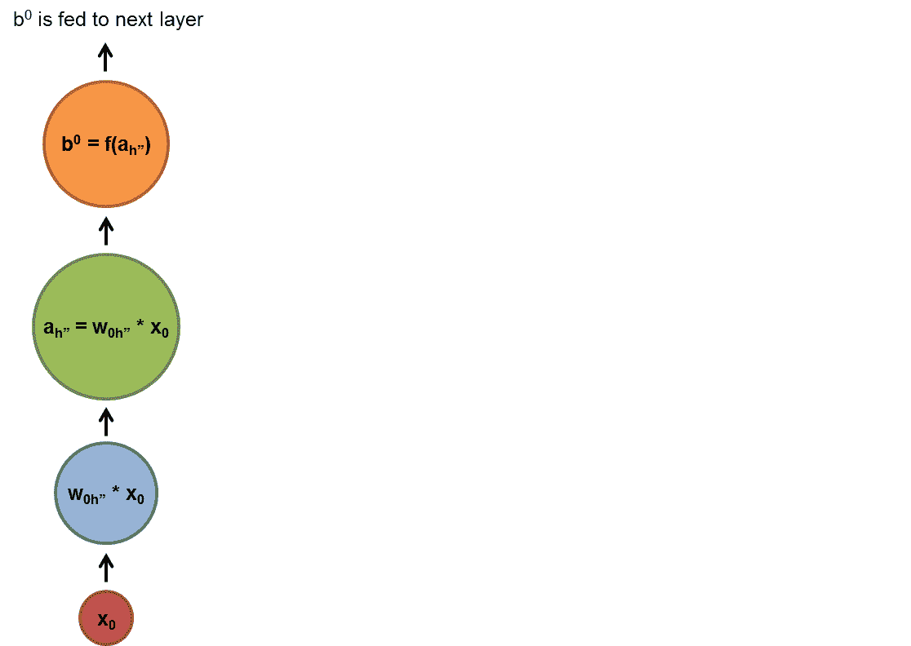

how recurrent neural networks work #deeplearning4j #dl4j

# 回归神经元

在这里，我们将更深入地研究负责决策的实际神经元。我们将使用上面描述的 **namaskar** 例子。我们将尝试找出前 7 个字母中的第 8 个字母。输入数据的总词汇是{n，a，m，s，k，r}。在现实世界中，你会遇到更复杂的单词或句子。为了简单起见，我们将使用这个简单的词汇。

在上图中，隐藏层或 RNN 块将一个公式应用于当前输入和先前状态。在这种情况下，namaste 的字母`n`前面没有任何内容，所以我们将继续下一个字母`a`。在字母`a`和字母`n`的前一状态期间，隐藏层应用该公式。我们一会儿会讨论这个公式。输入通过网络时的每个状态都是一个时间步长或一个步长。所以如果在时间 t，输入是`a`，那么在时间 t-1，输入是`n`。将公式应用于`n`和`a`之后，我们得到一个新的状态。

当前状态的公式可以写成这样:

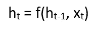

`ht`是新状态，`ht-1`是先前状态。`xt`是时间`t`的输入。我们现在对之前的输入有了一种感觉，在它经历了之前时间步骤的相同公式之后。我们将对网络进行 7 次这样的输入，网络在每一步都经过相同的权重和相同的函数。

现在让我们尝试以简单的方式定义`f()`。我们将`tanh`作为激活函数。权重由矩阵`Whh`定义，输入由矩阵`Wxh`定义。所以这个公式看起来像:

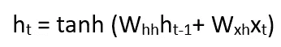

上面的例子只把最后一步作为记忆，从而与最后一步的数据合并。为了增加网络的存储容量，并在内存中保存更长的序列，我们必须向等式中添加更多的状态，如`ht-2`、`ht-3`等。最后，可以计算测试期间的输出:

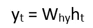

其中`yt`是产量。将输出与实际输出进行比较，然后计算误差值。网络通过经由网络反向传播误差来学习，以更新权重。我们将在下一节讨论反向传播。

# 穿越时间的反向传播(BPTT)

本节认为你知道反向传播是一个概念。如果您需要了解反向传播，请访问此[链接](http://cs231n.github.io/optimization-2/)阅读更多内容。

现在我们明白了 RNN 实际上是如何工作的，但是训练实际上是如何工作的呢？我们如何决定每个连接的权重？我们如何初始化这些隐藏单元的权重。递归网络的目的是准确地对顺序输入进行分类。我们依靠误差的反向传播和梯度下降来做到这一点。但是在前馈网络中使用的标准反向传播不能在这里使用。

rnn 的问题在于它们是循环图，不像前馈网络那样是非循环有向图。在前馈网络中，我们可以从上一层计算误差导数。在 RNN，我们没有这样的层次。

答案就在我们上面讨论的内容中。我们需要展开网络。我们将展开它，使它看起来像一个前馈网络。

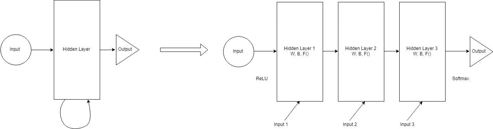

Unrolling a RNN

我们采用 RNN 的隐藏单元，并在每个时间步复制它。每个时间步的复制就像一个前馈网络中的一层。每个时间步长`t`层连接到时间步长`t+1`中所有可能的层。因此，我们随机初始化权重，展开网络，然后使用反向传播来优化隐藏层中的权重。初始化是通过向最低层传递参数来完成的。作为反向传播的一部分，这些参数也被优化。

展开的结果是每个层现在开始保持不同的权重，因此最终得到不同的优化。根据重量计算的误差不能保证相等。因此在单次运行结束时，每层可以具有不同的权重。我们绝对不希望这种情况发生。简单的解决方案是以某种方式汇总所有层的误差。我们可以计算出误差的平均值，甚至把它们加起来。这样，我们可以在所有时间步长中使用一个层来保持相同的权重。

# RNN 实施

下面是一个示例代码，我们尝试使用 Keras 模型实现了一个 RNN。这里是到[要点](https://gist.github.com/09aefc5231972618d2c13ccedb0e22cc.git)的直接链接。我们试图预测给定一组文本的下一个序列。

这个模型是由 [Yash Katariya](https://github.com/yashk2810/Predicting-Next-Character-using-RNN) 建造的。我稍微更新了代码，以适应本文的要求。代码是注释的，这是不言自明的。

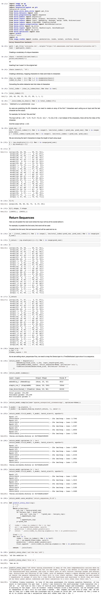

# 结论

好了，我们已经到了这篇文章的结尾。到目前为止，我们所讨论的只是 RNN 的一个基本实现。为了对这个话题有一个全面的了解，我们需要涵盖很多东西。我将在一周内写第二篇文章。我将尝试涵盖以下主题。

1.  消失和爆炸渐变
2.  长期依赖的问题
3.  长短期记忆网络(LSTM)
4.  LSTM 门
5.  双向 RNNs
6.  深度(双向)RNNs
7.  GRU 细胞

如果你想让我报道除此之外的事情，请在评论区留言。rnn 是非常强大的东西，它非常接近人类大脑的工作方式。我将期待在这一领域有更多的发展，我个人也在这方面努力。任何改进，我一定会在这里分享。因此，请在[媒体](/@debarko)或[推特](https://twitter.com/debarko)上关注我，了解最新消息。

## ***如果你喜欢这篇文章，请点击👏按钮来支持它。这将有助于其他媒体用户找到它。*** [***在 Twitter 上分享这篇文章***](http://twitter.com/intent/tweet?text=%40debarko%20just%20released%20an%20article%20on%20%23RNN.%20It%20talks%20about%20how%20you%20can%20build%20a%20%23RecurrentNeuralNetwork%20%F0%9F%9A%80and%20its%20workings.%20%23AI%20%23ML%20%23NeuralNetworks%20%23MachineLearning%20https%3A%2F%2Fgoo.gl%2FFPPwYN) ***帮助尽可能多的读者。***