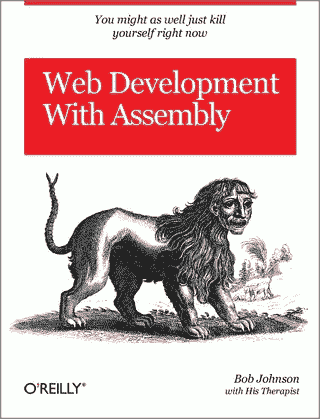

# 精通之路:我的权威初级开发人员求职指南

> 原文：<https://medium.com/hackernoon/road-to-mastery-my-definitive-junior-developer-job-finding-guide-fc23a67f4128>

Amazing artwork by my friend [GAA,](https://www.facebook.com/gaptum/) disgracefully cropped to fit the article. Please do check [the original](https://www.facebook.com/gaptum/photos/a.1607022436245935.1073741830.1607012139580298/1682334022048109/?type=3&theater).

你要是更有洞察力的话，现在可能已经意识到我很难遵守我的时间表。至于你们当中的*真的*敏锐，他们可能一点也不惊讶🤷‍♂️.

无论如何，欢迎！自从我作为一名雄心勃勃的软件工程师开始我的旅程已经一年多了。现在是我收集所有简单和困难的经验教训，并把它们浓缩成美味的声音和适当建议的时候了。让我们从解决我在[上一篇文章](https://hackernoon.com/road-to-mastery-half-a-year-on-the-road-2bec022a1255)中提到的关于从哪里开始着手的问题开始。

# 约$h .生面团。中国注册资本资产管理公司文件。硬币。

我假设你已经准备好了你的简历，并且已经校对了几百遍。但是在面试桌上的另一边是什么或谁呢？

Depicted: recruiters when they catch a whiff that you have graduated.

到现在为止——在 LinkedIn 上发了大约 371 封通知之后——你一定已经意识到，幸运的是，在我们的专业领域找工作并不太难。但是这伴随着明显的过度选择的代价。这也大大降低了你最初收到的大多数帖子的质量。年轻的开发人员很天真，比起更有经验的专业人员，他们很容易被低于行业平均水平的工资所左右。我们可以就这种做法的道德性进行辩论，但超出辩论范围的是，这就是所发生的事情。做好准备。

很明显，你不应该期望和一个已经在这个街区呆了很长时间的开发者挣得一样多。

然而。

这并不意味着你应该盲目接受任何人向你提出的“行业标准工资”或“初级员工的期望工资”。研究。问吧。环顾四周。利用你的影响力。你不应该拘泥于单一的职位发布或招聘流程。有很多人会增加你提高他们每个人的薪水的机会。别傻了。即使没有经验，也没有两个开发人员是相同的。你都明白了吗？太好了。

# 你将会花时间在什么上面

Granted this would REALLY shave off some ms per request.

当然，你的工作不仅仅是报酬。在过去的几年里，你没有因为一份工资而差点死于过量摄入咖啡因(如果你真的死了，天啊…点开…嘘！).

你喜欢这个！你迫不及待地想成为一名 Java 开发人员。或者是 Oracle 数据库管理员？可能是安卓工程师。Sysadmin！不过，你肯定希望使用 Python。

有太多的技术堆栈，甚至不能开玩笑，因为我可怜地刚刚尝试这样做。相反，许多不同的公司本身也有许多不同的技术。我之前已经强调并讨论过专业化的重要性，但至少也要对这个行业有后备兴趣——并为你的舒适区周围的任何新事物留下一些回旋的空间。

有大量的供给和需求。不要仅仅因为你还没有找到一家符合你要求的公司，就匆忙接受一份工作。我们谈论的是你的事业。你肯定不想从做你厌恶的事情开始。除非你想编码穿孔卡，否则总会有办法的。当然，在合理的范围内:我不指望你能轻松地找到一份 Perl 开发人员的工作，如果那是你的工作的话…不知何故。

# 公司价值观

“Here you are Greg! I’ll be expecting the script in my Dropbox folder by the end of the day. Welcome aboard!”

你会发现，不同的公司有不同的做事方式。创业公司通常在内部甚至开发流程上与大企业截然相反。开发商也是如此。

现在，这一开始不会对你有太大的影响。作为大三学生，你几乎什么都不知道。我说的“没什么”，是指你几乎把最后几年的时间都花在了学习黑客帝国的技能上……而你从未真正使用过。你会变成一块海绵(你应该这样！！).

我没有刻意用引号写任何东西:我已经表明了我的信念，没有两个开发人员是相同的。不是所有人都有同样的动力或像其他人一样认真对待事情。因此，对于初级开发人员所知的“一无所知”有许多不同的定义，这取决于每个人。有些人可能非常想成为专业的系统工程师。其他人可能想快速晋升到管理职位。

随着时间的推移，你会巩固这些想法，最终你会发现你真正的激情和你真正的开发类型。不同的激情导致不同的事情，不同的*工作方式*和不同的信仰。

然而，重要的是你要找到一家与你有相同信念的公司。我一直热衷于干净、健壮和可维护的代码。我强迫自己最终点击 TDD，感觉就像吃了红色药丸(好了，矩阵参考够了)。所以我很快发现我害怕计划和管理糟糕的项目，相反，我更喜欢工程团队中的每个人(如果有的话)都有发言权的方法。我陶醉于在一个项目中编写和清理代码，在这个项目中，性能和可维护性从一开始就是一个问题。

不幸的是，并不是所有的公司都是这样的。因为不是所有的公司都会分享你的信仰或激情，作为一个不害羞的理想主义者，我对这个问题非常敏感。找到你的运气和让你前进的动力。然后试着找一家能和你产生共鸣的公司。沙札姆，你真是天造地设的一对。记住:面试是双向的😉。

# 准备好学习，学习，再学习

不要害怕犯错。这是可以预料的。

…哦，你期望更多？我已经写了很多关于我自己的自我怀疑和不安全感，以及我是如何超越它们的。如果你已经做到了这一步，如果你还没有的话，不妨看看《精通之路》系列的其余部分。

# 结论

这真的是我搬到[这个沿海大都市](https://en.wikipedia.org/wiki/Lisbon)之前*喜欢*读的书，我口袋里装着世界上所有的梦想，我的朋友和家人都被远远抛在身后。至少在我住的地方，一批新的潜在开发人员刚刚离开校园，希望这对他们有用，就像我刚开始时对我有用一样。

我在完成这篇文章之前，必须要对我的好友佩德罗·卡斯特迪奥(Pedro Custódio)大喊一声，因为他给了我一记众所周知的耳光，这是我最终将这篇文章从脑海中抹去并发到网上所需要的。一定要看看他糟糕的想象和设计[每日 3D 渲染](https://www.behance.net/gallery/66513895/EVERYDAYS-May-2018)！

另外，请继续关注 Joaquim Ley 即将发布的播客，我将出现在其中一集中，你将最终品尝到我融化的巧克力般柔软性感的声音。并且还在 [LinkedIn](https://www.linkedin.com/in/alexolival/) 和 [Twitter](https://twitter.com/lex_olival) 跟踪我。

感谢您一如既往的阅读。下次再见！