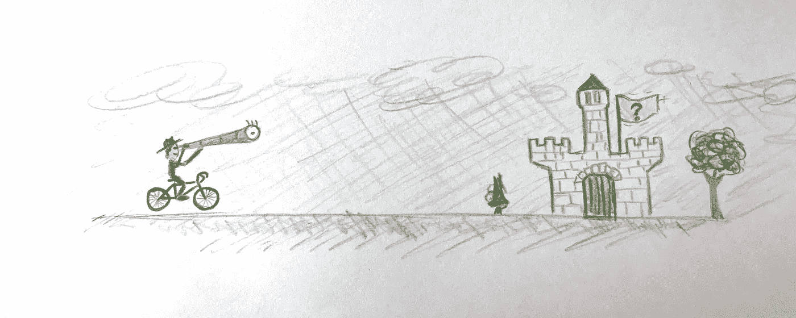
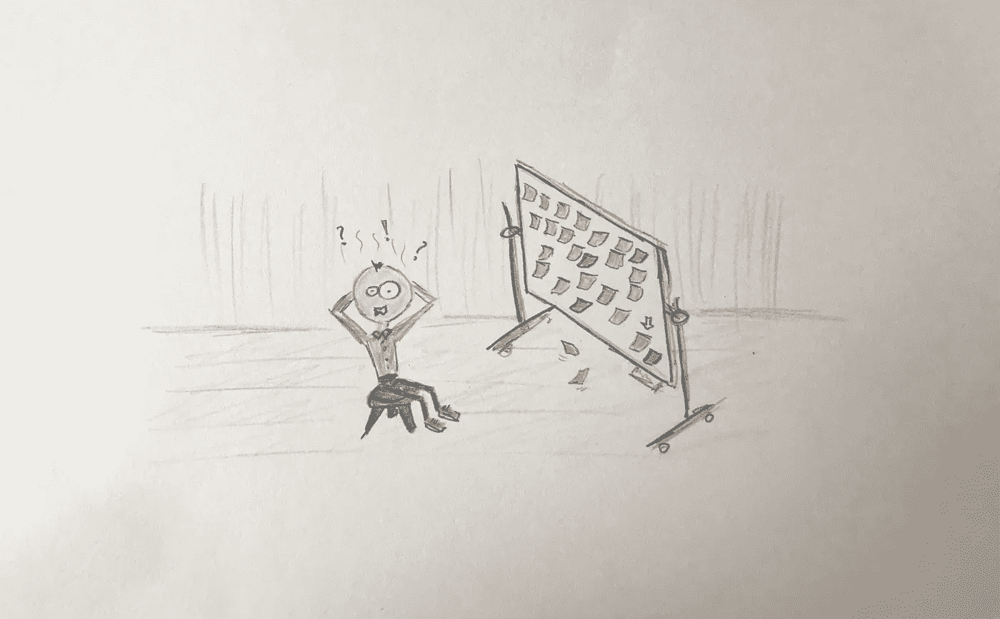
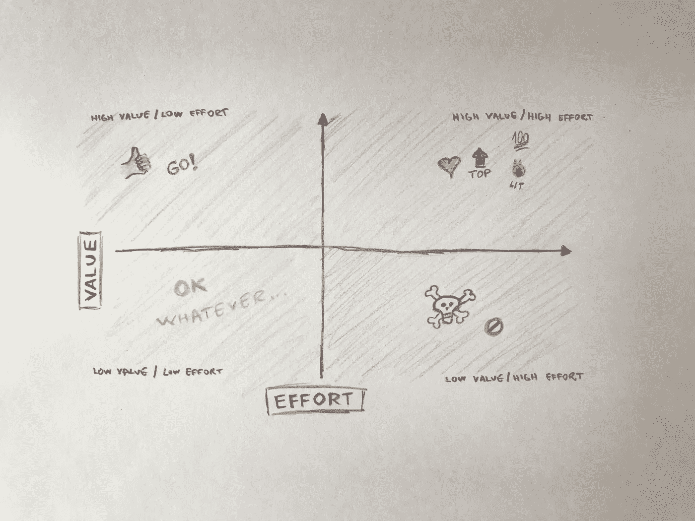
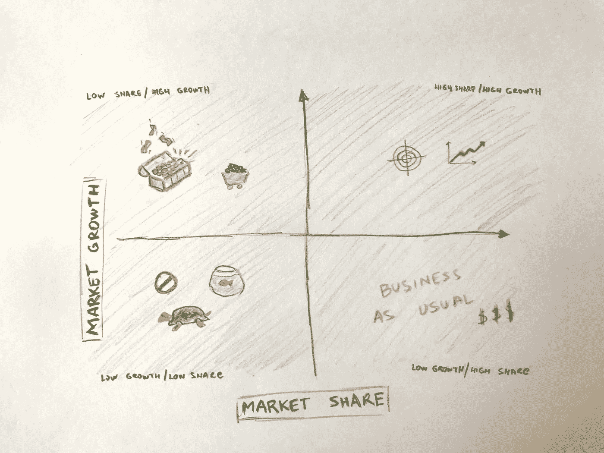

# 高风险低数据决策的路线图可视化

> 原文：<https://medium.com/hackernoon/roadmap-visualization-for-high-risk-low-data-decisions-8ebb527e51b3>

*说到产品* [*路线图*](https://hackernoon.com/tagged/roadmap) *规划，设定正确的路径总是很难。到底什么才是正确的道路？你应该为你的公司或产品制定一个长期发展计划，关于未来的信息非常有限。这就是我所说的高风险低数据决策。*

在这种情况下最重要的是避免和克服分析麻痹。我去过那里的次数多到我都不记得了，所以我想分享我用过的一个技巧。

Visualize your roadmap and end goal

因为路线图是一个长期计划，所以它的列表中可以包含很多特性。这使得我们很难将一个与另一个进行比较，并决定哪个更重要，哪个带来更多的价值。这就是为什么我喜欢把它视觉化。如果我能看到就更好理解了。

# 它是如何工作的？

在路线图规划会议期间，我总是问自己这些问题:

> 1.构建这一功能需要花费多少时间？

我必须[知道价格](https://momcilodakic.com/2018/06/28/everybody-sells-how-to-set-the-right-price/)，至少是用某种虚构的货币。我必须知道开发这项功能所需的努力。这将让我了解该功能有多大或有多小。

> 2.会带来多大的价值？它将如何使我们的产品变得更好？

因为我在开发上投入了时间和金钱，所以我必须估算回报。它会让我比我的竞争对手更优秀，还是会给我带来竞争性的平价？

> 3.这项功能的预计市场份额是多少？

对于这一特定功能，我是否有现有客户？如果没有，我看到有人在使用它吗？重要的是要形象化你是如何授权给你的用户的，以及你的功能是如何为他们的业务增加价值的。让你的用户牛逼。

> 4.随着时间的推移，市场份额将如何变化？

如果有现有市场，一个月后还是一年后？会成长还是只是炒作？我必须试着预测未来，因为我正在为即将到来的时间构建一个产品。

Too many roadmap items, too many questions

# 让它可视化

你可能认出了上面问题中的几对:

1.  努力与价值，
2.  市场份额与市场增长。

将您的路线图项目放在一个表格中，并为每个项目分配一个等级，分别是*努力*、*价值*、*市场份额*和*市场增长*。等级可以从 0 到 100，你可以根据你想要的分辨率来选择。但重要的是，排名是相对于每个路线图项目的，因为这里的目标是比较它们，并决定哪些更重要，哪些带来更多的价值。

现在您已经分配了等级，尝试在两个二维图表中绘制散点图。一旦你看到你的图表，事情就会变得有意义…

# 努力与价值

Value vs. Effort

当您查看图表时，您可以立即发现四个不同的区域:

## 高价值—低成本

这些功能/产品是每个人都喜欢构建的。你不必拼命工作，用户对此很满意。你绝对应该关注这些，因为投资的回报非常高。抓住低垂的果实，为接下来的事情保存你的能量…

## 高价值—高投入

这是让你兴奋的领域，你期待着让这些事情发生。这个象限将充满你相信的东西，定义你的产品或服务的东西。当然，它们需要大量的关注、工作和精力，但是男孩，哦，男孩，它们完成后会发光。这应该是你的主要关注点，即使你不得不冒一些风险。

## 低价值—低投入

这些都是不太吸引人的功能。然而，你不应该扔掉它们，因为它们的价值通常比需要的努力稍大。该象限内的功能最有可能为您带来同等的竞争力。当人们看到它们时，不太可能会被迷住，但很可能会注意到这些功能的缺失(我们习惯于在所有其他产品中拥有的东西)。您可以通过将这些功能分配给团队中的初级成员来提升它们的价值。他们会觉得自己掌握了主动权，学到了新的东西，并感到有成就感和独立。

## 低价值—高投入

远离这些。这些会吸干你的能量，你将无法充电，因为它们的价值与其他相比是如此之小。这是你不想做的投资。也许在某些时候，这看起来是一个很酷的想法，但是你把它排在这么低的位置是有原因的。这要么是直觉，要么是数据，但是相信你的勇气，推迟这些“美好的事情”。

# 市场份额与市场增长

Market Share vs. Market Growth

这张图表应该是对现实的检验。你实际上是在建造人们想要的东西吗，或者这只是你的宠物项目，因为你喜欢它。

## 高份额—高增长

这一地区的特点是中肯的。他们的目标是你现有的客户和账户。这意味着人们喜欢你将要建造的东西。此外，还有潜在的客户群增长，因为你可以看到越来越多的人进入其中。这是具有最高视角的领域，因为你正在构建你现有客户喜爱的东西，有可能扩展到与你现有的客户类似的客户。

## 高份额—低增长

这些功能也很酷。低增长不一定是坏事。这可能意味着你的目标是有特定需求和偏好的成熟人群。既然份额很高，你就知道这种需求是存在的，你就不会浪费时间。

## 低份额—高增长

这是你的金矿。或者煤矿。谁也不知道。由于增长率很高，你可能会因为这些特性而中头彩。结果尚不明朗，但机会肯定是存在的。如果它们也是低成本高价值的产品，你应该立即开始制造。

## 低份额—低增长

这些是你最喜欢的项目。承认吧。似乎没有人对这些感兴趣，但是你已经把它们放在你的路线图中了。宠物项目有时会发展成大项目，但是如果你的待办事项已经满了，那就把注意力放在有更光明前景的事情上。

# 好了，伙计，现在怎么办？

现在，看一下您刚刚创建的两个图表。如果您能确定哪些项目属于*高价值—低投入*和*高份额—高增长*区域，请将这些项目放在路线图的顶部。首先开始建造它们，并投资于它们。另一方面，如果有项目在*低值—高努力*和*低份额—低增长*区域内，就丢弃这些项目。或者，如果你对你的宠物有感情的话，把它们放在你清单的最底部。

我希望这能对你有所帮助。正如我所说的，我喜欢绘制这些图表，以便我可以直观地发现什么是热门，什么不是。你也可以使用这些图表向投资者、股东、团队成员以及任何对你的路线图感兴趣的人展示你的计划。

如果你还不确定需要构建什么，就做出决定吧。使用这种技巧，或者只是跟着你的直觉走。只要做出决定，你付出的努力就会使它成为正确的决定。

# 想了解更多？

学习如何将你的想法转化为成功的业务。

这本书为你提供了创建一个成功企业的整个过程的全面指导。它旨在为你展示整个[商业计划](https://treasureroadmap.com/)，让你的起步更加容易。整个过程归结为它的要点，使步骤简单易懂。

如果你遵循我在这本书里揭示的公式，很有可能你可以通过把一个[想法变成一个成功的生意](https://treasureroadmap.com/)来谋生。

 [## 宝藏路线图——如何将你的想法转化为成功的业务——企业家的最佳书籍…

### 如果你选择遵循我在这本书里揭示的公式，很有可能你可以通过转行谋生…

treasureroadmap.com](https://treasureroadmap.com/) 

点击下面的图片获取您的免费图书摘要:

