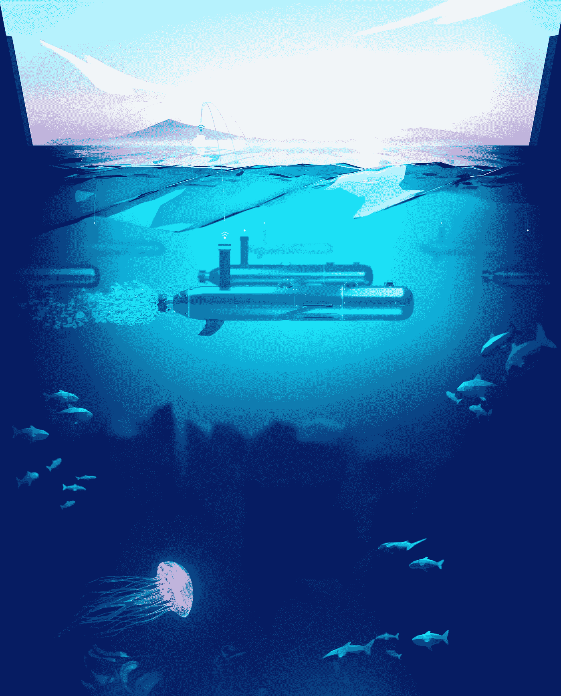
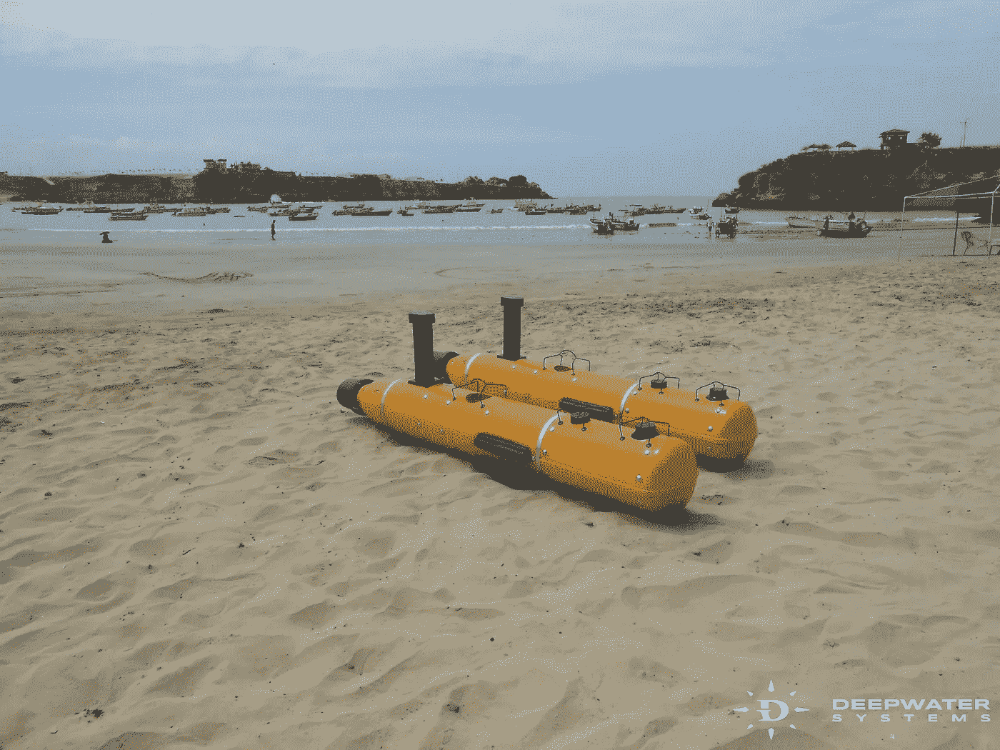

# 机器人印第安纳·琼斯！厄瓜多尔启动计划创建水下寻宝无人机舰队

> 原文：<https://medium.com/hackernoon/robot-indiana-jones-ecuadorians-launch-plan-to-create-underwater-treasure-searching-drone-fleet-b990e7c53ea1>

> *MVP —最小可行产品*[*https://deepwater.systems/mvp.html*](https://deepwater.systems/mvp.html)
> 
> [*https://www.facebook.com/DeepWaterSystem/*](https://www.facebook.com/DeepWaterSystem/)

> *机器人和人工智能代替了直觉和运气。我说的是寻找水下宝藏和厄瓜多尔商人的提议。他们想出了一个主意，创建一个无人机舰队，将能够找到沉船。水下机器人军队将会自动扫描海底，一米一米地扫描，那里隐藏着无数的财富。联合国教科文组织估计，海洋中有 300 万艘沉船的遗迹。成百上千艘这样的船可能装载着据传价值数万亿美元的宝箱。最昂贵的货物——西班牙国王的宝藏——是几年前发现的。来自* [*加勒比海*](https://hackernoon.com/tagged/caribbean) *的黄金和翡翠价值 150 亿美元。无人驾驶机队可以出售获利。这家初创公司的作者承诺，将根据他们的研究成果制作一张舰船地图，并拍卖他们的坐标。这些数据只能用加密货币购买。一个问题出现了:当他们自己可以使用这些有价值的数据时，为什么要分享呢？*

> *无人机配备了传统的* [*硬件*](https://hackernoon.com/tagged/hardware) *。它们的长度约为 2 米，最大深度约为 600 米。他们的声纳定位仪也很标准。然而，有些方面是相当奇怪的。已经上市他们可以自主工作半年。相比之下，美国的同类产品:根据其技术档案，其运行时间仅为 70 小时。厄瓜多尔和美国的原型车都有电动机和大型锂离子电池。那么是什么让它们如此不同呢？*
> 
> 顺便说一句，多亏了美国的无人驾驶飞机，发现了沿着哥伦比亚海岸运送黄金的西班牙大帆船圣何塞号的沉船地点。它在加勒比海沉没了。该项目的作者将海洋和墨西哥湾列为优先项目。
> 
> 然而，厄瓜多尔寻宝者计划沿着新旧世界之间的历史贸易路线扫描大西洋和太平洋的海底。另一个问题出现了:其他国家将如何对待在其海岸的迷你潜艇？
> 
> 这个项目不仅仅是厄瓜多尔的项目。看到作者名单就清楚了。它由亚历杭德罗·加夫里柳克创建。15 年的 IT 经验以及他创办了一家特殊公司的事实。看来 Gavrilyuk 的厄瓜多尔团队不会与寻宝者分享信息。他们保留检查最有希望的地点的权利，并计划每年让一两艘船浮出水面。