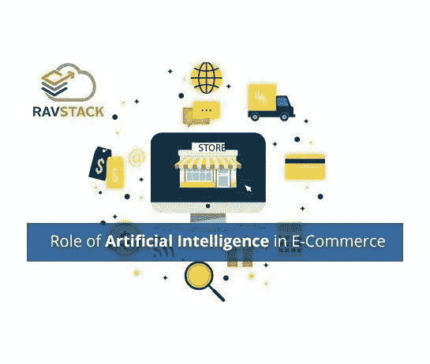

# 人工智能在电子商务中的作用

> 原文：<https://medium.com/hackernoon/role-of-artificial-intelligence-in-e-commerce-404cad38e1a>

# 人工智能在电子商务行业中的作用

人工智能现在不再是一个闻所未闻的概念。事实上，它对几乎所有可以想象的事情都有影响。从智能家居到 e- [学习](https://hackernoon.com/tagged/learning)甚至电子商务，几乎没有哪个领域没有受到[电子商务](https://magnostack.com)的影响。

事实上，人工智能正在嵌入我们生活的每个方面。现在，当你逛商场时，你会看到几个自助结账柜台。甚至机场现在也配备了最先进的安全检查系统。

简单地说，现在机器正在帮助我们，这是我们以前想都不敢想的。更重要的是，他们比人类更好地完成任务。现在，人们利用机器来完成日常工作，这样他们就可以把精力用在做更好的事情上。

我们生活在一个利润驱动的全球世界，销售不分时间进行，[业务](https://hackernoon.com/tagged/business)需要在一天的所有时间为客户提供服务。

电子商务中的人工智能有助于实现这一目标。它使公司能够实时收集和调查数据，从而提高业务效率和竞争力。

向顾客提供关于他们偏好的知识的个性化体验。

# 人工智能在电子商务中的一些例子

# 聊天机器人

电子商务网站现在提供 24/7 的帮助，这是因为聊天机器人。早先这些聊天机器人只是提供习惯性的回答，现在它们已经变成了智能生物，能够理解访问者必须处理的所有问题。

一些在线购物网站现在有聊天机器人来帮助人们做出购买决定。甚至像 Facebook Messenger 这样的应用程序也有聊天机器人，潜在客户可以通过聊天机器人与供应商网站进行交流，并在购买过程中提供帮助。这些机器人通过语音和/或文本进行交流。

# 客户关系管理

人力资源是客户关系管理(CRM)基础的日子已经一去不复返了。为收集和评估数据做出了巨大努力，以便为客户提供一流的服务。

现在，人工智能可以筛选海量数据，以准确预测哪些客户将执行购买决定，因此，人们正在努力确保他们的参与。

客户关系管理准确定位购买趋势，以便你的行动有正确的方向。借助先进的 CRM 解决方案，预测更加准确，因此销售团队可以专注于与客户建立长期的联系。

销售代表从分析数字的单调任务中解脱出来。他们现在可以专注于他们的收入目标。所以，现在 AI 成了销售努力的支点。

# 物联网

凝聚力带来更顺畅的运营，这就是物联网打算做的事情——为我们生活的所有元素提供连接。

从同步不同的设备到编程你的洗衣机、灯、家用电器甚至你的汽车，物联网无处不在。物联网正在对我们生活中的几乎所有事物产生影响。它甚至监测城市的交通灯和空气质量。

B2B 零售商和 B2C 零售商都可以从物联网革命中受益匪浅。物联网基本上是人工智能的一个分支，正在改变我们生活的参数。

# 实现销售目标的人工智能

是销售让世界运转；电子商务基本上都是为了创造销售。人工智能可以在整个客户旅程过程中提供帮助，从寻找潜在客户到提供售后服务。

事实上，通过提供对销售代表、销售组织等细分的销售趋势的清晰洞察，人工智能可用于为销售经理生成宏观层面的精确收入预测。

由于这一点，公司可以优化资源分配，以建立一个健康的管道，检查团队绩效，并导致成本效益的结果。

所有这些都归功于规范的洞察力，销售经理可以了解销售趋势的原因，以及需要采取哪些措施来增加销售额。

# 产品内容管理

从处理库存到对产品进行编目，人工智能使企业能够提供完美的客户体验。所有重要数据都保持在正确的轨道上，并经过组织以提供出色的结果。

人工智能在为每个接触点提供独特而可靠的客户体验方面大有作为。人工智能实际上正在导致有效的产品内容管理(PCM)。

需要集中处理在不同地区提供的特定产品的复杂性，并根据当地情况进行调整，以便客户获得稳定的体验，无论他们是在附近的商店还是在世界上的任何地方购买该产品，甚至是在网上购买。

# 客户服务

在任何蓬勃发展的经济中，客户服务是成功的关键，人工智能使您能够完美地踏上卓越的客户服务之路。

人工智能使品牌和企业能够强调什么是关键:客户的满意度和对他们的需求做出反应，而不管它何时出现。

人工智能解决方案有助于提供出色的客户服务。这最终会转化为销量。

在混合客户服务环境中，人和机器之间达到了平衡。最好的人工智能选项被利用，同时代理知识被用于保存客户上下文。

聊天机器人和机器[学习](https://hackernoon.com/tagged/learning)技术适合第 1 层服务项目，因为它们可以回答常规的客户问题，但在涉及复杂的客户特定问题时，它们就不太好了。

随着未来面对面互动的数量将会下降，人工智能在电子商务中的重要性将会大大提高。

许多常规任务将实现自动化，以便客服人员集中精力做他们最擅长的事情:为客户提供增值的个人服务。

# 自动化

人工智能和机器学习并不意味着机器人正在接管，尽管有些人觉得有这些印象。

人工智能基本上是为零售商提供机会，提供顾客想要的东西，而且不受任何时间限制。

通过利用人工智能，销售代表可以以更好的方式联系客户。这也有助于节省他们的时间，消除反复解释一件事情和重复微小细节的挫折感。

# 人工智能无处不在——一些事实

据估计，到 2020 年，85%的客户互动将在没有任何人类参与的情况下进行。一些电子商务企业正在利用人工智能来更好地了解他们的客户，以创造新的线索，并提供无缝的客户体验。

在快速变化的世界中，这是一种持续的创新。随着世界发生的变化，我们看到商业世界中的人工智能前所未有。

制造商、零售商甚至是数字初创企业都在不断竞争，以争取消费者。第四次革命有机会看到事物发展的方式。

现在，一个品牌不需要一个实体场所就能存在，并能为其目标受众所用。

人工智能正在以超快的速度改变着世界的零售游戏。如果你跟不上人工智能的步伐，它将导致你的业务快速下滑。所以现在因为 AI，电商变成了创新者的游戏。

Ebay、 [ShopBot](https://hackernoon.com/tagged/shopbot) 和 Amazon Go，还有很多更好的应用程序，它们提供了无尽的机会来简化客户的旅程，这些应用程序极大地依赖于人工智能解决方案。

他们唯一的目标是为他们的客户提供一个巨大的购物体验。由于人工智能算法的个性化营销在电子商务已经开发出来。

消费者接触点的数量迅速激增——在线商店、聊天机器人、网站、语音助手等，人工智能正在所有终端提供个性化体验。

预计人工智能将在未来几年进入涡轮驱动阶段，谷歌和微软等巨头将对创新的人工智能计划进行巨额投资。

谷歌最近以 4 亿英镑的天价收购了 DeepMind 这是一家人工智能公司，专门研究电子商务中的算法。

IBM、脸书和雅虎等其他领先的科技公司已经公开表示，他们将使用人工智能来为他们的业务带来更好的收入。

# 人工智能在电子商务中的切实好处

# 1.使用人工智能进行销售预测

人工智能的一个非常重要的用途是进行销售预测。人工智能有助于分析大量用户数据，并在此基础上提供关于消费者购买模式的有用见解。

现在，如果一个人去分析如此庞大的数据，将会花费很多时间。人工智能为你做这一切，并协助确保销售。现在可以在网飞看到人工智能的这种应用，它基本上可以根据用户的选择预测任何观众想要看到的内容。

因此，在用户实际确定之前，他面前有多种选择。因此，当谈到明智的预测时，人工智能也会为你做同样的事情。

# 2.利用人工智能以可承受的成本提供优质服务

人工智能有助于消除冗余。它使日常流程自动化，从而提供个性化的营销选择。例如，有了聊天机器人，企业可以大大节省客户服务成本。

**这样做是因为:**

*   聊天机器人增加了响应时间
*   解放特工去执行其他艰难的任务
*   回答超过 80%的常规问题

因此，这不仅会带来成本最小化，还会有助于开发以客户为中心的方法。

# 3.利用人工智能提高客户满意度并促进销售

除了提供一流的客户服务，人工智能也有助于会话商务。这基本上是实时的，是客户端和 messenger、chatbot 或语音聊天之间类似人类的交互。

这是通过利用自动化智能服务来实现的；向用户提问以理解他或她的意图，然后相应地进行个性化推荐。

所有这些都提高了客户满意度，从而确保了更高的销售额。例如，Ebay 的 ShopBot 根据 GIF-enhanced 问答游戏中提供的信息，展示策划的交易。

星巴克的聊天机器人可以在该公司的应用程序中看到，这使得下单变得如此简单和方便，你可以根据自己的意愿使用语音命令或短信。聊天机器人会告诉你订单详情。当您的订单准备好时，聊天机器人也会向您提供信息。

必胜客也推出了类似的服务。它推出了 Facebook Messenger 和 Twitter 应用程序，从用户那里接受订单，甚至跟踪送货情况。用户还可以重新订购比萨饼，询问他们想要什么，还可以看到正在进行的交易。

# 4.使用人工智能接收个性化内容

人工技术为任何企业提供了巨大的竞争优势，无论其经营规模如何。一个很好的例子是 Pinterest 最近对其 Chrome 扩展的更新。

它允许用户在网上挑选任何图片中的任何物品，然后要求 Pinterest 通过使用该图像来提供类似的东西。

AI 基本上是以无与伦比的精力在进军电商。谷歌、Pinterest 等公司已经推出了视觉搜索功能，亚马逊等巨头现在主要进入 Echo 等语音激活系统。

没有一个行业没有被人工智能提供的巨大可能性所触及。网络零售行业其实只是冰山一角。

# 5.人工智能在营销中的应用

正确处理营销预算通常需要完整的领域专业知识。这需要额外的和很多次不必要的成本为小企业。

幸运的是，在当前时代，由于人工智能解决方案意味着营销，小企业甚至可以有效地使用适度的预算。

小规模公司可以将他们的营销活动交给人工智能平台，如 Acquisio，该平台处理不同渠道(如 Bing、Adwords、脸书)的营销业务，分析广告表现，并参考 PPC(即每次点击付费)就最可行的预算分配提供明智的建议。

通过利用人工智能营销解决方案，公司可以提出最佳营销策略，并极大地降低每次点击成本。

这是因为情感分析算法有助于参考他们的营销活动分析参与度。

定期投标的自动化以及有效的预算监控也节省了雇佣额外营销人员和广告人员的费用。

这就是人工智能在电子商务中的一些优势。AI 在各种规模的业务中的气度相当多。事实上，人工智能正在改变当今企业的运作方式。

找专家建议？参观— [马格诺斯塔克](https://magnostack.com)

▓▓▓▓▓▓▓▓▓▓▓▓▓▓▓▓▓▓▓▓▓▓▓▓▓▓▓▓▓▓▓▓▓▓▓▓▓▓▓▓▓▓▓▓

关于拉维·夏尔马:

我帮助企业建立-

✔他们与现有客户的更好的连接

✔帮助他们寻找新客户

用更好的解决方案改进✔流程

✔数字品牌吸引新市场

✔生活更美好！

*要了解更多关于我如何帮助你的信息，请联系我。*

▓▓▓▓▓▓▓▓▓▓▓▓▓▓▓▓▓▓▓▓▓▓▓▓▓▓▓▓▓▓▓▓▓▓▓▓▓▓▓▓▓▓▓▓