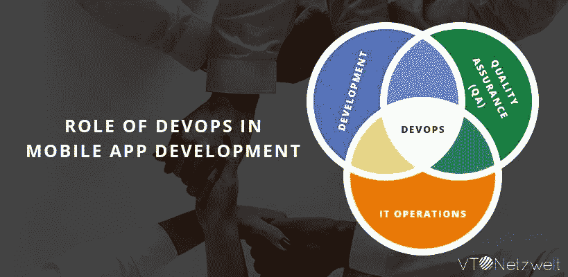
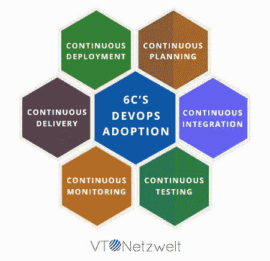
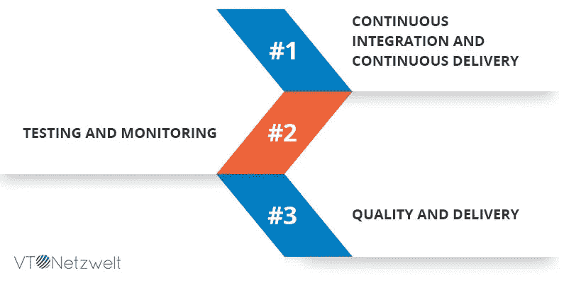

# 开发运维在移动应用开发中的作用—移动开发运维

> 原文：<https://medium.com/hackernoon/role-of-devops-in-mobile-app-development-mobile-devops-25e684fcd52e>

在过去的 5 年里，移动设备已经成为全球数百万人访问互联网的主要来源。这些趋势促使许多行业通过为其业务应用开发移动应用来适应业务应用用户的转变。

在这一转变的早期，IT 行业专注于满足市场需求，企业专注于创造市场存在，而他们忽略了关注应用程序开发成本、安全性、可维护性、代码质量等。

目前，随着潜在的激增已经稳定下来，这是一个很好的机会来关注这些问题，并采用新的方法来降低成本和提高质量。

在这篇博客中，我们将讨论移动应用开发中的 DevOps 方法、面临的主要挑战以及克服这些挑战的最佳实践。

# DevOps 是什么？

DevOps 是一种现代软件工程方法，它专注于项目经理、开发人员和运营人员之间的有效协作，同时与企业业务目标保持一致。

在 DevOps 方法之前使用的传统技术缺乏[软件开发](https://www.vtnetzwelt.com/services/outsourced-product-development/)的各个部门之间强有力的协调工作，最终导致额外的开发时间、客户口袋中更多的漏洞，并导致客户不满。采用 DevOps 的好处

# 采用 DevOps 的好处

DevOps 让开发和运营团队步调一致。在 DevOps 之前，开发人员习惯于编写完整的代码，然后将其传达给运营团队。借助 DevOps 流程，职责在不同团队之间平均分配，只有一个目标，即每个团队都清楚地了解应用性能。

在您的企业产品中采用 DevOps

*   连续软件交付
*   增强的客户体验
*   更快地解决错误修复/问题
*   更高的员工参与度
*   更快的产品交付
*   更稳定的环境，便于部署
*   更多创新时间
*   提高效率

# 采用 DevOps 的 6C

*   **连续规划**

持续计划是指将您的整个团队，如开发人员、业务分析师、测试人员和操作团队，聚集在一个公共平台上，以确定发布计划准备过程中应用程序的范围。

*   **持续集成**

持续集成(CI)通过关注遵循版本控制的最佳实践和标准的无错构建来解决开发人员社区的问题。

*   **连续测试**

测试是软件开发生命周期的重要组成部分。测试确保交付给客户的产品质量。DevOps 中的连续测试强调软件测试所有阶段的自动化。

*   **连续监控**

连续监控确保应用程序按预期运行，并且生产环境保持稳定，无论变化频率如何，无需任何人工干预。

*   **连续交货**

连续交付是一种实践，它通过将每个变更交付到类似生产的环境中来确保代码被部署到生产环境中。

*   **连续部署**

持续交付的下一步是持续部署。通过持续测试的每一个通过自动化测试的变更都会被自动部署到生产环境中。

# 移动开发平台

在[移动应用程序开发中采用 devo PS](https://www.vtnetzwelt.com/services/mobile-app-development/)可以改变许多组织的游戏规则。DevOps 确保所有不同的团队在执行方面变得更加高效。

然而，采用 DevOps 并不是一个简单的过程，因为它需要大量的技术和业务决策，但一旦成功实施，就可以在客户满意度、提高效率和增加收入方面为组织带来价值。

为了适应持续的移动开发工作流，首先需要识别所有的瓶颈和潜在问题。

# 在移动应用开发中采用 DevOps 的挑战

虽然在 web 应用程序和移动应用程序中采用 DevOps 的基本原则是相同的，但在移动应用程序开发中采用 DevOps 仍然存在一定的挑战。这些挑战包括

*   **多平台支持**

移动应用程序有多个目标环境。大多数移动应用针对多种设备、操作系统版本、硬件规格等。

*   **苹果应用商店和谷歌 Play 商店**

通常，移动应用程序不能直接部署到移动设备上。它必须通过苹果的苹果应用商店和谷歌 Play 商店的安卓应用商店。该应用程序经过应用程序商店的提交和审查过程。

*   **拉式部署模式**

传统部署采用推送模式，无论是 web 应用还是基于云的应用，都可以推送新版本的应用。然而，更新移动应用程序的过程是一个拉过程，因为这取决于用户选择他/她是否想要更新应用程序。

*   **手机应用测试**

没有什么比给你的手机应用程序打 1 星更糟糕的了。不满意的客户可以通过 App Store 或 Play Store 公开损害你的品牌。因此，使用功能、可用性和性能测试技术对你的应用程序进行严格的测试变得极其重要。

# 如何采用移动 DevOps？

在您的组织中采用移动开发运维需要遵循 3 条经验法则

# 规则#1 —持续集成和持续交付

*   移动应用程序开发团队必须确保所有开发资产的可追溯性，包括代码、配置、脚本、文档、文本文件等。必须实践持续集成，以确保一个团队交付的代码能够与另一个团队交付的代码协同工作。必须进行频繁的构建，新代码必须与先前开发的代码集成。
*   Android 和 iOS 完全主导了移动应用的格局。Android 和 iOS 非常分散。几乎每个品牌都有不同类型的安卓变种，苹果也将 iOS 扩展到支持 iPad。由于碎片化，开发人员必须为每个目标变体和平台维护单独的构建。
*   移动应用程序开发人员习惯于利用 IDE 来手动生成构建。手动为不同的平台生成不同的版本。随着构建数量的增加，开发人员可以使用脚本来生成自动化构建。开发人员可以通过分配版本来管理这些脚本，从而确保任何版本都可以在任何时候重现。

# 规则 2 —测试和监控

*   在测试自动化方面，移动应用程序开发落后于企业 web 应用程序。大多数移动应用程序测试是在模拟器上进行的，而不是在实际的物理设备上，模拟器上的测试是一个完全手动的过程。考虑到平台和外形的数量，甚至不可能进行手动测试。唯一可能的方法是使用自动化测试工具来测试你的应用。
*   每个移动应用程序都需要与后端应用程序和服务进行交互。与后端应用程序相比，移动应用程序遵循快速开发流程，这导致了更多的版本。这种快速发展导致应用程序中出现了生产环境尚不支持的新功能。为了解决这个问题，可以在虚拟实例上提供整个生态系统。这导致了快速测试并且还节省了硬件资源成本。
*   应用程序在测试环境中表现良好，但在实际环境中却失败，这是一种非常常见的情况。可能有不同的因素与故障相关，如网络条件、内存、电源等。因此，对于开发人员来说，通过向应用程序添加第三方 SDK(如日志、崩溃报告等)来找到故障的根本原因，从而确保持续的性能监控变得非常重要。

# 规则 3 —质量和交付

*   开发人员应该密切关注应用商店的反馈和评级，以便将来进行增强和改进，从而不断改进移动应用。

# 使用移动 DevOps 的优势

*   **创造更好的应用**

如今用户体验是最重要的因素。Mobile DevOps 支持即时报告和反馈、回归测试、透明的开发流程，从而更快地排除错误、修复错误并优化用户体验。

*   **发布时间更快**

DevOps 增强了不同部门和团队之间的协作，简化了信息共享过程，从而加快了代码发布。

*   **减少瓶颈**

DevOps 确保了一个透明的过程，增加了不同团队之间更好的沟通，并有助于构建更好的产品。DevOps 消除了几个瓶颈，包括

*   不一致的开发过程
*   缺乏所有权
*   手动测试过程
*   工作流程的不稳定性
*   沟通不畅

更多见解请访问我的网站— [VT Netzwelt](https://www.vtnetzwelt.com)