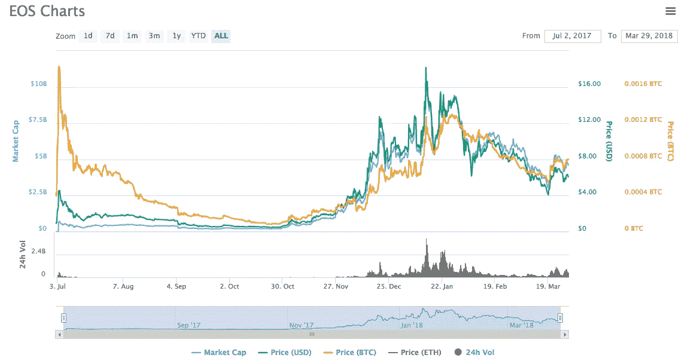
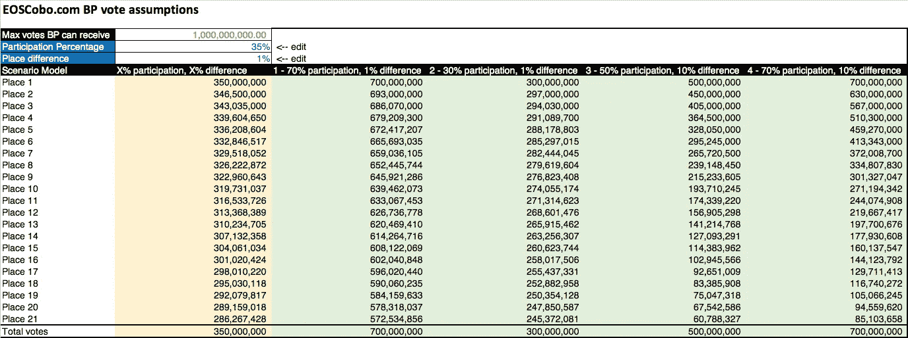
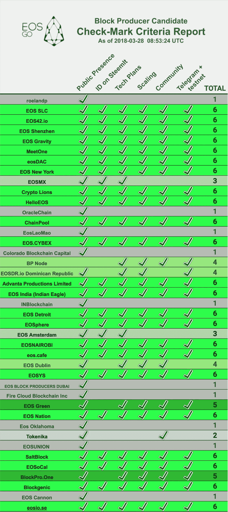
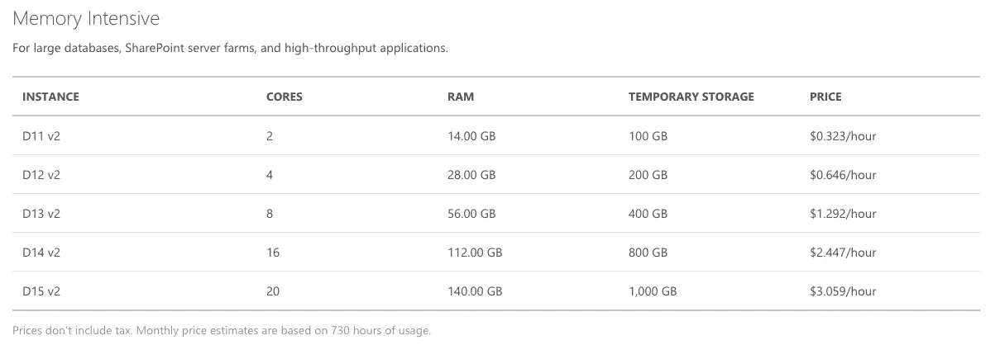
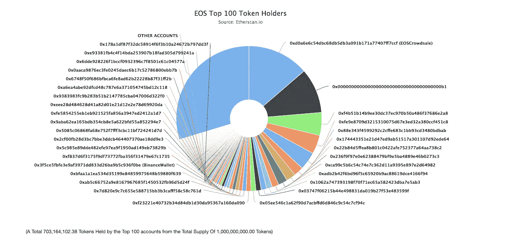
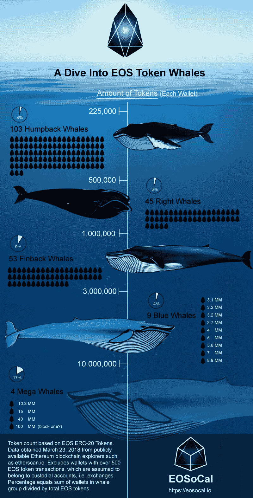

# 21 个伊奥斯王国的浪漫史

> 原文：<https://medium.com/hackernoon/romance-of-the-21-eos-kingdoms-459ca5bf2b9e>

## 对 EOS 中区块生产者模型现状的深入分析

作为“2018 年 6 月 3 日，格林威治时间上午 7:00+9”EOS 主网络(mainnet)发布会的一部分，争夺 21 家区块制作商(BPs)之一的战斗正在进行。作为 DPOS 区块链的授权证明，EOS 的块确认将由这 21 个块生产者处理，由他们的选民投票决定，而不是像比特币一样使用耗能的工作证明(POW)共识块确认。

目前，不同的业务伙伴各有所长，例如，EOS New York 在监管方面拥有丰富的经验和领先地位，而中国的 EOS 团体似乎拥有大量追随者和许多 EOS 令牌持有者的强大支持。由于持有的每个 EOS 令牌都将拥有 30 张选票(每个令牌不能两次投票给同一个节点)，块生产者将必须确保他们赢得足够的选票，以便有资格进入前 21 名名单，或者在备用名单上坐冷板凳。

因此，随着 mainnet 启动日期的临近，每个区块生产商都有一个非常有竞争力的投标来提出他们的建议和对社区的贡献。

在本文中，我们将探讨 EOS、当前的砌块生产商、成为砌块生产商的要求以及 EOS 社区。

# 什么是 EOS？

EOS 是由 Dan Larimer 创建的(他也是 Steemit 和 Bitshares 的创始人，这是该领域早期的一些产品，展示了去中心化应用程序和 DPOS 的可能性)。

主要是由于法律原因，以免被解释为一个安全，EOS。IO 软件由一个名为 block.one 的独立实体生产，由丹·拉里默(Dan Larimer)领导。EOS。IO 是一个免费的开源软件，供 EOS 开发者使用。作为其软件套件的一部分，开发人员可以创建 EOS 智能合同，并在分散自治组织(DAO)内制定治理系统，并将其用作分散应用程序(dApps)的操作系统。

Dan Larimer — founder of EOS

EOS 背后的理念是创建一个区块链平台，实现以下功能(在技术[白皮书](https://github.com/EOSIO/Documentation/blob/master/TechnicalWhitePaper.md)中有更详细的解释):

1.  支持数百万用户
2.  自由交易(用法)
3.  轻松升级和错误恢复
4.  低延迟
5.  连续性能
6.  并行性能

包含这些属性的 EOS 的设计源于这样一个事实，即当前的区块链往往存在可伸缩性问题，使得它们难以部署到需要快速响应和大量确认的应用程序中。例如，比特币大约每 10 分钟进行一次分组确认，以太坊大约需要 13-14 秒，当用户排队或在线等待交易确认时，面向消费者的应用程序或支付系统很难真正提供及时的反馈。

总共有 1B 可用的 EOS 代币，EOS 生态系统开发的初始资金是通过为期一年的代币销售获得的。核心团队表示，EOS 令牌的分发需要 341 天，以便为机构群体提供充足的时间来熟悉项目并参与分发。

EOS distributed and ETH collected as part of the token sale as of April 4th, 2018

截至 2018 年 4 月 4 日，已通过代币销售分发了 776，000，000 个 EOS 代币。作为代币销售的一部分，收集的 ETH 总量为 4，768，749 ETH。

根据 2018 年 3 月 29 日的 [Coinmarketcap](https://coinmarketcap.com/currencies/eos/) ，EOS 是市值排名第六的令牌，为 4，631，625，931 美元。

EOS on CoinMarketCap as of March 29, 2018

# EOS 投票系统

当前版本的 EOS 投票系统的工作方式是，每隔 180 秒左右，每个代币持有者的所有投票都会被计算在内，前 21 名制作人将在这一轮中当选。目前有 1B EOS 代币——假设每个 EOS 代币持有者将所有代币用于投票，那么所有候选区块生产商将收到大约 300 万张选票。

虽然有很多关于成为一个可持续 BP 所需票数的讨论，但我将从几个角度进行分析。这当然是一个假设，并作为你的基础指南:

1.  相比之下，LISK，也是 DPOS 区块链，已经有一个现场投票过程。
2.  使用一些基于 EOS 环境的基本假设。最后的结果如何，谁也说不准，但我们可以根据目前的情况得出一些假设。请注意，随着未来几周更多细节的公布，经济结构也将发生变化。

## LISK 比较

我们可以比较 EOS DPOS 结构和 Lisk 计划，另一个项目利用 DPOS 结构。

Lisk 有一个 101 个“代表”的系统，每个选民有 101 张选票，没有双重投票。由于有超过 1500 名可能的代表投票，前 101 名代表了所有可能候选人的 6-7%。根据 Coinmarketcap 的数据，LISK 代币的流通供应量为:103，481，304。单个代表可以获得的最大票数也是:103，481，304。

此刻，最高代表是“the pool”:【https://explorer.lisk.io/delegate/10839494368003872009L】T2。该代表已获得 10，988 名选民的 42，464，294 张选票，支持率为 35.49%。该代表每位选民的有效平均票数为 3864。

第 101 位代表是“alepop”:【https://explorer.lisk.io/delegate/9010579446607279905L】T4。该代表已获得 4593 名选民的 29661297 票，支持率为 24.79%。该代表每位选民的有效平均票数为 6458。

有趣的是，101 名 Lisk 代表中有 33 名是 GDT 集团的成员:[https://pool.liskgdt.net/members](https://pool.liskgdt.net/members)，该集团保持着一份透明的成员名单，并不断为 Lisk 社区做出良好贡献，使其代表的合并合法化。

因此，如果我们从 Lisk 获取该信息的表面价值，以获得 EOS 区块生产者候选人投票的数字，利用 1B EOS 令牌，每个区块生产者理论上可以最多接收 1B 投票。**排名第一的 BP 将获得约 3.5 亿张选票，排名第 21 的 EOS BP 将获得约 2.5 亿张选票。**假设每个投票者平均拥有 5000 张选票，将有大约 70，000 名投票者支持排名第一的 BP，50，000 名投票者支持排名第 21 的 BP。

## 基于假设的计算

计算 EOS 投票程序潜在结果的另一种方法是采用一些常识性的方法来理解不同的场景，考虑基于经济激励的不同参数。

在我计算可能投票结果的简单模型中，我使用了基于两点的计算:

1.  参与:投票过程中有多少代币参与
2.  等级之间的投票差异:一个 BP 从它的前一个 BP 得到多少投票差异

在这种情况下，我模拟了多个场景，展示了基于参与度和投票差异这两个因素，每个 BP 的投票结果可能会如何。实际上，投票率可能没有那么高，因此我将这些场景中的投票率限制在 70%；假设只有大宗生产商自己投票，这个数字可能会低得多(这意味着可能存在投票交易，这是违反宪法的)。

我在这些模型中没有展示的另一个危险是，不是所有的 30 个投票都需要为每个令牌部署；例如，BP 可以选择只为自己和盟友投票。如果持有量足够大，可能会发生合谋，前 21 名属于同一个卡特尔，每轮都投票给对方。

由于 21 不是一个大数目，我们不能排除这种勾结的可能性。

如果你有兴趣自己玩数字，请在这里抄一张表:[https://docs . Google . com/spreadsheets/d/1 guefkdn 9 lfzjmjhkujp 16 rhlzdu 1 eaihhtu 1 eqcbsmy 0/edit？usp =分享](https://docs.google.com/spreadsheets/d/1gUEFkDN9LfZjmJhKuJP16rhLZdu1eaIhtu1eQCBSmy0/edit?usp=sharing)

*(如果你确实模拟出了潜在共谋的影响，请与我分享，我可以在本帖中展示你的模型。)*

# 砌块生产商的角色

砌块生产商是 EOS 不可或缺的一部分。IO 网络。从本质上讲，它们是分散的实体，代表 EOS 利益相关者运营和管理 EOS 区块链。他们以硬件形式为区块链提供大宗交易确认服务，并通过社区教育提升 EOS 的价值。

区块生产商将受到激励，继续成为其 EOS 利益相关方的良好 BP，因为他们每年将获得一定比例的 EOS 通货膨胀令牌作为奖励。也就是说，他们必须留在 BP 点，这样他们才能获得更多的奖励；他们一致致力于让 EOS 有更多的项目和支持者，这样他们得到的代币的价值将随着时间的推移而增长。

BP 奖励的确切金额现在*可能*被限制在 1%；在这一层面上，BP 需要在资源分配方面具有高效性，以便在作为 BP 运营时具有经济意义。优秀、高绩效 BP 的一些要求是:

## 技术:

*   区块创建/确认
*   文件托管
*   备用服务器待命
*   初始化和指定种子节点

## 治理:

*   遵循宪法
*   账户冻结，针对不当合同的行动
*   强制执行文件的删除通知
*   保持在硬分叉和软分叉、费用(帐户创建)、优化参数(块大小、速率限制容量)的顶端

## 领导力:

*   就像传统公司的首席执行官一样，基本上控制内部的一切
*   与其他砌块生产商沟通
*   竞选成为英国石油公司的一员

## 可能的额外服务:

*   帐户恢复
*   帐户创建
*   神谕
*   价格源
*   争议解决服务

EOSphere 很好地总结了 EOS 区块生产商的角色:https://youtu.be/YLt5uexD9gg

EOSGo 论坛决定，作为一名优秀的社区成员，他们将不会参与 Block producer 候选人的选举，以避免任何潜在的利益冲突。他们有专门的资源来根据 6 个主要标准评估不同的 BP:

1.  公众形象
2.  Steemit 上的 ID
3.  技术计划
4.  缩放比例
5.  社区
6.  电报+测试网

总分随后每周滚动发布在下面的信息图中:

EOSGo BP report for week ending March 28, 2018

# 成为砌块生产商的技术要求

由于 BPs 对区块链的健康和稳定至关重要，因此技术要求也相对较高。技术需求方面的确切需求仍在工作中，尚未确定，BPs 和社区中其他人谈论的所有信息仍是推测和猜测。

为了支持区块链成为 BP，企业级设置是必要的。例如，HelloEOS 等 BP 计划采用以下规格:16 个内核、256GB RAM、1TB SSD HD。

在这种情况下，为了估计配置类似设置的成本，我们观察了可比的微软 Azure 服务的价格:运行节点的 D15 v2、20 个核心、140GB RAM 和 1TB 临时存储——税前 3.059 美元/小时。以下规格的一套设备每年将花费 26，797 美元。(注意，即使是 D15 v2 实例也不能满足 HelloEOS 提出的 256GB RAM 的要求。)

Estimates from Microsoft Azure pricing for cloud services

维持这样一个机构的成本绝对不低，也就是说，只有那些具备必要的资金和技术资源的人才能参与竞标成为 BP。这可能标志着某种形式的自我选择，只有富裕的代币持有者和财团才能成为 BP，并从长远来看从 BP 奖励中受益最多。

此外，我们还看到许多 BP 使用 AWS 和 Azure 等云提供商的潜在风险，实际上是将 EOS 基础设施集中在当前寡头垄断的云提供商市场上，违背了分散化的初衷。

# 顶级 EOS 令牌持有者

说到集权，还可以分析一下 EOS 目前的代币持有者。由于 EOS 是今天 ERC 20 的代币，所有持有 EOS 的钱包都可以在 https://etherscan.io/token/EOS[的 Etherscan 上查看](https://etherscan.io/token/EOS)

大约有 300，000 多个具有 EOS 的唯一地址，其中 70%以上的令牌由前 100 个帐户持有。

Etherscan token holders chart for EOS

EOS SoCal 展示了另一个很酷的信息图表视图:

# 支持 EOS 的钱包

大多数支持 ERC-20 令牌的主要加密货币钱包和交易所都宣布了支持 EOS mainnet 令牌交换的计划。EOS 令牌销售结束后，EOS 令牌将从 ERC20 EOS 过渡到 Mainnet EOS。因此:

*   [Cobo](http://Cobo.com) 是一款支持 20 多种加密货币的安全移动钱包。
*   imToken
*   Scatter 支持在 web 应用程序上签署 EOS 事务(如 meta mask):[http://scatter-eos.com](https://scatter-eos.com)
*   像币安这样的交易所(见下面的“EOS 交易地点”)

# 在哪里交易 EOS

由于 EOS 目前是 mainnet 令牌交换之前的 ERC-20 令牌，因此让我们来看看使用您的 ETH 令牌获得 EOS 的途径(按字母顺序排列):

*   Bibox
*   币安
*   Bitfinex
*   Gate.io
*   HitBTC
*   火币
*   IDEX
*   北海巨妖
*   库科恩
*   Liqui
*   OKEx
*   YoBit

# dApps 计划在 EOS 上发布

*EOS 项目全指标:* [https://eosindex.io/posts](https://eosindex.io/posts)
[https://eosprojects.org/](https://eosprojects.org/)

## 一些重点项目:

*(排名不分先后，未来几个月会有更多)*

*   EasyEos——一款智能、便捷的 Eos 钱包。
*   evolution——使用 EOS 开源构建的新型去中心化区块链。EOS book——图书交换。
*   反义词. life——反义词. life——时刻准备着——你个人生活的 LinkedIn。
*   WEOS 社会 Dapp-WEOS:改善我们与彼此和整个市场的联系方式。
*   格雷斯兰项目——将管理规则编码到智能合同中的国家治理。
*   RedAppl——一款建立在 EOS 基础上的约会应用，带来了创新的进化档案算法。
*   结合 EOS 的高性能分散式交换机。具有 Bitfinex 经验的 IO 软件。
*   everipedia——众包维基平台，在线百科全书。
*   Ono——分散的社会网络。
*   分散 EOS 区块链的分散应用桥梁。
*   亿万富翁令牌——区块链上的分散式游戏。目前在以太坊。

# EOS 中的谁是谁

*(基于截至发稿时对 Github 和社区共享的贡献)*

与其他区块链项目一样，社区对其长期成功至关重要。对于 EOS，有一个新兴的爱好者和开发者社区，他们中的许多人已经在 EOSD 上运行测试。

作为参考，以下是您在 EOS 社区中看到的一些最活跃的成员:

## Block.one 核心团队:

首席技术官 Dan la rimer
产品副总裁 Thomas Cox
首席执行官 Brendan Blumerm

## 顶级 EOS。IO Github 提交:

凯文·海夫纳
布莱恩·约翰逊
流浪波特
内森·豪特
菲尔·梅斯尼尔
马蒂亚斯·罗密欧
马特·威瑟斯彭
吉兹扎克
安德里安托·李
安东·珀科夫
巴基·基廷格
比尔·汉密尔顿

# 新闻

为了跟上 EOS 中的什么是什么，还有大量的新闻资源。其中两个是许多社区成员的主要聚集地:

EOSGO 是一个很好的信息来源:[https://forums.eosgo.io/](https://forums.eosgo.io/)
EOS 的子编辑:[https://www.reddit.com/r/eos/](https://www.reddit.com/r/eos/)

# EOS 社区

电报组通常是寻找社区活动和集群的最佳起点。

以下是 EOS New York 整理的列表:
EOS 通用聊天(英语):[https://t.me/EOSproject](https://t.me/EOSproject)

## Meetup 频道:

EOS 纽约:[https://t.me/](https://t.me/joinchat/GmULkkp7EyiWjur4TOT9Kg)eosnewyorkchat
EOS 伦敦:[https://t.me/EOSLondon](https://t.me/EOSLondon)
EOS 内罗毕:[https://t.me/eosnairobi](https://t.me/eosnairobi)
EOS 香港:[https://t.me/EOSHongKong](https://t.me/EOSHongKong)
EOS 国家:[https://t.me/EOSNation](https://t.me/EOSNation)
EOS 海洋:[https://t.me/EOSSEA](https://t.me/EOSSEA)

## EOS 开发人员:

EOS 指数(当前 EOS 项目列表):[https://t.me/eosindex](https://t.me/eosindex)
EOS 社区测试网:[https://t.me/CommunityTestnet](https://t.me/CommunityTestnet)
EOS 开发者:[https://t.me/joinchat/EgOVjkPktgfUS3kt14FStw](https://t.me/joinchat/EgOVjkPktgfUS3kt14FStw)
EOS 游戏开发者:[https://t.me/EosGameDevelopers](https://t.me/EosGameDevelopers)

## EOS 价格和交易:

EOS 价格讨论:[https://t.me/EOSPrice](https://t.me/EOSPrice)

## EOS 讨论渠道:

EOS 区块制作者:[https://t.me/EOSPros](https://t.me/EOSPros)
EOS 治理:[https://t.me/EOSGov](https://t.me/EOSGov)
EOS DAC 创作者:[https://t.me/EOSDAC](https://t.me/EOSDAC)
EOS 机会:[https://t.me/eos_opportunities](https://t.me/eos_opportunities)
EOS 设计:[https://t.me/EOSdesign](https://t.me/EOSdesign)
EOS 营销:[https://t.me/EOSmarketing](https://t.me/EOSmarketing)

## EOS 新闻:

EOS Go 公告:[https://t.me/eosgo_announcements](https://t.me/eosgo_announcements)
EOS 空投:[https://t.me/EOS_Airdrop](https://t.me/EOS_Airdrop)丹拉里默 Bot:[https://t.me/daneos](https://t.me/daneos)EOS 空投# 2:[https://t.me/airdropsforeos](https://t.me/airdropsforeos)

## dApps:

chintai EOS:[https://t.me/](https://t.me/airdropsforeos)chintaiEOS
Everipedia:[https://t.me/](https://t.me/airdropsforeos)Everipedia
https://t.me/散点

## 韩语:

KOREOS:[https://t.me/koreosio](https://t.me/koreosio)T21【EOS】韩国:[https://t.me/EOSIOKorea](https://t.me/EOSIOKorea)

## 中文:

EOS 中国:[https://t.me/EOSCN](https://t.me/EOSCN)

# 结论

与任何新社区和项目一样，这种程度的动荡、兴奋和炒作是意料之中的。我个人的信念是，随着社区的发展和做出更具体的决定，我们将看到砌块生产商、开发商、投资者、用户和公司之间更加公平。让《21 EOS 王国演义》继续带给我们欢笑和欢乐。随着不同候选 BP 之间的差异，EOS 生态系统的创新、治理和负责任的增长将蓬勃发展。

如果你确实喜欢你在这里读到的内容，请密切关注我们在[Cobo wallet](http://cobo.com)&EOS 东南亚社区在 [EOSSEA](http://eossea.com) 。我们期待共同服务社会。