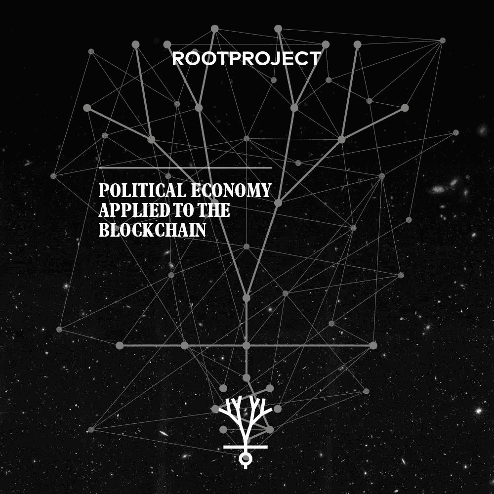

# 根项目的令牌与令牌化分权的经济学

> 原文：<https://medium.com/hackernoon/rootprojects-token-and-the-economics-of-tokenized-decentralization-c89561d9ce15>

作者 Nicholas Adams Judge 博士是一名政治经济学家，也是非营利组织[*root project*](http://rootproject.co)*的联合创始人。联合创始人克里斯·普莱斯是 Y Combinator 研究员。他们的 pre-ICO 实现了最初目标的 512%。RootProject 的 ICO 运行时间为 2018 年 4 月 10 日–13 日。它获得了严重超额认购，并将受到个人投资者硬性上限的限制。加入 RootProject* [*电报群*](https://t.me/Rootproject) *了解目前正在进行的事情。*

以下是我们商业计划中的一段。最重要的一点是，我们应该利用关于货币政策渠道的经济文献，来讨论和思考代币及其生态系统的相互作用。它也给出了根令牌在 [RootProject](https://hackernoon.com/tagged/rootproject) 正在构建的非盈利组织的分散生态系统中的效用和角色的想法。

**如果对系统的贡献主要是被动的——挖掘，而不是主动的——例如，使用你的本地知识来分析项目的预算，那么分权经济学就会不同。RootProject 是一个主动贡献系统。建立分散积极贡献的系统是一个创造*深刻[激励](https://hackernoon.com/tagged/incentivized)生态系统参与者的过程。在无等级制度的背景下，劳动要求更高的回报。代币带来许多好处，但从经济角度来说，它们最强大的特征是重塑参与者预期回报结构的能力。***

举一个典型的例子，考虑一个菲亚特生态系统的参与者。之前她赚了 10，000 美元，现在她赚了 100 美元，她希望她的贡献能让生态系统的市场价值增加 1%。她的预期收益仍然是 100 美元。在代币化系统中，她获得价值 100 美元的代币。她持有价值 1 万美元的代币。她的预期收益就变成了$ 100+1% *($ 10000+100)= $ 201。这个简化的例子说明了参与者效用的几乎无成本的翻倍。同样，它显示了如何激励令牌持有者成为积极的生态系统参与者。生态系统的参与者不仅仅是个人。非营利组织比个人有更大的组织能力，但比营利组织更有合作的传统。因此，它们是在分散系统中扩展地面服务的理想组织类型。在描绘生态系统参与者时，考虑个人和机构是很重要的。

## **令牌—生态系统渠道**

传统货币经济学研究货币政策如何通过各种渠道影响经济。例如，货币政策通过利率波动对经济增长的影响被称为“利率渠道”。以这种方式描述代币的作用是有用的，因为它为现有文献中的讨论提供了基础，并迫使描述代币设计影响生态系统生长和结果的精确机制。

***货币收费渠道*** 是 RootProject 减少自身令牌流动性供给的几个主要渠道之一。它创建了两个不同的通道。

***直供还原渠道*** 是最简单的机制。通过收取标准的众筹费用，但在公开市场上购买法定货币，社区众筹和流动性供应减少之间建立了简单、直接的联系。对这种减少的预期会从令牌持有者和生态系统参与者那里产生更高的预期回报。

***超价格竞争力通道*** 是货币-费用模型的另一个结果。这对 RootProject 生态系统的早期扩展尤为重要，并且已经引起了家喻户晓的慈善机构的极大关注。

货币收费模式的要点是减少流动性代币供应，而不扭曲相对于供求的价格。作为根，RootProject 通常持有运营费用允许的尽可能多的费用。然而，与价格相关的一点是，代币通过智能合约变得缺乏流动性，而不是谁持有该智能合约。为生态系统带来非凡价值的大型生态系统参与者可以在两年后发布的智能合同中持有自己的“费用”。这吸收了液体供应，支持了根令牌的价值，但允许主要利益相关者免费使用该平台。

RootProject 的货币收费模式就是一个例子，这种模式不仅需要代币，而且相对于非代币的市场策略而言，它还创造了巨大的竞争优势。

***生态系统储备渠道****——*由于 RootProject 的超高价格竞争力有助于开拓早期市场份额，大量积累的资本将被锁定在智能合同中。然而，合同持有人可以在 RootProject 生态系统中使用这些资金。这种被困住的资本鼓励(1)新的项目发起人选择 RootProject 而不是其他众筹平台；(2)成功的项目发起人成为捐助方；以及(3)承担新项目的成功项目发起人。

就其本身而言，储备渠道中的货币费用部分意义重大。然而，这只是产生大量被困资本的几种机制之一。总的来说，随着时间的推移，这些来源应该会大大减少流动性供应，并创造出相对于其他众筹平台的压倒性竞争优势。

***【养老基金】渠道****——*工人以当地货币赚取工资或薪金。然而，最重要的是 RootProject 慷慨的类似养老基金的实体。日工可以用他们有限的一部分财产捐赠给当地的项目。所有其他员工都可以参与到生态系统中，无论他们选择哪一部分。

***大型基金购买渠道*** —协商的大型基金捐赠代币购买混合模式，通过 RootProject 将代币引入社区众筹模式而成为可能。

这种捐赠——象征性购买混合方案可以用几个“胡萝卜”来谈判，包括从市场价格中获得小折扣，以吸引大量购买或主要捐赠者资助的项目。RootProject 将坚持在这种情况下，一小部分购买的令牌将被锁定，直到在生态系统中使用。

***实地渠道****——*随着 RootProject 机构能力的增长，它可以提供其他非营利组织会觉得有吸引力的合作关系和服务。作为这些合作关系的一部分，通过谈判购买和使用其代币，RootProject 的实地非营利组织也成为了其货币政策的工具。

通过货币作为费用、养老金和大型基金购买以及地面渠道，RootProject 创建了一套政策机制，通过这些机制，其生态系统储备渠道应相对于其众筹竞争对手产生强大的市场优势。

***生态系统参与者渠道****——*RootProject 保留一部分代币股票，用于奖励生态系统参与者，如专业项目发起人、经济研究人员、项目评审人员和主要合作伙伴非营利组织。通过适当调整这些补偿结构，RootProject 可以对生态系统增长和根令牌的相关预期价值进行“加油”或“刹车”。

**——在社区相关组织的背景下，针对生态系统特定表征的最广泛、最有力的论点之一涉及联盟构建，这主要通过经济利益的联盟来实现。**

**以一种历史上新颖的方式创造一种跨阶级和群体联盟共享的资产是一项重要的经济发展。这是将政治学最基本的共识应用到象征性的经济模型中。**

**上述渠道与央行的政策工具几乎没有任何相似之处。然而，就像运行良好的央行政策工具一样，它们相当于强大、可信的机制，通过这些机制来发展代币的生态系统并捍卫其价值。它们远非全能，但如果谨慎使用，它们能够在其生态系统中产生真正的价值。**

## ****生态系统中的令牌功能****

**以上是令牌对根项目生态系统影响的经济实质。实际的令牌函数如下。在商业计划的其他地方对它们有更详细的解释，但为了清楚起见，在这里对它们进行了简化。**

***【养老基金】*—RootProject 不是将生态系统中产生的价值输出到其他金融资产，而是通过将日工和员工的中期养老基金样的薪酬保留在 ROOTS tokens 中来实现一些目标。**

**对于日工来说，智能合同系统根据个人目标的实现来支付报酬；例如参加药物滥用研讨会。**

***利益攸关* —地方社区项目的分散监管至关重要。众筹平台结合地上组织之所以还没有成为成功的商业模式，是因为关于当地情况的信息成本；例如材料成本和许可要求。如此高的信息成本阻碍了扩展，因为聚合成本很高，而且经常发生变化。**

**通过激励那些已经具备这些知识的人(如当地承包商)参与该系统，这些信息的成本会从很高降到很低。创建一个标记项目的小成本并对正确标记的项目给予奖励需要一个令牌，这是创建社区评论系统的一种非常有效的方式。**

***非营利组织协调*——对协调项目的投票不能按照一个组织一票原则进行。参与项目必须有一些经济相关的措施。根据社区内根令牌的部分进行加权是衡量参与者之间利益相关程度的理想方法。**

***社区众筹投票*——在个人中，对当地生态系统治理和项目议程的投票也必须根据系统的活跃程度和买入程度进行加权。如果没有这样的权重，搭便车和其他经典的集体行动问题就会出现。通过奖励生态系统的参与，被深深激励的参与者被创造出来，同时系统的分散性质允许它适应非常不同的社区环境。**

***代币购买* — *混合捐赠* —作为一种加密资产，虽然有升值的潜力，但与城市中最弱势群体的福祉直接相关，ROOTS 旨在为那些通常不会参与非营利活动的人带来价值。**

**简而言之，令牌是以社区为中心的生态系统的理想工具。虽然乍一看很新颖，但 RootProject 生态系统的设计实际上只是主流政治学和经济学的一些最基本共识在加密资产世界中的延伸。**