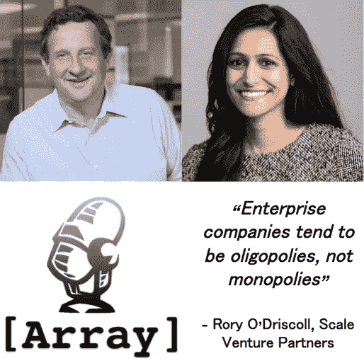

# “企业公司往往是寡头垄断，而不是垄断”

> 原文：<https://medium.com/hackernoon/rory-odriscoll-founder-of-scale-venture-partners-discusses-enterprise-investing-ipos-diversity-3cf038b8962f>

## Scale Venture Partners 的创始人 Rory O'Driscoll 讨论了企业投资、公司上市、人工智能以及建立一个持久的风险投资公司

Rory O’Driscoll, Scale Venture Partners with Shruti Gandhi, Array.vc

Rory O'Driscoll 是 Scale Venture Partners 的联合创始人和合伙人。Scale Venture Partners 刚刚筹集了 4 亿美元的第六只基金，管理着超过 15 亿美元的资产。Scale 作为一家公司有着有趣的开端；它们是美国银行内部的风险投资基金，2007 年由 Rory O'Driscoll 和 Kate Mitchell 分拆为一家独立公司。Scale 是 SV 为数不多的由女性创始人和众多女性投资合伙人组成的风险投资基金。

自早期以来，Scale 一直是 Array 的有益合作伙伴，也是 Array 这样专注于企业投资的少数公司之一。Rory 领导了投资，并担任 Box、DocuSign、Pantheon 等公司的董事会成员，Scale 在这些公司的 A 轮或 B 轮投资中进行投资，直到它们上市。

在这一集里，Rory 讨论了以下内容:

*   企业与消费者公司的区别
*   交易挑选
*   反投资组合
*   性别多样性
*   作为风险投资家的网络
*   边缘计算与云计算
*   自下而上的采用与自上而下的销售

还有更多…

 [## Rory O'Driscoll 的创始人规模风险投资伙伴讨论企业投资的进出…

### 编辑描述

art19.com](https://art19.com/shows/69737c5a-bef1-46cb-9aee-125716ca9b1f/episodes/d9525723-f25c-4a41-aeef-c13c33a3bb6e/embed?theme=light-gray-custom&primary_color=%236b5d62) 

罗里·奥德里斯科尔的推特:[https://twitter.com/rodriscoll](https://twitter.com/rodriscoll)

Shruti Gandhi 的推特:【https://twitter.com/atshruti 

规模创业伙伴:【https://www.scalevp.com/ 

阵冒险:[http://www.array.vc/](http://www.array.vc/)

点击这里，收听蒂姆·德雷珀、布拉德·菲尔德、埃丝特·戴森、贾斯汀·坎和其他科技英雄的播客

 [## Shruti Gandhi 在苹果播客上的播客

### 免费下载 Shruti Gandhi 的[Array]播客过去的剧集或订阅未来的剧集。

itunes.apple.com](https://itunes.apple.com/us/podcast/array-ventures-podcast/id1215062660)