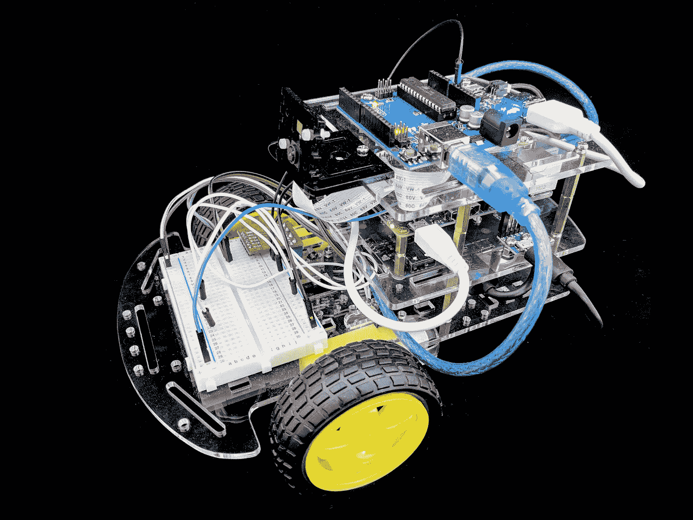

# 面向创客的 ROS + OpenCV 机器人套件

> 原文：<https://medium.com/hackernoon/ros-opencv-robot-kit-for-makers-7e22d91b4fd7>

我们非常兴奋地宣布面向制造商的第二代 [ROSbots](http://www.rosbots.com?src=blog) ROS + OpenCV 机器人套件已经上市。

ROSbots version 2.0

这个新的 2.0 版本套件——[在这里可以买到](https://www.rosbots.com/purchase?src=blog)——在很多方面改进了 1.0 版本。

2.0 版具有:

1.  专用的 Arduino 兼容型 UNO 微控制器，具有硬件 PWM 输出和 ADC 输入功能。
2.  两块锂电池充电/升压控制板——一块用于电机和传感器，另一块专用于 Raspberry Pi。
3.  树莓派相机和相机支架。
4.  拥有更高传动比的电机变速箱，这意味着更高的扭矩。

第 1 项可实现更快的电机响应和更准确的传感器数据采集。是的 Arduino UNO 运行 ROS。我们将在接下来的文章中告诉你如何做！

第 2 项免除了更换电池的需要。事实上，由于充电器可以同时充电和放电，我们的 ROSbots 机器人完全有能力自主充电(一旦我们编写软件来这样做)！

第 3 项使我们能够开箱即用地使用 ROS+OpenCV 计算机视觉应用程序。

第 4 项使机器人能够更容易地在地毯等粗糙表面上移动。我们的行动没有以前那么快，但通过更灵敏的控制弥补了这一点。

为了降低总成本，就像 1.0 版一样，除了 ROSbots 套件，您还需要购买额外的部件。作为一个无用的中间人，我们不想向你收取额外的费用。在 ROSbots 购买页面上清楚地列出了从亚马逊购买这些额外部件的链接(附带 Prime shipping)。

我们正在努力为 ROSbots 版工具包完善 ROS 和 OpenCV 软件。等到套件交付给您时，我们已经发布了软件堆栈，并准备就绪。

[ROS bots 软件栈是开源的，托管在 Github](https://goo.gl/hQfyyX) 上。请“启动”和/或关注我们的 Github 回购项目。事实上，我们欢迎您与我们合作开发运行在 ROSbots 机器人上的 ROS + OpenCV 系统。

我们还有一个安装了 ROS 和 OpenCV 的 [Raspbian Stretch Lite 映像](/@rosbots/ready-to-use-image-raspbian-stretch-ros-opencv-324d6f8dcd96),供社区下载并在有或没有 ROSbots 套件的情况下与 Raspberry Pi 一起使用。

有任何问题，请不要犹豫。

你可以[在这里](https://www.rosbots.com/purchase?src=blog)购买新的第二代 ROSbots 套件。

谢谢！
杰克“机器人制造商”

PS——通过在 [Instagram](https://www.instagram.com/rosbots/) 和/或[脸书](https://www.facebook.com/hackrosbots)上关注我们，帮助我们传播关于 ROSbots 的信息。