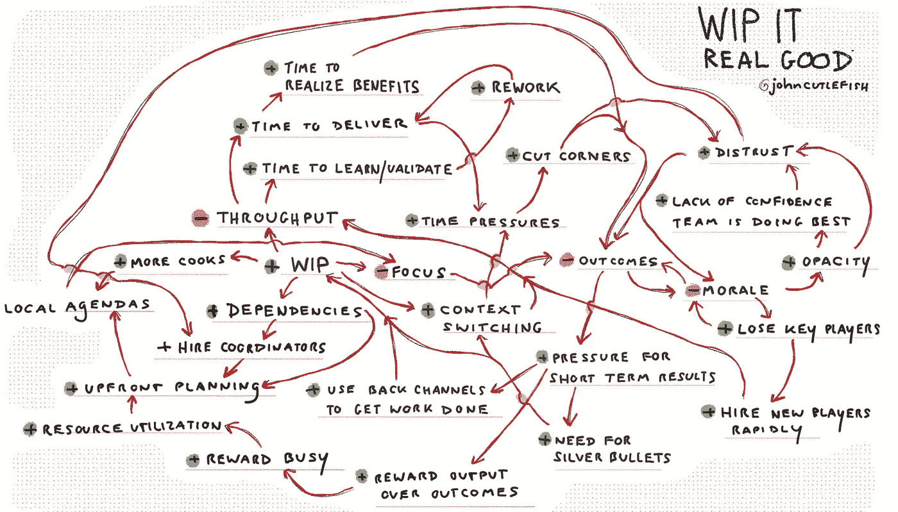

# 处处

> 原文：<https://medium.com/hackernoon/round-and-round-38e51e1bb57e>

疯狂的旅行周。抱歉没有贴更多。

我做这些小图是为了好玩(通常是在等待损坏的飞机被修理的时候，而我享受着我的 10 美元餐券飞往另一个机场，在那里我会错过我的转机)。我一直在想把它们编入一本有趣的小书里。听起来有帮助/宣泄？请在推特上@johncutlefish 告诉我，或者在评论中告诉我。也许(为了踢我的屁股)我会建立一个 Kickstarter…然后我需要完成。

这里有几个最近的…

## **1。为什么那个团队似乎总是承担太多的工作？**

## **2。为什么这种共享资源似乎永远人手不足？**

## **3。为什么团队一直在计划大批量生产？**

/

## **4。为什么短视地关注提高速度最终会损害质量？**

## **5。为什么团队的故事从来都“不够好”？**

## **6。为什么我的团队对我隐瞒事情？**

## 7.嗯…你看到了当我们试图给他们一个问题时发生了什么，对吗？

## 8.不像以前了…

## 9.有时它们变得超级复杂，但我不确定这些是否很有帮助…

我认为使用像 [Donella Meadow 的十二个杠杆点](https://en.m.wikipedia.org/wiki/Twelve_leverage_points)这样的东西来建议一些潜在有用的干预措施会很有趣。但那是另一篇文章。

