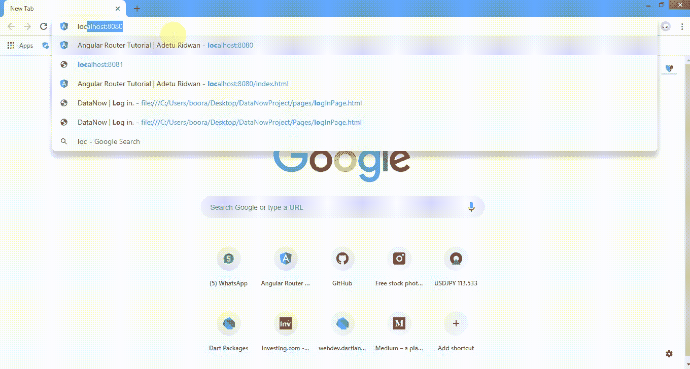
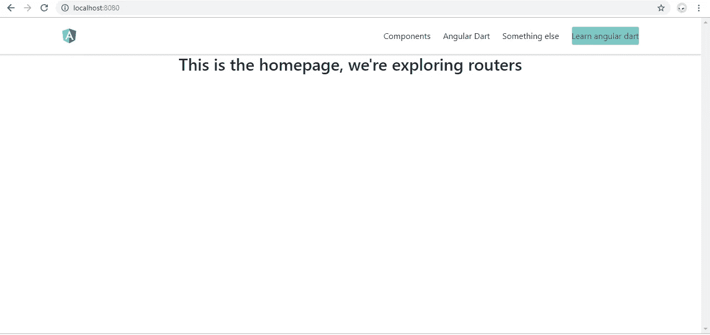

# 带角省的路由器实用方法

> 原文：<https://medium.com/hackernoon/router-practical-approach-with-angular-dart-80485978a124>



Our end game for routers.

原谅我；我无法解释我最近对角镖的痴迷，尽管事实上在尼日利亚只有不到一定比例的人对角镖感兴趣。

直接进入今天的教程和路由器基础知识的解释，我们将把路由器的使用应用到我们 web 应用程序的导航菜单中。所以我实际上把你从压力中解救了出来，并且用一个用 HTML，一些 CSS 和布尔玛 CSS 框架制作的自定义导航栏准备了你需要的文件。

好了，让我们从我的 [github、](https://github.com/corpsgeek/angular-Dart-router-starter-pack)运行 pub get 来更新依赖项，然后 webdev serve 来设置我们的实时服务器。

太好了，我想我们可以走了。通过观察，您注意到点击链接没有任何效果，也不会导致其他页面，这是一个好消息。坏消息是，我们必须配置一切才能正常工作。

让我们回顾一下路由器或路由，我的目的是解释在一页纸上找不到的东西。当用户执行应用程序任务时，角度路由器可以从一个视图导航到另一个视图。跳过 angular dart 官方文档中已经解释的内容，让我们将路由器提供商添加到我们的程序中。

**添加路由器提供商**

首先，我们转到我们的 ***main.dart*** 文件，并在那里添加我们的路由器提供商。与路由器提供商合作；有两种定位策略，即哈希定位策略和路径定位策略，您将学习如何在这两种定位策略之间轻松切换。

让我们将路由器包导入到主 dart 文件中

```
import ‘package:angular_router/angular_router.dart’;
```

之后，我们导入 ***main.dart*** 文件，在程序中将其引用为“ **self** ”，self 不是一个关键字，可以任意命名。

```
import ‘main.template.dart’ as self;
```

现在，如果你不知道 angular dart 中的依赖注入，请回到文档中阅读它，如果你不理解它，请在这里阅读我关于依赖注入的文章。

我们想让我们的 **routersProviderHash** (散列位置策略)对我们程序中的每个组件都可用，唯一的方法就是让它成为一个可以注入的服务。我们需要使用 **@GenerateInjector** 注释将***routerproviderhash***注入到我们的程序中，该程序会在编译时生成一个***injector factory***，并带有参数< object >，该对象可以是提供者，也可以是模块。

好了，让我们将***routerproviderhash***作为参数传递给 **@GenerateInjector** 以注入到我们的程序中。因为 router 是一个定制服务，所以我们必须在 runApp()函数中将它作为参数传递。

```
runApp(ng.AppComponentNgFactory, createInjector: injector);
```

很明显，我们创建了一个注入器，但是我们还没有具体说明这个注入器做什么，所以让我们开始吧。

```
final InjectorFactory injector = self.injector$Injector;
```

将这段代码添加到您的 **main()** 方法之上。我们很清楚， **@GenerateInjector** 生成了一个 **InjectorFactory** ，它定义了一个函数，该函数在一个父注入器周围创建了一个注入器，而 **$Injector** 用于检索由路由器提供者定义的对象实例，这些实例还实例化了一个类型、调用了方法并加载了模块，而 **self.injector** 引用了引用其中的注入器的主文件。是的，这就是添加路由器提供商所需的全部内容。

就在我们继续之前，我更换了 我们可以在快速入门主 index.html 文件的头文件内找到标签:

```
<base href=”/”></base>
```

基础应该总是用于生产，也许是一个小的编码实践。

**配置路线**

当用户单击链接或将 URL 粘贴到浏览器地址栏时，路由会告诉路由器显示哪个视图。根据导航菜单，我们有四个链接，这意味着我们必须创建四条路线，但在我们开始创建路线之前，我们都希望每个链接显示不同的信息，所以让我们先设置一下。

为此，我们需要首先创建五个(五个链接==五个组件)组件。转到 **lib - > src** 文件夹，创建另一个文件夹标题 **linksComponent** 。有了这些改变，我们的文件结构看起来像这样。

> lib-> src-> links 组件



我们的页面看起来像这样，当你运行它时，我们都可以看到四个链接，我说了五个链接，第五个链接实际上是主页，将用于解释默认路由。

所以我们对每个链接的组件名称将分别是 ***components.dart、angular.dart、something.dart、learn.dart*** 和 ***home.dart*** 。我将只使用**组件。镖、角镖**和**什么的。镖**而你可以填写其余的作为家庭作业。

好了，让我们像对待我们的***app _ component . Dar***t 文件一样对待每个组件。

**用于组件。镖:**

**为有角.镖:**

**为 home.dart:**

很好，你可以解决剩下的问题。

让我们进入路线。简单地说，路由告诉路由器，如前所述，当点击链接时，显示哪个视图。因此，我们希望定义将用于路由定义(生成 URL)的路由路径。

我们的应用程序结构现在看起来像这样:

> lib-> src-> links 组件

现在，在 **src** 文件夹下，我们创建另一个文件夹来处理与路线相关的操作。为 Routes 创建一个文件夹，在这个文件夹中创建一个 ***route_path.dart*** 和 ***routes.dart*** 文件。

从路由路径文件开始，我们导入角度路由器并创建一个 ***类 route path***并为每个应用程序的视图定义路由路径，在这种情况下，我们为 navbar 中的所有链接创建路由路径，因为我只处理三个链接，所以我将只为三个链接创建路由路径。

在那里，我们有三个链接的路由路径。传递给 path 的字符串参数显示在 URL 栏中，您可以随意命名。

我们希望在我们的 ***routes.dart*** 文件中定义每个路线路径，该文件负责处理到路径的导航和关联视图的渲染。

让我们快速导入下面的包和文件:

```
import ‘package:angular_router/angular_router.dart’;import ‘../linksComponent/components.template.dart’;import ‘../linksComponent/angular.template.dart’;import ‘../linksComponent/home.template.dart’;import ‘route_path.dart’;
```

是的，我们的导入已经完成，但还没有完全完成我们可以看到所有链接组件上的 **.template.dart** 扩展名，但我们实际上并没有创建任何 **.template.dart** 文件，它只是简单地做了我们尝试访问每个组件工厂以在路由定义中使用，并且我们必须引用它作为 ***xyz_template*** 或 ***xyz*** 或***my component*让我们马上对我们的程序进行修正:****

```
import ‘package:angular_router/angular_router.dart’;import ‘../linksComponent/components.template.dart’ as components_template;import ‘../linksComponent/angular.template.dart’ as angular_template;import ‘../linksComponent/home.template.dart’ as home_template;import ‘route_path.dart’;class Routes{}
```

这里做了更改，我添加了一个**类路由**，我们将在这里定义每个路由路径。

因此，让我们定义组件的布线路径，角度和主路径:

我们已经定义了所有的路由路径，一个 **RoutePaths** 封装了一个路由定义属性并创建了链接 URL。现在，让我们存储所有定义在类型为**routed definition**的数组中的路由:

将这段代码添加到最后一个路由定义之后。这就是我们完成创建我们的路线路径和定义它们，我们实际上需要我们的 **navbar_component.dart** 文件中的路线，所以我们需要导出 **routes.dart** 文件，以便它可以从任何组件使用。

```
export ‘routes.dart’;
```

在 **RoutePath** 类文件上方添加导出代码行，您的程序应该如下所示:

就在我们的 navbar 组件文件中，让我们将我们的 **routeDirectives** ，export **Routes** 和 **RoutePaths** 添加到模板中引用的导出列表中，位于 **@Component** 方法下。

```
directives: [routerDirectives],exports: [Routes, RoutePaths],
```

快好了！

我们需要做的就是通过添加以下内容，将每个路由器链接绑定到一个路由路径，从而将这一堆代码付诸实施:

```
[routeLink] = “RoutePaths.components.toUrl()”
```

其中**组件**指在路线和路线路径文件中定义的变量名。

> 确保每个链接的变量名在路由器文件中是相同的。

me 将路由器链接绑定到其各自锚定标签的示例:

routerLinkActive 在每个锚标签或链接中都是必要的，否则你将无法点击链接。

现在，我们已经将路由器链接绑定到每个锚标签，我们很清楚这个页面显示输出或另一组信息，供用户执行任务，我们必须用**路由器出口**标签指定它出现在哪个区域。

将下面的 **router-outlet** 代码添加到您特别希望显示您的输出的区域，并作为一个开发者，而不是在您的网页上的 **navbar** 之后。

```
<router-outlet [routes]= “Routes.all”></router-outlet>
```

**Routes.all** 是指**routed definition**数组中的所有链接，告诉它在这个区域内显示其内容。因此，为了在 navbar 之后的适当区域显示，我们切换到我们的 **app_component.dart** 文件，并在其下方插入 **router-outlet** 标记。

如果您注意到在添加这个之后，如果我们的代码是 100%正确的，构建命令行显示一个严重的失败而不是成功。

要解决这个问题，导入**路径、routePath** 文件和 **angular_router** ，然后添加 **routerDirectives** 并导出**route path**和**router**

```
directives: [NavBarComponent, routerDirectives],exports: [RoutePaths, Routes],
```

现在它工作正常，我们的页面工作良好。

**默认路线:**

默认路径可用于设置用户加载页面后默认加载的页面，在任何情况下，该页面都将是主页，因此我们转到 **routePaths** 文件，将以下代码添加到我们希望用作默认视图页面的链接属性中:

```
useAsDefault: true,
```

**使用默认**只接收**布尔值**并且在你的程序中你最多只能使用一个默认用例。

主页现在是窗口加载时查看的默认页面。

让我们添加一些样式来了解活动页面之间的区别。

```
styles: [‘.active-route {color: #039be5;}’],
```

将这段 CSS 样式代码添加到**导航条**组件文件中，就完成了。


The final look of our program

**在 RouterProviderHash 和 RouterProviders 之间切换:**

我们程序中使用的***routerProviderHash***在 url 前附加一个“#”，如下所示:

[http://localhost:8080/# angular](http://localhost:8080/#angular)

而***router providers***显示 url 的方式与大多数网页显示 url 的方式类似。例如:

[http://localhost:8080/angular](http://localhost:8080/angular)

无论您想使用 **providersHash** 还是 **providers** ，只需打开您的 **main.dart** 文件，将传递给 **@GenerateInjector** 的参数更改为您选择的任何位置策略。

> 确保在构建 web 应用程序时保持一个位置策略。

看吧！路由器很容易，角镖很酷。接下来，我们将探讨导航规则、子设备和路由器生命周期挂钩。