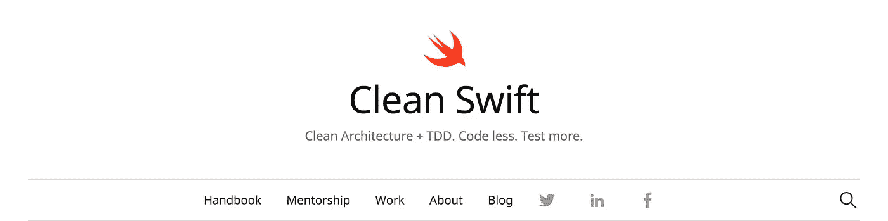
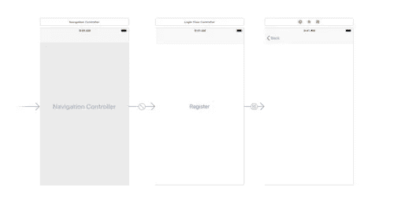
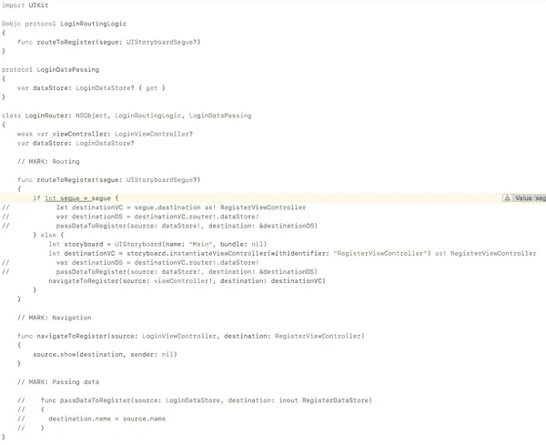
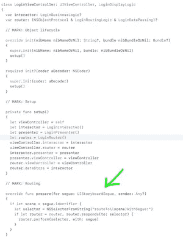
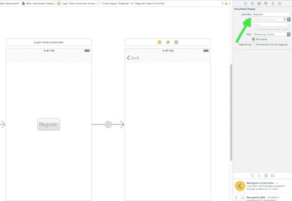

# 干净 Swift (VIP)架构中的路由

> 原文：<https://medium.com/hackernoon/routing-in-clean-swift-vip-architecture-dcc9a0ee9eb3>

## 了解如何正确使用路由器组件



[https://clean-swift.com/clean-swift-ios-architecture/](https://clean-swift.com/clean-swift-ios-architecture/)

在继续本教程*之前，请确保您已经阅读了 [*介绍 Clean Swift (VIP)架构*](https://hackernoon.com/introducing-clean-swift-architecture-vip-770a639ad7bf) 。*

[路由器](https://hackernoon.com/tagged/router)组件负责传递数据和处理视图控制器之间的转换。如果我们利用得当，这是一个非常有用的组件。

出于本教程的目的，我已经创建了一个包含两个场景的示例项目，分别名为登录和注册。下面给出了两种情况。

1.  从登录过渡到注册
2.  将数据从登录名传递到注册表



# 过渡

我将首先向您展示如何转换到下一个视图控制器。路由器组件已经包含了示例方法，我们可以根据自己的需要进行调整。

## 登录路由器

我们将编辑*route tosomething()*方法，并将其命名为 *routeToRegister()* ，因为我们希望在按钮点击*上呈现注册场景。*我已经注释了负责数据传递的行，我将在本教程的后面介绍这些行。



**路由逻辑协议** 在文件的顶部，有一个*协议*叫做`RoutingLogic.`这个协议将包含所有负责转换的方法。这里声明的所有内容都可以从 ViewController(在我们的例子中是 LoginViewController)中访问。

**route register()** [clean swift](https://hackernoon.com/tagged/cleanswift)为我们提供了两种处理视图控制器之间转换的解决方案。(1) *通过使用 segue，* (2) *通过编程*。

## #1 使用 Segue

在 LoginViewController 下，CleanSwift 模板为我们生成了一个对 *prepare(for segue:)* 方法的覆盖。每当一个视图控制器被推/呈现一个序列时，这个方法将被触发。



> **重要:** *当你使用 segues 时，你必须设置 segues 标识符来匹配方法的命名。*

例如，如果 segue 标识符的方法被设置为`Register`，那么应该有一个在 Router 下声明的方法被命名为`routeToRegister(segue: UIStoryboardSegue?)`。



An example Segue created from a Storyboard

## **#2 编程方式**

为了导航到注册场景，您需要将 IBAction 连接到按钮并调用`routeToRegister(nil)`。

# 传递数据

传递数据也是通过*route register()*方法完成的。我们所要做的就是取消之前由于关注转换逻辑而被注释的几行。

**数据传递&数据存储协议
每个路由器组件都包含一个处理数据传递逻辑的协议。在我们的例子中，它被称为 *LoginDataPassing* 。该协议实现了一个在 Interactor 下声明的*数据存储协议*。**

*数据存储协议*主要存储我们需要传递给下一个场景的变量。交互器完成填充这些变量的所有逻辑。路由器只是继承这些值。

**passDataToRegister()** 该方法负责为目的数据存储协议赋值。它包含两个属性:

1.  *源数据源协议* -代表当前视图控制器的数据源。
2.  *目的数据源协议——表示目的视图控制器的数据源。*

假设我们需要将数据从登录名传递到注册控制器，我们将把 LoginDataSource 指定为*源*，把 RegisterDataSource 指定为*目的地。*

在当前的例子中，我正在传递一个名为`name`的变量。为了传递该变量，我们必须向登录和注册数据源声明它。在声明了这两个变量之后，您可以在 LoginInteractor 中将一些随机字符串直接分配给名称为*的*变量(用于测试目的)。*返回到 *passDataToRegister()* 内的 LoginRouter* 和将值分配给目的数据存储器*。*

```
destination.name = source.name
```

如果现在从登录导航到注册，将调用 *routeToRegister()* 方法，并且*Register data source**协议*将包含从*登录数据源协议*分配的正确名称。

## 这就是本教程的内容，如果对你有帮助，请👏或者分享这个故事，让其他像你一样的人也能找到它。感谢您的关注！🚀

[](http://bit.ly/2KkkwGL)

## 查看我的最新项目:

[](https://play.google.com/store/apps/details?id=betting.tips.goals) [## BetScore:Google Play 上的足球博彩技巧、比分和赔率应用

### 我们提供高胜率的专业足球技巧。每个比赛模拟包含三个预测…

play.google.com](https://play.google.com/store/apps/details?id=betting.tips.goals) [](https://play.google.com/store/apps/details?id=betting.tips.sportsbet) [## Google Play 上的篮球、曲棍球和手球应用程序的下注技巧

### 超过 500，000 名职业博彩客户、体彩投注者和体育博彩爱好者信任我们的日常体育博彩…

play.google.com](https://play.google.com/store/apps/details?id=betting.tips.sportsbet) [](https://apps.apple.com/app/long-video-story-for-instagram/id1511499427) [## Instagram 的长视频故事

### Instagram 的 Long Story 是一个非常棒的工具，允许您录制或选择任意长度的视频并进行转换…

apps.apple.com](https://apps.apple.com/app/long-video-story-for-instagram/id1511499427) 

## 阅读更多我在媒体上的作品:

[](/theappspace/installing-the-clean-swift-template-in-xcode-6b4367006827) [## 在 Xcode 中安装干净的 Swift 模板

### Clean Swift 在 iOS 开发者中越来越受欢迎。这个简短的教程将向您展示如何安装…

medium.com](/theappspace/installing-the-clean-swift-template-in-xcode-6b4367006827) [](https://medium.freecodecamp.org/how-you-can-use-the-google-maps-sdk-with-ios-using-swift-4-a9bba26d9c4d) [## 使用 Swift 4 在 iOS 上使用 Google Maps SDK 的终极指南

### 许多 iOS 应用程序使用谷歌地图。这是一个非常普遍的特点，所以我决定准备一个终极指南…

medium.freecodecamp.org](https://medium.freecodecamp.org/how-you-can-use-the-google-maps-sdk-with-ios-using-swift-4-a9bba26d9c4d) [](/theappspace/swift-custom-uiview-with-xib-file-211bb8bbd6eb) [## SWIFT —带有 XIB 文件的自定义 UIView

### 用 XIB 文件定制 UIView 是 iOS 开发中非常常见的做法。自定义 UIView 类不包含 XIB 文件…

medium.com](/theappspace/swift-custom-uiview-with-xib-file-211bb8bbd6eb) [](https://hackernoon.com/how-to-add-spotlight-support-to-your-ios-app-4a89054aff89) [## 如何将 Spotlight 支持添加到您的 iOS 应用程序

### Swift 教程将使您的应用程序在 Spotlight search 中可用

hackernoon.com](https://hackernoon.com/how-to-add-spotlight-support-to-your-ios-app-4a89054aff89) [](https://hackernoon.com/core-data-relationships-d813ed66ba8c) [## 核心数据关系

### 理解一对一和一对多关系

hackernoon.com](https://hackernoon.com/core-data-relationships-d813ed66ba8c) [](https://hackernoon.com/understanding-auto-layout-in-xcode-9-2719710f0706) [## 了解 Xcode 9 中的自动布局

### 所有你需要知道的关于自动布局

hackernoon.com](https://hackernoon.com/understanding-auto-layout-in-xcode-9-2719710f0706) 

## 订阅我的时事通讯: