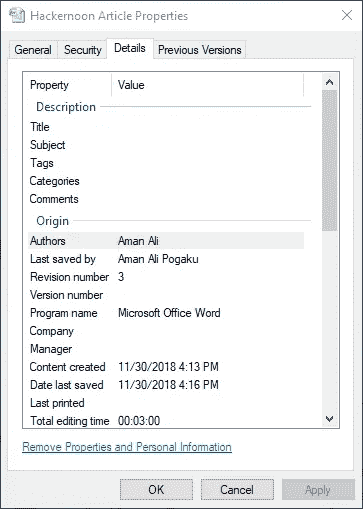

# 数字艺术版税管理系统

> 原文：<https://medium.com/hackernoon/royalty-management-system-for-digital-arts-e92f2939fb8b>

[Source](https://www.shellypalmer.com/2018/02/what-is-blockchain/)

# 问题

声称对数字艺术拥有所有权可能是个问题，这也是艺术家得不到应有认可的原因之一。除了所有权问题，访问数字艺术(右键单击+保存)并稍加修改后再次出售也非常容易。

这里有一个例子来解释上述说法:

1.  让我们举个例子，我们有一个艺术家“艾美”。
2.  他设计并绘制了一幅以**蓝**色为背景的美丽画作。
3.  他现在在互联网上发表了自己的作品。
4.  现在，让我们假设黑客“H”下载了“EMMAY”的作品，并将背景从**蓝色**改为**橙色。**
5.  “H”不承认“EMMAY ”,而是试图出售艺术品并从中赚钱。
6.  不幸的是，“艾美”不会因为他的作品得到任何荣誉或版税。

在这篇文章中，我提出了一个解决这个问题的方案，它可能会改变整个数字艺术产业。

# **动机**

我创建了一个 word 文档，并将其保存在我的笔记本电脑上。当我打开文档的属性时，我观察到以下内容:

Observe “Authors” and “Last saved by” attributes

在上面的图像中，可以看到**作者**和**最后被**属性保存。

# 解决办法

资产是任何有价值的东西。画类比关系，我得到一个想法，如果我们有一个图像格式，用它我们有**艺术家的**名字，我们保存作者的名字到一个**区块链。**因为，我们在区块链上保存了艺术家的名字，艺术家对艺术品的所有权是永久的**。**

**现在，试图修改图像的人“A”的名字将出现在**最后编辑者下面。****

**所有这些都很好，但是我们如何确保原创艺术家从他的作品中获得版税。这就是智能合同发挥作用的地方。**

**假设“A”以 10 美元的价格出售艺术品，那么我们可以拥有智能合同(合同代码需要嵌入到提议的图像格式中)，该合同将自动向原始**艺术家的**账户转账 1 美元(版税)。这确保了原创者得到他的版税。可以从保存艺术家名字的区块链中检索原始艺术家的信息(如上所述)。**

**通过这个所有权和版税问题可以在**区块链的帮助下解决。****

**我强烈感觉区块链的这种**用例能够解决 [**马太效应**](https://en.wikipedia.org/wiki/Matthew_effect) 即“富者愈富，贫者愈贫**”现象。**

**下面这段引语激励我写这篇文章:**

> **创造力和洞察力几乎总是包含一种敏锐的模式识别体验:一种我们感知不同概念或想法之间的相互联系以揭示新事物的灵光乍现的时刻~杰森·席尔瓦**

**感谢您阅读我的文章。**

****注:**
本文来自莱特州立大学智能实验室在裴勇博士指导下完成的研究工作。**

**莱特州立大学:[https://www.wright.edu/](https://www.wright.edu/)
计算机科学与工程系:[https://www . Wright . edu/degrees-and-programs/profile/Computer-Science](https://www.wright.edu/degrees-and-programs/profile/computer-science)
裴勇俊博士:[https://people.wright.edu/yong.pei](https://people.wright.edu/yong.pei)**

***如有任何问题，欢迎随时给我发* [*邮件*](mailto:pamanalionline@gmail.com) *。也可以通过*[*Linkedin*](https://www.linkedin.com/in/amanali1/)*联系我。也可以关注我的* [*推特*](https://twitter.com/aliandco) *。***

***为了入门区块链阅读我的* [*文章*](https://hackernoon.com/blockchain-learning-path-2019-e54d6763dd6c) *发表在*[*hacker noon*](https://hackernoon.com/)*。***

****