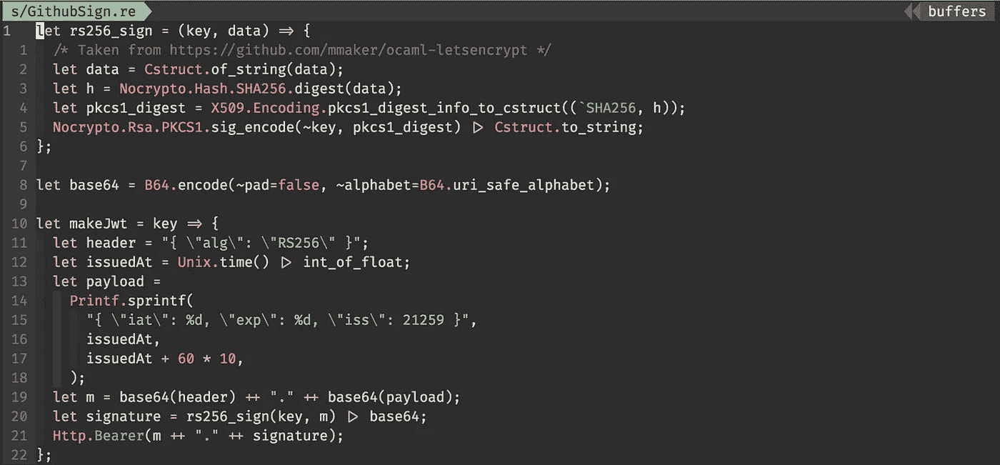

# OCaml/ReasonML 中的 RS256

> 原文：<https://medium.com/hackernoon/rs256-in-ocaml-reasonml-9ae579b9420a>

## 我花了相当多的时间来弄清楚如何为一个 GitHub 应用程序的消息签名。这是我的发现。



> TL；dr:下面是代码片段，原因是本地标签检查服务是 GitHub 上的[开源](https://github.com/Schniz/reason-pr-labels)

就在我们发布新版本的 [Yoshi](https://github.com/wix/yoshi) 、[文档](https://medium.com/u/2741d9d88322#authenticating-as-a-github-app)中提到的，为特定的安装(或回购)请求一个短期令牌。然后，剩下的都是一样的——我们得到一个令牌，就像我们从查询参数中得到的一样。

为了制作 JWT，我尝试使用`ocaml-jwt`库，但不幸的是，它不支持 RS256 开箱即用，尽管有一个 PR 添加了支持，所以我决定从头开始:搜索一个库来签署我的请求并自己构建 JWT。

因为我是 OCaml 的新手，所以我不知道什么是库，所以我只是四处搜索并寻找包。经过长时间的研究，当我看到一个名为`ocaml-letsencrpt` [的 github repo 实现了我所需要的功能](https://github.com/mmaker/ocaml-letsencrypt/blob/de05f574c8c037b0668ce5369f26eccdf5cee756/src/primitives.ml#L16-L20)时，我决定使用`[nocrypto](https://github.com/mirleft/ocaml-nocrypto)`(以及`[x509](https://github.com/mirleft/ocaml-x509)`),这个功能接受一个私钥、一个字符串并返回一个带符号的字符串。以下是 Reason 语法中的函数:

Sign with RS256: just copy and paste!

我在这里使用了 3 个库:`nocrypto`、`x509`和`cstruct`。因此，请确保在项目中使用它们之前安装它们:

```
opam install nocrypto x509 cstruct
```

上面的函数接受一个私钥和一个字符串，然后对字符串进行签名。所以我们需要得到私钥，特别是一个`Nocrypto`私钥。这里有一种将 PEM 文件读入`Nocrypto` RSA 私钥的快速方法:

Now, `key` is our private GitHub key. Again, just copy-and-paste!

现在，我们可以简单地用我们的私钥签署请求。剩下的 JWT 一代代码住在这里。它非常简单，但是很粗糙——我使用的是硬编码的 stringified JSON，我甚至不感到抱歉——因为有类型检查，所以感觉很安全。它格式化了一些`int` s，所以 JSON 不需要转义。感觉不错。

[正如我在](https://hackernoon.com/the-programming-language-im-looking-for-948d93f7a396)之前提到的，文档和进入壁垒不是 OCaml/Reason land 最强的方面，所以我希望这能帮助其他人，甚至是未来的我。请不要犹豫[在 twitter 上给我发短信](https://twitter.com/galstar)或者在这里回复。我很想聊天！

干杯！