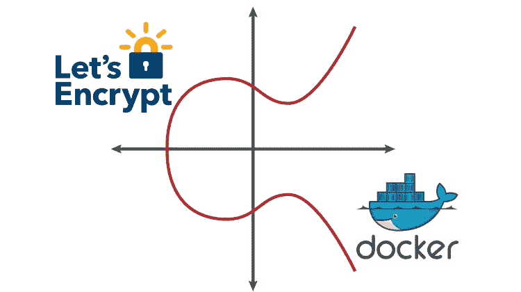
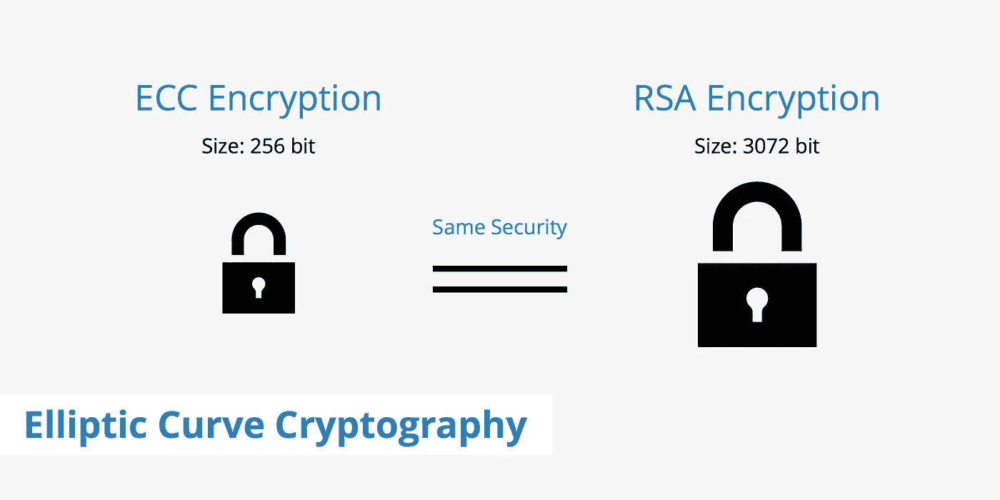
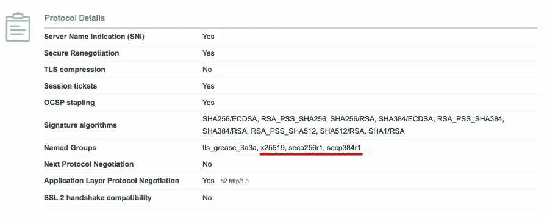

# RSA 和 ECDSA 混合 Nginx 设置，通过 Docker 映像生成 LetsEncrypt 证书

> 原文：<https://medium.com/hackernoon/rsa-and-ecdsa-hybrid-nginx-setup-with-letsencrypt-certificates-ee422695d7d3>

## RSA 与 ECC 的比较。使用包装在 Docker 映像中的 certbot 和 acme.sh 客户端颁发 LetsEncrypt 证书。Nginx 设置



# 目录

*   RSA 与 ECC 的比较。为什么你可能需要 ECDSA 证书？
*   如何使用`openssl`生成 RSA 和 EC 密钥/CSR？
*   什么是 [LetsEncrypt CA](https://letsencrypt.org/) ？如何自动发布免费的域验证证书？
*   如何在仍然使用 [certbot](https://certbot.eff.org/) 和 [acme.sh](https://github.com/Neilpang/acme.sh) 客户端的情况下，通过 [Docker 镜像](https://github.com/samoshkin/docker-letsencrypt-certgen)生成 RSA 和/或 ECDSA 证书？
*   如何为混合 RSA/ECDSA 设置配置和测试 Nginx？

# RSA 与 ECC 的比较

RSA 是最流行的公钥密码算法。带有 RSA 密钥的证书是黄金标准，是当前互联网 PKI [安全](https://hackernoon.com/tagged/security)的代表。这是一项久经考验的老技术，从安全角度来看非常重要。椭圆曲线加密是当前 RSA 标准上公钥加密的替代方法。

RSA 算法可以用于加密和数字签名，而 ECC 只能用于签名。

密钥的安全性取决于它的大小和算法。有些算法比其他算法更容易被破解。破解 RSA 密钥需要分解两个大数的乘积。破解一个 ECC 密钥需要找到椭圆曲线上点之间的离散对数，目前还没有实现这一点的进展。

对于相同的安全级别，算法需要不同的密钥大小。ECC 可以使用较小的密钥大小。以下是密钥大小比较表:

```
+----------------------+-----------------+--------------------+
| Symmetric Key length |  RSA key length |   ECC key length   | 
+----------------------+---------- ------+--------------------+
| 80                   | 1024            | 160                |
| 112                  | 2048            | 224                |
| 128                  | 3072            | 256                |
| 192                  | 7680            | 384                |
| 256                  | 15360           | 512                |
+----------------------+-----------------+--------------------+
```

例如，256 位 ECC 密钥相当于 RSA 3072 位密钥，提供 128 位安全性:



较小的密钥在生成签名时计算量较小，因为数学运算涉及的数字较小。然而，尽管 ECC 在签名生成方面更快，但在签名验证方面却比 RSA 慢。让我们使用 openssl 作为基准测试工具来衡量这一点:

```
$ openssl speed ecdsap256 rsa2048 sign/s     verify/s
rsa 2048 bits             679.0      23489.0
256 bit ecdsa (nistp256)  15581.9    6211.7
```

更小的 ECC 公钥意味着更小的证书大小——传递的数据更少，下载更快，TLS 握手更快。

如果您想要更高的安全性，RSA 就不能很好地扩展，您必须以远快于 ECDSA 曲线大小的速度增加 RSA 模数大小。1024 位 RSA 密钥已经过时，2048 是当前的标准大小。如果你需要走得更远，你会停滞不前。第一，如果 CA 不提供 4096 位 RSA keychain，那么用 2048 RSA 中介来签署自己的 4096 位 RSA 密钥是没有意义的。其次，请注意，RSA 私钥每翻倍一次，TLS 握手性能就会降低大约 6 到 7 倍。所以，如果你需要更多的安全性，选择 ECC。

虽然 ECC 有一些好处，但也有一些缺点。该技术不像 RSA 那样成熟和成熟。还有一个兼容性问题，不过它似乎可以在大多数操作系统和现代浏览器上使用。查看这些资源了解 [ECC 兼容性详情](https://support.globalsign.com/customer/portal/articles/1995283-ecc-compatibility)。

那里有很多椭圆曲线。最受欢迎和主要浏览器支持的是 P-256、P-384、P-521、x25519。虽然 P-256 和 P-384 是 [NIST 的套件 B](https://en.wikipedia.org/wiki/NSA_Suite_B_Cryptography) 算法的一部分，但 P-521 和 x25519 不是。谷歌 Chrome 已经[不再支持 P-521 曲线](https://code.google.com/p/chromium/issues/detail?id=478225)，[NSS/火狐也是如此。为了最大化与现有浏览器和服务器的互操作性，坚持 P-256 `prime256v1`和 P-384 `secp384r1`曲线。](https://bugzilla.mozilla.org/show_bug.cgi?id=1128792)

要查看所有可用 ECC 曲线列表，OpenSSL 库支持:

```
openssl ecparam -list_curves
```

要查看浏览器支持的曲线，请使用 [SSL Labs 客户端测试](https://www.ssllabs.com/ssltest/viewMyClient.html)。



总之，ECDSA 证书的优点和缺点:

*   (+)更小的密钥和证书大小，[更快的 TLS 握手](https://scotthelme.co.uk/ecdsa-certificates/)
*   (+) [更好的性能](https://securitypitfalls.wordpress.com/2014/10/06/rsa-and-ecdsa-performance/)从服务器的角度来看，需要更少的 CPU 和内存
*   (+)算法更强，更难破解
*   (+)在您需要更多安全性时可以更好地扩展
*   (-)与 RSA 相比，ECC 相对较新，不如 RSA 成熟且久经考验
*   (-)缺乏兼容性，缺乏广泛支持。
*   (-) ECC 生成签名的速度更快，但是签名验证的计算量更大，速度比 RSA 慢

你不需要在 RSA 和 ECC 之间做出唯一的选择。您可以设置混合配置，首先提供 ECDSA 证书，然后为不支持的客户端提供 RSA 证书。

# 使用 openssl 生成 RSA 和 ECC 密钥/CSR

通常，在向 CA 发送颁发证书的请求之前，您需要生成私钥和 CSR(证书签名请求)。使用`openssl`工具非常简单。

生成给定长度的 RSA 密钥:

```
openssl genrsa -out example.key 2048
```

用给定曲线生成 EC 键:

```
openssl ecparam -genkey -name secp384r1 | openssl ec -out ec.key
```

使用给定的主题信息从现有私钥生成 CSR:

```
openssl req -new  -key example.key -out example.csr -subj "/CN=example.com" -sha256
```

或者，您可以在一个命令中同时创建密钥和 CSR:

```
openssl req -nodes -newkey rsa:2048 -keyout example.key -out example.csr -sha256
```

# LetsEncrypt CA

如果你想试验 ECDSA 和 RSA 证书，最好的选择是使用 [LetsEncrypt 认证中心](https://letsencrypt.org/)，它允许自动生成免费的域验证证书。

为了获得证书，您需要证明域的所有权。

通常，此过程需要手动操作:生成一个私钥和一个 CSR(证书签名请求),其中包含相关的主题信息和通用名称，向 CA 发送 CSR，最后使用选定的质询方法证明域的所有权:

*   **邮箱**；CA 发送带有验证链接的电子邮件，其中一个地址是 admin@example.com。您需要按照链接完成验证。
*   **http；**你需要下载一个带有特制令牌的文件，然后将其上传到你的域名根文件夹，这样就可以在 http://example.com/.well-known/pki-validation URI[访问该文件](http://example.com/.well-known/pki-validation)
*   **DNS；**您必须在您的域名的 DNS 配置中创建一个特殊的 CNAME 记录

LetsEncrypt 通过使用一个能够与 ACME 协议对话的客户端来自动化这个过程。客户端通常运行在您的 web 主机上，并与 LetsEncrypt CA 或其他 ACME 兼容的服务器通信。客户端从服务器接收唯一的令牌，从中生成密钥，启动一个独立的 web 服务器监听端口 80，并在特殊的 URI 提供密钥，如[http://example.com/.well-known/acme-challenge](http://example.com/.well-known/acme-challenge)。在 DNS 质询方法的情况下，客户端可以根据 DNS 服务器/提供商自动将 CNAME 记录添加到您的 DNS 配置中。然后，LetsEncrypt CA 向您的域发出 HTTP 或 DNS 请求，以检索从令牌派生的密钥。成功的响应证明了域的所有权，CA 颁发请求的证书。

您不需要自己生成私钥和 CSR，这是由 web 主机上的客户端软件处理的。请注意，私钥不会在 CA 服务器上生成/泄露，而是专门存储在您的 web 主机上。客户端通常通过客户端提供一些方法来调整一些设置，如密钥长度、主题替换名称，或者如果您需要进一步定制，您可以提供自定义 CSR 以获得更多的灵活性和控制。

注意，Lets Encrypt 的证书有效期只有 90 天。这是为了鼓励用户自动执行证书颁发和续订过程。

## 速率限制和临时服务器

请注意，LetsEncrypt CA 生产服务器设置了严格的[速率限制](https://letsencrypt.org/docs/rate-limits/):

*   每个注册域的证书(每周 20 个)
*   每个证书最多 100 个备选名称
*   重复证书限制为每周 5 个证书

当你在尝试和试验的时候，你很可能会遇到后一种情况，所以最好使用 LetsEncrypt[staging environment](https://letsencrypt.org/docs/staging-environment/)，限制要宽松得多。

临时环境中间证书("[假 LE 中间 X1](https://letsencrypt.org/certs/fakeleintermediatex1.pem) ")是由浏览器/客户端信任存储中不存在的根证书颁发的，因此您可能希望在测试时添加["假 LE 根 X1"](https://letsencrypt.org/certs/fakelerootx1.pem) 作为受信任的根证书。

# 使用 Docker 映像生成 LetsEncrypt 证书

ACME 客户端有多种: [certbot](https://certbot.eff.org/) 、 [acme.sh](https://github.com/Neilpang/acme.sh) 、 [lego](https://github.com/xenolf/lego) 和[其他](https://letsencrypt.org/docs/client-options/)。我在这里不打算深入客户细节——无论如何，医生会解释得更好。

就我个人而言，我发现更容易、更快速地完成工作的方法是通过一些 Docker 映像发布证书。这是给懒人和那些不想花太多时间用 LetsEncrypt 挖掘和解析文档的人的。

我准备了一个:[Docker Hub 上的 asamoshkin/letsencrypt-certgen](https://hub.docker.com/r/asamoshkin/letsencrypt-certgen/)和 [Github 链接](https://github.com/samoshkin/docker-letsencrypt-certgen)。这个 Docker 映像提供了一个简单的入口点来从 LetsEncrypt CA 获取和管理 SSL 证书。它封装了两个流行的 ACME 客户端: [certbot](https://certbot.eff.org/) 和 [acme.sh](https://github.com/Neilpang/acme.sh) ，分别用于获取 RSA 和/或 ECDSA 证书。我们两者都需要，因为 certbot 不能颁发 ECDSA 证书(更准确地说，只能通过自定义 CSR，但这样您就失去了更新、撤销和进一步管理此类证书的能力)。

以下是为单个域颁发 ECDSA (prime256v1 曲线)和 RSA (2048)证书的示例`foobbz.site`

```
docker run \
  -v /var/ssl:/var/ssl \
  -p 80:80 \
  -e DOMAINS=foobbz.site \
  --rm \
  asamoshkin/letsencrypt-certgen issue
```

要求是在服务器上运行这个映像，为您想要获取证书的域进行配置(您的 DNS A 记录指向该域)。服务器的端口 80 应该由防火墙打开，这样 LetsEncrypt CA 服务器可以执行验证质询。

一旦完成，证书、密钥和相关文件就存储在`/var/ssl/$domain_common_name`路径下，在一个`/var/ssl`卷上，这个卷是你以前装入容器的。

```
# tree /var/ssl

/var/ssl
└── foobbz.site
    ├── certs
    │   ├── cert.ecc.pem
    │   ├── cert.rsa.pem
    │   ├── chain.ecc.pem
    │   ├── chain.rsa.pem
    │   ├── fullchain.ecc.pem
    │   └── fullchain.rsa.pem
    └── private
        ├── privkey.ecc.pem
        └── privkey.rsa.pem
```

所有文件都以 PEM 格式编码:

*   `cert.rsa.pem`、`cert.ecc.pem` -生成的证书(RSA 或 ECDSA)
*   `chain.[type].pem` -中间 CA 证书链(如假 LE Intermediate X1)
*   `fullchain.[type].pem` -与任何中间 CA 证书捆绑的证书。这适用于 Nginx 指令`ssl_certificate`，它需要一个 bundle，而不是 leaf 证书。
*   `privkey.[type].pem` -私钥文件

您并不局限于单个域的单个证书。您可以为多个域颁发多个证书，或者使用 SAN(x . 509 subject alternative names extension)为多个域颁发一个证书。您可以选择仅使用自定义密钥长度或椭圆曲线生成 ECDSA 或 RSA 证书。

首先，准备一个包含域列表的文件。每行代表要颁发的单个证书。每行中的第一个名称是常用名称，而后面以逗号分隔的名称是证书备用名称(SAN)。

```
# cat /root/domains.txt

foobbz.site,www.foobbz.site,web.foobbz.site
foobbz2.site,www.foobbz.site
```

运行一个命令，仅为`foobbz.site`和`foobbz2.site`域颁发两个 ECD sa“secp 384 r 1”证书(无 RSA 证书):

```
docker run \
  -v /var/ssl:/var/ssl \
  -v /root/domains.txt:/etc/domains.txt \
  -p 80:80 \
  -e RSA_ENABLED=0 \
  -e ECDSA_KEY_LENGTH=ec-384 \
  -e DOMAINS=/etc/domains.txt \
  --rm \
  asamoshkin/letsencrypt-certgen issue
```

该映像的主要用例是触发一个一次性命令来颁发证书，但您也可以通过使用同一映像续订、撤销或删除证书来进一步管理它们。

您可以在构建时、Nginx/Apache 启动之前的运行时使用这个映像，或者通过从 cron 作业运行它来定期更新证书。这个想法是 LetsEncrypt 的东西被封装在一个容器中，你不需要污染你的 Nginx/Apache 容器。

更完整的功能列表:

*   自动颁发和管理 LetsEncrypt SSL 证书
*   为 1 生成 DV 证书..n 域，支持多域 SAN(主题别名)证书
*   使用可配置的密钥参数生成 RSA 和/或 ECDSA 证书:RSA 密钥长度(2048，3072，4096)和 EC 密钥的椭圆曲线(prime256v1，secp384r1)
*   选择 DV 挑战验证方法:独立或 webroot
*   在证书即将过期时续订证书或强制续订
*   通过联系 LetsEncrypt CA 吊销证书
*   使用 LetsEncrypt 临时服务器或生产服务器

更多细节和例子，请查看 Github 上的[samoshkin/docker-letsencrypt-certgen](https://github.com/samoshkin/docker-letsencrypt-certgen)。你也可以查看源代码，了解如何使用 [certbot](https://certbot.eff.org/) 和 [acme.sh](https://github.com/Neilpang/acme.sh) 客户端。

还有一张[ZeroSSL](https://zerossl.com/)docker 图片值得一查。

# 混合 RSA/ECDSA 设置的 Nginx 配置

生成证书后，就该配置 web 服务器了。Nginx 允许混合并行 RSA 和 ECDSA 证书，并将根据商定的密码套件在 TLS 握手期间提供一个或另一个证书。

```
server {
  listen 443 ssl default_server*;* server_name foobbz.site www.foobbz.site*;* *# RSA certificates* ssl_certificate /var/ssl/foobbz.site/certs/fullchain.rsa.pem*;*        
  ssl_certificate_key /var/ssl/foobbz.site/private/privkey.rsa.pem*;* *# ECDSA certificates* ssl_certificate /var/ssl/foobbz.site/certs/fullchain.ecc.pem*;*        
  ssl_certificate_key /var/ssl/foobbz.site/private/privkey.ecc.pem*;

  # Other directives
}*
```

您还需要通过正确排序您的密码套件，告诉 Nginx 优先使用 ECDSA 而不是 RSA 进行身份验证(请注意，首先使用“ECDSA”的套件，然后是“aRSA”的套件):

```
ssl_prefer_server_ciphers on;
ssl_ciphers "EECDH+ECDSA+AESGCM:EECDH+aRSA+AESGCM:EECDH+ECDSA+SHA384:EECDH+ECDSA+SHA256:EECDH+aRSA+SHA384:EECDH+aRSA+SHA256:EECDH:DHE+AESGCM:DHE:!RSA!aNULL:!eNULL:!LOW:!RC4:!3DES:!MD5:!EXP:!PSK:!SRP:!DSS:!CAMELLIA:!SEED";
```

就这样，现在启动您的 Nginx，让我们使用 openssl 作为 TLS 客户端并提取证书来测试我们的配置。或者您可以使用 [Qualys SSL Labs 服务器测试](https://www.ssllabs.com/ssltest/)来查看证书。

```
$ openssl s_client -host foobbz.site -port 443 -cipher ECDHE-ECDSA-AES128-GCM-SHA256 2>&1 < /dev/null | sed -n '/-----BEGIN/,/-----END/p' | openssl x509 -noout -text
```

查看公钥，我们可以确保提供 ECDSA 证书。

```
Subject Public Key Info:
  Public Key Algorithm: id-ecPublicKey
    Public-Key: (256 bit)
    pub:
      04:47:ee:86:9f:c9:5a:81:16:89:38:f7:5b:9d:ba:
      6b:8b:d2:aa:8e:1e:54:67:f7:f1:44:84:5f:10:df:
      7f:df:16:f4:2f:d6:c1:78:b8:71:68:e9:ee:78:82:
      fc:2e:ae:96:e9:a3:b7:26:c0:ed:41:39:2a:48:f9:
      0f:28:10:4e:15
    ASN1 OID: prime256v1
    NIST CURVE: P-256
```

注意，叶子 ECDSA 证书仍然由 LetsEncrypt 的 RSA 证书链签名(让我们加密权威 X3，DST 根 CA X3)。LetsEncrypt 不使用专用的 EC 证书签名来构建完整的 EC 链。

```
0 s:/CN=foobbz.site
 i:/C=US/O=Let’s Encrypt/CN=Let’s Encrypt Authority X3
 1 s:/C=US/O=Let’s Encrypt/CN=Let’s Encrypt Authority X3
 i:/O=Digital Signature Trust Co./CN=DST Root CA X3
```

现在，让我们使用另一个密码套件(ECDHE-RSA-AES128-GCM-SHA256)来测试 RSA 配置。

```
openssl s_client -host foobbz.site -port 443 -cipher ECDHE-RSA-AES128-GCM-SHA256 2>&1 < /dev/null | sed -n '/-----BEGIN/,/-----END/p' | openssl x509 -noout -text
```

我们得到 2048 位 RSA 公钥。顺便说一下，注意它们之间的长度差异。

```
Subject Public Key Info:
  Public Key Algorithm: rsaEncryption
    Public-Key: (2048 bit)
      Modulus:
        00:ea:cb:5e:22:dd:93:fe:63:21:c4:bd:b9:07:78:
        fc:ef:66:38:7a:19:bf:68:58:39:16:86:ee:f6:2c:
        18:68:9c:32:c0:5b:a4:76:e8:e0:40:0e:6d:29:7c:
        bc:04:67:b4:1b:05:e8:72:53:24:dc:4f:a6:3d:48:
        41:2e:83:99:fa:13:20:88:b8:e5:5d:34:57:01:c6:
        eb:fc:c1:67:e8:e4:ec:58:2c:a2:ce:51:ea:99:c0:
        bb:de:61:8a:40:76:80:50:48:25:c6:7f:0e:a4:a6:
        61:e7:25:67:b1:74:ee:1f:f1:75:e8:76:a0:c5:5d:
        9c:40:48:8b:d3:95:e1:27:d2:d6:ca:14:e4:39:ac:
        4d:0d:35:23:89:db:4b:ef:60:84:0b:4d:15:76:0e:
        3c:f5:52:1c:20:ce:d8:03:25:22:7a:37:84:fb:d2:
        1b:00:ff:31:69:55:65:7d:42:d1:31:99:0c:d6:29:
        41:36:06:bf:0d:ab:31:1a:e6:b0:6a:76:67:2c:7b:
        c0:5b:34:55:49:e2:4c:d9:e4:40:99:1c:c1:1d:6a:
        88:c1:53:af:ee:ab:b5:2e:e6:76:ff:1c:33:e2:ca:
        7e:d7:93:e6:23:df:cd:78:a6:39:f4:04:a2:44:d0:
        a6:cc:f1:51:2f:5d:dc:5e:ea:ff:57:d7:f1:82:d4:
        48:11
      Exponent: 65537 (0x10001)
```

所以，就这样了。感谢你阅读这篇文章。

# 编辑#1

[Reddit 用户 wuunderbar 指出](https://www.reddit.com/r/devops/comments/7oeohq/docker_image_to_generate_renew_revoke_rsa_andor/dsa7rkc/)Docker 容器没有足够的熵来生成关键素材。我知道的一个解决方案是将主机上的`/dev/urandom`安装到容器的`/dev/random`中。看到这个 [StackOverflow 回答](https://stackoverflow.com/questions/26021181/not-enough-entropy-to-support-dev-random-in-docker-containers-running-in-boot2d/26024403#26024403)。

```
docker run -v /dev/urandom:/dev/random ...
```

# 资源

asamoshkin/letsencrypt-certgen—码头枢纽—[https://hub.docker.com/r/asamoshkin/letsencrypt-certgen/](https://hub.docker.com/r/asamoshkin/letsencrypt-certgen/)

samoshkin/docker-LetsEncrypt-certgen:使用 certbot 和 acme.sh 客户端以自动化方式从 LetsEncrypt CA 生成、续订和撤销 RSA 和/或 ECDSA SSL 证书—[https://github.com/samoshkin/docker-letsencrypt-certgen](https://github.com/samoshkin/docker-letsencrypt-certgen)

椭圆曲线加密(ECC 证书)| DigiCert.com—[https://www.digicert.com/ecc.htm](https://www.digicert.com/ecc.htm)

ECC—[https://support . globalsign . com/customer/portal/articles/1994 347-ECC](https://support.globalsign.com/customer/portal/articles/1994347-ecc)

ECC 兼容性—[https://support . globalsign . com/customer/portal/articles/1995 283-ECC 兼容性](https://support.globalsign.com/customer/portal/articles/1995283-ecc-compatibility)

ECDSA:更好的互联网的数字签名算法—[https://blog . cloud flare . com/ECD sa-The-digital-signature-algorithm-of-a-better-internet/](https://blog.cloudflare.com/ecdsa-the-digital-signature-algorithm-of-a-better-internet/)

让我们加密—免费 SSL/TLS 证书—[https://letsencrypt.org/](https://letsencrypt.org/)

https://certbot.eff.org/

ZeroSSL:免费 SSL—【https://zerossl.com/ 

Neilpang/acme.sh:实现 acme 客户端协议的纯 Unix shell 脚本—【https://github.com/Neilpang/acme.sh】T4

RSA 和 ECDSA 性能| securitypitfalls—[https://securitypitfalls . WordPress . com/2014/10/06/RSA-and-ECD sa-performance/](https://securitypitfalls.wordpress.com/2014/10/06/rsa-and-ecdsa-performance/)

测试 ECDSA 证书—[https://scotthelme.co.uk/ecdsa-certificates/](https://scotthelme.co.uk/ecdsa-certificates/)