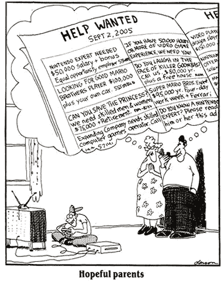

# Ruby Javascript 形比较

> 原文：<https://medium.com/hackernoon/ruby-javascript-kata-comparison-37470254c445>

在我的最后一次面试中，我对我的测试驱动开发(TDD)缺乏信心。这意味着您首先编写一个测试来阐明您的意图，然后测试它，然后因为代码尚不存在而失败，然后编写代码并使其通过。

我一直在通过 [codewars](https://www.codewars.com/) 练习寻找小谜题。自从创客学院[预科](https://thep-log.blogspot.co.uk/2017/07/the-makers-academy-pre-course.html)之后，我就再也没有碰过 codewars 了。希望现在我能对它们有更多的了解？

**电影职员**

[我想强调的是我上周用](https://www.codewars.com/kata/555615a77ebc7c2c8a0000b8/train/javascript) [Javascript](https://hackernoon.com/tagged/javascript) 做的一个形，然后用 Ruby 和配对来做。因此，这将让您更好地比较这两种语言。我会说我在这两方面都很精通，但是总有改进的空间，尤其是重构之类的。

> 瓦西亚目前是一名文员。他想把票卖给队伍中的每一个人。他们每个人都有一张 100、50 或 25 美元的钞票。一张票要 25 美元。
> 
> 如果 Vasya 最初没有钱，并严格按照人们排队的顺序卖票，他能向每个人出售一张票并找零吗？
> 
> Return YES，如果 Vasya 可以向每个人出售一张票，并用他当时手头的钞票找钱。否则返回否
> 
> 例子；
> 
> 门票([25，25，50]) // = >是
> 
> 门票([25，100]) // = >没有

在例 1 中，第一个顾客给了 25 美元，然后第二个，第三个人给了 50 美元，需要 25 美元的零钱，钱柜里有两个 25 美元的。所以这一行可以完成，所以它返回 YES。

在示例 2 中，第一个顾客买了一张 25 美元的票，但是第二个顾客试图用一张 100 美元的钞票付款，但是钞票上只有一张 25 美元的钞票，所以没有足够的零钱，所以它返回 NO。

Welcome to the world of just 25, 50, and 100 notes! Sounds great to me, being a fan light wallets.

**步骤(在 JAVASCRIPT 中)**

首先要做的是将问题分解成更小的块，这样更容易理解。以下是我在计划中列出的步骤:

1.  我们需要遍历数组(客户)的每个数字，并计算出它是否能给出变化。
2.  如果在队列的任何一点，任何客户都无法获得更改退货号
3.  如果他们能得到零钱，我们必须根据给出的纸币更新钱柜；

*   25 英镑没有零钱。
*   50 英镑可以换 25 英镑。
*   100 英镑可以换 75 英镑，也就是一张 50 英镑和一张 25 英镑或三张 25 英镑。

1.  如果一切正常，每个人都得到正确的零钱，那么返回 YES。

我认为散列数据结构最适合这种情况。这将用于更新钱柜中纸币的数量；

哈希以冒号分隔的键/值对的形式工作。所以这里的键是 25，50，100，值是零。当一群新的顾客排队时，每张钞票都是零。

现在我们想检查一下我们是否能给零钱。

这里有一个函数 canMakeChange，你输入 25、50 或 100，它会查看钱柜，看是否能有所改变。

对 25 岁的人来说，不需要改变，所以永远是真的。

50 元的话，通常需要 25 元零钱。这里“till[25]”在散列中寻找 25 的密钥对，并询问该数字是否大于零。如果是的话，有 50 元的零钱。我们可以自己编辑散列并运行[代码](https://hackernoon.com/tagged/code)来测试这是否可行。但是在这个过程中，我进行了笔试。

对于 100 英镑来说，这有点复杂，因为有两种可能的找钱方式。75 英镑的零钱你可以给一张 50 英镑的和一张 25 英镑的或三张 25 英镑的。和以前一样，它在 hash till 中寻找这些音符的各种组合，并返回 true。在代码中，我把它提取到了另一个部分，这样可读性更好。也就是说，如果输入的纸币是 100，如果钱柜中的纸币多于三张 25，或者(两个竖线符号“||”)多于一张 25，以及(双&符号“&&”)多于一张 50，则返回 true。

好吧，那么让我们更新我们的钱柜，如果可以改变的话，它确实可以。我们的钱柜将会有钱进账，钱出账给顾客。

所以这个函数接受一个输入数字，然后更新散列值。注意++和—是指自身加一或减一。这是如此普遍的事情，以至于 Javascript 创建了这个快捷方式。

对于 25，它在 25 的散列值上加 1。这意味着如果钱箱在这个输入之前是空的，那么钱箱应该是“hash = { 25:1，50:0，100:0 }。因为没有零钱，所以不需要扣除任何其他的纸币。

如果是 50 英镑，它会减去一张 25 英镑的钞票，但会在钱柜中增加另一张 50 英镑的钞票。

对于 100 美元的纸币，情况又变得复杂了。我们需要弄清楚钱柜里是有一张 50 元的钞票和一张 25 元的钞票，还是三张 25 元的钞票。所以在这里，我们使用之前创建的其他函数来检查它是否正确，然后适当地更新它。每种一个，我们减去 25 和 50，加上 100。有三张 25，我们只扣除三张 25。

最后，我们在一个更具控制器类型的功能中把一切都联系在一起。这是当一个函数更多地被用作调用其他函数的地方，而不是我们单独调用它们的时候。

在这里，我们使用一个循环遍历我们的列表，并将其应用于每个单独的元素，即每个客户的付款。Var i = 0 告诉它从数组的第一个元素开始循环，i < array.length 告诉它在列表末尾停止循环，i++告诉它逐个遍历列表的元素(由 array[i]表示)。

对于每个周期，我们将元素输入到我们的 canMakeChange 函数中，如果它是真的，那么给出一个 Change 并更新钱箱。使用 if 语句，如果我们在问某事是否为真，我们不必明确地陈述它。比如 if(true ===true)可以写成 just if(true)。

如果它不能做出改变，则返回 NO。如果它设法完成了所有给定的改变的循环，则返回 YES。一旦我们在 Javascript 中返回了某个东西，它就脱离了函数，这意味着如果还有代码的话，代码就停在那里。

Some tests to practice my TDD and also keep an eye on my code working

**可读的红宝石**

下面是 Ruby 和 Javascript 的比较。这里我们调用函数 sell 来初始化它。

Javascript Version

Ruby Version, with case conditional

我真的很喜欢 Ruby 中的代码，它看起来可读性更好。有一些非常好的东西，比如:带问号的函数返回 true 或 false，循环更短，最后几行被显式返回，读起来非常好，就像它揭示了它试图做什么的意图。

Ruby 中也有很多内置函数，可以简化很多常见的任务。比如【字符串】。reverse 将反转一个字符串(duuh ),但是在 Javascript 中你必须手动编写这样做的方法，这意味着更多的代码行。

我在编写 Javascript 代码时遇到的许多问题包括记住所有函数都需要返回某个东西，因为如果你不这样做，就不知道该做什么，并且会得到一个意想不到的未定义的结果！

我还尝试在 Javascript 中使用 forEach 循环，结果发现在遇到条件时无法摆脱它。Javascript 到处都有过多的括号和花括号，这增加了输入错误的几率。

也就是说，我一直主要关注 Javascript。我发现它在网络上使用非常灵活，你可以在你的 HTML 文件中写一些代码，或者甚至在沙盒控制台中尝试一些代码，如果你 Alt + Apple + I it！

Going to View/Developer/Developer Tools in Chrome (or Alt + Apple + I) opens the console where you can play around with Javascript

试图用最简单的形式解释这样的事情是一个有趣的挑战，希望这一切都有意义！代码可以被重构(编辑)以使其更好，但现在我将把它留给另一篇文章。我敢肯定，许多专业读者可以看到一些低效和(囫囵吞下)一些错误？希望不会。

我不知道你们中有多少非编码人员能够理解这一点，但我尽力了…

Github 版本[这里](https://github.com/puyanwei/ticket-clerk)。

**这绝对是私人的，但仍然是生意**

求职是真实的。拒绝是艰难的。但是通过每次面试，我学到了更多，更多关于我自己和这个过程的东西。

纵观创客，我一直听到两种阵营的说法，一种是“获得[几乎]任何工作”阵营，在这种阵营中，一年的工作经验会让你变得非常适合工作，另一种是“去做你真正想要的工作”阵营。

最后，我认为这取决于个人和他们的目标。人们有不同的目标和个性，有些人能在一段时间内适应任何工作，而另一些人确实需要感受到对他们工作的热爱。

这很难，因为我觉得我已经把我的一切都投入到这个过程中了，但仍然达不到要求。毫无疑问，我一直在我的采访中犯错误，即说愚蠢的狗屎由于紧张或什么。

我越来越清楚印象很重要。如果他们喜欢你，并看到他们在团队中与你相处的潜力，那么几乎其他事情都不那么重要了。我讨厌这句话，“这不是个人的，这是它的业务”，这意味着业务和个性是分开的事情。这与事实相去甚远，商业就是你与谁相处，你创建的网络，你做的交易。

也许这是解雇时常用的一句话，尤其是当公司需要裁员的时候。但即便如此，这也是非常个人化的，某些员工比其他人更受青睐。

不管怎样，我会继续努力。当这么多其他人找到工作，而你试图不本能地进行比较时，这很难。

How many kids thought this could be their dream job? :D