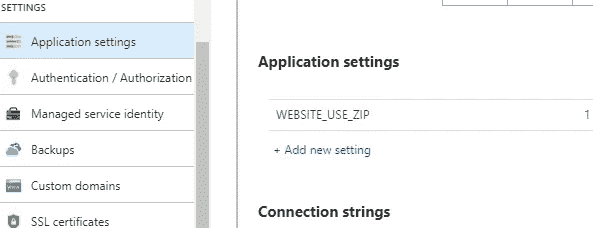
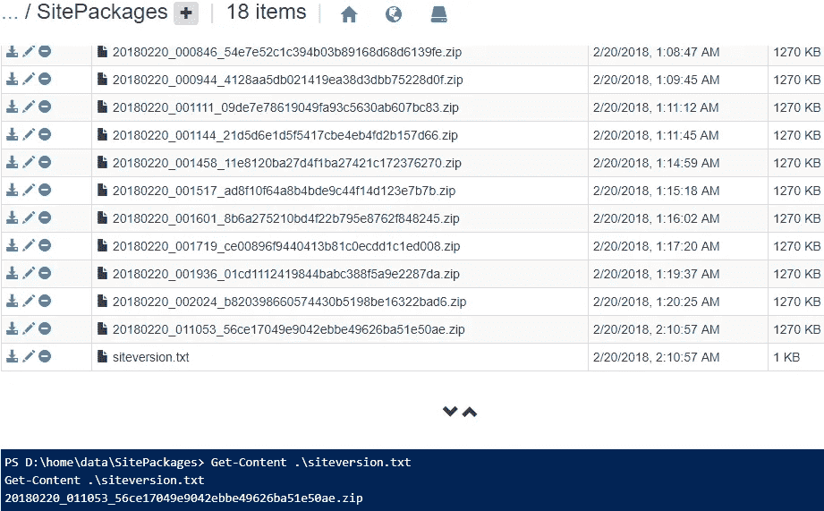

# 与 Cake Kudu 客户端一起“从 Zip 运行”

> 原文：<https://medium.com/hackernoon/run-from-zip-with-cake-kudu-client-5c063cd72b37>

## 部署 Azure Web 应用和功能应用的新方式

> 更新！自从这篇文章发表以来，Azure App Services 从 Zip 文件运行的功能有了一些突破性的变化，这个问题已经在 Cake 中得到解决。客户端版本 0.6.0 你可以在下面的帖子中了解更多

 [## 蛋糕。Kudu.Client 版本 0.6.0 发布

### 此版本修复了 Azure App Services 从 Zip 运行 web 应用部署功能中的一个重大更改。

medium.com](/@devlead/cake-kudu-client-version-0-6-0-released-cb6435629684) 

几天前，Azure 宣布他们在 preview 中增加了一种新的部署应用服务的方式，叫做 [Run-From-Zip](https://github.com/Azure/app-service-announcements/issues/84) ，可以让你使用 Zip 文件进行部署。

与以前一样，使用 zip 文件进行部署，这种新方法的不同之处在于，该文件没有提取到“wwwroot”目录中，而是将 zip 文件*挂载为只读的“wwwroot”。*

zip 文件可以在网站外部托管，也可以在应用服务本身的一个特殊文件夹中托管，后者现在是“Kudu 客户端”Cake addin 现在支持的——使您能够在 Cake 构建脚本中使用这种新的部署方法。

# 先决条件

要启用 Run-From-Zip 部署，您首先需要设置一个名为`WEBSITE_USE_ZIP`的应用程序设置，您可以在从外部源部署时将其设置为一个 url，或者在本例中将其设置为`1`。

# ZipRunFromDirectory

给事物命名很难，但是插件现在有了一个名为[ziprunfromdirect](https://cakebuild.net/api/Cake.Kudu.Client.Extensions/KuduClientZipExtensions/AA111BEB)的方法，它将完成所有的“繁重工作”并部署一个本地目录。

## 用法示例

所以使用这种新方法部署一个站点只需要几行代码

返回的文件路径是部署到应用程序服务的 zip 文件。

## 秘密地

那么这里到底发生了什么？
简而言之，该方法将:

1.  内存中的 zip 源目录
2.  将 zip 压缩到`d:\home\data\SitePackages`中一个唯一的带有日期戳的文件名
3.  将压缩文件的文件名推送到`d:\home\data\SitePackages\siteversion.txt`
4.  通过 Kudu API 调用该站点以确保它是已部署的正确版本(为此，在已部署的 zip 中包含了一个名为`KuduClientZipRunFromDirectoryVersion.txt`的文件)
5.  返回部署的 zip 的远程路径

# 结束语

我已经试了几天了，发现部署非常稳定和快速。但是真的需要更多的测试来看看在生产中运行这个会有什么影响，现有的应用程序在只读模式下会有什么表现，等等。

这是一个闪亮的新特性，仍然在预览中，一般的指导和工具支持还没有完全到位，但正如你在这篇文章中看到的，原语已经到位，可以在未来建立和完善体验！

 [## 介绍 Cake Kudu 客户端

### 使用 Cake 远程发送到 Azure 应用服务

hackernoon.com](https://hackernoon.com/introducing-cake-kudu-client-abda40d15f38)