# 优步如何利用 UberEats 平台上的语音技术占领 400 亿美元市场的 XX%的运营手册

> 原文：<https://medium.com/hackernoon/runbook-for-how-uber-can-capture-xx-of-a-40-billion-market-utilizing-voice-technology-on-the-72f6975feee7>

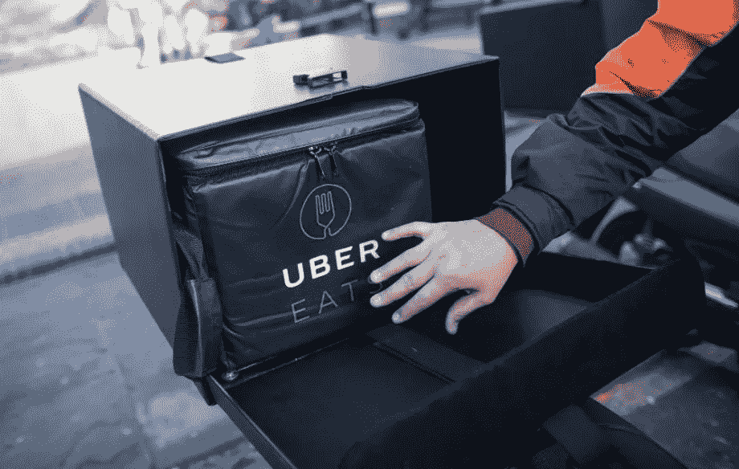

在我们开始谈论语音技术、T2 的 UberEats 平台或 400 亿美元的市场之前，让我们先来看看优步本身。这里有一份来自优步的[引文](https://www.uber.com/en-CA/about/)，介绍了他们是如何开始的，以及他们想去哪里。

> 它从一个简单的想法开始:如果你可以用手机请求搭车会怎么样？在超过 50 亿次旅行之后，我们正在努力使交通更安全、更便捷，帮助人们快速、实惠地点餐，通过让更多人乘坐更少的汽车来减少城市拥堵，并为人们创造自主工作的机会。

这些都是优步在未来几年想要处理和解决的大问题。其中一个问题是如何帮助人们快速、经济地点餐。

语音的产品机会在于**帮助人们快速点餐**。

下面是 UberEats 上点餐的当前**用户流量**。

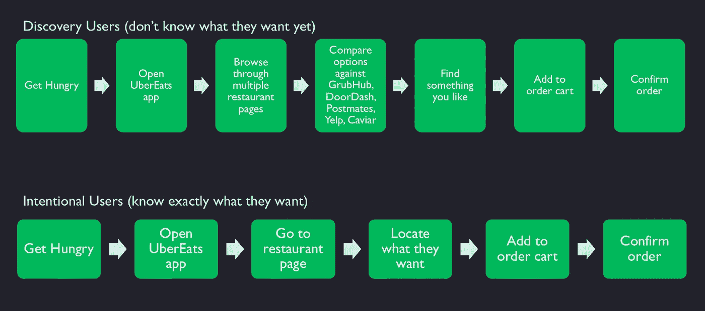

# **两大痛点**

用户在 UberEats 点餐过程中遇到两个主要问题。

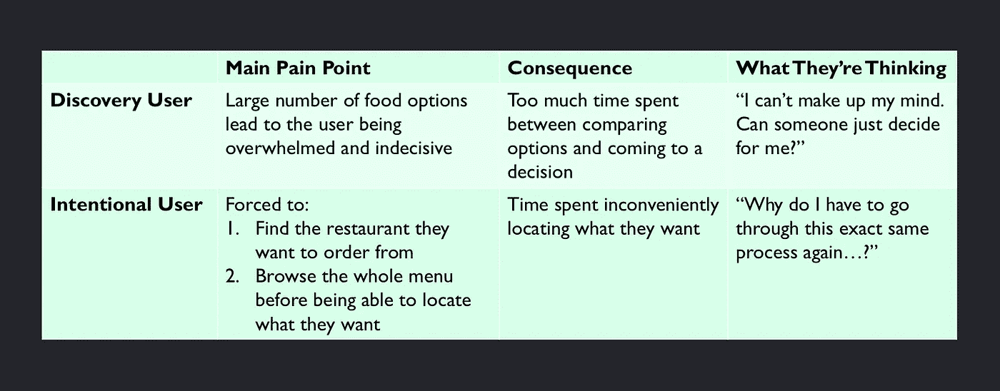

花在犹豫不决和不便上的时间表面上看起来像是微不足道的小事，但事实并非如此。事实上，在*他们想做的事情*和*他们想做的事情*之间有很大的摩擦(相对于通过语音界面可以完成的事情)。

**想想看:**如果每一个 YouTube 视频的加载都要多花 10 秒钟，你会变得非常恼火——客观地说，只有 10 秒钟，但是一旦人类获得了*速度*和*便利*，就很难回到看似*古老的*选项了。

# **语音将如何使人们更快地做决定，更快地做事**

下面是 UberEats 移动应用上的一系列示例语音*用例*。

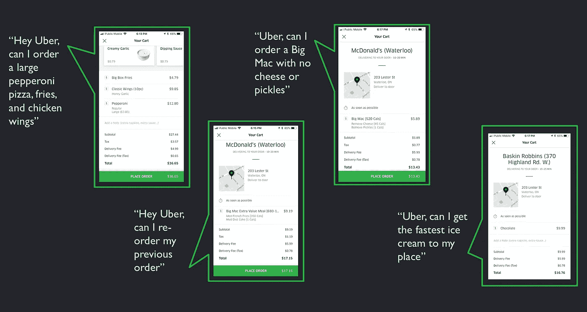

# 为什么语音作为界面是必然的

人类已经进化到选择阻力最小的道路。

为了说明人类是多么热爱速度，让我们看看历史是如何证明消费者的使用向最可靠和无摩擦的界面发展的

*   起初，计算机上的光标只能通过键盘上的箭头键垂直或水平移动
*   电脑鼠标使用户能够将光标从 A 点移动到 B 点，移动方式是同时由水平和垂直向量组成
*   目前，智能手机无需操纵光标就能立即识别意图区域并做出反应
*   使用你的声音是阻力较小的途径，我们目前有技术使它可靠地准确用户的意图

未能适应这一现实可能会导致 UberEats 在未来几年失去市场份额，因为竞争对手确实开始调整

*   [到 2020 年，50%的搜索将是语音搜索](https://www.campaignlive.co.uk/article/just-say-it-future-search-voice-personal-digital-assistants/1392459)
*   [到 2020 年美国将有 2140 万智能音箱](https://www.slideshare.net/ActivateInc/think-again-tech-media-outlook-2017-67604099)
*   [5%的消费者使用语音购物，预计 2022 年将上升至 50%](https://www.thestreet.com/story/14546693/1/walmart-should-worry-that-voice-shopping-will-be-huge.html)
*   [2017 年杂货购物(食品相关)占语音购物的 2017】](https://www.prnewswire.com/news-releases/voice-shopping-set-to-jump-to-40-billion-by-2022-rising-from-2-billion-today-300605596.html)

# 400 亿美元的市场

根据 OC&C 战略咨询公司的一项研究，到 2022 年，美国价值 400 亿美元的销售额将通过语音技术进行交易。

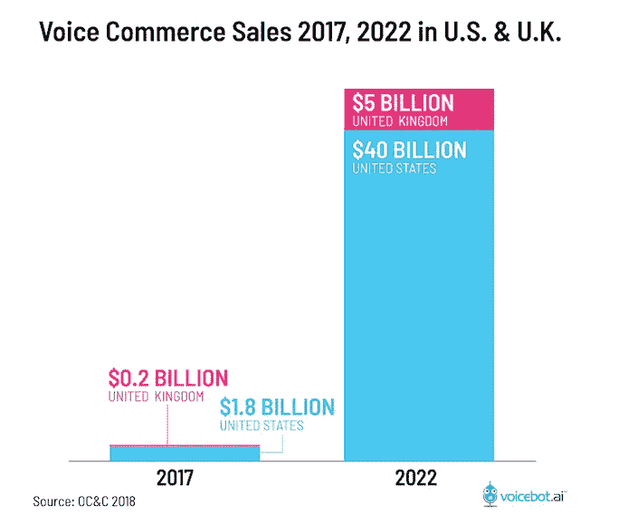

[Link to Report](https://www.prnewswire.com/news-releases/voice-shopping-set-to-jump-to-40-billion-by-2022-rising-from-2-billion-today-300605596.html)

鉴于 UberEats 的巨大平台、资源可用性和产品市场契合度，他们处于投资长期 moonshot 项目的最佳位置，该项目可能带来不成比例的商业价值——足以大幅缩小他们与 GrubHub(食品配送市场份额领先)之间的差距，如果不是超过他们的话。

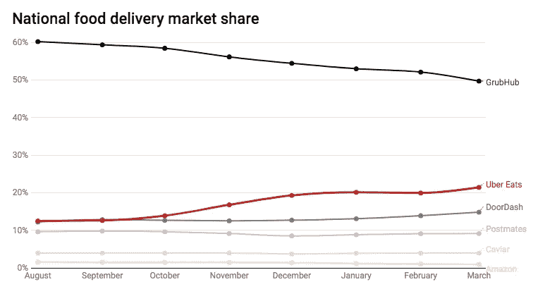

August 2017 — March 2018\. [Click Here for Source](https://www.datawrapper.de/_/UUqBD/)

通过成为*先行者，* UberEats 将在语音送餐市场获得巨大的市场份额，这在目前是“无可争议的”。这将通过以下方式实现:

*   在 UberEats 中构建语音用户界面
*   UberEats Siri 和谷歌助手在 iPhones 和 Android 移动设备上内置集成。
*   UberEats Alexa 技能和 Google Home 行动

看看目前的市场领导者，UberEats 可以很容易地在食品配送 Alexa Skill 上占据第一的位置——老实说，这并没有冒犯*披萨来源*或*丹尼的*

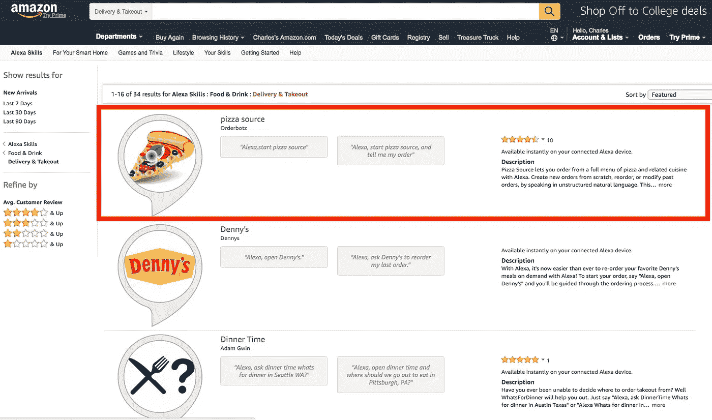

# 语音用户流量

UberEats 上点餐的语音用户流会是这样的。

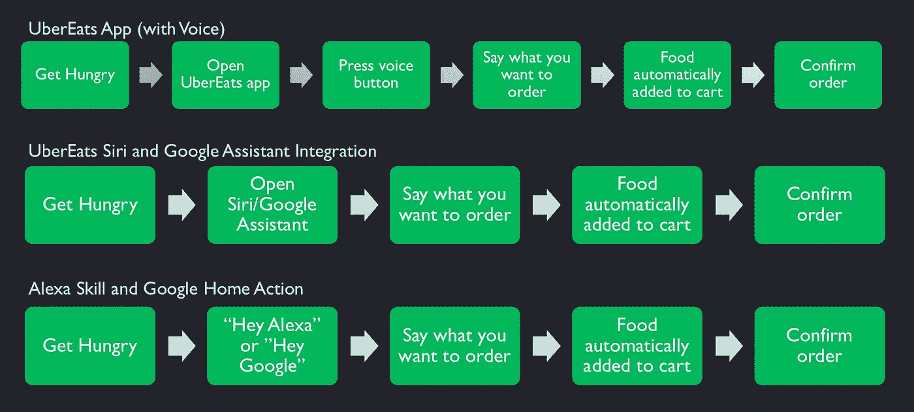

# 事实真相

让我们深入探讨如何为 UberEats 应用程序创建这种语音体验。

*   目前仅限英语
*   将语音按钮添加到主页选项卡的顶部栏上(将其放在过滤器按钮旁边)
*   点击按钮，调出语音订单屏幕

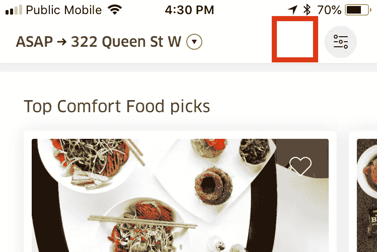

Draw similar elements from Shazam when constructing the voice ordering screen

## 解释逻辑

用户将说出他们的订单，商品将自动添加到订购车上。

*   多个项目将被分批送到一个餐厅，最贵的项目是过滤器的主要对象
*   目前，每次语音查询只能从 1 家餐厅点餐
*   交付时间少于 45 分钟的最受欢迎的餐厅是订单的默认过滤器，除非明确说明(“订购最快到达的披萨”)
*   如果参与度足够高，在未来的迭代中引入语音默认过滤器设置(“流行”、“评级”、“交付时间”)
*   未指定时，默认为中间份大小(披萨为“中号”)
*   像“汉堡包”、“比萨饼”和“冰淇淋”这样非特定搜索查询项应该映射到餐馆中该类型的最受欢迎的项目(“普通汉堡包”、“意大利香肠比萨饼”、“香草冰淇淋”)
*   未解释的用户意图将提示错误状态和消息，并要求用户再次请求他们的订单

最后，过敏警告、预期订购时间和总价格仍应在确认付款前提示并显示在最终的结账屏幕上。

# 系统结构

1.  利用 iOS 和 Android 语音转文本库( [iOS 语音](https://developer.apple.com/documentation/speech)和 [Android 语音识别器](https://developer.android.com/reference/android/speech/SpeechRecognizer))将用户语音输入转换为文本输出
2.  创建并设计一个语言解释器，将一个模式或单词序列映射到不同形式的*点餐*意图，并为这些创建 API 端点。上下文信息(食物类型、餐馆名称等)应该存储为槽。查看 [Amazon Intent Schemas](https://developer.amazon.com/docs/custom-skills/create-intents-utterances-and-slots.html) 如何解决这个问题。
3.  通过 API 端点将文本传送到意图解释器。识别出的意图将调用现有的 UberEats API 端点，并将提取的槽作为 API 参数(要订购的食品、要订购的餐馆),以便将商品添加到订单购物车中。

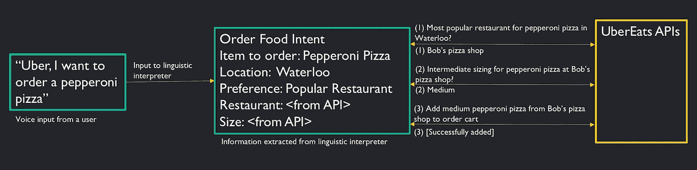

# 发布后 6 个月的成功定义

在前 6 个月，关注任务成功和客户效用。

*   **关键目标:**语音发起的订单应该比普通订单快 10%(从打开应用程序到订单确认的时间)
*   **目标 2:** 30%的成功语音查询转化为订单
*   **目标 3:** 85%的用户表示他们会再次使用语音点餐

在达到任务成功和效用指标后，关注增长(获取和参与)。

## 关键目标

**高级假设:**使用语音功能的用户应该能够比不使用该功能的用户更快地完成订单。

通过语音完成的订单应放入群组 A

*   在订购时跟踪会话长度(从开始打开应用程序到点击确认订单的时间)

正常完成的订单应放入群组 B

*   订购时跟踪会话长度
*   记录使用语音搜索的会话百分比。这些会话意味着语音不能满足用户的需求

群组 A 点餐时的会话长度应至少比群组 B 短 10%,才能有意义地说假设已被证明是正确的。

我们需要从应用程序会话的开始就加入时间，因为 UberEats 用户正在打开应用程序来寻找解决方案。我们的假设是，语音会在更短的时间内将用户转化为订单。

确保群组 B 中发起语音搜索的订单少于 10%。

## 目标 2

**高级假设:**使用语音功能的用户应该能够找到他们正在寻找的东西

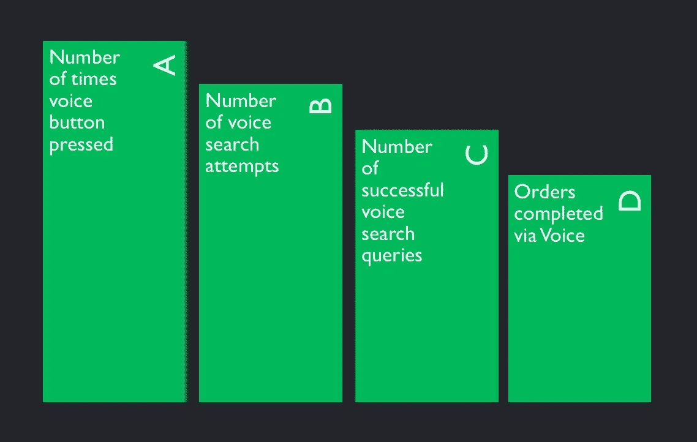

目前的主要重点不是增加 A，而是需要确保这一数字在 30 天内不会低于 30 天内唯一活跃用户的 0.1%。

*   b 不应低于 A 的 10%
*   至少 60%的语音搜索会导致商品被添加到购物车中。
    许多用户会把语音功能当作乐趣，这会对这个数字产生负面影响，这就是为什么基线没有设得更高。
*   **关键绩效指标:**语音功能建议的 10 个订单中有 3 个被订购

## 目标 3

**高级假设:**语音功能的用户体验是无缝的，让用户感到满意

**利用净推销商分数:**在语音发起的订单成功完成后，显示一个询问用户是否愿意再次使用语音订购的模式，带有*拇指向上*和*拇指向下*选项。

目标是获得至少 85%的好评。

# 前 6 个月的发布计划

从技术进步大城市的一小部分用户开始推广。

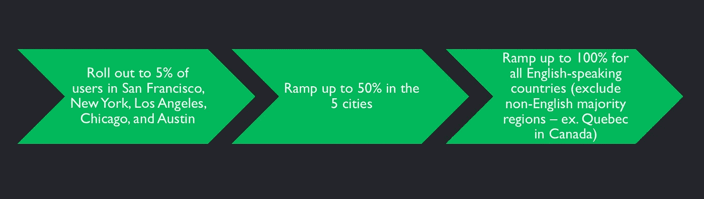

Minimum 2 weeks spent on each stage

在以下条件下，进行下一步:

*   语音订单应该比普通订单快 10%
*   在同一应用程序会话中尝试语音搜索的订单不到正常订单的 10%
*   在过去 30 天内，至少有 0.1%的独立活跃用户点击过语音按钮
*   至少 60%的语音搜索会将商品添加到订单购物车中
*   30%的成功语音搜索会带来订单
*   再次通过语音订购的净推广分数为 85%

# 结论

*   到 2022 年，通过语音交易的商务销售额有望达到 400 亿美元
*   消费者的使用向最可靠和无摩擦的界面发展
*   通过在 UberEats 上部署语音、Siri 和谷歌助理的集成、Alexa 技能和谷歌主页操作成为先行者，将为优步带来不成比例的收入和商业价值

如果你有任何问题，欢迎在下面提出！

放下一个👏如果你已经走了这么远！[更快到来](/@charlesbai)。

你是学生吗？20 多岁在科技行业工作？我在这里制作[视频](https://www.youtube.com/channel/UCTOrob9sFoyG8ryvEIJzu9Q/featured)。