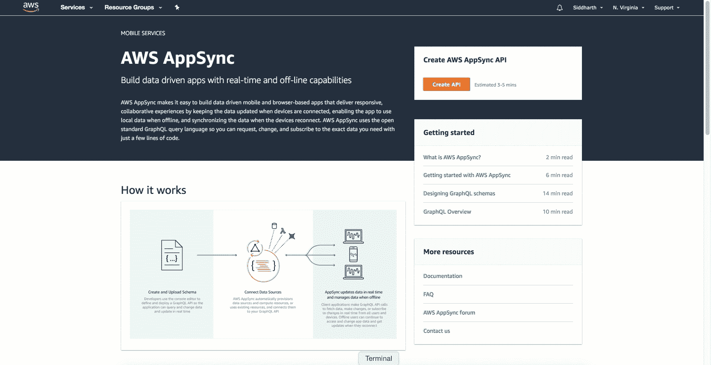

# 使用无服务器运行可扩展且可靠的 GraphQL 端点

> 原文：<https://medium.com/hackernoon/running-a-scalable-reliable-graphql-endpoint-with-serverless-24c3bb5acb43>

## 第 2 部分:AppSync 后端:AWS 托管的 GraphQL 服务


AWS AppSync architecture

> **第 1 部分** : [简介:带 API 网关的 GraphQL 端点+ AWS Lambda](https://serverless.com/blog/running-scalable-reliable-graphql-endpoint-with-serverless/)
> **第 2 部分** : AppSync 后端: [AWS](https://hackernoon.com/tagged/aws) 托管 GraphQL 服务(本帖)
> **第 3 部分** : [AppSync 前端:AWS 托管 GraphQL 服务](https://hackernoon.com/running-a-scalable-reliable-graphql-endpoint-with-serverless-db16e42dc266)
> **第 4 部分** : [无服务器 AppSync 插件:新特性](https://hackernoon.com/serverless-appsync-plugin-top-10-new-features-3faaf6789480)(最新！！！)

> “使用无服务器后端为您的 GraphQL 端点提供支持彻底解决了扩展性和可用性问题，并为您提供了安全保障。甚至没有那么多代码或配置”。-第一部分

# 介绍

在系列的这一部分中，我们将学习如何使用在 re: Invent 2017 上发布的名为 ***AppSync*** [的新 AWS 服务来构建](https://aws.amazon.com/blogs/aws/introducing-amazon-appsync/) [GraphQL](https://hackernoon.com/tagged/graphql) 端点。我将使用 AppSync 与 DynamoDB、ElasticSearch 和 AWS Lambda 集成来创建一个迷你 Twitter 应用程序 的后端，并向您展示如何使用*new*[**server less-AppSync-Plugin**](https://github.com/sid88in/serverless-appsync-plugin)**来配置和部署 App sync。**

我们开始吧！🏃

> *注:如果你是 Serverless 或 GraphQL 的新手，我会建议你拿起一杯咖啡，浏览一下本系列的* [***第 1 部分***](https://serverless.com/blog/running-scalable-reliable-graphql-endpoint-with-serverless/)**，然后再回来。**

# *AppSync 是什么？*

*AWS AppSync 是一个完全托管的无服务器 [GraphQL](http://graphql.org/) 服务，用于实时数据查询、同步、通信和离线编程功能。这篇博客涵盖了创建 GraphQL API 本身，本系列的下一部分将关注 AppSync 客户端及其特性 *(* [*)敬请关注*](https://twitter.com/sidg_sid) *！*🔈*)。**

*"*事实证明，*[*Apollo Client 2.0*](https://dev-blog.apollodata.com/apollo-client-2-0-beyond-graphql-apis-888807b53afe)*的模块化架构对于希望定制其 GraphQL 客户端的开发人员来说是一个巨大的胜利，因为这正是 AWS 团队能够构建* [*AppSync 客户端*](https://github.com/awslabs/aws-mobile-appsync-sdk-js/blob/254930e3de1211c20bbac3efadf571008826bc32/packages/aws-appsync/src/client.js) *的方式！*”——作者 authenticationType: **AMAZON_COGNITO_USER_POOLS | API KEY**
mappingTemplates:
- dataSource: **myDynamoDB | myElasticSearch | myLambda**
type: # GraphQL Type
field: # Schema Field
request: # Request Mapping Template
response: # Response Mapping Template
schema: schema.graphql # Input GraphQL Schema
dataSources:
- type: **AMAZON_DYNAMODB | AMAZON_ELASTICSEARCH | AWS_LAMBDA**
name: **myDynamoDB | myElasticSearch | myLambda**
config:
**tableName** | **endpoint** | **lambdaFunctionArn**
serviceRoleArn: *IAM ROLE**

*无服务器 AppSync 插件允许您将所有***六步*** 配置为您的[*server less . yml*](https://github.com/serverless/serverless-graphql/blob/master/app-backend/appsync/dynamo-elasticsearch-lambda/serverless.yml#L31)中的一个配置。您基本上可以使用这三个命令来部署、更新或删除 AppSync 组件:*

```
***serverless deploy-appsync
serverless update-appsync
serverless delete-appsync***
```

> ****注*** *:插件中的所有配置不言而喻，但如有任何疑问或想投稿，* [*欢迎随时联系我*](https://twitter.com/sidg_sid) *。**

## *最后，它看起来是这样的:*

**

*AppSync Deployment with Serverless Plugin*

# *迷你 Twitter 应用架构*

*现在，你可能会想“迷你 Twitter 应用有什么大惊小怪的？它是如何工作的？我还是不明白！”。好吧，让我解释一下:*

*这个应用程序包括一个反应前端以及一个 AppSync 客户端集成。您可以使用 [AWS Amplify](https://github.com/aws/aws-amplify) 和 Cognito 用户池进一步简化用户认证流程(我将在我的**下一篇**博文中详细介绍前端架构)。*

*对于应用后端，使用*无服务器 AppSync 插件*创建 GraphQL API。这个 API 连接到 DynamoDB(获取用户信息)、ElasticSearch(检索用户推文)和 Lambda(从 Twitter REST API 获取任何额外的用户信息)。*

> *注意:请按照[这些说明](https://github.com/serverless/serverless-graphql#setup-for-production-deploy-resources-to-aws)在您的本地环境中运行应用程序。*

**

*Mini Twitter App Architecture*

*让我们看一些解析器映射模板:*

> **例 1:*get userinfo(handle:String！) *vs.* meInfo*

*为 *getUserInfo* 请求映射模板:*

```
*{
    "version" : "2017-02-28",
    "operation" : "**Query**",
    "query" : {
        "expression": "handle = :**handle**",
        "expressionValues" : {
            ":handle" : {
                "S" : "${**context.arguments.handle**}"
            }
        }
    }
}*
```

*为 *meInfo* 请求映射模板:*

```
*{
    "version" : "2017-02-28",
    "operation" : "**Query**",
    "query" : {
        "expression": "handle = :**handle**",
        "expressionValues" : {
            ":handle" : {
                "S" : "${**context.identity.username**}"
            }
        }
    }
}*
```

*在本例中，请求模板使用 DynamoDB 查询操作从 Users 表中获取数据。在 *meInfo* 中，用户的句柄来自包含其身份信息的上下文变量(在客户端通过 JWT 令牌解析)。[本文](https://docs.aws.amazon.com/appsync/latest/devguide/resolver-context-reference.html)解释了更多关于 AppSync 中上下文变量和 util 函数的功能。*

*两个字段的响应映射模板:*

```
*$util.toJson(**$context.result.items[0]**)*
```

> **例 2:* 收藏夹 _ 计数*

*在这种情况下，我们希望从 Twitter 本身获取用户最喜欢的计数的值。AWS Lambda 通过查询 REST API ( [参考](https://github.com/serverless/serverless-graphql/blob/master/app-backend/appsync/dynamo-elasticsearch-lambda/handler.js#L6))提供了灵活性*

```
***exports**.graphqlHandler = (event, context, callback) => {
  **switch** (event.**field**) {
    **case 'favourites_count'**: {
      **const** handle = event.**arguments**.**handle** ? event.**arguments**.**handle** : event.**handle**;

      *getFavouritesCount*(handle).then(result => {
        callback(**null**, result);
      });

      **break**;
    }
  }
};*
```

> **例三:* **推文**(限定:Int！，nextToken: String)*

*ElasticSearch 提供了搜索引擎的强大功能。在这种情况下，我们将 ES 中的所有 tweet 编入索引，下面的请求映射模板对用户的 tweet 进行分页:*

```
*{
    "version":"2017-02-28",
    "operation":"GET",
    "path":"/user/twitter/_search",
    "params":{
        "body":{
            "from": **$context.arguments.nextToken**,
            "size": **$context.arguments.limit**,
            "query" : {
                "bool" : {
                    "must" : [
                        {
                        "match" : 
                           { "handle" : **$context.source.handle** }
                        }
                    ]
                }
            }
        }
    }
}*
```

*响应映射模板:*

```
*{
  #set($hitcount = **$context.result.hits.total**)
    #set($tweetList = [])
    #set($counter = 0)
  #if($hitcount > 0)
        #foreach($entry in **$context.result.hits.hits**)
          #set( $element = ${tweetList.add(
          { 
            "tweet" : "$entry.get('_source')['tweet']",
            "tweet_id": "$entry.get('_id')",
            "created_at": $entry.get('_source')['created_at']
          })})
          #set ($counter = $counter + 1)
      #end
          "items" : $util.toJson($tweetList),
          "nextToken" : "$counter"
   #end
}*
```

***样本 GraphQL 查询**:*

```
***query** {
  **meInfo**{                           *# DynamoDB*
    name                            
    description                     
    **favourites_count** *#**Lambda*
    **tweets**(limit:4, nextToken:"3"){ *# ElasticSearch*
      items{
        tweet
        tweet_id
        created_at
      }
      nextToken
    }
  }
}*
```

> *最后但同样重要的是…*
> 
> *最精彩的部分？要让订阅在后端工作，您只需用 4 行代码扩展您的 GraphQL 模式:*

```
*type Subscription {
  addTweet: Tweet
  @aws_subscribe(mutations: [“createTweet”]
}*
```

*这段代码建立了一个**订阅**来监听每一个新的[*create tweet*](https://github.com/serverless/serverless-graphql/blob/master/app-backend/appsync/dynamo-elasticsearch-lambda/schema.graphql#L4)**变异，一旦你的客户决定订阅这个订阅，它将会得到实时更新(在下一篇文章中会有更多相关内容😏)***

# ***AppSync 限制***

1.  *****陡峭的学习曲线** 使用 AppSync 需要很好地理解 [VTL](http://velocity.apache.org/engine/1.7/vtl-reference.html) 。对于初学者，我会完全推荐[这本指南](https://docs.aws.amazon.com/appsync/latest/devguide/resolver-mapping-template-reference-programming-guide.html)。但是，好消息是 AWS 提供了一系列的[助手和实用程序](https://docs.aws.amazon.com/appsync/latest/devguide/resolver-context-reference.html)来让我们的生活变得更加轻松。***
2.  *****缺少 GraphQL 信息对象** AppSync 目前没有在上下文变量中提供[信息对象](https://blog.graph.cool/graphql-server-basics-demystifying-the-info-argument-in-graphql-resolvers-6f26249f613a)，这限制了它与其他开源 GraphQL 框架(如 [Prisma](https://github.com/graphcool/prisma) )集成的功能。***
3.  *****缺少对 DynamoDB 批处理操作的支持** 截至目前，AppSync 并不支持所有 DynamoDB API，例如 BatchGetItem 或 BatchPutItem***

***AppSync 正在积极地添加功能来简化无服务器的 GraphQL 体验，我很期待。***

# ***接下来呢？***

***在本系列的下一部分，我将详细解释迷你 Twitter 应用的前端组件，包括 **AppSync 客户端**、 **AWS Amplify** 、 **React 组件**、**突变**乐观响应**和**离线支持**、**订阅**、**冲突解决**等 *(* [*敬请关注*🔈*)。*](https://twitter.com/sidg_sid)*****

****该应用程序将看起来像这样:****

******

# ***特别感谢***

***首先，非常感谢 [Nik Graf](https://medium.com/u/ff3f225e7f5c?source=post_page-----24c3bb5acb43--------------------------------) 在这个项目上的合作，她是一位优秀的导师，并帮助进行代码审查和实现。***

***感谢[菲利普](https://medium.com/u/a770eb52909c?source=post_page-----24c3bb5acb43--------------------------------)、[乔恩](https://twitter.com/superpatell)和 [LolCoolKat](https://twitter.com/lolcoolkat) 为 AppSync 插件所做的努力。***

***AWS 移动团队([理查德](https://medium.com/u/5342f0b850db?source=post_page-----24c3bb5acb43--------------------------------)、[罗汉](https://medium.com/u/1acf799d46d3?source=post_page-----24c3bb5acb43--------------------------------)、[纳德](https://medium.com/u/695782484bda?source=post_page-----24c3bb5acb43--------------------------------)、[曼努埃尔](https://twitter.com/menyao)和[迈克尔](https://medium.com/u/a9d19754c17e?source=post_page-----24c3bb5acb43--------------------------------))帮助解决问题并密切合作解决问题和错误。***

***最后但同样重要的是，感谢每一个正在阅读这篇文章或鼓励我写更多的人。**你的支持驱使我做出更多贡献**😃 😍***

******

***[Serverless and GraphQL Meetup](https://www.meetup.com/Serverless/events/245690042) at Glassdoor, San Francisco attended by [Graphcool](https://medium.com/u/122d169c63c0?source=post_page-----24c3bb5acb43--------------------------------), [Serverless](https://medium.com/u/10625560e1ed?source=post_page-----24c3bb5acb43--------------------------------), [Danielle](https://medium.com/u/47b3b199a712?source=post_page-----24c3bb5acb43--------------------------------), [Nik](https://medium.com/u/ff3f225e7f5c?source=post_page-----24c3bb5acb43--------------------------------), [Rohan](https://medium.com/u/1acf799d46d3?source=post_page-----24c3bb5acb43--------------------------------), [Michael](https://medium.com/u/a9d19754c17e?source=post_page-----24c3bb5acb43--------------------------------)***

***我想用我最喜欢的一句话来结束我的博客—***

***重要的是不要停止提问。好奇心有它存在的理由。”— 阿尔伯特·爱因斯坦***