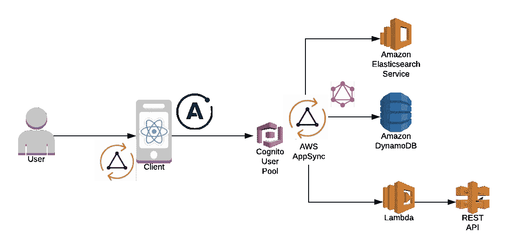
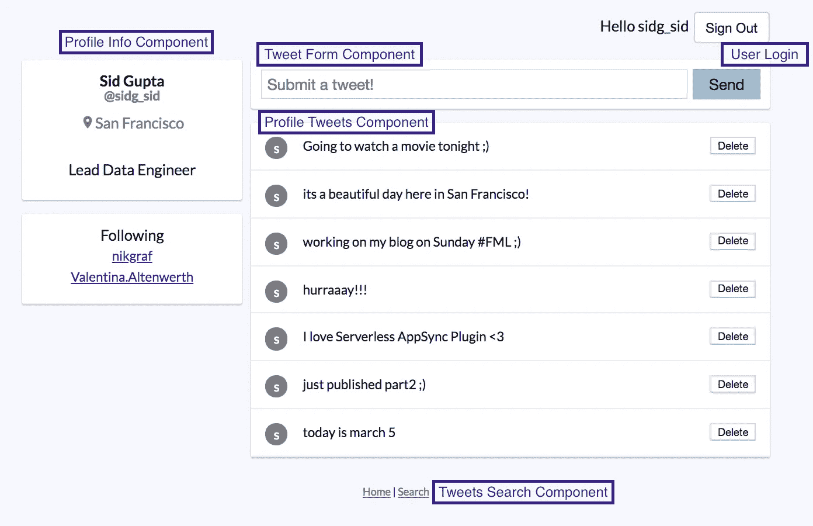
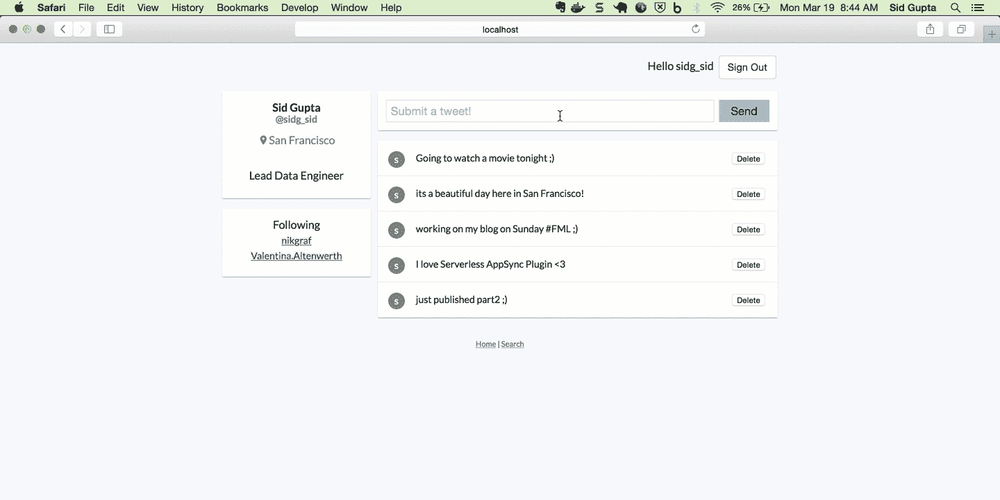
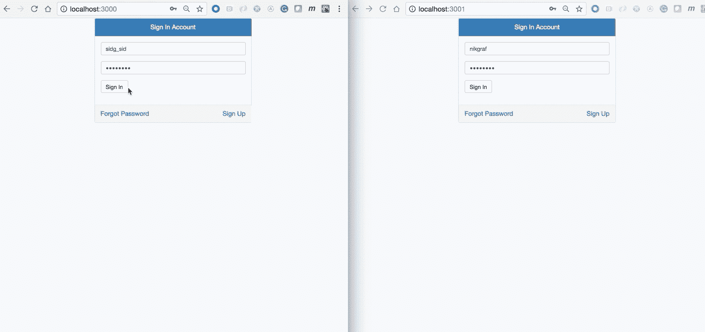
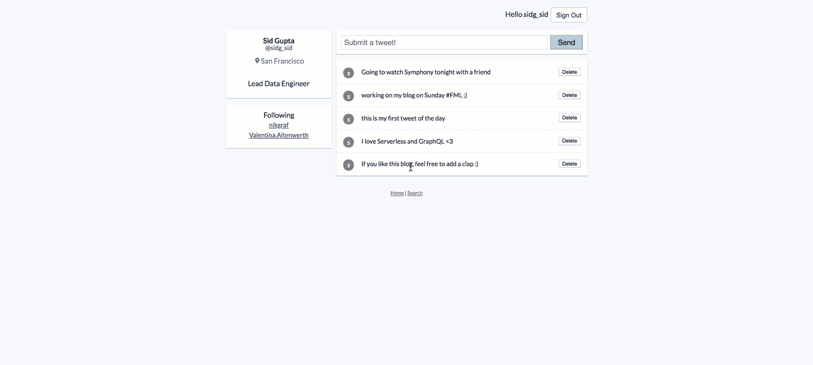

# 使用无服务器运行可扩展且可靠的 GraphQL 端点

> 原文：<https://medium.com/hackernoon/running-a-scalable-reliable-graphql-endpoint-with-serverless-db16e42dc266>

## 第 3 部分:AppSync 前端:AWS 托管的 GraphQL 服务



AWS AppSync architecture

> **第 1 部分** : [简介:带 API 网关的 GraphQL 端点+ AWS Lambda](https://serverless.com/blog/running-scalable-reliable-graphql-endpoint-with-serverless/)
> **第 2 部分** : [AppSync 后端:AWS 托管 GraphQL 服务](https://hackernoon.com/running-a-scalable-reliable-graphql-endpoint-with-serverless-24c3bb5acb43)
> **第 3 部分** : AppSync 前端:AWS 托管 GraphQL 服务(本帖)
> **第 4 部分** : [无服务器 AppSync 插件:新特性](https://hackernoon.com/serverless-appsync-plugin-top-10-new-features-3faaf6789480)(最新！！！)

> *"* AWS AppSync 是一个完全托管的无服务器 GraphQL 服务，提供实时数据查询、同步、通信和离线编程功能。*”—第二部分*

# 介绍

在本帖中，我们将学习如何使用 **ReactJS** 和 **AWS AppSync** 构建迷你 Twitter 应用的客户端组件。具体而言，我将重点介绍:

*   *通过 AWS Amplify 进行用户认证*。
*   *迷你推特应用组件*。
*   *GraphQL 订阅*。
*   *GraphQL 突变与* *乐观 UI 和离线支持。*
*   *使用 Netlify 和 S3 的无服务器客户端部署**。*

*我们开始吧！🏃*

> ***注 1:** 在[第二部分](https://hackernoon.com/running-a-scalable-reliable-graphql-endpoint-with-serverless-24c3bb5acb43)中，我们已经使用 AWS AppSync、DynamoDB、ElasticSearch 和 AWS Lambda 创建了迷你 Twitter 应用的后端 GraphQL API。我们还使用新的[server less-app sync-plugin](https://github.com/sid88in/serverless-appsync-plugin)部署了 API。*
> 
> ***注 2:** 您可以使用`yarn start.`在 [serverless-graphql](https://github.com/serverless/serverless-graphql/blob/master/app-client/appsync-client/src/App.js) 存储库中快速开始使用此应用程序，请确保配置设置正确。*
> 
> ***注 3:** AppSync 客户端也有针对原生 iOS、web 和 React Native 的 SDK，但在本文中，我们将使用 [JS SDK](https://github.com/awslabs/aws-mobile-appsync-sdk-js) 构建 React JS 应用。*

# *AppSync 客户端+ AWS 放大器*

*[AppSync](https://hackernoon.com/tagged/appsync) 客户端使用 [Apollo Client 2.0](https://dev-blog.apollodata.com/aws-appsync-powered-by-apollo-df61eb706183) 在幕后简化用户认证，管理离线逻辑，支持[实时](https://hackernoon.com/tagged/real-time)订阅。*

*另一方面，您可以使用带有 [AWS Amplify](https://github.com/aws/aws-amplify) 的 AppSync 客户端来简化应用程序中的用户认证工作流🔑。AppSync 使用 API 密钥、Cognito 用户池或 AWS IAM 策略提供身份验证，AWS Amplify 使用 [Auth Class](https://aws.github.io/aws-amplify/api/classes/authclass.html) 中提供的方法对*用户注册、登录、密码确认和注销进行补充。**

```
***import** Amplify, { Auth } **from 'aws-amplify'**;
**import** { *withAuthenticator* } **from 'aws-amplify-react/dist/Auth'**;
**import** AWSAppSyncClient **from 'aws-appsync'**;
**import** { ApolloProvider } **from 'react-apollo'**;**const** client = **new** AWSAppSyncClient({
  **url**: 'https://xxxx.appsync-api.us-east-1.amazonaws.com/graphql',
  **region**: 'us-east-1',
  **auth**: { // AWS Cognito User Pool
    **type**: **AUTH_TYPE**.**AMAZON_COGNITO_USER_POOLS**,
    jwtToken: **async** () =>
      (**await** Auth.currentSession()).getIdToken().getJwtToken(),

    // API KEY
    **type**: **AUTH_TYPE**.**API_KEY**,
    apiKey: 'xxxxxxxxxxxxx', // AWS IAM
    **type: AUTH_TYPE.AWS_IAM**
    credentials: () => Auth.currentCredentials(), },
});**const** *WithProvider* = () => (
  <**Router**>
    <**ApolloProvider client=**{client}>
  </**Router**>
);**export default** *withAuthenticator*(*WithProvider*);*
```

*如上面的`App.js`代码所示，向应用程序添加身份验证就像用`withAuthenticator`高阶组件包装应用程序的主组件一样简单。您可以使用 AWS 的`*aws-appsync-react*`和`*aws-amplify-react*` 包进行所有这些集成。*

> ***注意:**对于这个演示，我使用 AWS Cognito 用户池进行用户认证，并在 Cognito 中创建了两个测试用户(sidg_sid 和 nikgraf)。一旦用户登录，他们的会话就会被 Amplify 保存在`localStorage`中。所以用户可以离开页面，回来，仍然登录！你可以在 [Nader Dabit](https://medium.com/u/695782484bda?source=post_page-----db16e42dc266--------------------------------) 的[这个帖子](https://hackernoon.com/react-authentication-in-depth-4deebda9aa45)中找到更多细节。*

**

*User Authentication with AWS AppSync + AWS Amplify + AWS Cognito*

# *迷你 Twitter 应用组件*

*现在，激动人心的事情开始了！💃*

*这个应用的基本结构是使用`[create-react-app](https://github.com/facebook/create-react-app)`创建的。此外，我们正在使用`[styled-components](https://github.com/styled-components/styled-components)`使我们的应用程序看起来很花哨💅下面给出了该应用程序的五个主要组件。*

*   ****UserLogin*** :用户可以从本 App *(上一节)登录或注销。**
*   ****ProfileInfo*** :从 DynamoDB 中检索用户基本资料信息。*
*   ****profile Tweets***:从 ElasticSearch 检索 tweets 列表。*
*   ****TweetForm*** :用户可以发送推文。*
*   ****TweetSearch*** :用户可以通过关键词搜索所有 tweets 的语料库。*

*为了使这一切正常工作，我们利用了特定的 GraphQL 操作:*

*   ****查询*** —获取给定用户的个人资料信息和推文列表。*
*   ****突变*** —为给定用户创建和删除推文。*
*   ****订阅*** —给定用户的关注者可以看到他的新推文。*

**

*Various Components of mini Twitter App*

# *个人资料信息组件:*

*在本节中，您将看到如何使用`react-apollo`中的`ProfileInfoQuery`、`graphql`连接该组件。*

*这个应用程序的 GraphQL 模式定义了`getUserInfo`。下面给出的查询的解析器为给定的用户*句柄从 DynamoDB 获取数据。**

```
***export const** ProfileInfoQuery = gql**`
  query** ProfileInfoQuery(**$handle: String!) {
    getUserInfo(handle: $handle) {
      name
      location
      description
      following
     }
  }
`**;*
```

**句柄*的值是从 JWT 令牌中解析出来的，可以在`context.identity.username`中获得，或者可以作为输入`context.arguments.handle`提供。上面的查询是使用 AppSync 后端中的以下映射模板解决的。*

```
*{
    "version" : "2017-02-28",
    "operation" : "**Query**",
    "query" : {
        "expression": "**handle** = **:handle**",
        "expressionValues" : {
            ":handle" : {
                "S" : "${**context.identity.username**}"
            }
        }
    }
}*
```

*`ProfileInfoComponent`结尾是:*

```
***import** React **from 'react'**;
**import** { *graphql* } **from 'react-apollo'**;
**import** { ProfileInfoQuery } **from '../queries'**;**const** *ProfileInfo* = ({ data: { loading, **getUserInfo** }}) => {
  **if** (loading) { **return** ( <**p**>Loading ...</**p**> ); } **return** ( <d**iv**> <**h4**> {**getUserInfo**.**name**} </**h4**> </d**iv**> );
};**export default** *graphql*(ProfileInfoQuery, {
  options: props => ({
    **variables**: {
      **handle**: props.**handle**,
    },
  }),
})(***ProfileInfo***);*
```

> ***注**:迷你 Twitter 应用的 GraphQL 模式和解析器在[第 2 部分](https://hackernoon.com/running-a-scalable-reliable-graphql-endpoint-with-serverless-24c3bb5acb43)中有解释。*

# *个人资料推文组件:*

*该组件的数据也从 AppSync 模式中定义的`getUserInfo`中检索。该查询的解析器点击 ElasticSearch tweet 索引，并通过*句柄检索 tweet。**

```
***export const** ProfileTweetsQuery = gql**`
  query** ProfileTweetsQuery **{
    getUserInfo {
      tweets(limit: 10) {
        items {
          tweet
          tweet_id
        } 
        nextToken
      }
    }
  }
`**;*
```

# *乐观的回应和线下的支持*

*现在，让我们想象以下场景:*

> *场景:在漫长的一天工作后，你正准备回家。你乘火车从 A 站到 b 站。现在，你还在推特上发表你对你最感兴趣的话题的想法，但突然火车穿过隧道，现在你遇到了网络连接问题。你的应用程序将如何处理这个问题？*

*在这种可能的情况下，用户会期望应用程序正常运行(哦耶！用户期望很高😉点击删除应用程序按钮并不会花费他们太多时间💁).这就是 ***乐观响应*** 和 ***离线支持*** 在后端不可达时前来救援的地方。*

*我们的下一个组件， **TweetForm** 处理上面解释的场景。在这种情况下， *create tweet mutation* 将一条 tweet 记录放入 ElasticSearch 索引中。*

```
***export const** AddTweetMutation = gql**`
  mutation AddTweetMutation(
    $tweet: String!
  ) {
    createTweet(
      tweet: $tweet
    ) {
      tweet_id
      tweet
    }
  }
`**;*
```

*现在，我们需要在我们的组件中增加两个功能，在这篇文章的[中也有解释。](https://code.tutsplus.com/tutorials/code-an-app-with-graphql-react-native-and-aws-appsync-the-app--cms-30569)*

1.  *`optimisticResponse`定义您希望在更新功能中可用的新响应。*
2.  *`update`接受两个参数，代理(允许您从缓存中读取)和您想要用来进行更新的数据。我们读取当前缓存(`proxy.readQuery`)，将它作为我们的新条目添加到条目数组中，然后写回缓存，这更新了我们的 UI。*

```
***export default** *graphql*(AddTweetMutation, {
  props: ({ mutate }) => ({
    addTweet: tweet => {
      **return** mutate({
        **variables**: {
          tweet,
        },
        optimisticResponse: () => ({
          **createTweet**: {
            tweet,
            **tweet_id**: uuid(),
            **__typename**: **'Tweet'**,
          },
        }),
        update: (proxy, { data: { createTweet } }) => {
          **const** data = proxy.readQuery({
            **query**: ProfileTweetsQuery,
            **variables**: {
              tweet,
            },
          });
          data.**meInfo**.**tweets**.**items**.push(createTweet);
          proxy.writeQuery({
            **query**: ProfileTweetsQuery,
            data,
            **variables**: {
              tweet,
            },
          });
        },
      });
    },
  }),
})(TweetFormComponent);*
```

> *和..嘣！你可以亲眼目睹这种魔力👓*

**

# *让我们看看所有这些实时的东西是如何工作的:*

> *最精彩的部分？要让订阅在后端工作，您只需用 4 行代码扩展您的 GraphQL 模式:*

```
*type Subscription {
  addTweet: Tweet
  @aws_subscribe(mutations: [“createTweet”]
}*
```

> *场景:假设我们有两个用户(sidg_sid 和 nikgraf)互相关注。在这种情况下，两个用户都订阅了对方的推文。如下所示，当用户 sidg_sid 发送一条推文时，它会立即被推送给包括 nikgraf 在内的所有关注者，反之亦然。*

**

*Real Time Subscriptions*

*AWS AppSync 中的订阅被调用作为对突变的响应。此外，它们由 AWS AppSync 客户端 SDK 自动处理，使用 MQTT over Websockets 作为客户端和服务之间的网络协议。每次添加新的 tweet 时，都会调用下面的订阅。*

```
***export const** AddTweetSubscription = gql**`
  subscription AddTweetSubscription {
    addTweet {
      __typename
      tweet_id
      tweet
    }
  }
`**;

**export default** {
  AddTweetSubscription,
};*
```

*我们现在通过使用`AddTweetSubscription`和用户`handle`调用`subscribeToMore`函数，将该订阅添加到*个人资料推文组件*。`updateQuery`在给定用户之前的推文中添加一条新推文。*

```
***const** tweetsQuery = *graphql*(ProfileTweetsQuery, {
  options: props => ({
    **variables**: { ...variables, **handle**: props.**handle** },
    **fetchPolicy**: **'cache-and-network'**,
  }),
  props: props => ({
    ...props,
    subscribeToNewTweets: params =>
      props.**data**.subscribeToMore({
        **document**: AddTweetSubscription,
        **variables**: params,
        updateQuery: (prev, { subscriptionData: { data: { addTweet } } }) => {
          **return** {
            ...prev,
            **getUserInfo**: {
              ...prev.**getUserInfo**,
              **tweets**: {
                **items**: [addTweet, ...prev.**getUserInfo**.**tweets**.**items**],
              },
            },
          };
        },
      }),
  }),
});

**export default** compose(tweetsQuery)(ProfileTweetsComponent);*
```

# *搜索所有推文组件*

*最后但并非最不重要的一点是，用户还可以通过关键词搜索推文语料库。该查询的解析器映射到后端的 ElasticSearch 查询。*

```
***export const** SearchTweetsQuery = gql**`
  query UserQuery($keyword: String!) {
    searchAllTweetsByKeyword(keyword: $keyword) {
      items {
        tweet
        tweet_id
      }
    }
  }
`**;*
```

**

*ElasticSearch Query*

*`SearchTweetsComponent`结尾是:*

```
***import** React **from 'react'**;
**import** { *graphql* } **from 'react-apollo'**;
**import** { SearchTweetsQuery } **from '../queries'**;**const** Search= ({ data: { loading, searchAllTweetsByKeyword }}) => {
  **if** (loading) { **return** ( <**p**>Loading ...</**p**> ); }**return** (
  <**Container**>
    {searchAllTweetsByKeyword.**items**.map((item, index) => (
      <**Tweet key=**{index}>{item.tweet}</**Tweet**>
    ))}
  </**Container**>
);
};**export default** *graphql*(SearchTweetsQuery, {
  options: props => ({
    **variables**: {
      **handle**: props.**handle**,
    },
  }),
})(Search);*
```

# *使用 Netlify 和/或 S3 的无服务器客户端部署*

> *部署 Netlify:**yarn build&&Netlify 部署 build** 部署 S3: **yarn build & &无服务器客户端部署***

```
***service:** serverless-graphql-client

**frameworkVersion: ">=1.21.0 <2.0.0"

provider:
  name:** aws
  **runtime:** nodejs6.10
  **stage:** dev
  **region:** us-east-1

**plugins:** - serverless-finch

**custom:
  client:
    bucketName:** <unique bucket name>
    **distributionFolder:** build*
```

# *特别感谢*

*[Nik Graf](https://medium.com/u/ff3f225e7f5c?source=post_page-----db16e42dc266--------------------------------) 合作实现客户端组件。
[Manuel](https://twitter.com/menyao) 和 [Nader](https://medium.com/u/695782484bda?source=post_page-----db16e42dc266--------------------------------) 用于帮助和审查代码。*

*最后但同样重要的是，感谢所有人鼓励我多写点东西，感谢以前的博客。*

*我想用我最喜欢的一句话来结束我的博客—*

**“想象力比知识更重要。因为知识是有限的，而想象力包含整个世界，刺激进步，催生进化。”—* 阿尔伯特·爱因斯坦*