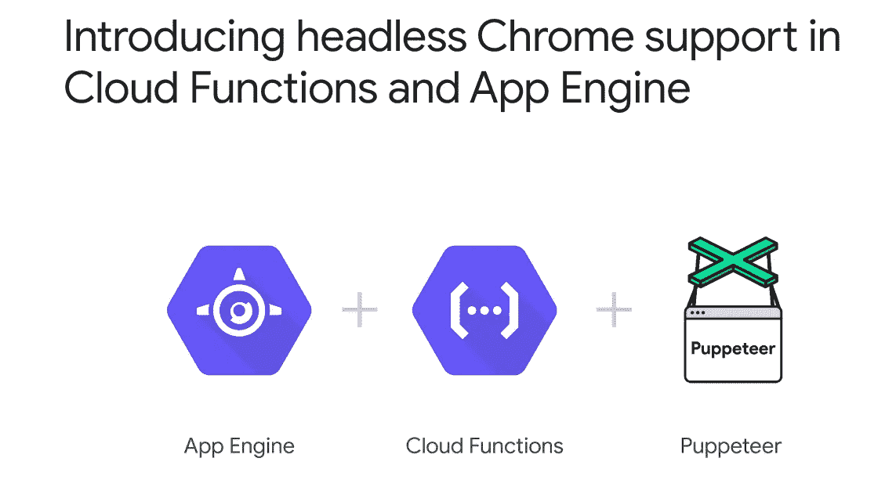
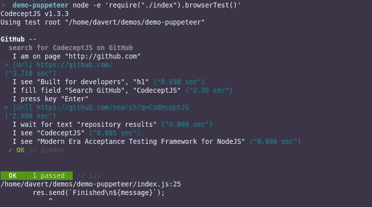
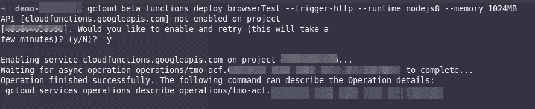
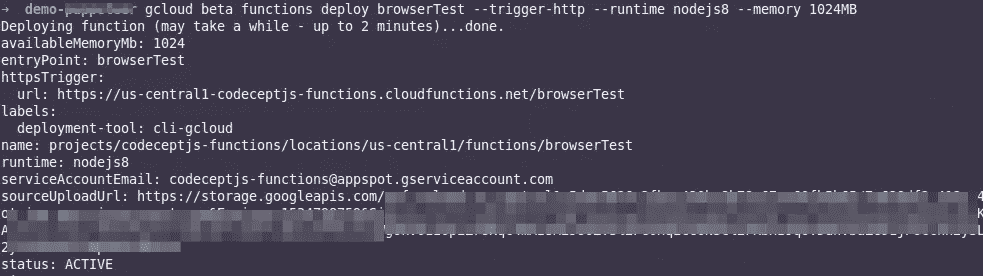
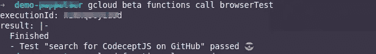
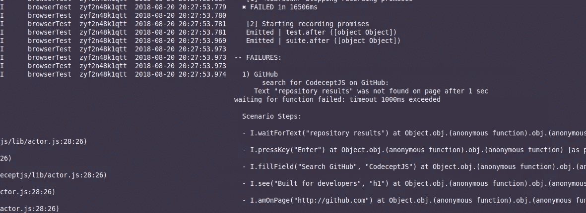
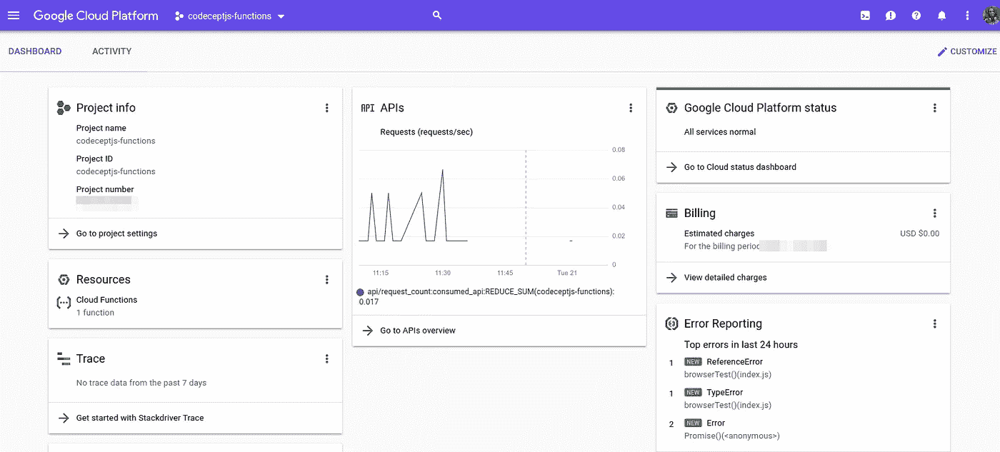

# 作为谷歌云功能运行端到端测试

> 原文：<https://medium.com/hackernoon/running-end-to-end-tests-as-google-cloud-functions-f5e34ffc3984>

一切从这里开始:[谷歌宣布在其云功能服务](https://cloud.google.com/blog/products/gcp/introducing-headless-chrome-support-in-cloud-functions-and-app-engine)中支持浏览器。但是好吧，就一个浏览器。猜猜是哪个？你说的没错，是谷歌 Chrome。无头铬合金。尽管如此，这个声明是巨大的，这可能是我们所知道的浏览器测试革命的开始。



[Announcement post](https://cloud.google.com/blog/products/gcp/introducing-headless-chrome-support-in-cloud-functions-and-app-engine)

我来详细说明一下。Google 中的云函数(类似 AWS 中的 lambdas)是无服务器的无状态函数，你只需为它们实际执行的时间付费。在测试社区内部，人们对使用它们有着浓厚的兴趣。事实上，我们正在以同样的方式启动我们的浏览器——启动和停止，我们不想为测试不运行的时间付费！在此之前，很难让浏览器运行在云功能中，但现在谷歌安装了一个，所以我们准备尝试一下。它能成为游戏规则的改变者吗？

谷歌推荐使用[木偶师](https://github.com/GoogleChrome/puppeteer)库来控制浏览器。木偶师本身并不是一个测试框架，所以为了编写和运行实际的测试，我们将使用 [CodeceptJS 测试框架](https://codecept.io)。这个可以在各种后端运行测试，比如 Selenium，但是也内置了对木偶师的支持。如果你以前从未遇到过 CodeceptJS，可以查看我之前的帖子[:“用 CodeceptJS 在 JavaScript 中进行有效的 End 2 End 测试”](https://hackernoon.com/effective-end-2-end-testing-in-javascript-with-codeceptjs-37c8d7d6a928)。今天我们将尝试一些高级的东西:作为云函数运行功能测试。


[CodeceptJS testing framework](https://codecept.io)

首先你需要在[谷歌云平台](https://console.cloud.google.com/project/_/logs?service=cloudfunctions.googleapis.com)注册。即使你没有账户，创建一个也很容易，因为每个人都有谷歌账户。谷歌会问你要信用卡，但别担心，你一年可以花 300 美元，云功能包含在免费层中。创建帐户后，您需要[安装 *gcloud* 命令行](https://cloud.google.com/sdk/docs/quickstarts)工具。

> 云功能免费层包括每月多达 200 万次调用和 100 万秒的免费计算时间

现在让我们做一些 JavaScript 的东西。让我们从制作包含 codeceptjs 和 puppeteer 库的`package.json` 文件开始:

```
{
  "name": "browserTest",
  "main": "index.js",
  "dependencies": {
    "codeceptjs": "^1.3.3",
    "puppeteer": "^1.6.2"
  }
}
```

然后运行`npm install`。您不需要安装任何其他测试框架，比如 Mocha，因为 CodeceptJS 已经提供了一个测试框架。它还内置了断言。

与传统的 [CodeceptJS 安装](https://codecept.io/quickstart/)(仍然可以完成)不同，我们不能在这里使用 CodeceptJS CLI runner，因为 Google 希望在`index.js`中使用纯 JavaScript 函数。CodeceptJS 拥有用于[创建自定义运行器](https://codecept.io/hooks/#custom-runner)的 API，我们将使用它来运行我们的测试。将这段代码复制粘贴到`index.js:`

在这个设置中，我们为木偶师创建了配置(请注意在云中启动浏览器所需的`--no-sandbox`选项)并创建了一个基本的报告器。然而，我们还没有创建任何测试！测试是从当前目录加载的带有`*_test.js`后缀的独立文件。

所以我们来创造一个吧！我们将围绕 GitHub 做一个基本的测试，这就是为什么我把 Puppeteer 配置`github.com`添加为基本 URL 值。因此一个名为`github_test.js`的测试文件应该非常简单，但是要包含一些交互和断言。这是我准备的:

*(有些命令我用* `*retry()*` *，因为页面可能还没有完全加载)*

如您所见，您可以阅读测试并理解其输出。语法非常简单，没有不必要的 CSS 或 XPath 选择器。

这就是我们所有的测试。但是让我们回到我们的`index.js`和名为`browserTest`的主函数(这个名字将被 Google 使用)。但是在我们将它部署到云之前，让我们试着用[节点在本地运行它:](https://hackernoon.com/tagged/nodejs)

```
node -e 'require("./index").browserTest()'
```



test is passed, the error is not related

如果您看到这样的输出，测试通过了，我们准备把它推到云中。

执行以下命令:

```
gcloud beta functions deploy browserTest --trigger-http --runtime nodejs8 --memory 1024MB
```



On first run you will be asked

第一次运行时，你会被要求启用谷歌云功能 API。你需要同意这一点，并请**检查该项目的计费已启用**。否则浏览器将无法访问外部网站。



The expected output

一旦部署了该函数，就可以通过下一个命令来执行它:

```
gcloud beta functions call browserTest
```

如果一切正常，我们应该在几秒钟后看到以下响应:



如果没有——尝试重新运行函数或查看日志，Google 也为我们提供了下一个命令:

```
gcloud functions logs read
```

日志应该包含逐步编写的测试输出，如果有断言失败的话。如果发生了错误，很容易发现错误在哪里。例如，下面是日志中错误报告的样子:



But I hope you will get the successfully passing test, instead of this one

最后，让我们从终端切换到花哨的仪表板，查看关于云功能执行的详细报告。



# 摘要

测试运行并开始得非常快。然而，在使用云函数进行测试之前，您需要考虑一些限制。最强的是**超时。**默认情况下，谷歌**限制云功能的执行时间为 1 分钟**，可以增加到 9 分钟，但不能超过 9 分钟。

这使得谷歌云还没有为复杂的长场景端到端测试做好准备。然而，谷歌云功能对于健康检查测试来说是完美的**。**这样你就可以挑选测试子集，并通过 Google Cloud 不时地运行它们，以确保你的服务的可用性。如果你涵盖了最基本的功能，如登录、搜索等，并将这些测试部署到云中，它们总有一天会派上用场。

其他值得注意的限制是只读文件系统，预装 Chrome，不能控制系统。但是**开始时间令人印象深刻**定价模式非常有趣。我希望有一天谷歌会考虑增加超时时间，或者允许我们产生多个函数来作为云函数运行我们的测试。